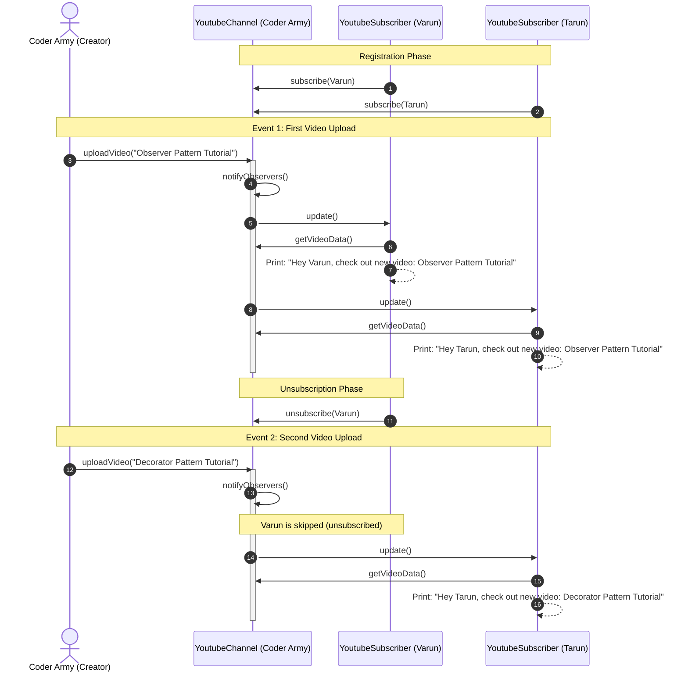

# 12. Observer Design Pattern

## 1. Overview

The **Observer Design Pattern** is a behavioral design pattern that defines a **one-to-many dependency** between objects. When the core state of one object (termed the **Subject** or **Observable**) changes, all registered dependents (termed **Observers** or **Subscribers**) are automatically notified and updated.

In this lecture, the pattern is introduced through the quintessential **YouTube Channel & Subscriber System**:
- The YouTube Channel (e.g., **"Coder Army"**) acts as the Observable Subject.
- Subscribers (e.g., **Varun** and **Tarun**) subscribe to the channel to receive notifications.
- When Coder Army uploads a new video (e.g., *"Observer Pattern Tutorial"*), all active subscribers receive notifications automatically.
- When Varun unsubscribes, future video uploads (e.g., *"Decorator Pattern Tutorial"*) are delivered exclusively to Tarun.
- In-depth architectural trade-off: Why standard Observer patterns intentionally compromise the **Single Responsibility Principle (SRP)** by keeping subscription management and business logic within the same Subject class.

```mermaid
mindmap
  root((Observer Design Pattern))
    Core Problem
      Polling Anti-Pattern
      Push vs Pull Architectures
    Entities & Roles
      Observable / Subject Interface
        subscribe()
        unsubscribe()
        notifyObservers()
      Observer / Subscriber Interface
        update()
    Concrete Realization: YouTube
      Channel: "Coder Army"
      Subscribers: Varun, Tarun
      Video Uploads & Dynamic Unsubscription
    Architectural Trade-offs
      SRP Violation vs Simplicity
      Invariant Observer Logic vs Changing Domain Logic
    Practical Use Cases
      Notification Engines
      Newsfeed Updates (Instagram, Facebook)
      GUI Event Listeners & Reactive Programming
```

---

## 2. What Problem Are We Solving?

### The Polling Anti-Pattern
Imagine building a YouTube subscription system without the Observer pattern:
- How does a user (Observer) know when their favorite channel (Subject) has published a new video?
- **The Polling Solution**: The user repeatedly queries the channel:
  - *At 10:00 AM*: "Did you upload a video?" $\rightarrow$ "No."
  - *At 10:01 AM*: "Did you upload a video?" $\rightarrow$ "No."
  - *At 10:02 AM*: "Did you upload a video?" $\rightarrow$ "No."
- **Why Polling Fails**:
  1. **Enormous CPU & Network Waste**: Millions of users querying servers continuously burns bandwidth and compute on empty responses.
  2. **High Latency**: If polling occurs every 10 minutes, users experience up to a 10-minute delay after video release.
  3. **Poor User Experience**: Battery drain on mobile devices and unnecessary server load.

### The Observer (Push) Solution
Instead of observers querying the subject repeatedly, the responsibility is inverted:
- Observers register once (**Subscribe**).
- The Subject stays silent until an actual event occurs (**Upload Video**).
- The moment the event happens, the Subject iterates through its registered subscribers and broadcasts the update (**Notify**).

---

## 3. Core Concepts

- **Subject / Observable**: Maintains a collection of observers and exposes methods to attach (`subscribe`), detach (`unsubscribe`), and broadcast (`notifyObservers`).
- **Observer / Subscriber**: Defines an updating interface (`update()`) for objects that should be notified of changes in a subject.
- **Push vs. Pull Model**:
  - **Push Model**: The Subject sends all modified data attributes directly as arguments inside `update(data)`.
  - **Pull Model**: The Subject passes a reference to itself, or simply notifies the observer, and the Observer queries specific getters (`channel.getVideoData()`) to pull only what it needs.

---

## 4. Architectural Evolution: YouTube Notification System

```text
┌───────────────────────────────────────┐
│        <<interface>> Channel          │
├───────────────────────────────────────┤
│ +subscribe(Subscriber s)              │
│ +unsubscribe(Subscriber s)            │
│ +notifyObservers()                    │
└───────────────────┬───────────────────┘
                    │
                    ▼
┌───────────────────────────────────────┐          ┌───────────────────────────┐
│             YoutubeChannel            │───────◇  │ <<interface>> Subscriber  │
├───────────────────────────────────────┤          ├───────────────────────────┤
│ -List<Subscriber> subscribers         │          │ +update()                 │
│ -String channelName                   │          └─────────────┬─────────────┘
│ -String latestVideo                   │                        │
├───────────────────────────────────────┤                        ▼
│ +uploadVideo(String title)            │          ┌───────────────────────────┐
│ +getVideoData() String                │          │     YoutubeSubscriber     │
└───────────────────────────────────────┘          ├───────────────────────────┤
                                                   │ -String name              │
                                                   │ -Channel channel          │
                                                   ├───────────────────────────┤
                                                   │ +update()                 │
                                                   └───────────────────────────┘
```

---

## 5. Sequence Diagram: YouTube Upload & Notification Flow



---

## 6. Complete Java Implementation

```java
import java.util.*;

// ============================================================================
// 1. CONTRACTS (INTERFACES)
// ============================================================================

/**
 * Subscriber interface implemented by any entity that wishes to observe a channel.
 */
public interface Subscriber {
    void update();
}

/**
 * Channel interface representing the Subject / Observable contract.
 */
public interface Channel {
    void subscribe(Subscriber subscriber);
    void unsubscribe(Subscriber subscriber);
    void notifyObservers();
    String getVideoData();
}

// ============================================================================
// 2. CONCRETE SUBJECT: YOUTUBE CHANNEL
// ============================================================================

public class YoutubeChannel implements Channel {
    private final String channelName;
    private final List<Subscriber> subscribers = new ArrayList<>();
    private String latestVideoTitle;

    public YoutubeChannel(String channelName) {
        this.channelName = Objects.requireNonNull(channelName, "Channel name required");
    }

    @Override
    public synchronized void subscribe(Subscriber subscriber) {
        if (subscriber != null && !subscribers.contains(subscriber)) {
            subscribers.add(subscriber);
        }
    }

    @Override
    public synchronized void unsubscribe(Subscriber subscriber) {
        subscribers.remove(subscriber);
    }

    @Override
    public void notifyObservers() {
        // Defensive copying to prevent ConcurrentModificationException
        List<Subscriber> snapshot;
        synchronized (this) {
            snapshot = new ArrayList<>(this.subscribers);
        }

        for (Subscriber subscriber : snapshot) {
            subscriber.update();
        }
    }

    /**
     * Core business operation: Uploading a video mutates state and triggers notification.
     */
    public void uploadVideo(String videoTitle) {
        this.latestVideoTitle = videoTitle;
        System.out.println("\n🎬 [" + channelName + "] Uploaded new video: \"" + videoTitle + "\"");
        notifyObservers();
    }

    @Override
    public String getVideoData() {
        return "Check out our new video on " + channelName + ": \"" + latestVideoTitle + "\"";
    }

    public String getChannelName() {
        return channelName;
    }
}

// ============================================================================
// 3. CONCRETE OBSERVER: YOUTUBE SUBSCRIBER (PULL MODEL)
// ============================================================================

public class YoutubeSubscriber implements Subscriber {
    private final String subscriberName;
    private final Channel channel;

    public YoutubeSubscriber(String subscriberName, Channel channel) {
        this.subscriberName = subscriberName;
        this.channel = channel;
    }

    @Override
    public void update() {
        // Pull model: Subscriber pulls the formatted video data from the channel reference
        String videoData = channel.getVideoData();
        System.out.println("🔔 [Notification to " + subscriberName + "] " + videoData);
    }

    public String getSubscriberName() {
        return subscriberName;
    }
}

// ============================================================================
// 4. DRIVER DEMONSTRATION
// ============================================================================
public class ObserverPatternDemo {
    public static void main(String[] args) {
        System.out.println("==================================================");
        System.out.println("      CODER ARMY YOUTUBE OBSERVER PATTERN DEMO     ");
        System.out.println("==================================================");

        // 1. Create Channel (Observable Subject)
        YoutubeChannel coderArmy = new YoutubeChannel("Coder Army");

        // 2. Create Subscribers (Observers)
        YoutubeSubscriber varun = new YoutubeSubscriber("Varun", coderArmy);
        YoutubeSubscriber tarun = new YoutubeSubscriber("Tarun", coderArmy);

        // 3. Both Varun & Tarun Subscribe
        System.out.println("\n--- Step 1: Varun & Tarun Subscribe to Coder Army ---");
        coderArmy.subscribe(varun);
        coderArmy.subscribe(tarun);

        // 4. Upload 1st Video -> Both receive notification
        System.out.println("\n--- Step 2: First Video Release ---");
        coderArmy.uploadVideo("Observer Design Pattern Tutorial");

        // 5. Varun Unsubscribes
        System.out.println("\n--- Step 3: Varun Unsubscribes ---");
        coderArmy.unsubscribe(varun);
        System.out.println("Varun has successfully unsubscribed.");

        // 6. Upload 2nd Video -> Only Tarun receives notification
        System.out.println("\n--- Step 4: Second Video Release ---");
        coderArmy.uploadVideo("Decorator Design Pattern Tutorial");
    }
}
```

---

## 7. Deep Dive: Architectural Trade-Off — The SRP Tension

An insightful architectural point analyzed in the lecture:

### Does `YoutubeChannel` Violate the Single Responsibility Principle?
Notice that `YoutubeChannel` performs two distinct duties:
1. **Subscription Management**: Storing subscribers, subscribing, unsubscribing, and iterating over the list.
2. **Business Domain Logic**: Uploading videos, maintaining channel metadata, formatting video descriptors.

**The Interview Dilemma**:
- *Strict Purist View*: "Yes, `YoutubeChannel` violates SRP because it has two reasons to change: if notification mechanics change, or if video publishing logic changes."
- *Pragmatic Engineering View (Instructor's Take)*:
  - In real-world software, the subscription management logic (`subscribe`, `unsubscribe`, `notifyObservers`) is **invariant infrastructure code**—it almost never changes once written.
  - The business domain logic (video processing, monetization, encoding) is what actually evolves.
  - While one could decouple subscription into a separate `SubscriptionManager` delegate, doing so introduces unnecessary indirection and boilerplate without providing meaningful architectural value.
  - Standard GoF UML diagrams deliberately consolidate these roles to keep the pattern clean, lightweight, and maintainable.

---

## 8. Real-World Applications

1. **Notification Engines**: Broadcasting email, push, or SMS messages whenever an order state updates (as seen in Topic 11 Tomato App).
2. **Social Media Feeds**: When a user posts a photo on Instagram or Facebook, the post event notifies the feeds of all following accounts.
3. **GUI & Event-Driven Systems**: JavaScript DOM event listeners (`element.addEventListener('click', handler)`) and desktop UI frameworks (Java Swing / JavaFX buttons) are pure implementations of the Observer pattern.

---

## 9. Interview Questions & Key Discussion Points

1. **What is the difference between Push and Pull models in the Observer pattern?**
   - *Answer*: In the **Push model**, the Subject passes all state data directly in the `update(data)` parameter list. This couples the observer interface to a fixed payload. In the **Pull model** (used in our YouTube example), the Subject passes a reference to itself or nothing, and the Observer queries `channel.getVideoData()` to fetch only the specific information it requires.
2. **How do you prevent `ConcurrentModificationException` during notifications?**
   - *Answer*: Take a synchronized defensive copy of the observer collection (`new ArrayList<>(this.subscribers)`) and iterate through the snapshot copy rather than the live list. This allows observers to safely unsubscribe during their own `update()` callback without crashing the loop.
3. **What is the "Lapsed Listener Problem"?**
   - *Answer*: If an observer registers with a long-lived Subject (such as an application-wide event bus or singleton channel) and forgets to unsubscribe, the Subject retains a strong reference to the observer, preventing Java's Garbage Collector from reclaiming the observer's memory. In long-running applications, this causes severe memory leaks.

---

## 10. Quick Revision

### Core Idea
The Observer pattern establishes a one-to-many publish-subscribe relationship where state changes in a Subject automatically trigger notifications across all subscribed Observers without polling.

### Remember
- Inverts the polling anti-pattern into an efficient push/notify mechanism.
- The lecture's canonical domain: **YouTube Channel ("Coder Army")** and **Subscribers ("Varun" & "Tarun")**.
- Defensive copying during iteration prevents `ConcurrentModificationException`.

### Java Implementation Idea
Define `Channel` with `subscribe()`, `unsubscribe()`, and `notifyObservers()`, maintain `List<Subscriber>`, and have concrete subscribers call `channel.getVideoData()` on notification.

### Most Important Interview Point
Explain the trade-off between the Single Responsibility Principle and pattern simplicity when embedding subscription lists directly inside the Subject class.

### Common Trap
Iterating directly over `this.subscribers` without taking a defensive copy. If an observer unsubscribes inside its `update()` method, a runtime `ConcurrentModificationException` crashes the broadcast loop.
