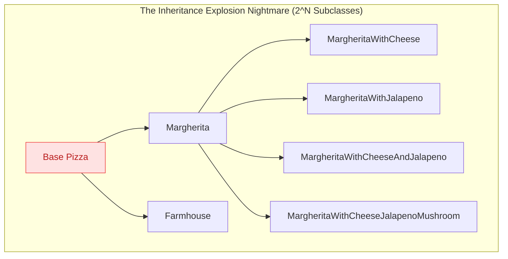
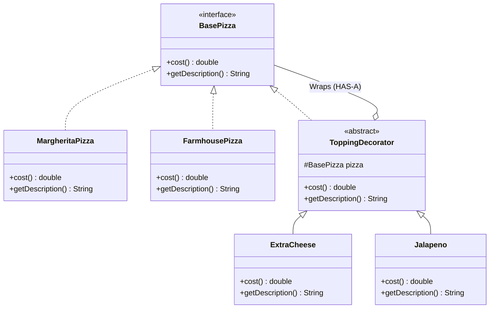

# 13. Decorator Design Pattern

> 💡 **Quick Revision Anchor**: 
> - **Type**: Structural Design Pattern.
> - **Core Intent**: Attaches additional responsibilities and behaviors to an object **dynamically at runtime** without altering the underlying class or using subclass inheritance.
> - **Motto**: A Decorator both **"IS-A"** component and **"HAS-A"** component simultaneously.

---

## 1. Context & The Class Explosion Problem

Suppose you are building the billing engine for a custom Pizza Restaurant:
- Base Pizzas: `Margherita` ($8.00), `Farmhouse` ($10.00).
- Optional Toppings: `Extra Cheese` (+$1.50), `Jalapeno` (+$0.80), `Mushroom` (+$1.20), `Paneer` (+$2.00).



### Why Subclassing Fails:
With just 10 optional toppings, you would need $2^{10} = 1,024$ subclass permutations! Adding a new topping requires creating dozens of new classes, and changing topping prices requires editing multiple subclasses.

---

## 2. The Decorator Architecture

Instead of static subclassing, we wrap an object inside another object that enhances its behavior:



### The Recursive Unwinding Mechanism:
When `myPizza.cost()` is invoked, the call cascades through layers of wrappers like a Russian nesting doll:

```mermaid
flowchart LR
    Client -->|cost()| EC["ExtraCheese Wrapper<br/>(+ $1.50)"]
    EC -->|cost()| JL["Jalapeno Wrapper<br/>(+ $0.80)"]
    JL -->|cost()| Core["Margherita Core<br/>($8.00)"]
    
    Core -- returns $8.00 --> JL
    JL -- returns $8.80 --> EC
    EC -- returns $10.30 --> Client
```

---

## 3. Production Java Implementation

```java
// 1. Component Interface
public interface BasePizza {
    double cost();
    String getDescription();
}

// 2. Concrete Components (The core items being decorated)
public class MargheritaPizza implements BasePizza {
    @Override public double cost() { return 8.00; }
    @Override public String getDescription() { return "Margherita Pizza"; }
}

public class FarmhousePizza implements BasePizza {
    @Override public double cost() { return 10.00; }
    @Override public String getDescription() { return "Farmhouse Pizza"; }
}

// 3. Abstract Decorator (Both IS-A and HAS-A BasePizza)
public abstract class ToppingDecorator implements BasePizza {
    protected final BasePizza wrappedPizza;

    public ToppingDecorator(BasePizza pizza) {
        if (pizza == null) throw new IllegalArgumentException("Pizza cannot be null");
        this.wrappedPizza = pizza;
    }
}

// 4. Concrete Decorator 1: Extra Cheese
public class ExtraCheeseDecorator extends ToppingDecorator {
    public ExtraCheeseDecorator(BasePizza pizza) {
        super(pizza);
    }

    @Override
    public double cost() {
        return wrappedPizza.cost() + 1.50; // Add extra cheese surcharge
    }

    @Override
    public String getDescription() {
        return wrappedPizza.getDescription() + " + Extra Cheese";
    }
}

// Concrete Decorator 2: Jalapeno
public class JalapenoDecorator extends ToppingDecorator {
    public JalapenoDecorator(BasePizza pizza) {
        super(pizza);
    }

    @Override
    public double cost() {
        return wrappedPizza.cost() + 0.80; // Add jalapeno surcharge
    }

    @Override
    public String getDescription() {
        return wrappedPizza.getDescription() + " + Jalapeno";
    }
}

// Concrete Decorator 3: Mushroom
public class MushroomDecorator extends ToppingDecorator {
    public MushroomDecorator(BasePizza pizza) {
        super(pizza);
    }

    @Override
    public double cost() {
        return wrappedPizza.cost() + 1.20;
    }

    @Override
    public String getDescription() {
        return wrappedPizza.getDescription() + " + Fresh Mushrooms";
    }
}
```

### Client Execution & Nesting:
```java
public class PizzaOrderDemo {
    public static void main(String[] args) {
        // Order 1: Plain Margherita
        BasePizza order1 = new MargheritaPizza();
        System.out.println(order1.getDescription() + " = $" + order1.cost());

        // Order 2: Margherita with Extra Cheese
        BasePizza order2 = new ExtraCheeseDecorator(new MargheritaPizza());
        System.out.println(order2.getDescription() + " = $" + order2.cost());

        // Order 3: Farmhouse with Double Cheese and Jalapenos
        BasePizza order3 = new JalapenoDecorator(
                                new ExtraCheeseDecorator(
                                    new ExtraCheeseDecorator(
                                        new FarmhousePizza())));
                                        
        System.out.println(order3.getDescription() + " = $" + order3.cost());
        // Output: Farmhouse Pizza + Extra Cheese + Extra Cheese + Jalapeno = $13.80
    }
}
```

---

## 4. Real-World Java Standard Library Example

The Java I/O framework (`java.io.*`) is the most famous real-world implementation of the Decorator pattern:

```java
// Java standard library I/O streams decorator stacking:
InputStream fileStream = new FileInputStream("large_payload.gz");
InputStream bufferedStream = new BufferedInputStream(fileStream); // Adds buffering
InputStream decompressedStream = new GZIPInputStream(bufferedStream); // Adds gzip decompression
```
Here, `InputStream` is the base component, and each stream wrapper adds dynamic responsibilities (buffering, decompression, data parsing) without altering `FileInputStream`.

---

## 5. Decorator vs. Adapter vs. Proxy

| Pattern | Intent | Interface Relationship |
| :--- | :--- | :--- |
| **Decorator** | **Enhances / adds new behaviors** dynamically without altering the interface | Implements the **same** interface as the wrapped object. |
| **Adapter** | **Converts incompatible interfaces** so two classes can collaborate | Exposes a **different** interface to the client than the wrapped adaptee. |
| **Proxy** | **Controls access** (lazy loading, caching, auth, security) to the subject | Implements the **same** interface, but manages lifecycle or permissions rather than enriching behavior. |
