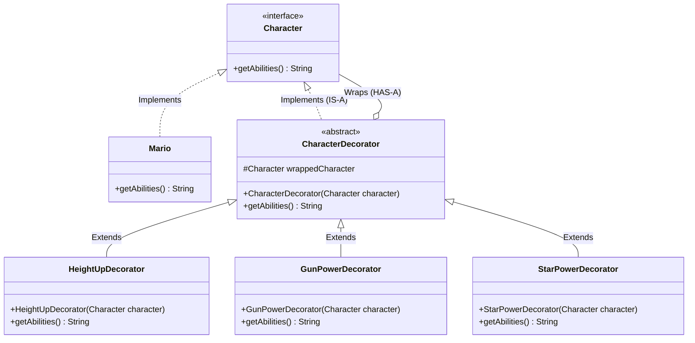
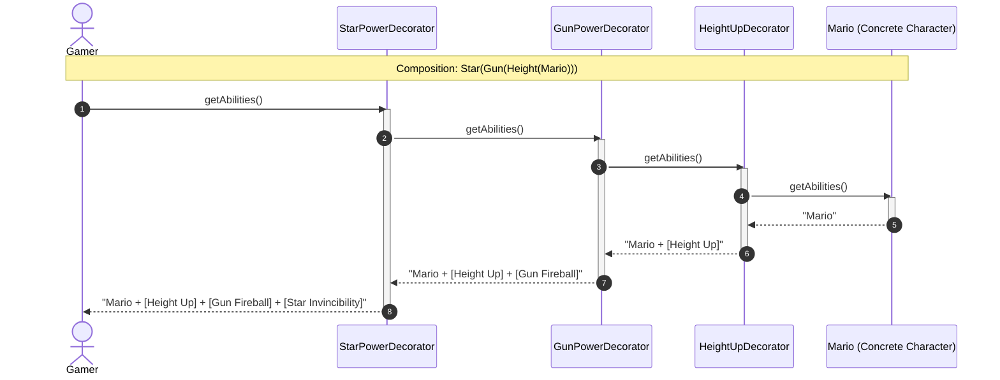

# 13. Decorator Design Pattern

> 💡 **Quick Revision Anchor**: A comprehensive, interview-focused guide to the Decorator Design Pattern faithfully derived from the complete lecture transcript. Explores the architectural hallmark of the Decorator: having **both an IS-A and HAS-A relationship** with the component interface. Resolves the catastrophic $2^N$ combinatorial class explosion of pure inheritance through runtime wrapping. Grounded in the instructor's **Super Mario Power-Up System** (`BasicMario` dynamically wrapped with `HeightUpDecorator`, `GunPowerDecorator`, and `StarPowerDecorator`), with production-grade enterprise extensions for **Rich Text Formatting** and **Web Request Security Middleware** (SQL injection and authentication filters).

---

## 1. Overview

The **Decorator Design Pattern** is a structural design pattern that allows attaching new responsibilities and behaviors to an object **dynamically at runtime** without altering its underlying class or resorting to inheritance. A Decorator simultaneously **"IS-A"** Component (so it can substitute for it) and **"HAS-A"** Component (so it wraps and delegates to it).

In this lecture, the pattern is introduced through the classic **Super Mario Power-Up System**:
- Base character: `Mario` (small, basic abilities).
- Dynamic Power-Ups:
  - **HeightUpDecorator** (Mushroom power-up: increases height/jump).
  - **GunPowerDecorator** (Flower power-up: adds fireball shooting ability).
  - **StarPowerDecorator** (Star power-up: grants invincibility and supersonic speed).
- Real-world and enterprise extensions:
  - **Text Formatting in Document Editors** (Raw Text decorated with `BoldDecorator`, `ItalicDecorator`, `UnderlineDecorator`).
  - **Web Request Middleware / Form Validation Pipelines** (Decorating raw forms with `EmailValidationDecorator`, `SqlInjectionFilterDecorator`, `CsrfDecorator`).

```mermaid
mindmap
  root((Decorator Design Pattern))
    Core Dilemma
      Why Not Inheritance?
      Compile-Time vs Runtime Dispatch
      Combinatorial Class Explosion (2^N)
    The Dual Relationship
      IS-A Component (Polymorphic Substitution)
      HAS-A Component (Delegation & Wrapping)
    Primary Canonical Domain: Mario Game
      ICharacter Interface: getAbilities()
      Concrete Character: Mario
      CharacterDecorator Abstract Wrapper
      Concrete Power-Ups
        HeightUpDecorator (Mushroom)
        GunPowerDecorator (Flower)
        StarPowerDecorator (Star)
    Alternative Practical Domains
      Text Editor Formatting (Bold, Italic, Underline)
      Form Security Pipeline (SQL Injection, CSRF, Email)
      Java IO Streams (BufferedInputStream, GZIPInputStream)
```

---

## 2. What Problem Are We Solving?

### Why Not Polymorphic Inheritance?
Consider a game where characters can run:
- A base class `Base` declares `run() { print("Running"); }`.
- A subclass `Child` overrides `run() { print("Running with Skates"); }`.
- At compile-time or startup, you can write `Base b = new Child(); b.run();`.
- **The Critical Question**: *Can you dynamically layer multiple abilities onto an existing character at runtime without restarting or re-instantiating completely separate subclass branches?*

### The Combinatorial Class Explosion ($2^N$)
In Super Mario:
- Mario starts basic.
- Mario grabs a Mushroom $\rightarrow$ needs Height Up.
- Mario grabs a Flower $\rightarrow$ needs Gun Power.
- Mario grabs a Star $\rightarrow$ needs Invincibility.
- Mario can have any combination of these simultaneously:
  - `MarioWithHeightUp`
  - `MarioWithGun`
  - `MarioWithStar`
  - `MarioWithHeightUpAndGun`
  - `MarioWithHeightUpAndGunAndStar`
- For $N$ independent power-ups or attributes, subclassing requires **$2^N$ concrete classes**!
- Inheritance is completely rigid at runtime: if Mario loses the Gun power upon taking damage, an inheritance-based object cannot simply "shed" a parent class dynamically.

---

## 3. Core Concepts & The Dual Relationship

The fundamental secret of the Decorator pattern is its **dual relationship** with the Component interface:

```text
                             ┌───────────────────────────────┐
                             │    <<interface>> Component    │
                             └───────────────▲───────────────┘
                                             │
                       ┌─────────────────────┴─────────────────────┐
                       │ IS-A                                      │ IS-A
        ┌──────────────┴──────────────┐             ┌──────────────┴──────────────┐
        │      ConcreteComponent      │             │      Decorator (Wrapper)    │
        │           (Mario)           │             ├─────────────────────────────┤
        └─────────────────────────────┘             │ -Component wrappedComponent │──◇ HAS-A
                                                    └──────────────▲──────────────┘
                                                                   │ IS-A
                                                    ┌──────────────┴──────────────┐
                                                    │      Concrete Decorators    │
                                                    │ (HeightUp, GunPower, Star)  │
                                                    └─────────────────────────────┘
```

1. **Decorator IS-A Component**: By implementing `Component`, the decorator conforms to the exact same contract. Calling code treats decorated objects identically to plain ones.
2. **Decorator HAS-A Component**: The decorator holds a reference to another `Component` instance. When a method is called, the decorator delegates to the inner wrapped component first, then layers on its own additional behavior.

---

## 4. Architectural Evolution: Super Mario System



---

## 5. Sequence Diagram: Layering Power-Ups Dynamically



---

## 6. Complete Java Implementation

```java
import java.util.Objects;

// ============================================================================
// 1. COMPONENT CONTRACT
// ============================================================================

/**
 * Base abstraction for any playable game character.
 */
public interface Character {
    String getAbilities();
}

// ============================================================================
// 2. CONCRETE COMPONENT
// ============================================================================

/**
 * Core Mario character with base capabilities.
 */
public class Mario implements Character {
    @Override
    public String getAbilities() {
        return "Mario (Small, Normal Speed)";
    }
}

// ============================================================================
// 3. BASE DECORATOR (DUAL IDENTITY: IS-A AND HAS-A)
// ============================================================================

/**
 * Abstract decorator wrapping a Character reference.
 */
public abstract class CharacterDecorator implements Character {
    protected final Character wrappedCharacter;

    public CharacterDecorator(Character character) {
        this.wrappedCharacter = Objects.requireNonNull(character, "Character to wrap cannot be null");
    }

    @Override
    public String getAbilities() {
        return wrappedCharacter.getAbilities(); // Default delegation
    }
}

// ============================================================================
// 4. CONCRETE DECORATORS (POWER-UPS)
// ============================================================================

/**
 * Mushroom Power-Up: Increases Mario's height and jump.
 */
public class HeightUpDecorator extends CharacterDecorator {
    public HeightUpDecorator(Character character) {
        super(character);
    }

    @Override
    public String getAbilities() {
        return super.getAbilities() + " + [Super Mushroom: Height Up & High Jump]";
    }
}

/**
 * Flower Power-Up: Enables shooting fireballs.
 */
public class GunPowerDecorator extends CharacterDecorator {
    public GunPowerDecorator(Character character) {
        super(character);
    }

    @Override
    public String getAbilities() {
        return super.getAbilities() + " + [Fire Flower: Gun Fireballs]";
    }
}

/**
 * Star Power-Up: Grants invincibility and supersonic speed.
 */
public class StarPowerDecorator extends CharacterDecorator {
    public StarPowerDecorator(Character character) {
        super(character);
    }

    @Override
    public String getAbilities() {
        return super.getAbilities() + " + [Star Power: Invincible & Supersonic Speed]";
    }
}

// ============================================================================
// 5. OTHER REAL-WORLD DOMAIN EXAMPLES (INSTRUCTOR LECTURE)
// ============================================================================

// --- Example A: Rich Text Editor Formatting ---
public interface TextElement {
    String render();
}

public class PlainText implements TextElement {
    private final String text;
    public PlainText(String text) { this.text = text; }
    @Override public String render() { return text; }
}

public abstract class TextDecorator implements TextElement {
    protected final TextElement inner;
    public TextDecorator(TextElement inner) { this.inner = inner; }
}

public class BoldDecorator extends TextDecorator {
    public BoldDecorator(TextElement inner) { super(inner); }
    @Override public String render() { return "<b>" + inner.render() + "</b>"; }
}

public class ItalicDecorator extends TextDecorator {
    public ItalicDecorator(TextElement inner) { super(inner); }
    @Override public String render() { return "<i>" + inner.render() + "</i>"; }
}

public class UnderlineDecorator extends TextDecorator {
    public UnderlineDecorator(TextElement inner) { super(inner); }
    @Override public String render() { return "<u>" + inner.render() + "</u>"; }
}

// ============================================================================
// 6. DRIVER DEMONSTRATION
// ============================================================================
public class DecoratorPatternDemo {
    public static void main(String[] args) {
        System.out.println("==================================================");
        System.out.println("    SUPER MARIO DECORATOR PATTERN DEMO           ");
        System.out.println("==================================================");

        // 1. Basic Character
        Character player = new Mario();
        System.out.println("\nLevel 1 Start: " + player.getAbilities());

        // 2. Mario collects a Super Mushroom
        player = new HeightUpDecorator(player);
        System.out.println("Power-up Grabbed: " + player.getAbilities());

        // 3. Mario collects a Fire Flower
        player = new GunPowerDecorator(player);
        System.out.println("Power-up Grabbed: " + player.getAbilities());

        // 4. Mario collects a Super Star
        player = new StarPowerDecorator(player);
        System.out.println("Power-up Grabbed: " + player.getAbilities());

        System.out.println("\n==================================================");
        System.out.println("    RICH TEXT FORMATTING DECORATOR DEMO          ");
        System.out.println("==================================================");

        TextElement formattedText = new UnderlineDecorator(
                new ItalicDecorator(
                        new BoldDecorator(
                                new PlainText("Hello Coder Army!")
                        )
                )
        );
        System.out.println("\nRendered HTML Output:\n" + formattedText.render());
    }
}
```

---

## 7. Deep Dive: Other Practical Use Cases

### 1. Web Form Security & Validation Pipeline
In web applications, forms submitted by users require multiple security inspections:
- Base Component: `FormHandler`.
- Decorators:
  - `EmailValidationDecorator` (checks regex email format).
  - `SqlInjectionFilterDecorator` (escapes malicious characters like `' OR 1=1--`).
  - `CsrfProtectionDecorator` (validates secure token header).
Each decorator inspects the request before forwarding it to the inner handler, acting like an extensible middleware chain.

### 2. Java Standard Library `java.io`
The most famous production example of the Decorator pattern is Java's I/O library:
```java
InputStream stream = new GZIPInputStream(
                        new BufferedInputStream(
                            new FileInputStream("data.tar.gz")
                        )
                     );
```
- `FileInputStream`: Concrete component reading raw bytes from disk.
- `BufferedInputStream`: Decorator adding memory buffer caching.
- `GZIPInputStream`: Decorator transparently decompressing the stream on the fly.

---

## 8. Comparison: Decorator vs. Adapter vs. Proxy

| Dimension | Decorator Pattern | Adapter Pattern | Proxy Pattern |
| :--- | :--- | :--- | :--- |
| **Primary Intent** | Dynamically add new behaviors/responsibilities to an object | Convert an incompatible interface into an expected target interface | Control access, manage lazy loading, caching, or security logging |
| **Interface Relation** | Conforms to the **same** component interface | Translates to a **different** target interface | Conforms to the **same** subject interface |
| **Wrapping Multiplicity** | Encourages arbitrary recursive layering (`D3(D2(D1(Core)))`) | Usually wraps a single adaptee object | Usually holds a 1-to-1 reference to a real subject |
| **Mental Model** | *"Layering winter clothes on a person"* | *"A UK-to-US power plug converter"* | *"A security guard checking an ID badge at a door"* |

---

## 9. Interview Questions & Key Discussion Points

1. **How does the Decorator Pattern eliminate the class explosion problem?**
   - *Answer*: With inheritance, $N$ independent features require $2^N$ subclasses to represent every possible combination. With Decorator, you write exactly $N$ decorator classes and combine them dynamically in memory as needed ($O(N)$ code complexity instead of $O(2^N)$).
2. **Why must the abstract decorator implement the component interface?**
   - *Answer*: Implementing the component interface guarantees type conformance (**IS-A**). This allows the outermost decorated wrapper to be passed anywhere the original core component is expected, maintaining transparent interchangeability.
3. **What are the disadvantages of the Decorator Pattern?**
   - *Answer*:
     - Can lead to long, nested stack traces that are difficult to debug.
     - Breaks object identity: `decoratedObj instanceof Mario` returns `false` because the outer instance is of type `StarPowerDecorator`.

---

## 10. Quick Revision

### Core Idea
Decorator dynamically layers new responsibilities onto an object at runtime by wrapping it in an object that both implements (`IS-A`) and contains (`HAS-A`) the component interface.

### Remember
- Solves the $2^N$ subclass explosion problem.
- Canonical lecture domain: **Super Mario** (base `Mario` decorated with `HeightUpDecorator`, `GunPowerDecorator`, `StarPowerDecorator`).
- Recursive unwinding: calls cascade inward to the core and bubble results back outward.

### Java Implementation Idea
Define `Character` interface with `getAbilities()`, implement `Mario`, create abstract `CharacterDecorator` with `protected final Character wrappedCharacter`, and extend it with specific power-up classes.

### Most Important Interview Point
Cite `java.io.BufferedInputStream(new FileInputStream(...))` as the benchmark real-world production example of the Decorator pattern.

### Common Trap
Introducing new public methods in decorators that are missing from the `Component` interface. Doing so prevents clients from invoking them when holding a reference of type `Component`.
