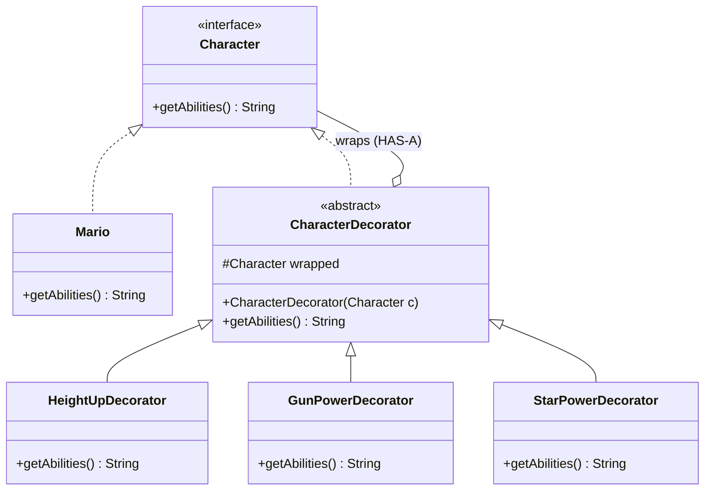

# 13. Decorator Design Pattern

> 💡 **Quick Revision Anchor**
> - The **Decorator Pattern** dynamically attaches new behaviors to an object at runtime without modifying the underlying class or resorting to subclassing.
> - The Architectural Hallmark: A Decorator **both IS-A and HAS-A** Component (it implements the component interface while holding a reference to another component).
> - Solves the **$2^N$ combinatorial class explosion** of inheritance.
> - Canonical lecture example: **Super Mario Power-Up System** (`BasicMario` wrapped dynamically with `HeightUpDecorator`, `GunPowerDecorator`, and `StarPowerDecorator`).

---

## 1. What Problem Are We Solving?

In a game like Super Mario, the player's abilities change frequently during gameplay:
- Mario starts small with basic abilities.
- Mario collects a Mushroom $\rightarrow$ needs Height Up (higher jump).
- Mario collects a Flower $\rightarrow$ needs Gun Power (shoots fireballs).
- Mario collects a Star $\rightarrow$ needs Star Power (invincibility).

### The Pure Inheritance Trap: Combinatorial Explosion ($2^N$)
If we model every power-up combination using subclassing:
- `Mario`
- `MarioWithHeight`
- `MarioWithGun`
- `MarioWithStar`
- `MarioWithHeightAndGun`
- `MarioWithHeightAndGunAndStar`

For $N$ power-ups, we need **$2^N$ subclasses**. Furthermore, inheritance is static at compile time: if Mario takes damage and loses his Gun power, an object in an inheritance hierarchy cannot dynamically "shed" its parent behavior at runtime.

---

## 2. Key Design Idea: The Dual Relationship (IS-A & HAS-A)

The Decorator pattern solves this by wrapping objects inside decorator layers:

```
                            ┌────────────────────────┐
                            │ <<interface>> Character│
                            └───────────▲────────────┘
                                        │
                    ┌───────────────────┴───────────────────┐
                    │ (IS-A)                                │ (IS-A)
        ┌───────────┴───────────┐               ┌───────────┴───────────┐
        │         Mario         │               │   CharacterDecorator  │
        ├───────────────────────┤               ├───────────────────────┤
        │ +getAbilities()       │               │ -Character inner      │──◇ (HAS-A)
        └───────────────────────┘               │ +getAbilities()       │
                                                └───────────▲───────────┘
                                                            │
                                         ┌──────────────────┴──────────────────┐
                                         ▼                                     ▼
                               ┌───────────────────┐                 ┌───────────────────┐
                               │ HeightUpDecorator │                 │ GunPowerDecorator │
                               └───────────────────┘                 └───────────────────┘
```

1. **Decorator IS-A Character:** Implements the same interface so callers can treat decorated objects transparently.
2. **Decorator HAS-A Character:** Holds a reference to the wrapped object and delegates calls to it before/after adding its own behavior.

---

## 3. Visual Architecture




---

## 4. Concise Java Implementation (Primary Lecture Example)

```java
// ==========================================
// 1. COMPONENT CONTRACT & CONCRETE COMPONENT
// ==========================================
interface Character {
    String getAbilities();
}

class Mario implements Character {
    @Override
    public String getAbilities() {
        return "Mario [Basic Run]";
    }
}

// ==========================================
// 2. ABSTRACT DECORATOR (IS-A and HAS-A)
// ==========================================
abstract class CharacterDecorator implements Character {
    protected final Character wrapped;

    public CharacterDecorator(Character wrapped) {
        this.wrapped = wrapped;
    }

    @Override
    public String getAbilities() {
        return wrapped.getAbilities(); // Default delegation
    }
}

// ==========================================
// 3. CONCRETE POWER-UP DECORATORS
// ==========================================
class HeightUpDecorator extends CharacterDecorator {
    public HeightUpDecorator(Character c) { super(c); }

    @Override
    public String getAbilities() {
        return super.getAbilities() + " + [Height Up (High Jump)]";
    }
}

class GunPowerDecorator extends CharacterDecorator {
    public GunPowerDecorator(Character c) { super(c); }

    @Override
    public String getAbilities() {
        return super.getAbilities() + " + [Fire Gun (Shoots Fireballs)]";
    }
}

class StarPowerDecorator extends CharacterDecorator {
    public StarPowerDecorator(Character c) { super(c); }

    @Override
    public String getAbilities() {
        return super.getAbilities() + " + [Star Power (Invincible!)]";
    }
}

// ==========================================
// Driver Demonstration
// ==========================================
public class Main {
    public static void main(String[] args) {
        // Start with basic Mario
        Character player = new Mario();
        System.out.println("Spawn: " + player.getAbilities());

        // Dynamic runtime power-up layering
        player = new HeightUpDecorator(player);
        System.out.println("PowerUp 1: " + player.getAbilities());

        player = new GunPowerDecorator(player);
        System.out.println("PowerUp 2: " + player.getAbilities());

        player = new StarPowerDecorator(player);
        System.out.println("PowerUp 3: " + player.getAbilities());
    }
}
```

---

## 5. Other Practical Domains (From Lecture)

### A. Rich Text Formatting in Document Editors
```java
// Raw text decorated with HTML tags
interface TextElement { String render(); }
class PlainText implements TextElement {
    private final String text;
    public PlainText(String text) { this.text = text; }
    @Override public String render() { return text; }
}
class BoldDecorator implements TextElement {
    private final TextElement inner;
    public BoldDecorator(TextElement inner) { this.inner = inner; }
    @Override public String render() { return "<b>" + inner.render() + "</b>"; }
}
// Usage: new BoldDecorator(new PlainText("Hello")) -> <b>Hello</b>
```

### B. Standard Java I/O (`java.io`)
Java's standard I/O library is the most classic production implementation:
```java
InputStream stream = new BufferedInputStream(new FileInputStream("data.txt"));
```
`FileInputStream` is the concrete component; `BufferedInputStream` is the decorator adding in-memory buffer capabilities.

---

## 6. Decorator vs Adapter vs Proxy

| Dimension | Decorator Pattern | Adapter Pattern | Proxy Pattern |
| :--- | :--- | :--- | :--- |
| **Primary Intent** | Dynamically add new behaviors/responsibilities to an object | Convert an incompatible interface to match an expected contract | Control access, lazy-load, cache, or log calls to the real subject |
| **Interface Relation** | Conforms to the **same** component interface | Translates to a **different** target interface | Conforms to the **same** subject interface |
| **Layering** | Designed for arbitrary recursive wrapping (`D2(D1(Core))`) | Typically wraps a single adaptee (1-to-1) | Typically wraps a single real subject (1-to-1) |

---

## 7. Interview Questions & Key Discussion Points

1. **Why does the abstract decorator class both implement and compose the component interface?**
   - *Answer*: Implementing the interface ensures **IS-A** polymorphic substitutability (it can be passed anywhere the component is expected). Composing the interface (**HAS-A**) allows it to delegate execution down the wrapper chain.
2. **How does Decorator solve the class explosion problem?**
   - *Answer*: Instead of needing $2^N$ subclasses for $N$ independent features, you write only $N$ decorator classes and layer them dynamically in memory at runtime ($O(N)$ code complexity).
3. **What is the downside of the Decorator pattern?**
   - *Answer*: It can introduce multiple small wrapper objects that complicate debugging (nested stack traces) and breaks object identity (`decoratedObj instanceof Mario` is false because the outer type is a decorator).

---

## 8. Quick Revision

### Core Idea
Decorator dynamically wraps objects to layer new responsibilities at runtime without modifying existing classes or creating massive inheritance trees.

### Remember
- **Dual Relationship:** Decorator **IS-A** and **HAS-A** Component.
- **Mario Analogy:** `Mario` wrapped in `HeightUpDecorator` $\rightarrow$ `GunPowerDecorator` $\rightarrow$ `StarPowerDecorator`.
- **Benchmark Real-World Example:** `java.io.BufferedInputStream(new FileInputStream(...))`.
