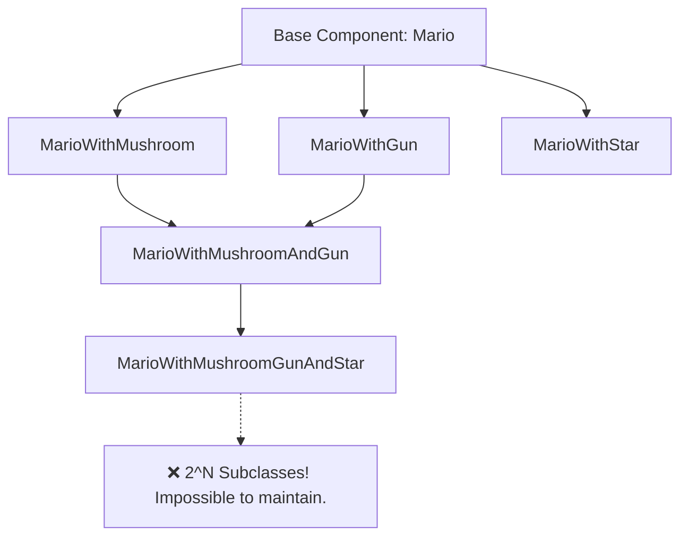
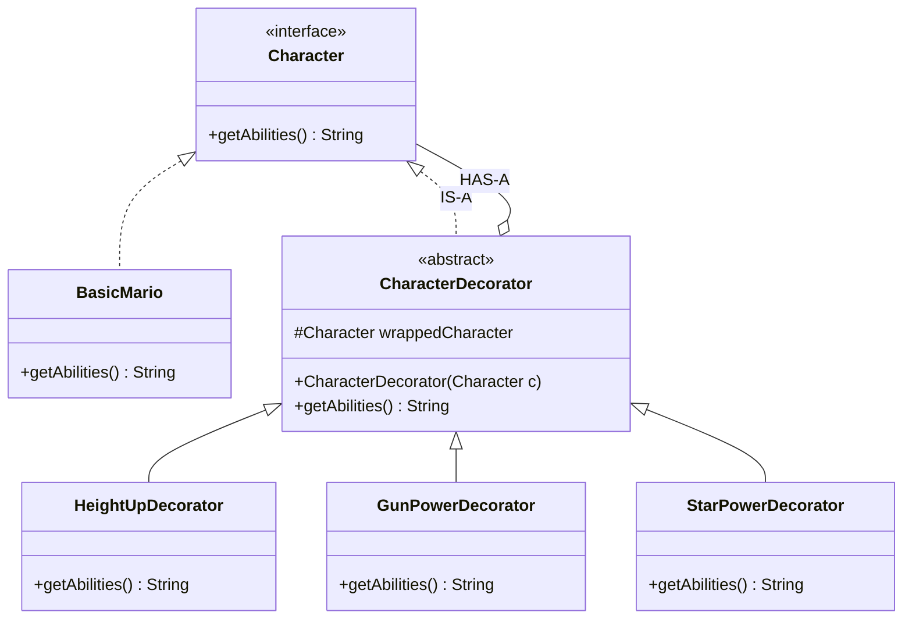

# 13. Decorator Design Pattern

> 💡 **Quick Revision Anchor**: `Dynamic Wrapping, Decorator IS-A and HAS-A Component simultaneously`

---

## 1. Intent & Problem Motivation

The **Decorator Design Pattern** is a **Structural Design Pattern** that allows you to dynamically attach new behaviors and responsibilities to an object **at runtime** without subclassing or modifying the underlying class.

### The Combinatorial Class Explosion Anti-Pattern
Imagine a gaming character system (e.g., Mario) or a Coffee Shop order system:
- A base character (Mario) can acquire power-ups: **Mushroom (HeightUp)**, **Fire Flower (GunPower)**, and **Star (Invincibility)**.
- If you use inheritance:
  - `MarioWithMushroom`
  - `MarioWithGun`
  - `MarioWithMushroomAndGun`
  - `MarioWithMushroomGunAndStar`
- For $N$ features or toppings, inheritance creates $2^N$ classes! This is the infamous **Combinatorial Class Explosion**.



---

## 2. The Decorator Architecture: "IS-A" and "HAS-A" Together

The hallmark of the Decorator pattern is that the **Decorator both IS-A Component (via inheritance) and HAS-A Component (via composition)**:



---

## 3. Java Implementation Walkthrough

### 1. Base Component Interface & Concrete Component
```java
// Component Interface
public interface Character {
    String getAbilities();
    int getAttackPower();
}

// Concrete Component: Plain Mario
public class BasicMario implements Character {
    @Override
    public String getAbilities() {
        return "Basic Mario (Can run & jump)";
    }

    @Override
    public int getAttackPower() {
        return 10;
    }
}
```

### 2. Base Decorator (Abstract)
```java
public abstract class CharacterDecorator implements Character {
    protected final Character wrappedCharacter; // HAS-A relationship

    public CharacterDecorator(Character character) {
        this.wrappedCharacter = character;
    }

    @Override
    public String getAbilities() {
        return wrappedCharacter.getAbilities();
    }

    @Override
    public int getAttackPower() {
        return wrappedCharacter.getAttackPower();
    }
}
```

### 3. Concrete Decorators (Power-Ups)
```java
// Height Up (Mushroom)
public class HeightUpDecorator extends CharacterDecorator {
    public HeightUpDecorator(Character character) {
        super(character);
    }

    @Override
    public String getAbilities() {
        return wrappedCharacter.getAbilities() + " + [Height-Up Mushroom]";
    }

    @Override
    public int getAttackPower() {
        return wrappedCharacter.getAttackPower() + 20;
    }
}

// Fire Flower (Gun Power)
public class GunPowerDecorator extends CharacterDecorator {
    public GunPowerDecorator(Character character) {
        super(character);
    }

    @Override
    public String getAbilities() {
        return wrappedCharacter.getAbilities() + " + [Fireball Gun]";
    }

    @Override
    public int getAttackPower() {
        return wrappedCharacter.getAttackPower() + 50;
    }
}

// Star Power (Invincibility)
public class StarPowerDecorator extends CharacterDecorator {
    public StarPowerDecorator(Character character) {
        super(character);
    }

    @Override
    public String getAbilities() {
        return wrappedCharacter.getAbilities() + " + [Star Invincibility Mode]";
    }

    @Override
    public int getAttackPower() {
        return wrappedCharacter.getAttackPower() + 100;
    }
}
```

### 4. Client Simulation (Layered Russian-Doll Wrapping)
```java
public class Main {
    public static void main(String[] args) {
        // Start with Basic Mario
        Character mario = new BasicMario();
        System.out.println(mario.getAbilities() + " | Power: " + mario.getAttackPower());

        // 1. Mario eats a Mushroom
        mario = new HeightUpDecorator(mario);
        System.out.println(mario.getAbilities() + " | Power: " + mario.getAttackPower());

        // 2. Mario gets a Fireball Gun
        mario = new GunPowerDecorator(mario);
        System.out.println(mario.getAbilities() + " | Power: " + mario.getAttackPower());

        // 3. Mario grabs an Invincibility Star
        mario = new StarPowerDecorator(mario);
        System.out.println(mario.getAbilities() + " | Power: " + mario.getAttackPower());
    }
}
```

#### Output:
```text
Basic Mario (Can run & jump) | Power: 10
Basic Mario (Can run & jump) + [Height-Up Mushroom] | Power: 30
Basic Mario (Can run & jump) + [Height-Up Mushroom] + [Fireball Gun] | Power: 80
Basic Mario (Can run & jump) + [Height-Up Mushroom] + [Fireball Gun] + [Star Invincibility Mode] | Power: 180
```

---

## 4. Real-World Applications

1. **Java I/O Streams (`java.io.*`)**: The most famous example in standard libraries:
   ```java
   InputStream in = new BufferedInputStream(
                       new GZIPInputStream(
                           new FileInputStream("data.gz")));
   ```
   `FileInputStream` is the concrete component; `GZIPInputStream` and `BufferedInputStream` are decorators adding decompression and buffer caching.
2. **Web Framework Middleware & HTTP Filters**: Wrapping `HttpServletRequest` to decrypt tokens, add audit headers, or log metrics.
3. **E-commerce Pricing**: Base price decorated with `TaxDecorator`, `SeasonalDiscountDecorator`, and `DeliveryFeeDecorator`.

---

## 5. Decorator vs. Proxy vs. Adapter

| Pattern | Primary Intent | Does it change the Interface? |
| :--- | :--- | :---: |
| **Decorator** | Adds dynamic responsibilities & behaviors | **No** (Implements same interface) |
| **Proxy** | Controls access, lazy loading, security, caching | **No** (Implements same interface) |
| **Adapter** | Converts incompatible interfaces so classes can work together | **Yes** (Translates to a different interface) |
