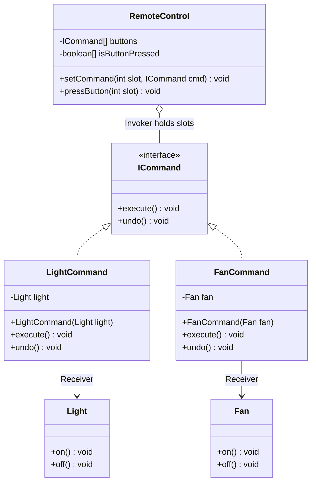
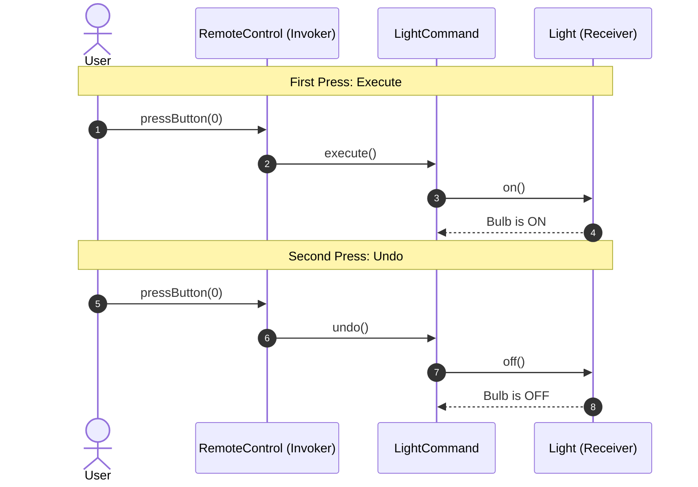

# 15. Command Design Pattern

> 💡 **Quick Revision Anchor**
> - The **Command Pattern** turns a request into a standalone object, decoupling the object invoking the request (**Invoker**) from the object performing the work (**Receiver**).
> - Key Philosophy: **"Encapsulate method invocation as an object"** to support parameterization, dynamic re-binding, queuing, and undo/redo.
> - Primary lecture example: **Universal Smart Home Remote Control** where slots dynamically bind to appliances (`Light`, `Fan`) and pressing a button toggles state via `execute()` and `undo()`. Real-world applications include text editor `Ctrl+Z` undo stacks and GUI button click dispatchers.

---

## 1. What Problem Are We Solving?

Suppose you are building a **Universal Smart Home Remote Control**:
- The remote has buttons (slots 0, 1, 2, etc.) that control appliances like lights, fans, and ACs.
- Today, Button 0 turns ON the **Living Room Light**.
- Tomorrow, the user buys a **Smart Fan** and wants Button 0 remapped to control the fan instead.
- If the user presses the button once, the appliance turns ON (`execute()`). If pressed again, the action is reversed (`undo()`).

---

## 2. Initial / Naive Approach: Direct Hardcoding

In a naive implementation, the remote control directly references every concrete appliance:

```text
❌ Naive Tightly-Coupled Remote:
┌───────────────────────────┐
│     BadRemoteControl      │
├───────────────────────────┤
│ -Light light              │ ────▶ calls light.turnOn()
│ -Fan fan                  │ ────▶ calls fan.startRotate()
│ -AC ac                    │ ────▶ calls ac.setTemperature(24)
├───────────────────────────┤
│ +pressButton(int slot)    │ ────▶ large if-else ladder!
└───────────────────────────┘
```

### Why Does It Fail?
- **Tight Coupling:** The Remote must know the exact classes, method names (`turnOn`, `startRotate`, `setTemperature`), and parameters of every appliance.
- **OCP Violation:** Adding a new appliance (e.g., Geyser) requires opening, modifying, and recompiling `BadRemoteControl`.
- **No Uniform Undo/Redo:** Because every appliance has completely different method signatures, tracking a unified undo history stack is impossible.

---

## 3. Key Design Idea: The Command Object

Decouple the caller from the receiver by introducing a unified command contract:
1. **Command Interface:** Declare abstract `execute()` and `undo()`.
2. **Concrete Commands:** Bind specific receiver methods to `execute()` and `undo()`.
3. **Invoker (Remote):** Holds only `ICommand` slots and triggers them uniformly without knowing what receiver is behind them.

```
[Invoker: Remote] ──calls──▶ [ICommand: execute()/undo()] ──delegates──▶ [Receiver: Light/Fan]
```

---

## 4. Visual Architecture



---

## 5. Concise Java Implementation (Primary Lecture Example)

```java
// ==========================================
// 1. COMMAND CONTRACT
// ==========================================
interface ICommand {
    void execute();
    void undo();
}

// ==========================================
// 2. RECEIVERS (Hardware / Domain Entities)
// ==========================================
class Light {
    public void on() { System.out.println("💡 [LIGHT] Bulb is ON."); }
    public void off() { System.out.println("💡 [LIGHT] Bulb is OFF."); }
}

class Fan {
    public void on() { System.out.println("🌀 [FAN] Motor spinning ON."); }
    public void off() { System.out.println("🌀 [FAN] Motor stopped (OFF)."); }
}

// ==========================================
// 3. CONCRETE COMMANDS (Binding Action to Receiver)
// ==========================================
class LightCommand implements ICommand {
    private final Light light;

    public LightCommand(Light light) {
        this.light = light;
    }

    @Override public void execute() { light.on(); }
    @Override public void undo() { light.off(); }
}

class FanCommand implements ICommand {
    private final Fan fan;

    public FanCommand(Fan fan) {
        this.fan = fan;
    }

    @Override public void execute() { fan.on(); }
    @Override public void undo() { fan.off(); }
}

// ==========================================
// 4. INVOKER (Remote Control with Toggle State)
// ==========================================
class RemoteControl {
    private final ICommand[] buttons;
    private final boolean[] isButtonPressed;

    public RemoteControl(int slots) {
        this.buttons = new ICommand[slots];
        this.isButtonPressed = new boolean[slots];
    }

    public void setCommand(int slot, ICommand command) {
        buttons[slot] = command;
        isButtonPressed[slot] = false; // Reset toggle state
    }

    public void pressButton(int slot) {
        if (slot < 0 || slot >= buttons.length || buttons[slot] == null) {
            System.out.println("⚠️ Slot " + slot + " is empty.");
            return;
        }

        if (!isButtonPressed[slot]) {
            buttons[slot].execute();
            isButtonPressed[slot] = true;
        } else {
            buttons[slot].undo();
            isButtonPressed[slot] = false;
        }
    }
}

// ==========================================
// 5. CLIENT DEMONSTRATION
// ==========================================
public class CommandPatternDemo {
    public static void main(String[] args) {
        RemoteControl remote = new RemoteControl(4);

        Light livingRoomLight = new Light();
        Fan bedroomFan = new Fan();

        remote.setCommand(0, new LightCommand(livingRoomLight));
        remote.setCommand(1, new FanCommand(bedroomFan));

        System.out.println("--- Testing Button 0 (Light Toggle) ---");
        remote.pressButton(0); // Turns ON
        remote.pressButton(0); // Turns OFF (Undo)

        System.out.println("\n--- Testing Button 1 (Fan Toggle) ---");
        remote.pressButton(1); // Turns ON
        remote.pressButton(1); // Turns OFF (Undo)

        System.out.println("\n--- Dynamic Runtime Re-mapping: Slot 0 -> Fan ---");
        remote.setCommand(0, new FanCommand(bedroomFan));
        remote.pressButton(0); // Now controls fan!
    }
}
```

### Execution Output:
```text
--- Testing Button 0 (Light Toggle) ---
💡 [LIGHT] Bulb is ON.
💡 [LIGHT] Bulb is OFF.

--- Testing Button 1 (Fan Toggle) ---
🌀 [FAN] Motor spinning ON.
🌀 [FAN] Motor stopped (OFF).

--- Dynamic Runtime Re-mapping: Slot 0 -> Fan ---
🌀 [FAN] Motor spinning ON.
```

---

## 6. Sequence Diagram: Button Press & Undo Flow



---

## 7. Deep Architectural Doubts Explored in Lecture

### Doubt 1: Why does `ICommand` NOT hold a reference to `Receiver`?
- `ICommand` is a pure behavioral abstraction declaring *what* can be done (`execute()`, `undo()`).
- If `ICommand` held a `Receiver` reference, it would force all commands to bind to a single receiver type. Concrete commands encapsulate the exact receiver they interact with.

### Doubt 2: Why not create a common `Appliance` parent class for all receivers?
- **Violates Liskov Substitution Principle (LSP) & ISP:** Different appliances have incompatible feature sets. An AC has `setTemperature(int)` and `setMode()`; a Smart TV has `changeChannel()`; a Light only has `on()`/`off()`.
- Forcing all appliances into an `Appliance` interface results in empty dummy methods or runtime exceptions. Concrete commands allow rich, device-specific APIs to be invoked behind a uniform `execute()`/`undo()`.

---

## 8. Real-World Applications Mentioned in Lecture

1. **GUI Text Editors (Undo / Redo History):**
   - Each keystroke, cut, copy, or paste is an `ICommand` pushed onto a `Stack<ICommand>`.
   - Pressing `Ctrl + Z` pops the top command and executes `command.undo()`.
2. **Task Queuing & Job Schedulers:**
   - Background workers pull command objects from thread-safe queues and call `execute()`.
3. **Write-Ahead Logging (WAL) & Crash Recovery:**
   - Commands are serialized to disk before execution; on server reboot, uncommitted commands are replayed.

---

## 9. Interview Questions & Key Discussion Points

1. **How do you implement Multi-Level Undo and Redo?**
   - Maintain two stacks: `undoStack` and `redoStack`.
   - On execution: push command to `undoStack`, clear `redoStack`.
   - On Undo: pop from `undoStack`, call `command.undo()`, push to `redoStack`.
   - On Redo: pop from `redoStack`, call `command.execute()`, push to `undoStack`.
2. **What is the difference between Strategy and Command Pattern?**
   - **Strategy:** Replaces *how* a task is achieved (different algorithms, e.g., `QuickSort` vs. `MergeSort`).
   - **Command:** Encapsulates *what* request to trigger, decoupling the caller from execution timing, history, and target.
3. **Should a Command object contain business logic?**
   - No. Commands are dispatchers that coordinate receivers. The receiver owns the business or hardware logic.

---

## 10. Quick Revision

```text
Problem: Hardcoding actions inside callers causes tight coupling and prevents undo/redo.
Solution: Package the request into a Command object with execute() and undo().
Participants: Invoker (Remote) -> Command (LightCommand) -> Receiver (Light).
Key Invariant: Invoker never knows the Receiver directly.
```
