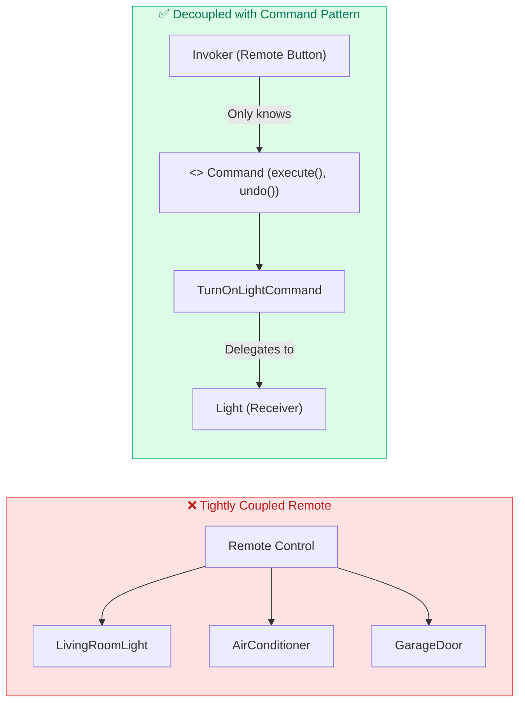
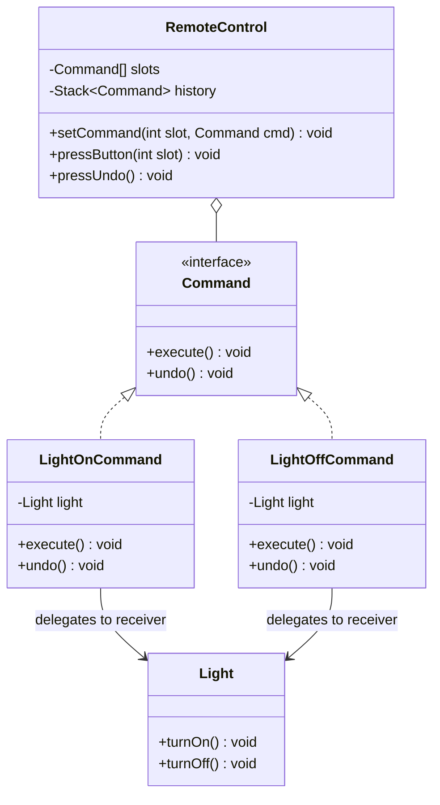

# 15. Command Design Pattern

> 💡 **Quick Revision Anchor**: `Encapsulate Requests as Objects, Decouple Invoker from Receiver, Built-in Undo/Redo`

---

## 1. Intent & Problem Motivation

The **Command Design Pattern** is a **Behavioral Design Pattern** that converts a request or action into a **stand-alone object** containing all information about the request (the receiver, method name, and arguments).

### The Decoupling Problem
Imagine designing a **Universal Remote Control** with 5 programmable buttons for a smart home:
- The remote should not be hardcoded to `livingRoomLight.turnOn()`.
- What if Button 1 turns on a Light today, but tomorrow the user rebinds Button 1 to open the Garage Door, and Button 2 to adjust the Air Conditioner?
- If the remote knows about `Light`, `GarageDoor`, and `AirConditioner`, the remote becomes tightly coupled and constantly changes.



---

## 2. Command Pattern Architecture & The 4 Key Actors

1. **Command Interface**: Declares execution contract (`execute()`, `undo()`).
2. **Concrete Command**: Binds a specific action to a Receiver.
3. **Receiver**: The actual domain worker (e.g., `Light`, `Thermostat`) that performs the real task.
4. **Invoker**: Holds references to commands and triggers execution (e.g., `RemoteControl`).
5. **Client**: Instantiates receivers, wraps them into commands, and registers commands with the invoker.



---

## 3. Java Implementation Walkthrough

### 1. Command Interface
```java
public interface Command {
    void execute();
    void undo();
}
```

### 2. Receiver (The Device)
```java
public class Light {
    private final String location;
    private boolean isOn = false;

    public Light(String location) { this.location = location; }

    public void turnOn() {
        isOn = true;
        System.out.println("💡 [" + location + "] Light is turned ON.");
    }

    public void turnOff() {
        isOn = false;
        System.out.println("🌑 [" + location + "] Light is turned OFF.");
    }
}
```

### 3. Concrete Commands
```java
public class TurnOnLightCommand implements Command {
    private final Light light;

    public TurnOnLightCommand(Light light) { this.light = light; }

    @Override
    public void execute() { light.turnOn(); }

    @Override
    public void undo() { light.turnOff(); }
}

public class TurnOffLightCommand implements Command {
    private final Light light;

    public TurnOffLightCommand(Light light) { this.light = light; }

    @Override
    public void execute() { light.turnOff(); }

    @Override
    public void undo() { light.turnOn(); }
}
```

### 4. Invoker (Remote Control with Undo History)
```java
public class RemoteControl {
    private final Command[] buttons = new Command[5];
    private final Deque<Command> history = new ArrayDeque<>();

    public void setCommand(int slot, Command command) {
        buttons[slot] = command;
    }

    public void pressButton(int slot) {
        if (buttons[slot] != null) {
            buttons[slot].execute();
            history.push(buttons[slot]); // Record for undo
        }
    }

    public void pressUndo() {
        if (!history.isEmpty()) {
            Command lastCommand = history.pop();
            System.out.print("[UNDO TRIGGERED] -> ");
            lastCommand.undo();
        } else {
            System.out.println("Nothing to undo.");
        }
    }
}
```

### 5. Client Execution
```java
public class Main {
    public static void main(String[] args) {
        RemoteControl remote = new RemoteControl();
        Light livingRoomLight = new Light("Living Room");

        // Bind buttons
        remote.setCommand(0, new TurnOnLightCommand(livingRoomLight));
        remote.setCommand(1, new TurnOffLightCommand(livingRoomLight));

        // Press Button 0 (Turn ON)
        remote.pressButton(0);

        // Press Button 1 (Turn OFF)
        remote.pressButton(1);

        // Press Undo (Reverts Button 1, Turns Light back ON!)
        remote.pressUndo();

        // Press Undo (Reverts Button 0, Turns Light OFF!)
        remote.pressUndo();
    }
}
```

#### Output:
```text
💡 [Living Room] Light is turned ON.
🌑 [Living Room] Light is turned OFF.
[UNDO TRIGGERED] -> 💡 [Living Room] Light is turned ON.
[UNDO TRIGGERED] -> 🌑 [Living Room] Light is turned OFF.
```

---

## 4. Real-World Applications

1. **GUI Buttons & Menu Items**: In IDEs, clicking "Copy", "Paste", or "Save" triggers an encapsulated `Command` without UI buttons knowing filesystem or clipboard internals.
2. **Transactional Rollbacks**: In databases and transaction managers, each mutating operation stores an inverse command to execute if a rollback is triggered.
3. **Task Queues & Background Schedulers**: Thread pools (`Runnable` and `Callable` in Java are standard Command implementations).
4. **Macro Commands (Batch Scripts)**: Combining multiple commands into a single `MacroCommand` that executes sequential operations in a single click.
