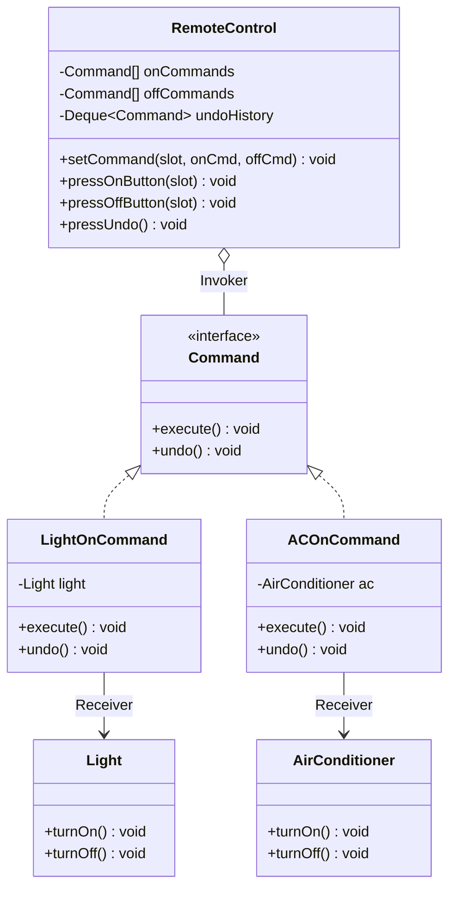

# 15. Command Design Pattern

> 💡 **Quick Revision Anchor**: 
> - **Type**: Behavioral Design Pattern.
> - **Core Intent**: Encapsulates a request as a standalone object, separating the **Invoker** that issues the request from the **Receiver** that performs the action.
> - **Primary Superpowers**: Parameterization of requests, queuing/logging of operations, and multi-level **Undo/Redo** support.

---

## 1. Context & The Tight Coupling Anti-Pattern

Imagine designing a **Universal Smart Home Remote Control**:
- You have 7 programmable button slots.
- The user can assign a button to turn on a Living Room Light, activate an Air Conditioner to 22°C, open the Garage Door, or play a Spotify playlist on a Stereo.

### The Naive Anti-Pattern (Hardcoded Coupling):
```java
// ❌ Naive Remote: Hardcoded to specific vendor classes!
public class BadRemote {
    private Light light;
    private AirConditioner ac;

    public void onButtonPressed(int slot) {
        if (slot == 1) light.turnOn();
        else if (slot == 2) ac.setTemperature(22);
        // Violates OCP every time a new device is purchased!
    }
}
```
If you buy a new smart curtain or robotic vacuum, you must rewrite and recompile the `RemoteControl` class!

---

## 2. Command Pattern Architecture



### The 4 Key Participants:
1. **Command Interface**: Declares `execute()` and `undo()`.
2. **Concrete Commands (`LightOnCommand`)**: Binds an action to a specific receiver.
3. **Receiver (`Light`, `AirConditioner`)**: Contains actual device hardware logic.
4. **Invoker (`RemoteControl`)**: Holds command slots and triggers execution without knowing which receiver is being operated.

---

## 3. Production Java Implementation with Multi-Level Undo & Macro Mode

```java
import java.util.*;

// 1. Command Interface
public interface Command {
    void execute();
    void undo();
}

// 2. Null Object Pattern: Avoids null checks for empty button slots
public class NoCommand implements Command {
    @Override public void execute() {}
    @Override public void undo() {}
}

// 3. Receivers (Domain entities with business logic)
public class Light {
    private final String location;
    private boolean isOn = false;

    public Light(String location) { this.location = location; }
    public void turnOn()  { isOn = true; System.out.println("💡 [" + location + "] Light is ON"); }
    public void turnOff() { isOn = false; System.out.println("🌑 [" + location + "] Light is OFF"); }
    public boolean isOn() { return isOn; }
}

public class AirConditioner {
    private boolean isRunning = false;
    private int temperature = 24;

    public void turnOn() { isRunning = true; System.out.println("❄️ AC is ON at " + temperature + "°C"); }
    public void turnOff() { isRunning = false; System.out.println("🛑 AC is OFF"); }
    public void setTemperature(int temp) { this.temperature = temp; System.out.println("🌡️ AC set to " + temp + "°C"); }
}

// 4. Concrete Commands
public class LightOnCommand implements Command {
    private final Light light;

    public LightOnCommand(Light light) { this.light = light; }
    @Override public void execute() { light.turnOn(); }
    @Override public void undo()    { light.turnOff(); }
}

public class LightOffCommand implements Command {
    private final Light light;

    public LightOffCommand(Light light) { this.light = light; }
    @Override public void execute() { light.turnOff(); }
    @Override public void undo()    { light.turnOn(); }
}

public class ACOnCommand implements Command {
    private final AirConditioner ac;

    public ACOnCommand(AirConditioner ac) { this.ac = ac; }
    @Override public void execute() { ac.turnOn(); }
    @Override public void undo()    { ac.turnOff(); }
}

// Macro Command: Batch execution (Party Mode / Goodnight Mode)
public class MacroCommand implements Command {
    private final List<Command> commands;

    public MacroCommand(List<Command> commands) { this.commands = commands; }
    @Override public void execute() { for (Command cmd : commands) cmd.execute(); }
    @Override public void undo() {
        // Reverse undo order
        for (int i = commands.size() - 1; i >= 0; i--) {
            commands.get(i).undo();
        }
    }
}

// 5. Invoker: Programmable Remote with Undo Stack
public class RemoteControl {
    private final Command[] onCommands;
    private final Command[] offCommands;
    private final Deque<Command> undoHistory = new ArrayDeque<>();

    public RemoteControl(int slots) {
        onCommands = new Command[slots];
        offCommands = new Command[slots];
        Command noOp = new NoCommand();
        for (int i = 0; i < slots; i++) {
            onCommands[i] = noOp;
            offCommands[i] = noOp;
        }
    }

    public void setCommand(int slot, Command onCmd, Command offCmd) {
        onCommands[slot] = onCmd;
        offCommands[slot] = offCmd;
    }

    public void pressOnButton(int slot) {
        onCommands[slot].execute();
        undoHistory.push(onCommands[slot]);
    }

    public void pressOffButton(int slot) {
        offCommands[slot].execute();
        undoHistory.push(offCommands[slot]);
    }

    public void pressUndo() {
        if (undoHistory.isEmpty()) {
            System.out.println("⚠️ No commands left to undo.");
            return;
        }
        Command lastCommand = undoHistory.pop();
        System.out.print("[UNDO] ");
        lastCommand.undo();
    }
}
```

### Demonstration Execution:
```java
public class CommandDemo {
    public static void main(String[] args) {
        RemoteControl remote = new RemoteControl(4);

        Light livingRoomLight = new Light("Living Room");
        AirConditioner ac = new AirConditioner();

        // Assign slots
        remote.setCommand(0, new LightOnCommand(livingRoomLight), new LightOffCommand(livingRoomLight));
        remote.setCommand(1, new ACOnCommand(ac), new NoCommand());

        // Press buttons
        remote.pressOnButton(0); // Turns on Light
        remote.pressOnButton(1); // Turns on AC

        // Multi-level undo
        remote.pressUndo(); // Undoes AC turn on -> turns off
        remote.pressUndo(); // Undoes Light turn on -> turns off
    }
}
```

---

## 4. Real-World Applications

1. **Transactional Database Rollbacks (WAL)**:
   Every DB operation (INSERT, UPDATE, DELETE) is stored as a reversible command object in Write-Ahead Logs for atomic rollbacks (`undo()`).
2. **GUI Desktop Applications**:
   Every button click, keystroke, and menu item (Edit $\rightarrow$ Cut / Paste) is mapped to an action command supporting Ctrl+Z.
3. **Job Schedulers & Thread Pools**:
   `Runnable` and `Callable` in Java are standard command objects placed on worker queues for asynchronous execution.
