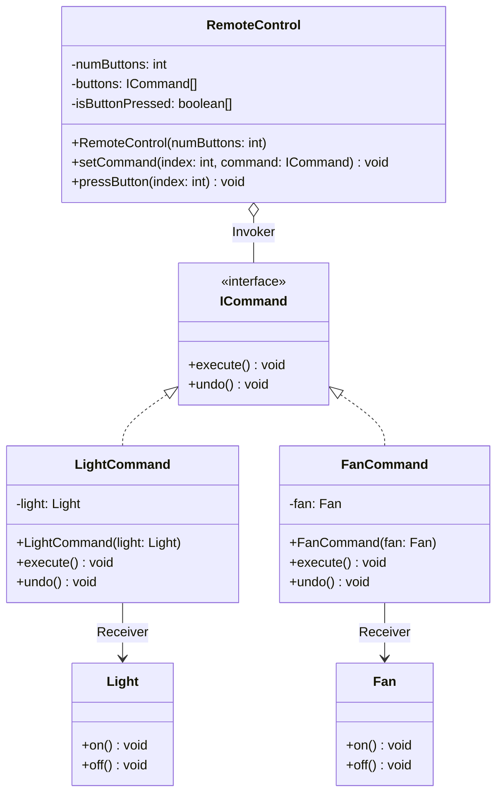
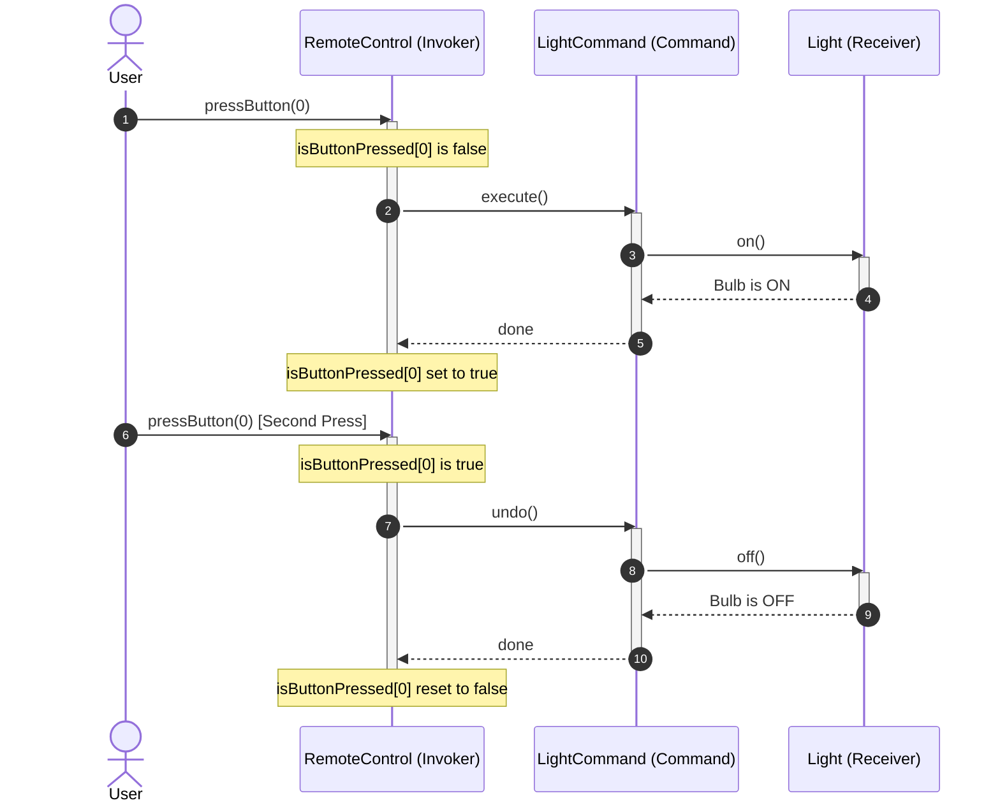

# 15. Command Design Pattern

## 1. Introduction & Motivation

In object-oriented software engineering, we frequently have an object (the **Source** or **Invoker**) that wants to trigger an action on another object (the **Receiver**). 

The naive approach is for the Source to directly invoke methods on the Receiver:
```
Source --------------------> Receiver.turnOn()
(Tightly coupled to Receiver's concrete class and method)
```

However, direct invocation causes severe architectural problems:
1. **Tight Coupling**: The caller must know the exact concrete type, method signature, and internal contract of the receiver.
2. **OCP Violation**: Whenever a new receiver is added or a button's behavior changes, the caller class must be modified and recompiled.
3. **No Support for Undo / Redo**: When actions are executed as ad-hoc procedural method calls, it is nearly impossible to track history, reverse an operation, or maintain an undo stack.
4. **No Queuing or Logging**: You cannot easily serialize, log, or queue raw method invocations.

The **Command Design Pattern** solves this by turning a request/action itself into a standalone first-class **Object**:

```
Source (Invoker) --------> Command Object (execute() / undo()) --------> Receiver (Light / Fan)
```

---

## 2. Real-World Domain: Universal Smart Home Remote Control

To understand the pattern intuitively, consider designing a **Smart Home Remote Control**:
- The remote has multiple physical or digital buttons.
- Today, Button 0 controls a **Light**, and Button 1 controls a **Fan**.
- Tomorrow, the user buys a **Smart AC** or **Smart Room Heater** and wants Button 0 remapped to the AC.
- If the user presses Button 0 once, the light turns **ON**. If they press it again, the action is **UNDONE** (the light turns **OFF**).

### Naive Implementation (Anti-Pattern)
```java
// ❌ NAIVE APPROACH: Hardcoding appliances inside the RemoteControl
public class BadRemoteControl {
    private Light livingRoomLight;
    private Fan ceilingFan;
    private AC airConditioner;

    public void pressButton(int buttonIndex) {
        if (buttonIndex == 0) {
            livingRoomLight.turnOn(); // Hardcoded tight coupling!
        } else if (buttonIndex == 1) {
            ceilingFan.turnOn();
        } else if (buttonIndex == 2) {
            airConditioner.setTemp(24);
            airConditioner.turnOn();
        }
        // Adding a Room Heater breaks Open/Closed Principle!
    }
}
```

### The Command Pattern Solution
Instead of hardcoding appliances:
1. Define an `ICommand` interface with `execute()` and `undo()`.
2. Encapsulate each device action into a concrete command: `LightCommand`, `FanCommand`.
3. The `RemoteControl` only holds a collection of `ICommand` references and a state tracker (`isButtonPressed[]`).
4. When a button is pressed, the remote delegates execution to `command.execute()` or `command.undo()`.

---

## 3. Core Roles in Command Design Pattern

| Role | Class / Interface | Responsibility |
| :--- | :--- | :--- |
| **Command Interface** | `ICommand` | Declares abstract operations for executing and undoing an action (`execute()`, `undo()`). |
| **Concrete Command** | `LightCommand`, `FanCommand` | Encapsulates the binding between a specific action and its **Receiver**. Implements `execute()` by delegating to receiver methods. |
| **Receiver** | `Light`, `Fan` | The target hardware or domain entity that actually knows how to perform the low-level work (e.g., turning on electricity, spinning motor). |
| **Invoker** | `RemoteControl` | Holds command references (e.g., in an array or slots) and triggers them on user interaction without knowing what receiver is affected. |
| **Client** | `Main` | Instantiates receivers, configures concrete commands with receivers, and binds commands into the remote control's slots. |

---

## 4. Class Diagram



---

## 5. Complete Java Implementation

### 5.1 Command Interface

```java
package com.coderarmy.command;

// Abstract Command Contract
public interface ICommand {
    void execute();
    void undo();
}
```

---

### 5.2 Receivers (Appliance Hardware Abstractions)

Receivers do **not** know about the Command pattern, remotes, or callers. They focus purely on domain actions.

```java
package com.coderarmy.command;

// Receiver 1: Light
public class Light {
    public void on() {
        System.out.println("[LIGHT] Bulb is ON (Illuminating room).");
    }

    public void off() {
        System.out.println("[LIGHT] Bulb is OFF (Room is dark).");
    }
}
```

```java
package com.coderarmy.command;

// Receiver 2: Fan
public class Fan {
    public void on() {
        System.out.println("[FAN] Motor spinning ON at default speed.");
    }

    public void off() {
        System.out.println("[FAN] Motor stopped (OFF).");
    }
}
```

---

### 5.3 Concrete Commands

Each concrete command holds a reference to its specific receiver and coordinates the action.

```java
package com.coderarmy.command;

// Concrete Command for Light
public class LightCommand implements ICommand {
    private final Light light;

    public LightCommand(Light light) {
        this.light = light;
    }

    @Override
    public void execute() {
        light.on();
    }

    @Override
    public void undo() {
        light.off();
    }
}
```

```java
package com.coderarmy.command;

// Concrete Command for Fan
public class FanCommand implements ICommand {
    private final Fan fan;

    public FanCommand(Fan fan) {
        this.fan = fan;
    }

    @Override
    public void execute() {
        fan.on();
    }

    @Override
    public void undo() {
        fan.off();
    }
}
```

---

### 5.4 Invoker (Smart Remote Control with Toggle / Undo Tracking)

The invoker maintains slots for commands and tracks button states using a boolean array so that pressing an active button automatically triggers `undo()`.

```java
package com.coderarmy.command;

public class RemoteControl {
    private final int numButtons;
    private final ICommand[] buttons;
    private final boolean[] isButtonPressed;

    public RemoteControl(int numButtons) {
        this.numButtons = numButtons;
        this.buttons = new ICommand[numButtons];
        this.isButtonPressed = new boolean[numButtons]; // Defaults to false
    }

    // Dynamic configuration of buttons (remap at runtime)
    public void setCommand(int index, ICommand command) {
        if (index < 0 || index >= numButtons) {
            throw new IllegalArgumentException("Invalid button index: " + index);
        }
        this.buttons[index] = command;
        this.isButtonPressed[index] = false; // Reset state on re-binding
    }

    // Pressing button executes or undos based on state
    public void pressButton(int index) {
        if (index < 0 || index >= numButtons) {
            System.out.println("[ERROR] Button " + index + " does not exist on this remote.");
            return;
        }

        ICommand command = buttons[index];
        if (command == null) {
            System.out.println("[WARNING] Button " + index + " has no command assigned.");
            return;
        }

        if (!isButtonPressed[index]) {
            // First press -> Turn ON (Execute)
            System.out.println("-> Remote Button " + index + " pressed (EXECUTE):");
            command.execute();
            isButtonPressed[index] = true;
        } else {
            // Second press -> Toggle OFF (Undo)
            System.out.println("-> Remote Button " + index + " pressed again (UNDO):");
            command.undo();
            isButtonPressed[index] = false;
        }
    }
}
```

---

### 5.5 Client Execution & Demonstration

```java
package com.coderarmy.command;

public class Main {
    public static void main(String[] args) {
        System.out.println("=== INITIALIZING SMART HOME REMOTE (4 SLOTS) ===");
        RemoteControl remote = new RemoteControl(4);

        // 1. Instantiate Receivers
        Light livingRoomLight = new Light();
        Fan bedroomFan = new Fan();

        // 2. Instantiate Concrete Commands
        ICommand lightCommand = new LightCommand(livingRoomLight);
        ICommand fanCommand = new FanCommand(bedroomFan);

        // 3. Configure Invoker Slots
        remote.setCommand(0, lightCommand);
        remote.setCommand(1, fanCommand);

        System.out.println("\n=== TESTING BUTTON 0 (LIGHT TOGGLE) ===");
        remote.pressButton(0); // Turns light ON
        remote.pressButton(0); // Turns light OFF (Undo)

        System.out.println("\n=== TESTING BUTTON 1 (FAN TOGGLE) ===");
        remote.pressButton(1); // Turns fan ON
        remote.pressButton(1); // Turns fan OFF (Undo)

        System.out.println("\n=== DYNAMIC RUNTIME RE-BINDING ===");
        System.out.println("User swaps Button 0 from Light to Bedroom Fan:");
        remote.setCommand(0, fanCommand);
        remote.pressButton(0); // Now controls fan!

        System.out.println("\n=== TESTING UNASSIGNED SLOT ===");
        remote.pressButton(3); // Warning: no command assigned
    }
}
```

---

## 6. Execution Trace & Sequence Diagram



---

## 7. Deep Architectural Doubts Explored in Lecture

In the lecture, two crucial design dilemmas were analyzed in detail:

### Doubt 1: Why does `ICommand` NOT hold a reference to `Light` or `Receiver`?
- **Question**: Why is the HAS-A relationship with the receiver placed inside `LightCommand` rather than in the base `ICommand` interface?
- **Explanation**: 
  - `ICommand` is a pure abstraction declaring only *what* can be done (`execute()`, `undo()`). It does not care *who* executes it.
  - If `ICommand` held a receiver reference, it would force all commands to bind to that single type of receiver.
  - By placing the receiver inside concrete commands (`LightCommand HAS-A Light`, `FanCommand HAS-A Fan`), each command binds exclusively to the exact receiver it needs.

### Doubt 2: Why not create a common `Appliance` parent class for all receivers?
- **Question**: Why not create `class Appliance { on(); off(); }` and have `Command HAS-A Appliance` so we only need one generic `Command` class?
- **Explanation**:
  - **Liskov Substitution Principle (LSP) Violation**: Not all smart appliances fit into a simple `on()` / `off()` interface. 
    - An **AC** has `setTemperature(int temp)`, `setMode(Mode mode)`.
    - A **Smart Refrigerator** has `setFreezerTemp()`, `defrost()`.
    - A **Room Heater** has `setTimer(int mins)`.
  - Forcing all appliances into a monolithic `Appliance` interface violates LSP and ISP (Interface Segregation Principle).
  - Concrete commands allow each command to interact with the unique, rich API of its specific receiver while presenting the identical, uniform `execute()`/`undo()` interface to the invoker.

---

## 8. Real-World Use Cases

1. **GUI Text Editors & Photoshop (Undo / Redo Stacks)**:
   - When you press `Ctrl + Z` (or `Cmd + Z`), you undo the last action.
   - Every operation (type character, delete word, bold text, crop image) is packaged as a `Command` object and pushed onto a **History Stack** (`Stack<ICommand>`).
   - When undo is triggered, the system pops the top command and invokes `command.undo()`.
2. **Keyboard Shortcut Customization**:
   - Operating systems and IDEs (e.g. VS Code, IntelliJ) allow developers to map any key combination to an action. The keystroke listener is the Invoker, which triggers whichever `Command` is bound in the keymap configuration.
3. **Task Queuing & Background Job Schedulers**:
   - Commands can be added to thread-safe queues (`BlockingQueue<ICommand>`) for asynchronous execution by worker thread pools.
4. **Transactional Logging & Crash Recovery**:
   - Because commands encapsulate all state needed to execute an action, they can be written to a write-ahead log (WAL) on disk. In the event of a system crash, the log is replayed to reconstruct system state.

---

## Quick Revision

### Core Idea
The **Command Pattern** turns a request into a standalone **Object**, decoupling the object that invokes the command (**Invoker**) from the object that performs the low-level logic (**Receiver**).

### Remember
- **4 Key Players**:
  - **Invoker** (`RemoteControl`): Triggers commands via slots or buttons.
  - **Command** (`ICommand`): Contract with `execute()` and `undo()`.
  - **Concrete Command** (`LightCommand`): Connects `execute()` to `receiver.on()`.
  - **Receiver** (`Light`, `Fan`): Real hardware or business logic.
- **LSP Compliance**: Do not try to force all receivers into a monolithic `Appliance` parent class; let concrete commands bind directly to concrete receivers.

### Java Implementation Idea
```java
// Receiver
Light light = new Light();

// Command
ICommand lightOn = new LightCommand(light);

// Invoker
RemoteControl remote = new RemoteControl(4);
remote.setCommand(0, lightOn);
remote.pressButton(0); // Turns ON
remote.pressButton(0); // Turns OFF (Undo)
```

### Most Important Interview Point
Explain how the pattern enables **Undo/Redo**: Since every action is an object with an `undo()` method, the invoker or an orchestrator can maintain a `Stack<ICommand>`. Pushing executed commands onto the stack allows multi-level undo by simply popping and calling `undo()`.

### Common Trap
Do not put appliance logic inside the Command class. The command is merely a **Dispatcher / Bridge** that delegates to the Receiver. Keep the Receiver responsible for hardware/business operations.
