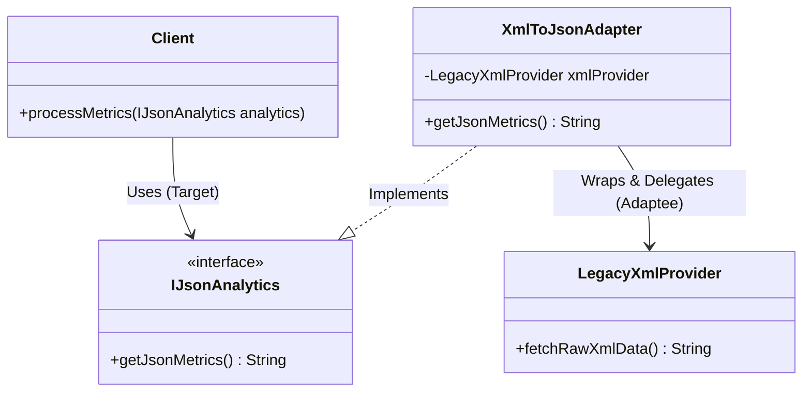
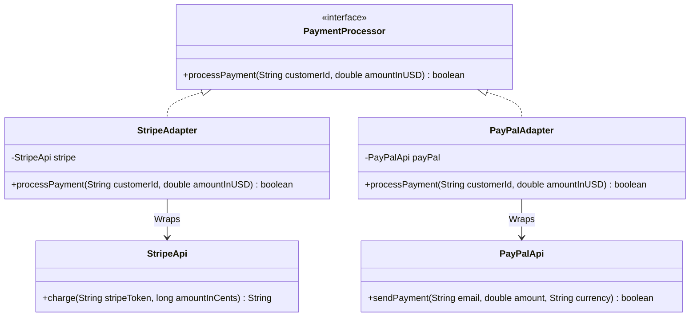

# 16. Adapter Design Pattern

> 💡 **Quick Revision Anchor**: 
> - **Type**: Structural Design Pattern.
> - **Core Intent**: Acts as a bridge between **two incompatible interfaces**, allowing classes to collaborate that normally could not due to mismatched API signatures or data formats.
> - **Real-World Metaphor**: A travel power adapter that allows a 3-pin US plug to fit safely into a 2-pin European round wall socket.

---

## 1. Context & Motivation

In enterprise software engineering, you constantly integrate third-party libraries, external SDKs, or legacy systems:
- Your application's client services expect data in modern **JSON format** via a standard domain interface (`IJsonAnalytics`).
- A vendor's proprietary SDK produces analytics data exclusively in **XML format** (`LegacyXmlProvider`).
- **Anti-Pattern**: Directly scattering XML parsing code and third-party vendor calls throughout your client business logic. This tightly couples your core application to a proprietary vendor API.
- **Adapter Solution**: Wrap the incompatible class (`Adaptee`) inside an `Adapter` class that implements your application's expected interface (`Target`). The adapter handles conversion seamlessly behind the scenes.



---

## 2. Object Adapter vs. Class Adapter

| Parameter | Object Adapter (Recommended ⭐) | Class Adapter |
| :--- | :--- | :--- |
| **Mechanism** | Uses **Composition** (HAS-A relation). | Uses **Multiple Inheritance** (IS-A both Target & Adaptee). |
| **Language Support** | Supported in all OOP languages (Java, C++, Python, C#). | Only feasible in languages supporting multiple class inheritance (C++, Python). **Impossible in Java** with multiple classes. |
| **Coupling** | **Loose coupling**. Can adapt any subclass of the Adaptee. | **Tight coupling**. Bound to one specific concrete Adaptee class. |
| **Flexibility** | High. One adapter can work with the Adaptee and all its subclasses. | Low. Cannot adapt subclasses of the Adaptee easily. |

---

## 3. Production Java Implementation: Case Study 1 (XML to JSON Adapter)

```java
// 1. Target Interface: Expected by our modern reporting dashboard
public interface IJsonAnalytics {
    String getJsonMetrics();
}

// 2. Adaptee: 3rd-party vendor SDK producing legacy XML
public class LegacyXmlProvider {
    public String fetchRawXmlData() {
        return "<analytics><users><active>1420</active><churnRate>0.04</churnRate></users></analytics>";
    }
}

// 3. Adapter: Implements Target interface, wraps Adaptee
public class XmlToJsonAdapter implements IJsonAnalytics {
    private final LegacyXmlProvider xmlProvider;

    public XmlToJsonAdapter(LegacyXmlProvider xmlProvider) {
        if (xmlProvider == null) throw new IllegalArgumentException("Adaptee cannot be null");
        this.xmlProvider = xmlProvider;
    }

    @Override
    public String getJsonMetrics() {
        // Step 1: Query legacy Adaptee to get raw XML
        String rawXml = xmlProvider.fetchRawXmlData();
        System.out.println("🔄 [Adapter] Received XML payload from vendor: " + rawXml);

        // Step 2: Translate XML to clean JSON
        String convertedJson = convertXmlToJson(rawXml);
        System.out.println("✅ [Adapter] Converted XML to JSON successfully.");

        return convertedJson;
    }

    private String convertXmlToJson(String xml) {
        String activeUsers = xml.replaceAll(".*<active>(.*?)</active>.*", "$1");
        String churnRate = xml.replaceAll(".*<churnRate>(.*?)</churnRate>.*", "$1");
        return "{\n  \"activeUsers\": " + activeUsers + ",\n  \"churnRate\": " + churnRate + "\n}";
    }
}

// 4. Client Code: Expects only IJsonAnalytics
public class AnalyticsDashboardClient {
    public void displayDashboard(IJsonAnalytics analyticsService) {
        System.out.println("📊 Rendering Dashboard with Real-time Metrics:");
        String json = analyticsService.getJsonMetrics();
        System.out.println(json);
    }
}
```

---

## 4. Production Java Implementation: Case Study 2 (Payment Gateway Adapter)

In real-world e-commerce, applications must integrate external payment gateways like **Stripe**, **PayPal**, and **Razorpay**, each with different method signatures and currencies:



```java
// Target Interface: Our application's universal payment contract
public interface PaymentProcessor {
    boolean processPayment(String customerId, double amountInUSD);
}

// Incompatible Vendor 1: Stripe API (expects amount in CENTS as integer)
public class StripeApi {
    public String charge(String stripeCustomerToken, long amountInCents) {
        System.out.println("💳 [Stripe API] Charging " + amountInCents + " cents to " + stripeCustomerToken);
        return "ch_stripe_success_9981";
    }
}

// Incompatible Vendor 2: PayPal API (expects email and ISO currency code)
public class PayPalApi {
    public boolean sendPayment(String paypalEmail, double amount, String currencyCode) {
        System.out.println("🅿️ [PayPal API] Sending $" + amount + " " + currencyCode + " to " + paypalEmail);
        return true;
    }
}

// Adapter 1: Stripe Adapter
public class StripeAdapter implements PaymentProcessor {
    private final StripeApi stripeApi;

    public StripeAdapter(StripeApi stripeApi) { this.stripeApi = stripeApi; }

    @Override
    public boolean processPayment(String customerId, double amountInUSD) {
        // Conversion logic: Dollars to Cents
        long amountInCents = Math.round(amountInUSD * 100);
        String chargeId = stripeApi.charge(customerId, amountInCents);
        return chargeId != null && !chargeId.isEmpty();
    }
}

// Adapter 2: PayPal Adapter
public class PayPalAdapter implements PaymentProcessor {
    private final PayPalApi payPalApi;

    public PayPalAdapter(PayPalApi payPalApi) { this.payPalApi = payPalApi; }

    @Override
    public boolean processPayment(String customerId, double amountInUSD) {
        return payPalApi.sendPayment(customerId, amountInUSD, "USD");
    }
}
```

---

## 5. Two-Way Adapters

A **Two-Way Adapter** implements **both** the Target interface and the Adaptee interface simultaneously. It can be passed to systems expecting the Target, or to legacy systems expecting the Adaptee, enabling seamless bidirectional interoperability.

---

## 6. Real-World Java Standard Library Adapters

1. **`java.util.Arrays#asList(T... a)`**:
   Adapts an array of raw primitives/objects (`T[]`) to the `java.util.List<T>` collection interface.
2. **`java.io.InputStreamReader(InputStream)`**:
   Adapts a byte-oriented input stream (`InputStream`) to a character-oriented reader interface (`Reader`).

---

## 7. Adapter vs. Facade vs. Decorator

| Pattern | Problem it Solves | Interface Transformation |
| :--- | :--- | :--- |
| **Adapter** | Converts an **incompatible existing interface** into one the client expects | Converts old interface $\rightarrow$ **new target interface** |
| **Facade** | Provides a **simplified, high-level interface** to a complex subsystem | Creates a **new simpler interface** over many subsystem classes |
| **Decorator** | Adds **new behaviors dynamically** without altering existing code | Preserves the **exact same interface** as the wrapped object |
