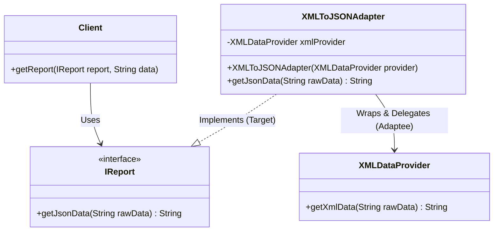
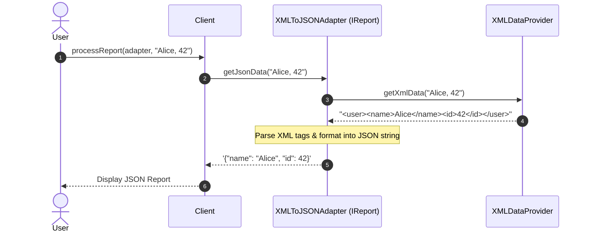

# 16. Adapter Design Pattern

> 💡 **Quick Revision Anchor**: The **Adapter Pattern** is a **structural design pattern** that acts as a bridge between two incompatible interfaces. It wraps an existing class (Adaptee) with a new interface (Target) so that incompatible classes can collaborate without changing existing source code.

---

## 1. Context & Motivation

Imagine traveling from India/US to Europe with your laptop charger. Your charger has a 3-pin plug, but the European wall socket accepts only a 2-pin rounded plug. You don't rebuild your laptop charger or break the wall socket; you insert an **adapter** in between.

In software architecture:
- Your application's client expects data or API calls in a specific format (e.g., modern **JSON-based analytics** or a standard internal interface).
- A 3rd-party provider or legacy system produces or accepts data in an incompatible format (e.g., **XML** data or legacy SOAP calls).
- **Anti-Pattern**: Directly altering client code with messy conversions or altering third-party/legacy code (which you often don't own). This tightly couples your core business logic to vendor-specific APIs.
- **Adapter Solution**: Introduce an **Adapter** class that implements your client's expected interface (`Target`), holds a reference to the legacy/third-party object (`Adaptee`), and translates incoming requests on the fly.

---

## 2. Core Architecture & Actors



### The 4 Key Participants:
1. **Target Interface (`IReport`)**: The domain-specific interface that your client expects and knows how to use.
2. **Client**: The application code that executes business logic using the Target interface.
3. **Adaptee (`XMLDataProvider`)**: The existing, incompatible class or 3rd-party library that contains useful functionality but has the wrong interface.
4. **Adapter (`XMLToJSONAdapter`)**: Implements the Target interface while holding a reference to the Adaptee. It translates calls from the Target interface into calls the Adaptee understands and converts results back.

---

## 3. Object Adapter vs. Class Adapter

| Aspect | Object Adapter (Recommended) | Class Adapter |
| :--- | :--- | :--- |
| **Mechanism** | Uses **Composition** (HAS-A relation). | Uses **Multiple Inheritance** (IS-A both Target and Adaptee). |
| **Language Support** | Supported in all languages (Java, C++, Python, C#). | Only supported in languages with multiple class inheritance (C++, Python). Not feasible directly in Java (single class inheritance). |
| **Flexibility** | High. Can adapt any subclass of the Adaptee. | Low. Tied to the specific concrete class extended. |
| **Coupling** | Loose coupling. | Tightly coupled to both Target and Adaptee hierarchies. |

---

## 4. Production Java Implementation

### Step 1: Target Interface
```java
// Target interface that the Client code relies upon
public interface IReport {
    String getJsonData(String rawData);
}
```

### Step 2: Incompatible Adaptee (Legacy / 3rd-Party)
```java
// Adaptee: Existing service that produces XML data
public class XMLDataProvider {
    public String getXmlData(String rawData) {
        // Simulating raw data conversion to XML
        String[] parts = rawData.split(",");
        String name = parts.length > 0 ? parts[0].trim() : "Unknown";
        String id = parts.length > 1 ? parts[1].trim() : "0";
        
        return "<user><name>" + name + "</name><id>" + id + "</id></user>";
    }
}
```

### Step 3: Adapter (Translates XML to JSON)
```java
// Adapter: Implements IReport, wraps XMLDataProvider
public class XMLToJSONAdapter implements IReport {
    private final XMLDataProvider xmlDataProvider;

    public XMLToJSONAdapter(XMLDataProvider xmlDataProvider) {
        this.xmlDataProvider = xmlDataProvider;
    }

    @Override
    public String getJsonData(String rawData) {
        // 1. Delegate to the Adaptee to get XML
        String xmlData = xmlDataProvider.getXmlData(rawData);
        System.out.println("[Adapter] Received from Adaptee: " + xmlData);

        // 2. Translate XML to JSON format
        String jsonData = convertXmlToJson(xmlData);
        System.out.println("[Adapter] Converted to Target JSON: " + jsonData);
        return jsonData;
    }

    private String convertXmlToJson(String xml) {
        // Extract content between tags: <name>...</name> and <id>...</id>
        String name = extractTag(xml, "name");
        String id = extractTag(xml, "id");
        return "{\"name\": \"" + name + "\", \"id\": " + id + "}";
    }

    private String extractTag(String xml, String tag) {
        String openTag = "<" + tag + ">";
        String closeTag = "</" + tag + ">";
        int start = xml.indexOf(openTag);
        int end = xml.indexOf(closeTag);
        if (start != -1 && end != -1) {
            return xml.substring(start + openTag.length(), end);
        }
        return "";
    }
}
```

### Step 4: Client & Test Driver
```java
// Client class: only depends on the IReport abstraction
public class Client {
    public void processReport(IReport report, String rawInput) {
        System.out.println("[Client] Requesting report for input: " + rawInput);
        String jsonResult = report.getJsonData(rawInput);
        System.out.println("[Client] Displaying final JSON report: " + jsonResult);
    }
}

public class Main {
    public static void main(String[] args) {
        // 1. Existing legacy adaptee
        XMLDataProvider legacyProvider = new XMLDataProvider();

        // 2. Wrap it with our adapter
        IReport adapter = new XMLToJSONAdapter(legacyProvider);

        // 3. Client interacts with adapter via standard IReport interface
        Client client = new Client();
        client.processReport(adapter, "Alice, 42");
        System.out.println("---");
        client.processReport(adapter, "Bob, 108");
    }
}
```

---

## 5. Sequence Diagram



---

## 6. Adapter vs. Other Structural Patterns

| Pattern | Intent | Key Difference |
| :--- | :--- | :--- |
| **Adapter** | Converts one existing interface to match another expected interface. | Changes the **interface** of an existing object without altering behavior. |
| **Decorator** | Adds responsibilities/behaviors dynamically without altering interface. | Keeps the **same interface** while enriching behavior. |
| **Facade** | Provides a simplified higher-level interface to a complex subsystem. | Defines a **new, simpler interface** over many classes. |
| **Proxy** | Provides a surrogate/placeholder to control access to an object. | Has the **exact same interface** as the underlying object. |

---

## 7. Real-World Applications & Interview Tips

1. **Java Standard Library**:
   - `java.util.Arrays#asList()` adapts an array into a `List`.
   - `java.io.InputStreamReader(InputStream)` adapts a byte stream (`InputStream`) into a character stream (`Reader`).
2. **Third-Party Payment Gateways**:
   - Your internal service uses `PaymentGateway` (`charge(double amount, String customerId)`).
   - Stripe expects `stripeClient.createCharge(Map<String, Object> params)`.
   - Razorpay expects `razorpayClient.payments.capture(String paymentId, JSONObject req)`.
   - Adapters (`StripePaymentAdapter`, `RazorpayPaymentAdapter`) standardize multiple vendor APIs into a uniform domain interface.
3. **Interview Gotchas**:
   - Remember the **Single Responsibility Principle**: An adapter should only translate between interfaces; do not pollute it with heavy business validation logic.
   - Favor **Object Adapter** (composition) over Class Adapter (inheritance) to avoid brittle base class issues and enable polymorphic reuse.
