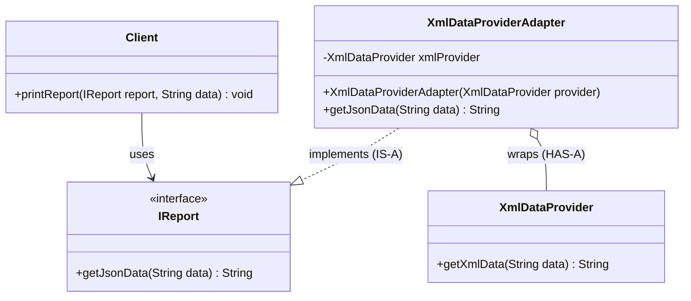

# 16. Adapter Design Pattern

> 💡 **Quick Revision Anchor**
> - The **Adapter Pattern** converts the incompatible interface of an existing class (**Adaptee**) into an interface that the client expects (**Target**), allowing mismatched classes to work together seamlessly.
> - Key Mechanism: **Object Adapter** implements the target interface (`IS-A`) and composes the adaptee (`HAS-A`).
> - Primary lecture example: A client application expecting **JSON data** (`IReport`) integrating with a 3rd-party vendor providing **XML data** (`XmlDataProvider`).

---

## 1. What Problem Are We Solving?

Real-world applications frequently integrate with:
- 3rd-party vendor SDKs (payment gateways, analytics engines, notification services).
- Legacy services whose method signatures cannot be changed.

### The Incompatibility Dilemma
Suppose our application client code expects reporting data formatted as **JSON**:
```java
public interface IReport {
    String getJsonData(String data);
}
```
However, an external vendor library (`XmlDataProvider`) only outputs **XML**:
```java
public class XmlDataProvider {
    public String getXmlData(String data) {
        return "<report><data>" + data + "</data></report>";
    }
}
```

If we invoke `XmlDataProvider` directly inside business logic:
1. **Tight Coupling:** Application code becomes tied to vendor-specific method names and data structures.
2. **Breaks OCP:** Switching to a new vendor (or updating the existing SDK) forces modifications across all client classes.
3. **Loss of Polymorphism:** The vendor SDK cannot be substituted as an implementation of our domain interfaces.

---

## 2. Key Design Idea: The Puzzle Piece Adapter

Think of the existing code and the 3rd-party library as two puzzle pieces with incompatible edges:

```
┌────────────────────┐      ┌───────────────────────────┐      ┌─────────────────────┐
│   Existing Client  │ ──▶  │          ADAPTER          │ ──▶  │  3rd-Party Library  │
│ (Expects JSON)     │      │ (Translates XML ➔ JSON)   │      │ (Produces XML)      │
└────────────────────┘      └───────────────────────────┘      └─────────────────────┘
```

The Adapter bridges the gap:
- **Client Facing:** Implements `IReport` (`IS-A`), conforming to what the client expects.
- **Vendor Facing:** Wraps `XmlDataProvider` (`HAS-A` via composition), delegating calls and translating XML into JSON.

---

## 3. Object Adapter vs. Class Adapter

| Approach | Relationship | Implementation Mechanism | Java Support | Recommendation |
| :--- | :--- | :--- | :--- | :--- |
| **Object Adapter** | `IS-A Target` & `HAS-A Adaptee` | **Composition** | Yes | **Preferred Standard** ("Favor composition over inheritance") |
| **Class Adapter** | `IS-A Target` & `IS-A Adaptee` | **Multiple Inheritance** | No (Java forbids multiple class inheritance) | Seldom used in modern software |

---

## 4. Visual Architecture




---

## 5. Concise Java Implementation (Primary Lecture Example)

```java
// ==========================================
// 1. TARGET INTERFACE (Expected by Client)
// ==========================================
interface IReport {
    String getJsonData(String data);
}

// ==========================================
// 2. ADAPTEE (Incompatible 3rd-Party Class)
// ==========================================
class XmlDataProvider {
    public String getXmlData(String data) {
        // Simulates 3rd-party library returning XML
        // Input: "name:Alice,id:42"
        String[] parts = data.split(",");
        String name = parts[0].split(":")[1];
        String id = parts[1].split(":")[1];
        return "<report><name>" + name + "</name><id>" + id + "</id></report>";
    }
}

// ==========================================
// 3. ADAPTER (Object Adapter via Composition)
// ==========================================
class XmlDataProviderAdapter implements IReport {
    private final XmlDataProvider xmlProvider; // HAS-A

    public XmlDataProviderAdapter(XmlDataProvider xmlProvider) {
        this.xmlProvider = xmlProvider;
    }

    @Override
    public String getJsonData(String data) {
        // 1. Delegate call to Adaptee's method
        String xml = xmlProvider.getXmlData(data);

        // 2. Convert XML format to expected JSON format
        String name = xml.substring(xml.indexOf("<name>") + 6, xml.indexOf("</name>"));
        String id = xml.substring(xml.indexOf("<id>") + 4, xml.indexOf("</id>"));

        return "{\"name\": \"" + name + "\", \"id\": " + id + "}";
    }
}

// ==========================================
// 4. CLIENT & DEMONSTRATION
// ==========================================
class Client {
    public void printReport(IReport report, String rawData) {
        String json = report.getJsonData(rawData);
        System.out.println("Client received JSON report: " + json);
    }
}

public class Main {
    public static void main(String[] args) {
        Client client = new Client();
        String rawData = "name:Alice,id:42";

        // Wrap the incompatible 3rd-party class inside the adapter
        XmlDataProvider thirdPartyProvider = new XmlDataProvider();
        IReport adapter = new XmlDataProviderAdapter(thirdPartyProvider);

        // Client operates seamlessly via Target interface
        client.printReport(adapter, rawData);
    }
}
```

---

## 6. Additional Common Example: Payment Gateway Adapter

### Additional Common Example
In an e-commerce platform, checkout expects a standard interface, but each payment vendor SDK has distinct methods and parameters:

```java
// Target Interface
interface PaymentProcessor {
    void processPayment(double amountInRupees);
}

// Adaptee: Razorpay SDK expects paise (amount * 100)
class RazorpaySDK {
    public void sendPaymentInPaise(long paise) {
        System.out.println("Payment processed via Razorpay SDK: " + paise + " paise");
    }
}

// Adapter converts Rupees to Paise and delegates
class RazorpayAdapter implements PaymentProcessor {
    private final RazorpaySDK sdk;
    public RazorpayAdapter(RazorpaySDK sdk) { this.sdk = sdk; }

    @Override
    public void processPayment(double amountInRupees) {
        long paise = (long) (amountInRupees * 100);
        sdk.sendPaymentInPaise(paise);
    }
}
```

---

## 7. Comparison: Adapter vs Facade vs Proxy vs Decorator

| Pattern | Primary Intent |
| :--- | :--- |
| **Adapter** | **Converts** an incompatible interface into an expected target interface. |
| **Facade** | **Simplifies** a complex subsystem behind a single, convenient entry point. |
| **Proxy** | Controls access, lazy-loads, or caches calls to an object while **maintaining the exact same interface**. |
| **Decorator** | **Adds new behaviors/responsibilities** dynamically without changing the existing interface. |

---

## 8. Interview Questions & Key Discussion Points

1. **What is the difference between an Object Adapter and a Class Adapter?**
   - *Answer*: An Object Adapter uses composition (`HAS-A`) to wrap an instance of the adaptee, which is flexible and adheres to OOP best practices. A Class Adapter uses multiple inheritance (`IS-A`) to inherit both the target and adaptee classes, which is not supported for classes in Java.
2. **When should you use an Adapter Pattern instead of refactoring existing code?**
   - *Answer*: When the code you need to interact with is a 3rd-party vendor library, an external SDK, or a stable legacy system whose source code you do not own or cannot modify.
3. **How does the Adapter pattern uphold the Open/Closed Principle (OCP)?**
   - *Answer*: You can integrate new third-party providers or SDKs into the system by creating new adapter classes without modifying existing client business logic.

---

## 9. Quick Revision

### Core Idea
Adapter converts the interface of an existing class into another interface expected by the client, bridging incompatible APIs through composition and translation.

### Remember
- **Analogy:** International travel plug adapter (Indian plug into US wall socket).
- **Structure:** Implements Target (`IS-A`), wraps Adaptee (`HAS-A`).
- **Standard Choice:** Always prefer **Object Adapter** over Class Adapter in Java.
