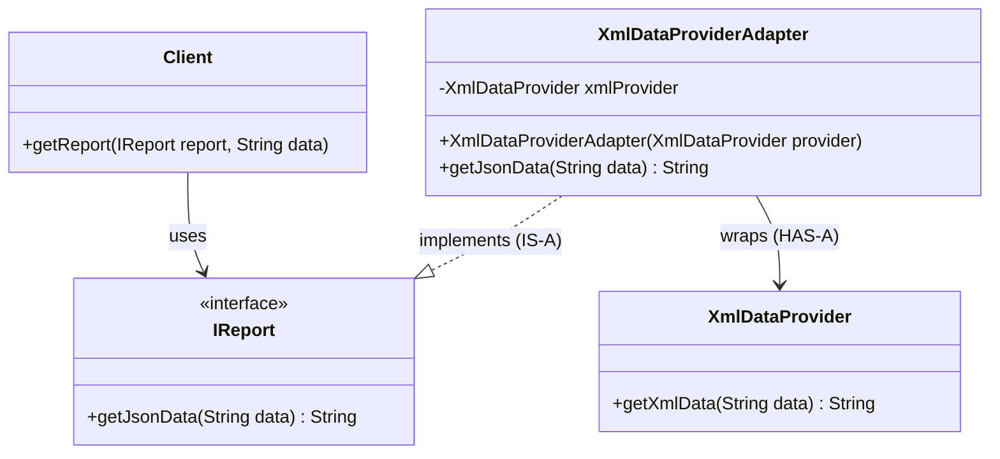

# 16. Adapter Design Pattern

> 💡 **Quick Revision Anchor**
> - **Type:** Structural Design Pattern
> - **Core Principle:** Converts the interface of a class into another interface clients expect. Lets classes work together that couldn't otherwise because of incompatible interfaces.
> - **Key Mechanism:** Wrap an existing incompatible class (**Adaptee**) inside a new class (**Adapter**) that implements the expected interface (**Target**).
> - **Rule of Thumb:** *"Favor Object Adapter (Composition) over Class Adapter (Multiple Inheritance)."*

---

## 1. Real-World Analogy

Consider everyday physical adapters:
1. **Travel Wall Plug Adapter:** You travel from India to the United States with an Indian 3-pin plug laptop charger. The US wall socket expects a flat 2-pin connector. The plug and socket are physically incompatible. You do not re-wire your charger or rebuild the wall socket; you insert an intermediate **plug adapter** that accepts your 3-pin plug on one side and fits the US wall socket on the other.
2. **USB-C to USB-A Converter:** Your modern smartphone uses a USB Type-C cable, but your older laptop only has standard USB Type-A ports. A tiny adapter converts the Type-C hardware interface to the Type-A format expected by the laptop.

In software, the **Adapter Design Pattern** serves the exact same purpose: bridging two existing, incompatible interfaces so they can communicate smoothly without rewriting either side.

---

## 2. The Problem

In modern software development, applications rarely live in complete isolation. We frequently integrate:
- Third-party libraries / SDKs (e.g., payment gateways like Razorpay, SMS/WhatsApp notification services, analytics platforms).
- Legacy subsystems written years ago with deprecated signatures.

### The Dilemma: Incompatible Interfaces

Suppose our core client application has standard contracts. For reporting, our client code expects an interface returning data formatted as **JSON**:

```java
public interface IReport {
    String getJsonData(String data);
}
```

Now, we need to integrate an external 3rd-party analytics provider (`XmlDataProvider`). This vendor library only accepts raw data and outputs **XML**:

```java
public class XmlDataProvider {
    public String getXmlData(String data) {
        return "<report><data>" + data + "</data></report>";
    }
}
```

```
[Existing Client Application]  ---> Expects JSON (IReport: getJsonData())
                                          ❌ Incompatible Interface
[Third-Party Vendor Library]   ---> Produces XML (XmlDataProvider: getXmlData())
```

### Why Naive Direct Integration Fails
If we call the third-party `XmlDataProvider` directly from within our application client code:
1. **Tight Coupling:** Our application logic becomes tied directly to vendor-specific method names and data structures.
2. **Open-Closed Principle (OCP) Violation:** If the vendor library updates its API, or if we switch from Vendor A to Vendor B (e.g., because Vendor B is cheaper, faster, or more reliable), we must modify every place in our core business logic where the vendor was invoked.
3. **Loss of Polymorphic Interchangeability:** The client cannot treat the third-party service as an implementation of its own domain interfaces.

---

## 3. Design Evolution: The Puzzle Piece Concept

Think of the existing code and third-party library as two jigsaw puzzle pieces that have mismatched edges. They cannot snap together directly.

```
+-------------------+      +-------------------+      +-------------------+
|   Existing Code   | ---> |      ADAPTER      | ---> | 3rd-Party Library |
| (Target Interface)|      | (Translates Calls)|      |     (Adaptee)     |
+-------------------+      +-------------------+      +-------------------+
```

The Adapter introduces matching edges on both sides:
- On the **Client side**, it implements `IReport` (`IS-A` Target), matching what the client expects.
- On the **Vendor side**, it holds a reference to `XmlDataProvider` (`HAS-A` Adaptee via Composition), handling vendor-specific method invocations and data transformation.

---

## 4. Class Adapter vs. Object Adapter

The instructor explains two structural approaches to implementing adapters:

| Dimension | Object Adapter (Composition) | Class Adapter (Inheritance) |
| :--- | :--- | :--- |
| **Relationship** | `Adapter IS-A Target` AND `Adapter HAS-A Adaptee` | `Adapter IS-A Target` AND `Adapter IS-A Adaptee` |
| **Coupling** | **Loose coupling** via composition reference. | **Tight coupling** via class inheritance. |
| **Language Support** | Supported in virtually all OOP languages (Java, C++, C#, Python). | Requires **Multiple Inheritance**, supported in C++ but **NOT supported for classes in Java**. |
| **Industry Practice** | **Standard / Strongly Preferred** ("Favor composition over inheritance"). | Seldom used in real-world modern systems. |

```
Object Adapter:
+---------------+          +------------------------+          +-------------------+
|    IReport    | <|...... | XmlDataProviderAdapter | --------> |  XmlDataProvider  |
|  <<interface>>|          +------------------------+ (HAS-A)  |     (Adaptee)     |
+---------------+                                              +-------------------+

Class Adapter (C++ style multiple inheritance):
+---------------+          +------------------------+          +-------------------+
|    IReport    | <|...... | XmlDataProviderAdapter | ......|> |  XmlDataProvider  |
|  <<interface>>|          +------------------------+          |     (Adaptee)     |
+---------------+                                              +-------------------+
```

> ⚠️ **Key Takeaway:** In Java and enterprise software engineering, we always build **Object Adapters**.

---

## 5. Architecture & Class Diagram



---

## 6. Java Implementation (Primary Lecture Example)

### Step 1: Target Interface (Expected by Client)
```java
// Target Interface: defines the domain-specific interface that client uses
public interface IReport {
    String getJsonData(String data);
}
```

### Step 2: Adaptee (Existing / Incompatible 3rd-Party Class)
```java
// Adaptee: third-party or legacy class with an incompatible interface
public class XmlDataProvider {
    public String getXmlData(String data) {
        // Simulating 3rd-party vendor returning XML format
        // Expected input format: "name:Alice,id:42"
        String[] parts = data.split(",");
        String name = parts[0].split(":")[1];
        String id = parts[1].split(":")[1];
        return "<report><name>" + name + "</name><id>" + id + "</id></report>";
    }
}
```

### Step 3: Adapter (Object Adapter via Composition)
```java
// Adapter: implements Target (IReport) and wraps Adaptee (XmlDataProvider)
public class XmlDataProviderAdapter implements IReport {
    private final XmlDataProvider xmlProvider;

    public XmlDataProviderAdapter(XmlDataProvider xmlProvider) {
        this.xmlProvider = xmlProvider;
    }

    @Override
    public String getJsonData(String data) {
        // 1. Delegate call to Adaptee's specific method
        String xmlData = xmlProvider.getXmlData(data);

        // 2. Transform the returned XML format into expected JSON format
        String name = xmlData.substring(xmlData.indexOf("<name>") + 6, xmlData.indexOf("</name>"));
        String id = xmlData.substring(xmlData.indexOf("<id>") + 4, xmlData.indexOf("</id>"));

        return "{\"name\": \"" + name + "\", \"id\": " + id + "}";
    }
}
```

### Step 4: Client Code & Demonstration
```java
public class Client {
    // Client depends strictly on the Target interface abstraction
    public void printReport(IReport report, String rawData) {
        String json = report.getJsonData(rawData);
        System.out.println("Client received JSON report: " + json);
    }
}

public class Main {
    public static void main(String[] args) {
        Client client = new Client();
        String rawInput = "name:Alice,id:42";

        // Create the Adaptee instance
        XmlDataProvider thirdPartyProvider = new XmlDataProvider();

        // Wrap Adaptee inside our Adapter
        IReport adapter = new XmlDataProviderAdapter(thirdPartyProvider);

        // Client seamlessly works with the Adapter without knowing XML exists
        client.printReport(adapter, rawInput);
    }
}
```

### Output:
```text
Client received JSON report: {"name": "Alice", "id": 42}
```

---

## 7. Additional Common Example: Payment Gateway Adapter

### Additional Industry Example

In e-commerce apps, checkout services interact with different payment vendors (Razorpay, Stripe, PayPal). Each SDK has completely different method signatures and parameters.

```java
// Target Interface: our application's clean checkout contract
interface PaymentProcessor {
    void processPayment(double amountInRupees);
}

// Adaptee 1: Razorpay 3rd-Party SDK (Incompatible)
class RazorpaySDK {
    public void makePaymentInPaise(long amountInPaise) {
        System.out.println("Payment processed via Razorpay SDK: " + amountInPaise + " paise");
    }
}

// Adapter 1: Razorpay Adapter
class RazorpayAdapter implements PaymentProcessor {
    private final RazorpaySDK razorpaySDK;

    public RazorpayAdapter(RazorpaySDK razorpaySDK) {
        this.razorpaySDK = razorpaySDK;
    }

    @Override
    public void processPayment(double amountInRupees) {
        long amountInPaise = (long) (amountInRupees * 100);
        razorpaySDK.makePaymentInPaise(amountInPaise);
    }
}
```

If we switch to Stripe tomorrow, we simply write `StripeAdapter` without touching our order placement logic.

---

## 8. Real-World Use Cases Discussed in Lecture

1. **Third-Party Vendor Integration:** 
   - Payment gateways (Razorpay, Stripe).
   - Notification services (WhatsApp, SendGrid, Twilio).
   - Machine Learning / Analytics services with distinct input/output contracts.
2. **Legacy Code Migration:**
   - Interfacing modern applications (e.g., Java 21+) with legacy libraries (written in Java 7 or C++) whose method names cannot be altered.
3. **Standard Library Adapters:**
   - Java's `java.io.InputStreamReader`: Adapts a byte stream (`InputStream`) to a character stream (`Reader`).
   - `Arrays.asList()`: Adapts a primitive array into a standard `List` interface.

---

## 9. Design Pattern Comparisons

### Additional Java / Interview Insight

| Pattern | Intent / Primary Purpose |
| :--- | :--- |
| **Adapter** | **Converts** an incompatible interface into another expected interface. Bridges existing code. |
| **Facade** | **Simplifies** a complex subsystem behind a single unified, higher-level interface. |
| **Proxy** | Provides a surrogate/placeholder to **control access** (lazy loading, security, caching) without changing the interface. |
| **Decorator** | **Enhances / adds behavior** dynamically to an object while keeping the same interface intact. |

---

## 10. Interview Perspective

- **Q: What problem does Adapter solve?**
  *A: It allows two classes with incompatible interfaces to collaborate without altering either class's source code.*
- **Q: Object Adapter vs. Class Adapter?**
  *A: Object Adapter uses composition (`HAS-A`), making it flexible and language-agnostic. Class Adapter relies on multiple inheritance (`IS-A`), which is unsupported for classes in Java and leads to tight coupling.*
- **Q: Which SOLID principles are upheld?**
  *A: **Single Responsibility Principle (SRP)** (separates interface conversion from business logic) and **Open/Closed Principle (OCP)** (new adapters can be introduced without breaking client code).*
- **Q: What are the trade-offs?**
  *A: Introduces extra classes/indirection. If the entire codebase is within your control, refactoring the interface directly is often cleaner than adding multiple adapter layers.*

---

## 11. Quick Revision

```text
Problem: Client expects Target Interface, but Provider exposes incompatible Adaptee Interface.
Solution: Adapter implements Target Interface (IS-A) and wraps Adaptee (HAS-A).
Benefit: Decouples core logic from 3rd-party vendor SDKs or legacy systems.
```
