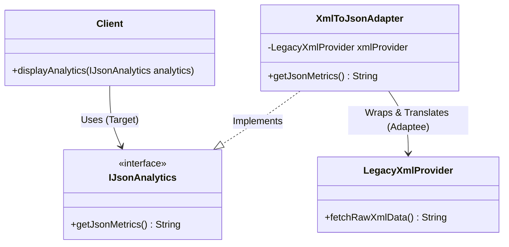
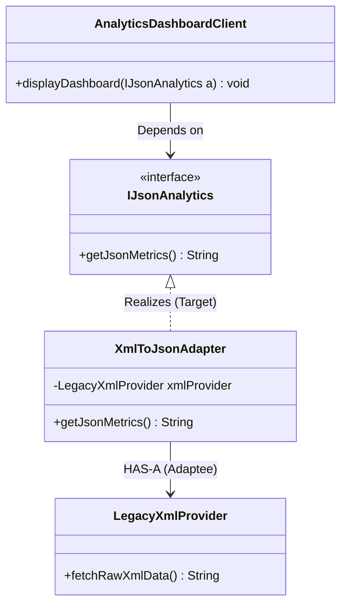
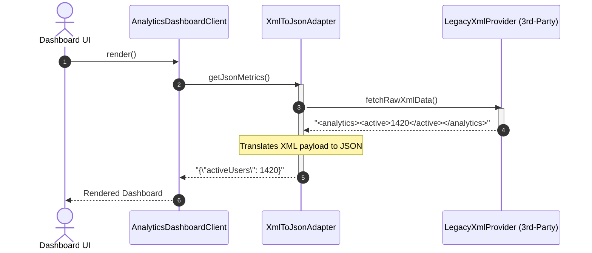

# 16. Adapter Design Pattern

## 1. Overview

The **Adapter Design Pattern** is a structural design pattern that acts as a bridge between **two incompatible interfaces**. It wraps an existing class (known as the **Adaptee**) with a new interface (known as the **Target**) so that classes with mismatched method signatures or data formats can collaborate seamlessly without altering existing source code.



---

## 2. What Problem Are We Solving?

In enterprise software engineering, you constantly integrate third-party libraries, external vendor SDKs, or legacy systems:
- Your application's client services expect data in modern **JSON format** via a standard domain interface (`IJsonAnalytics`).
- A vendor's proprietary SDK produces analytics data exclusively in **XML format** (`LegacyXmlProvider`).
- **Anti-Pattern**: Directly scattering XML parsing code and third-party vendor calls throughout your client business logic. This tightly couples your core application to a proprietary vendor API.
- **Adapter Solution**: Wrap the incompatible class (`Adaptee`) inside an `Adapter` class that implements your application's expected interface (`Target`). The adapter handles conversion seamlessly behind the scenes.

---

## 3. Core Concepts

- **Target Interface**: The domain-specific contract that your application's client code knows and expects.
- **Client**: The application business service interacting with the Target interface.
- **Adaptee**: The existing, incompatible class or 3rd-party library containing valuable functionality but presenting the wrong interface.
- **Adapter**: A wrapper class that implements the Target interface and holds a reference to the Adaptee, translating calls on the fly.

---

## 4. Important Terminology

- **Object Adapter**: Uses **composition** (HAS-A relation) to wrap the Adaptee. Supported in all OOP languages and universally recommended in Java.
- **Class Adapter**: Uses **multiple inheritance** (IS-A both Target and Adaptee). Impossible in Java with multiple classes.
- **Two-Way Adapter**: An adapter that implements both the Target and Adaptee interfaces simultaneously, allowing bidirectional interoperability.

---

## 5. Real-World Analogy

### 1. International Travel Power Plug Adapter
- When traveling from the US/India to Europe, your laptop charger has a 3-pin flat plug, but the European wall socket accepts only a 2-pin rounded socket.
- You do not rewire your laptop charger or break open the hotel wall socket; you insert a plug adapter between them.

### 2. Memory Card Reader
- A modern laptop has only USB-C ports, but your digital camera stores photos on an SD Card. An SD-to-USB-C card reader adapts the physical card pins to the laptop's USB interface.

---

## 6. Naive / Bad Design

### Java Example (Scattering Vendor Conversions in Client Code)
```java
// ❌ Naive Anti-Pattern: Client code directly entangled with third-party vendor XML
public class BadAnalyticsDashboard {
    private LegacyXmlProvider vendorSdk = new LegacyXmlProvider();

    public void display() {
        String xml = vendorSdk.fetchRawXmlData(); // 💥 Tightly coupled to vendor class!
        
        // Manual parsing duplicated in every client class
        String json = xml.replace("<active>", "{\"active\":").replace("</active>", "}");
        System.out.println("Displaying: " + json);
    }
}
```

### Problems
- Changing vendors (or upgrading the vendor SDK) forces breaking changes across all dashboard and reporting classes.
- Violates the Single Responsibility Principle and Dependency Inversion Principle.

---

## 7. Design Evolution

1. **Step 1**: Define the clean target interface expected by the domain: `IJsonAnalytics`.
2. **Step 2**: Create an adapter class `XmlToJsonAdapter` implementing `IJsonAnalytics`.
3. **Step 3**: Inject `LegacyXmlProvider` into `XmlToJsonAdapter` via constructor composition.
4. **Step 4**: The client communicates solely with `IJsonAnalytics`.

---

## 8. Final Design

### Architecture (Class Diagram)


### Mermaid Sequence Diagram


---

## 9. Java Implementation

```java
import java.util.Objects;

// ==========================================
// 1. TARGET INTERFACE (Expected by Client)
// ==========================================
public interface IJsonAnalytics {
    String getJsonMetrics();
}

// ==========================================
// 2. INCOMPATIBLE ADAPTEE (Legacy / 3rd-Party)
// ==========================================
public class LegacyXmlProvider {
    public String fetchRawXmlData() {
        return "<analytics><users><active>1420</active><churnRate>0.04</churnRate></users></analytics>";
    }
}

// ==========================================
// 3. OBJECT ADAPTER
// ==========================================
public class XmlToJsonAdapter implements IJsonAnalytics {
    private final LegacyXmlProvider xmlProvider;

    public XmlToJsonAdapter(LegacyXmlProvider xmlProvider) {
        this.xmlProvider = Objects.requireNonNull(xmlProvider, "Adaptee required");
    }

    @Override
    public String getJsonMetrics() {
        // Step 1: Query legacy Adaptee to get raw XML
        String rawXml = xmlProvider.fetchRawXmlData();
        System.out.println("🔄 [Adapter] Received raw XML: " + rawXml);

        // Step 2: Convert XML to standard JSON
        String convertedJson = convertXmlToJson(rawXml);
        System.out.println("✅ [Adapter] Converted XML to JSON successfully.");

        return convertedJson;
    }

    private String convertXmlToJson(String xml) {
        String activeUsers = xml.replaceAll(".*<active>(.*?)</active>.*", "$1");
        String churnRate = xml.replaceAll(".*<churnRate>(.*?)</churnRate>.*", "$1");
        return "{\n  \"activeUsers\": " + activeUsers + ",\n  \"churnRate\": " + churnRate + "\n}";
    }
}

// ==========================================
// 4. CLIENT CODE
// ==========================================
public class AnalyticsDashboardClient {
    public void displayDashboard(IJsonAnalytics analyticsService) {
        System.out.println("📊 Rendering Dashboard with Real-time Metrics:");
        String json = analyticsService.getJsonMetrics();
        System.out.println(json);
    }
}
```

---

## 10. Code Walkthrough

1. `IJsonAnalytics`: Target interface defining what the dashboard needs.
2. `LegacyXmlProvider`: The Adaptee with incompatible XML output.
3. `XmlToJsonAdapter`: Implements `IJsonAnalytics` and encapsulates all XML translation mechanics.
4. `AnalyticsDashboardClient`: Zero knowledge of `LegacyXmlProvider`; operates purely against `IJsonAnalytics`.

---

## 11. Important Design Decisions

### Object Adapter vs. Class Adapter
| Parameter | Object Adapter (Recommended ⭐) | Class Adapter |
| :--- | :--- | :--- |
| **Mechanism** | Uses **Composition** (HAS-A relation). | Uses **Multiple Inheritance** (IS-A both Target & Adaptee). |
| **Language Support** | Supported in all OOP languages (Java, C++, Python, C#). | Only feasible in languages supporting multiple class inheritance (C++, Python). **Impossible in Java** with classes. |
| **Coupling** | **Loose coupling**. Can adapt any subclass of the Adaptee. | **Tight coupling**. Bound to one specific concrete Adaptee class. |

---

## 12. Edge Cases

- **Malformed Adaptee Data**: The adapter should validate payloads and throw meaningful domain exceptions if the Adaptee returns null or invalid data.
- **Two-Way Adapters**: In bidirectional workflows, an adapter can implement both interfaces to allow new systems to call legacy services and vice versa.

---

## 13. Production Considerations

- **Java Standard Library Examples**:
  1. `java.util.Arrays#asList(T... a)`: Adapts a raw array (`T[]`) into the `java.util.List<T>` interface.
  2. `java.io.InputStreamReader(InputStream)`: Adapts a byte stream (`InputStream`) to a character reader (`Reader`).

---

## 14. Advantages

- **Adheres to OCP and SRP**: Introduces adapters without modifying either client or adaptee code.
- **Increases Code Reusability**: Enables utilizing legacy code or off-the-shelf SDKs with incompatible APIs.

---

## 15. Disadvantages / Trade-offs

- **Increased Architectural Indirection**: Requests must pass through intermediary translation layers.
- **Maintenance Overhead**: If the Adaptee's proprietary format changes significantly, the adapter translation logic must be updated.

---

## 16. Related Patterns / Alternatives

- **Adapter vs. Facade**: Adapter converts an *existing incompatible interface* into a target interface; Facade creates a *new, simplified high-level interface* over multiple subsystem classes.
- **Adapter vs. Decorator**: Adapter changes the interface; Decorator enhances behavior while keeping the *exact same interface*.

---

## 17. SOLID / OOP Connections

- **Open/Closed Principle (OCP)**: Integrates new third-party providers by adding new adapters without modifying client code.
- **Single Responsibility Principle (SRP)**: Data conversion logic is isolated inside the adapter rather than polluting business services.

---

## 18. Common Mistakes

- **Confusing Adapter with Facade**: An Adapter adapts a single incompatible interface; a Facade simplifies an entire subsystem.
- **Adding Extra Unrelated Logic**: An Adapter should focus strictly on interface and data format translation, not arbitrary business domain decisions.

---

## 19. Interview Questions

1. **What is the difference between an Object Adapter and a Class Adapter?**
   - *Answer*: An Object Adapter uses object composition (HAS-A) to wrap the adaptee, making it compatible with any subclass of the adaptee and fully supported in Java. A Class Adapter uses multiple inheritance (IS-A), which is not supported in Java for classes.
2. **What is the difference between Adapter and Decorator?**
   - *Answer*: An Adapter changes the interface of an object to make it compatible with a client, whereas a Decorator enhances an object's responsibilities without altering its interface.
3. **Where is the Adapter pattern used in Java?**
   - *Answer*: `java.util.Arrays.asList()` (adapting arrays to List), `java.io.InputStreamReader` (adapting byte stream to character reader), and Spring's `HandlerAdapter`.

---

## 20. Quick Revision

### Core Idea
> Adapter bridges two incompatible interfaces using composition, allowing existing or legacy classes to collaborate without altering source code.

### Remember
- Object Adapter uses Composition (HAS-A) and is preferred in Java.
- Converts old/proprietary interface into the domain's expected Target interface.
- Canonical Java example: `new InputStreamReader(System.in)`.

### Java Implementation Idea
> Create an Adapter class that implements `TargetInterface` and accepts `AdapteeClass` in its constructor, translating calls in method overrides.

### Most Important Interview Point
> Adapter changes the interface without adding new behavior; Decorator adds new behavior without changing the interface.

### Common Trap
> Do not use multiple inheritance for adapters in Java; always use composition to wrap the Adaptee object.
