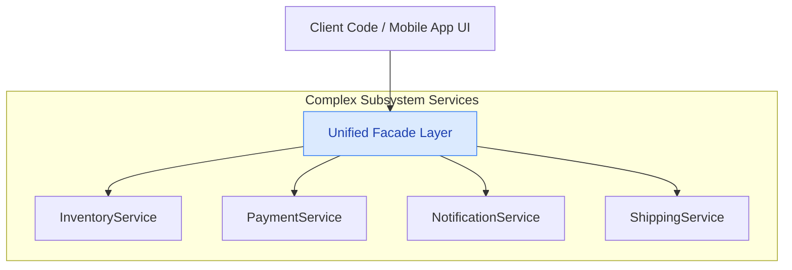

# 17. Facade Design Pattern

> 💡 **Quick Revision Anchor**: 
> - **Type**: Structural Design Pattern.
> - **Core Intent**: Provides a **simplified, unified high-level interface** to a complex set of subsystem classes, hiding lower-level orchestration details from the client.
> - **Guiding Architectural Rule**: The **Law of Demeter (Principle of Least Knowledge)**: *"Talk only to your immediate friends; don't talk to strangers."*

---

## 1. Context & Motivation

Enterprise applications often contain subsystems consisting of dozens of specialized classes. If clients interact directly with these internal classes:
1. **Tight Coupling**: Clients become tightly bound to internal subsystem implementation details.
2. **Scattered Orchestration**: Every client (Web UI, Mobile App, Microservice API) duplicates the exact same sequence of 10 method calls across 4 different services.
3. **Fragility**: Refactoring an internal subsystem class breaks external client code.

A **Facade** solves this by introducing a single cohesive entry point that encapsulates the orchestration workflow.



---

## 2. Case Study 1: E-Commerce Order Checkout Facade

When a user clicks **"Place Order"** in Amazon, several independent subsystems must execute in strict sequence:
1. `InventoryService`: Check stock availability and reserve items.
2. `PaymentService`: Charge the user's credit card.
3. `ShippingService`: Generate tracking label and assign courier.
4. `NotificationService`: Send email and SMS confirmation.

### Complete Production Java Implementation:
```java
// Subsystem 1: Inventory
public class InventoryService {
    public boolean checkStock(String productId, int quantity) {
        System.out.println("📦 Checking inventory for Product #" + productId + " (Qty: " + quantity + "): AVAILABLE.");
        return true;
    }

    public void reserveStock(String productId, int quantity) {
        System.out.println("🔒 Reserved " + quantity + " units of Product #" + productId);
    }
}

// Subsystem 2: Payment
public class PaymentGatewayService {
    public boolean processPayment(String customerId, double amount) {
        System.out.println("💳 Charging $" + amount + " to customer #" + customerId + ": SUCCESS.");
        return true;
    }
}

// Subsystem 3: Shipping & Logistics
public class ShippingService {
    public String createShippingLabel(String customerId, String productId) {
        String trackingNumber = "TRK-" + UUID.randomUUID().toString().substring(0, 8).toUpperCase();
        System.out.println("🚚 Shipping label generated: " + trackingNumber);
        return trackingNumber;
    }
}

// Subsystem 4: Notification
public class NotificationService {
    public void sendOrderConfirmation(String customerId, String trackingNumber) {
        System.out.println("📧 Confirmation email & SMS dispatched with tracking: " + trackingNumber);
    }
}

// The Facade: Unified checkout orchestrator
public class OrderProcessingFacade {
    private final InventoryService inventoryService;
    private final PaymentGatewayService paymentService;
    private final ShippingService shippingService;
    private final NotificationService notificationService;

    public OrderProcessingFacade(InventoryService inv, PaymentGatewayService pay,
                                 ShippingService ship, NotificationService notif) {
        this.inventoryService = inv;
        this.paymentService = pay;
        this.shippingService = ship;
        this.notificationService = notif;
    }

    // High-level one-click order placement
    public boolean placeOrder(String customerId, String productId, int qty, double amount) {
        System.out.println("\n🛒 [OrderProcessingFacade] Starting checkout workflow...");

        if (!inventoryService.checkStock(productId, qty)) {
            System.out.println("❌ Order Failed: Product out of stock!");
            return false;
        }

        inventoryService.reserveStock(productId, qty);

        if (!paymentService.processPayment(customerId, amount)) {
            System.out.println("❌ Order Failed: Payment declined!");
            return false;
        }

        String tracking = shippingService.createShippingLabel(customerId, productId);
        notificationService.sendOrderConfirmation(customerId, tracking);

        System.out.println("✅ [OrderProcessingFacade] Order fulfilled successfully!\n");
        return true;
    }
}
```

---

## 3. Case Study 2: Smart Home Theater Facade

To watch a movie, you must coordinate: `RoomLights`, `Projector`, `SurroundSoundSystem`, and `BluRayPlayer`:

```java
public class HomeTheaterFacade {
    private final RoomLights lights;
    private final Projector projector;
    private final SurroundSoundSystem soundSystem;
    private final BluRayPlayer player;

    public HomeTheaterFacade(RoomLights lights, Projector projector,
                             SurroundSoundSystem sound, BluRayPlayer player) {
        this.lights = lights;
        this.projector = projector;
        this.soundSystem = sound;
        this.player = player;
    }

    public void watchMovie(String movie) {
        System.out.println("\n🍿 Preparing Home Theater for movie night...");
        lights.dim(10);
        projector.on();
        projector.setInput("HDMI 1");
        soundSystem.on();
        soundSystem.setVolume(50);
        player.on();
        player.play(movie);
        System.out.println("🍿 Enjoy your movie!\n");
    }

    public void endMovie() {
        System.out.println("\n🛑 Shutting down Home Theater...");
        player.stop();
        player.off();
        soundSystem.off();
        projector.off();
        lights.on();
        System.out.println("✅ Theater shutdown complete.\n");
    }
}
```

---

## 4. Key Architectural Trade-Offs

1. **Does Facade prevent direct access to subsystems?**
   - **No!** A Facade does not encapsulate or hide subsystem classes behind private firewalls. Advanced clients who need granular, fine-tuned control can still instantiate and interact directly with `InventoryService` or `ShippingService`. The Facade is merely a convenience layer for standard use cases.
2. **Avoid God Facades**:
   - A Facade should remain focused on a specific domain feature. Do not create a single `ApplicationFacade` with 100 methods that wraps every service in the company. Create cohesive facades like `OrderFacade`, `AccountFacade`, and `SearchFacade`.

---

## 5. Facade vs. Adapter vs. Decorator vs. Proxy

| Pattern | Primary Intent | Does it hide subsystems? |
| :--- | :--- | :--- |
| **Facade** | **Simplifies an entire subsystem** by providing a unified high-level interface. | **Yes**. Subsystems are decoupled from the client. |
| **Adapter** | **Converts one interface into another** to fix compatibility. | **No**. Adapts one single adaptee to target interface. |
| **Decorator** | **Adds new behaviors dynamically** to a class without subclassing. | **No**. Enhances a component while sharing its exact interface. |
| **Proxy** | **Controls access, lifecycle, or security** for an expensive object. | **No**. Intercepts access to a single subject. |
