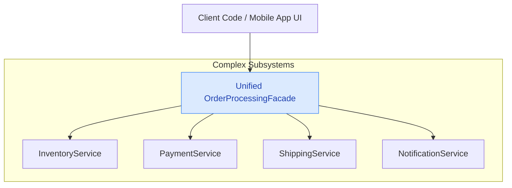
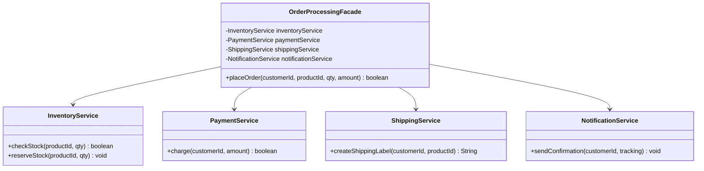
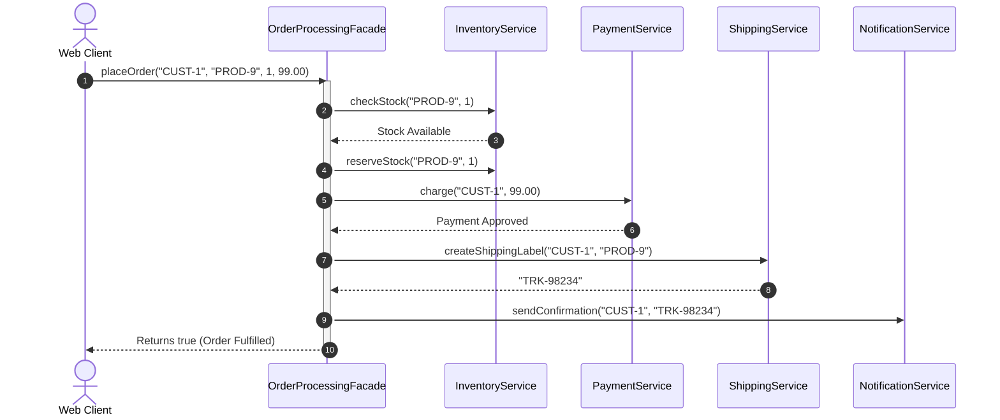

# 17. Facade Design Pattern

## 1. Overview

The **Facade Design Pattern** is a structural design pattern that provides a **simplified, unified high-level interface** to a complex subsystem of classes, libraries, or frameworks. A Facade shields client code from the intricate details and orchestration of multiple collaborating components, adhering to the **Law of Demeter (Principle of Least Knowledge)**.



---

## 2. What Problem Are We Solving?

Consider an e-commerce checkout workflow: To place an order, the system must coordinate:
1. `InventoryService`: Verify stock and reserve units.
2. `PaymentService`: Process customer credit card payment.
3. `ShippingService`: Generate tracking label and assign logistics courier.
4. `NotificationService`: Send email and SMS receipt.
- **The High Coupling Anti-Pattern**: If the client (Web UI, Mobile App, Microservice API) orchestrates all 4 services directly, every client must copy-paste the exact same 15 lines of orchestration code.
- If any subsystem method changes, every client application breaks.

---

## 3. Core Concepts

- **Facade**: A high-level class that knows which subsystem classes are responsible for a request and delegates work to them.
- **Subsystem Classes**: The underlying classes that implement actual functionality, oblivious to the existence of the Facade.
- **Law of Demeter**: A design principle stating that a module should only talk to its immediate collaborators, not to the internal sub-components of its collaborators.

---

## 4. Important Terminology

- **Structural Pattern**: Pattern organizing object and class composition.
- **Subsystem Encapsulation**: Hiding orchestration complexity behind a single entry point.
- **Non-Exclusivity**: A Facade does *not* seal off subsystems; power users can still access individual subsystem classes directly if they need fine-grained control.

---

## 5. Real-World Analogy

### 1. Computer Power Button
- When you turn on your PC, you press a single **Power Button** (Facade).
- Behind the scenes, the Power Supply stabilizes voltages, the Motherboard initiates BIOS POST checks, RAM runs integrity tests, the Hard Drive loads the OS kernel into memory, and the GPU initializes display drivers. You do not manually coordinate these hardware chips.

### 2. Hotel Concierge
- When staying at a luxury hotel, you call the Concierge (Facade) to book a dinner table, call a taxi, and schedule laundry. You do not contact the restaurant kitchen, taxi fleet dispatcher, and hotel laundry staff directly.

---

## 6. Naive / Bad Design

### Java Example (Client Directly Orchestrating Subsystems)
```java
// ❌ Naive Anti-Pattern: Client tightly coupled to 4 separate subsystems
public class BadClient {
    public void checkout() {
        InventoryService inv = new InventoryService();
        PaymentService pay = new PaymentService();
        ShippingService ship = new ShippingService();
        NotificationService notif = new NotificationService();

        // 💥 Client forced to manage ordering, error checks, and vendor APIs
        inv.checkStock("ITEM-1");
        inv.reserveStock("ITEM-1", 1);
        pay.processPayment("USER-1", 99.0);
        String tracking = ship.createLabel("USER-1", "ITEM-1");
        notif.sendEmail("USER-1", tracking);
    }
}
```

### Problems
- Duplicate code across Web, Android, iOS, and API clients.
- Modifying `PaymentService` method parameters breaks all client controllers.

---

## 7. Design Evolution

1. **Step 1**: Identify the common composite operation: `placeOrder()`.
2. **Step 2**: Create `OrderProcessingFacade` that encapsulates references to all 4 subsystem classes.
3. **Step 3**: Expose a single method `placeOrder(customerId, productId, quantity, amount)`.
4. **Step 4**: Clients communicate exclusively with the Facade.

---

## 8. Final Design

### Architecture (Class Diagram)


### Mermaid Sequence Diagram


---

## 9. Java Implementation

```java
import java.util.*;

// ==========================================
// 1. SUBSYSTEM CLASSES
// ==========================================
public class InventoryService {
    public boolean checkStock(String productId, int quantity) {
        System.out.println("📦 [Inventory] Stock verified for Product #" + productId);
        return true;
    }

    public void reserveStock(String productId, int quantity) {
        System.out.println("🔒 [Inventory] Reserved " + quantity + " units of Product #" + productId);
    }
}

public class PaymentService {
    public boolean processPayment(String customerId, double amount) {
        System.out.println("💳 [Payment] Charged $" + amount + " to customer: " + customerId);
        return true;
    }
}

public class ShippingService {
    public String createShippingLabel(String customerId, String productId) {
        String trackingNumber = "TRK-" + UUID.randomUUID().toString().substring(0, 8).toUpperCase();
        System.out.println("🚚 [Shipping] Shipping label generated: " + trackingNumber);
        return trackingNumber;
    }
}

public class NotificationService {
    public void sendOrderConfirmation(String customerId, String trackingNumber) {
        System.out.println("📧 [Notification] Confirmation dispatched with tracking: " + trackingNumber);
    }
}

// ==========================================
// 2. THE UNIFIED FAÇADE
// ==========================================
public class OrderProcessingFacade {
    private final InventoryService inventoryService;
    private final PaymentService paymentService;
    private final ShippingService shippingService;
    private final NotificationService notificationService;

    public OrderProcessingFacade(InventoryService inv, PaymentService pay,
                                 ShippingService ship, NotificationService notif) {
        this.inventoryService = Objects.requireNonNull(inv);
        this.paymentService = Objects.requireNonNull(pay);
        this.shippingService = Objects.requireNonNull(ship);
        this.notificationService = Objects.requireNonNull(notif);
    }

    // High-level one-click orchestration
    public boolean placeOrder(String customerId, String productId, int qty, double amount) {
        System.out.println("\n🛒 [Facade] Starting checkout workflow...");

        if (!inventoryService.checkStock(productId, qty)) {
            System.out.println("❌ Order Failed: Out of stock!");
            return false;
        }

        inventoryService.reserveStock(productId, qty);

        if (!paymentService.processPayment(customerId, amount)) {
            System.out.println("❌ Order Failed: Payment declined!");
            return false;
        }

        String tracking = shippingService.createShippingLabel(customerId, productId);
        notificationService.sendOrderConfirmation(customerId, tracking);

        System.out.println("✅ [Facade] Order fulfilled successfully!\n");
        return true;
    }
}
```

---

## 10. Code Walkthrough

1. Four independent subsystems (`Inventory`, `Payment`, `Shipping`, `Notification`) handle domain specifics.
2. `OrderProcessingFacade`: Injected with subsystem instances via constructor, encapsulating the ordering of operations.
3. `placeOrder()`: Executes the validation, reservation, payment, shipping, and notification sequence in a single high-level call.

---

## 11. Important Design Decisions

- **Non-Exclusive Access**: Clients needing custom workflows (e.g., custom warehouse fulfillment) can bypass the facade and call `ShippingService` directly.
- **Preventing God Facades**: Facades should remain cohesive. Avoid creating a single `MegaSystemFacade` that handles billing, authentication, customer service, and analytics in one giant class.

---

## 12. Edge Cases

- **Partial Failure & Compensation**: If payment succeeds but shipping label generation fails, the facade can trigger compensating transactions (refunding payment and releasing inventory).
- **Subsystem Exceptions**: Catch low-level subsystem exceptions inside the facade and convert them into clean high-level domain responses.

---

## 13. Production Considerations

- **Saga Pattern in Distributed Systems**: In microservices architectures, an API Gateway or Saga Orchestrator acts as a distributed Facade, managing distributed transactions with compensation steps across independent network services.

---

## 14. Advantages

- **Simplifies Client Code**: Replaces dozens of low-level calls with a single method.
- **Decouples Subsystems**: Clients are insulated from subsystem refactoring.
- **Enforces Clean Architectural Layering**: Creates a clear boundary between presentation controllers and internal domain subsystems.

---

## 15. Disadvantages / Trade-offs

- **Risk of God Object**: Facades can easily attract too many unrelated helper methods if not carefully bounded.
- **Extra Indirection**: Adds another layer between callers and subsystems.

---

## 16. Related Patterns / Alternatives

- **Facade vs. Adapter**: Facade simplifies an entire subsystem; Adapter converts one specific incompatible interface.
- **Facade vs. Mediator**: Facade provides a one-way simplified interface for clients; Mediator coordinates bidirectional communication between colleague objects.

---

## 17. SOLID / OOP Connections

- **Single Responsibility Principle (SRP)**: Subsystems focus on their domain; Facade focuses on orchestrating workflows.
- **Law of Demeter**: Clients interact only with the Facade rather than querying deep internal subsystem object graphs.

---

## 18. Common Mistakes

- **Locking Down Subsystems**: Trying to make subsystem classes private or inaccessible. A Facade is an optional simplified layer, not an exclusive prison.
- **Putting Heavy Business Logic in the Facade**: The Facade should only orchestrate; core business rules belong in the subsystem services.

---

## 19. Interview Questions

1. **What is the primary intent of the Facade Pattern?**
   - *Answer*: To provide a simplified, unified high-level interface to a complex subsystem, making it easier to use and decoupling client code from internal subsystem classes.
2. **What is the Law of Demeter and how does Facade support it?**
   - *Answer*: The Law of Demeter (*Principle of Least Knowledge*) states that an object should only talk to immediate friends, not strangers (`a.getB().getC().doSomething()` is a violation). A Facade provides an immediate friend that encapsulates calls to subsystems.
3. **Can you have multiple Facades for the same subsystem?**
   - *Answer*: Yes. If a subsystem is large, you can create multiple specialized facades (e.g. `UserCheckoutFacade`, `AdminInventoryFacade`) to serve different client roles.

---

## 20. Quick Revision

### Core Idea
> Facade provides a simplified, unified entry point to a complex subsystem, hiding orchestration complexity and decoupling clients from internal services.

### Remember
- Enforces the Law of Demeter ("talk only to immediate friends").
- Does not prevent advanced clients from accessing subsystems directly.
- Avoid God Facades; keep facades cohesive and domain-bounded.

### Java Implementation Idea
> Create `OrderProcessingFacade` containing references to `InventoryService`, `PaymentService`, and `ShippingService`, and expose a high-level `placeOrder()` method.

### Most Important Interview Point
> Facade creates a *new, simpler interface* over multiple classes; Adapter converts an *existing incompatible interface* for a single class.

### Common Trap
> Do not write business calculations inside the Facade; keep the Facade purely orchestrational.
