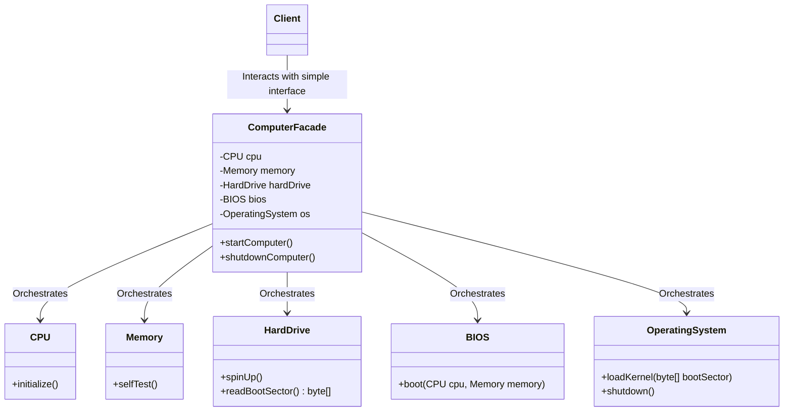

# 17. Facade Design Pattern & Law of Demeter

> 💡 **Quick Revision Anchor**: The **Facade Pattern** provides a unified, simplified, higher-level interface to a complex subsystem of classes. It shields the client from underlying complexity and enforces the **Principle of Least Knowledge** (Law of Demeter: *"Talk only to your immediate friends"*).

---

## 1. Context & Motivation

Imagine sitting in front of your desktop computer. To turn it on and work, you don't manually:
1. Supply electrical power to the motherboard.
2. Initialize CPU registers and clocks.
3. Perform RAM diagnostics and memory self-test.
4. Instruct the BIOS to read the master boot record (MBR) from the hard drive.
5. Load the Operating System kernel into memory and initialize drivers.

Instead, you press **one single power button**. The computer case provides a **Facade** that orchestrates this sequence internally.

### The Problem without Facade
- **High Coupling**: The client must know the existence, ordering, and exact method signatures of dozens of subsystem classes.
- **Fragile Code**: Any internal refactoring inside the subsystem breaks the client code.
- **Violation of Demeter's Law**: Clients navigate deep object graphs (`a.getB().getC().getD().execute()`), creating fragile "train wrecks".

---

## 2. Core Architecture & Mermaid Diagram



---

## 3. Deep Dive: Principle of Least Knowledge (Law of Demeter)

The video emphasizes the **Principle of Least Knowledge (LoD)** as a critical architectural foundation for low-level design.

> **Rule of Thumb**: *"Only talk to your immediate friends, never talk to strangers."*

Within any method `M` of class `A`, you should **only** invoke methods belonging to:
1. **The class itself (`A` / `this`)**: Calling private/internal helper methods.
2. **Parameters passed into `M`**: Objects explicitly supplied to the method as arguments.
3. **Objects created or instantiated inside `M`**: Any object instantiated via `new` inside that method scope.
4. **Direct components (HAS-A relation) of `A`**: Any instance variables owned by class `A`.

### Anti-Pattern: "Train Wreck" Call Chaining
```java
// VIOLATION of Law of Demeter
String zip = order.getCustomer().getAddress().getCity().getZipCode();
```
*Why is this dangerous?* If `Address` changes how `City` is modeled (or if `Customer` has multiple addresses), this client breaks.

### Refactored via Demeter / Facade:
```java
// COMPLIANT: Ask the immediate friend (Order) to provide what is needed
String zip = order.getDeliveryZipCode();
```

---

## 4. Production Java Implementation: Computer Boot Subsystem

### Step 1: Subsystem Components
```java
// Subsystem Component 1: CPU
public class CPU {
    public void initialize() {
        System.out.println("[CPU] Initializing registers and clock cycles...");
    }
    public void execute() {
        System.out.println("[CPU] Executing instructions...");
    }
}

// Subsystem Component 2: Memory (RAM)
public class Memory {
    public void selfTest() {
        System.out.println("[Memory] Running RAM integrity check: All banks OK.");
    }
    public void clear() {
        System.out.println("[Memory] Clearing cache & volatile buffers...");
    }
}

// Subsystem Component 3: HardDrive
public class HardDrive {
    public void spinUp() {
        System.out.println("[HardDrive] Spindles spun up to 7200 RPM.");
    }
    public byte[] readBootSector() {
        System.out.println("[HardDrive] Reading Master Boot Record (MBR)...");
        return new byte[]{0x4C, 0x4F, 0x41, 0x44}; // Mock boot loader bytes
    }
}

// Subsystem Component 4: BIOS
public class BIOS {
    public void boot(CPU cpu, Memory memory) {
        System.out.println("[BIOS] Handshaking CPU & Memory...");
        cpu.initialize();
        memory.selfTest();
    }
}

// Subsystem Component 5: Operating System
public class OperatingSystem {
    public void loadKernel(byte[] bootSector) {
        System.out.println("[OS] Kernel loaded into RAM from boot sector. GUI ready.");
    }
    public void halt() {
        System.out.println("[OS] Flushing state to disk and shutting down kernel.");
    }
}
```

### Step 2: The Facade Class
```java
// Facade: Unified high-level control over the subsystem
public class ComputerFacade {
    private final CPU cpu;
    private final Memory memory;
    private final HardDrive hardDrive;
    private final BIOS bios;
    private final OperatingSystem os;

    public ComputerFacade() {
        this.cpu = new CPU();
        this.memory = new Memory();
        this.hardDrive = new HardDrive();
        this.bios = new BIOS();
        this.os = new OperatingSystem();
    }

    // Unified start method
    public void startComputer() {
        System.out.println("\n=== [ComputerFacade] Initiating Boot Sequence ===");
        bios.boot(cpu, memory);
        hardDrive.spinUp();
        byte[] bootSector = hardDrive.readBootSector();
        os.loadKernel(bootSector);
        cpu.execute();
        System.out.println("=== [ComputerFacade] Computer Booted Successfully! ===\n");
    }

    // Unified shutdown method
    public void shutdownComputer() {
        System.out.println("\n=== [ComputerFacade] Initiating Shutdown ===");
        os.halt();
        memory.clear();
        System.out.println("=== [ComputerFacade] System Powered Down Safely. ===\n");
    }
}
```

### Step 3: Client Driver
```java
public class Main {
    public static void main(String[] args) {
        // Client only interacts with the clean Facade interface
        ComputerFacade computer = new ComputerFacade();

        computer.startComputer();

        // Subsystem work happens behind the scenes...

        computer.shutdownComputer();
    }
}
```

---

## 5. Facade vs. Adapter vs. Mediator

| Feature | Facade | Adapter | Mediator |
| :--- | :--- | :--- | :--- |
| **Intent** | Simplifies an interface for a complex subsystem. | Bridges incompatible interfaces between two systems. | Decouples multiple peer objects communicating among themselves. |
| **Interface** | Introduces a **new, simplified interface**. | Adopts an **existing target interface**. | Introduces a central hub for peer interactions. |
| **Communication** | Unidirectional: Client -> Facade -> Subsystem. | Unidirectional translation. | Multidirectional: Peers <-> Mediator. |
| **Subsystem Visibility** | Subsystem classes remain accessible if clients need granular control. | Wraps an Adaptee to fit a single Target. | Replaces direct peer-to-peer references. |

---

## 6. Real-World Applications & Interview Checklist

1. **Frameworks & Libraries**:
   - `java.net.URL` or HTTP clients: Hides sockets, DNS lookups, TCP 3-way handshakes, TLS negotiation behind a simple `.openConnection()` or `.get()`.
   - **JDBC**: `DriverManager.getConnection()` acts as a facade hiding driver-specific low-level connection protocols.
   - **Spring Framework**: `JdbcTemplate` or `RestTemplate` serve as facades encapsulating statement creation, connection pooling, and error mapping.
2. **Key Design Considerations**:
   - **Does Facade prevent direct subsystem access?** No! A facade is convenience-first, not a strict security gate. Clients with advanced needs can still directly access subsystem classes if required.
   - **Does it violate SRP?** If a facade starts handling business logic, validation, and transformations, it becomes a "God class". Keep the facade lean: strictly orchestration and delegation.
