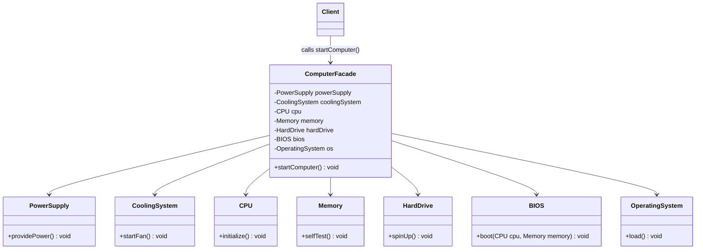

# 17. Facade Design Pattern

> 💡 **Quick Revision Anchor**
> - The **Facade Pattern** provides a simplified, unified higher-level interface to a complex subsystem of collaborating classes.
> - Key Guiding Principle: **Principle of Least Knowledge (Law of Demeter)** — *"Talk only to your immediate friends; do not talk to strangers."*
> - Primary lecture example: **Computer Boot Sequence Facade** orchestrating `PowerSupply`, `CoolingSystem`, `CPU`, `Memory`, `HardDrive`, `BIOS`, and `OS`.
> - Key distinction: **Facade simplifies** complex workflows; **Adapter converts** incompatible interfaces.

---

## 1. What Problem Are We Solving?

Real-world subsystems often consist of numerous interconnected classes:
```text
           [Complex Subsystem]
           ┌───────┐      ┌───────┐
           │Class A│ <--> │Class B│
           └───┬───┘      └───┬───┘
               │              │
               ▼              ▼
           ┌───────┐      ┌───────┐
           │Class C│ <--> │Class D│
           └───────┘      └───────┘
```

When an external **Client** needs to perform a high-level task (e.g., "Boot the computer" or "Place an order"), forcing the client to coordinate every subsystem class directly causes:
1. **Tight Coupling:** The client must know every internal class and call them in an exact operational sequence. Any change in subsystem classes breaks client code.
2. **Violates Law of Demeter:** Client code reaches deep into subsystem internals.
3. **High Cognitive Burden:** Callers must understand plumbing and wiring just to perform a common operation.

---

## 2. Core Idea: The Architectural Facade

The term comes from building architecture: the **facade** is the exterior face of a building that conceals the internal plumbing, electrical wiring, and structural framework.

A **Facade class** sits between the client and the complex subsystem:
- It maintains references to subsystem components (**HAS-A**).
- It exposes simple, high-level methods (`startComputer()`, `makePayment()`).
- The client only interacts with the facade, remaining insulated from internal subsystem details.

```
┌──────────┐              ┌──────────────────┐              ┌────────────────────────┐
│  Client  │ ──calls──▶   │  ComputerFacade  │ ──delegates─▶│ CPU, RAM, BIOS, Disk,  │
│          │ startComputer│                  │  in sequence │ PowerSupply, CoolingOS │
└──────────┘              └──────────────────┘              └────────────────────────┘
```

---

## 3. The Principle of Least Knowledge (Law of Demeter)

> *"Talk only to your immediate friends; do not talk to strangers."*

A method `M` inside Class `A` should only call methods on:
1. Class `A` itself (`this`).
2. Objects passed in as parameters to method `M`.
3. Objects instantiated or created within method `M`.
4. Direct instance fields (`HAS-A` components) of Class `A`.

```java
// ❌ Violates Law of Demeter (Train of calls):
client.getComputer().getMotherboard().getBios().boot();

// ✅ Adheres to Law of Demeter via Facade:
facade.startComputer();
```

---

## 4. Visual Architecture




---

## 5. Concise Java Implementation (Primary Lecture Example)

```java
// ==========================================
// 1. SUBSYSTEM COMPONENTS
// ==========================================
class PowerSupply {
    public void supply() { System.out.println("PowerSupply: Power on."); }
}

class CoolingSystem {
    public void startFan() { System.out.println("CoolingSystem: Fans spinning."); }
}

class CPU {
    public void initialize() { System.out.println("CPU: Registers cleared."); }
}

class Memory {
    public void check() { System.out.println("Memory: Self-test passed."); }
}

class HardDrive {
    public void spinUp() { System.out.println("HardDrive: Read/write heads positioned."); }
}

class BIOS {
    public void boot(CPU cpu, Memory mem) {
        System.out.println("BIOS: Bootstrapping hardware...");
        cpu.initialize();
        mem.check();
    }
}

class OperatingSystem {
    public void load() { System.out.println("OperatingSystem: Kernel loaded into RAM."); }
}

// ==========================================
// 2. FACADE CONTROLLER
// ==========================================
class ComputerFacade {
    private final PowerSupply power = new PowerSupply();
    private final CoolingSystem cooling = new CoolingSystem();
    private final CPU cpu = new CPU();
    private final Memory memory = new Memory();
    private final HardDrive disk = new HardDrive();
    private final BIOS bios = new BIOS();
    private final OperatingSystem os = new OperatingSystem();

    // Simplified, single entry point
    public void startComputer() {
        System.out.println("=== Computer Boot Sequence Started ===");
        power.supply();
        cooling.startFan();
        bios.boot(cpu, memory);
        disk.spinUp();
        os.load();
        System.out.println("=== Computer Ready for Use! ===");
    }
}

// ==========================================
// 3. CLIENT DEMONSTRATION
// ==========================================
public class Main {
    public static void main(String[] args) {
        // Client interacts solely with the simplified facade
        ComputerFacade pc = new ComputerFacade();
        pc.startComputer();
    }
}
```

---

## 6. Facade vs. Adapter (The Fundamental Distinction)

| Dimension | Facade Design Pattern | Adapter Design Pattern |
| :--- | :--- | :--- |
| **Primary Intent** | **Simplifies** a complex subsystem behind a single unified interface. | **Converts** an incompatible interface to match the client's expected contract. |
| **Interfaces Involved** | Aggregates and coordinates **many** subsystem classes. | Typically adapts **one** incompatible class to a target interface. |
| **Contract Created** | Introduces a brand new, simplified interface tailored to high-level client tasks. | Implements an already existing interface contract that the client expects. |
| **Mental Model** | *"Master TV Remote button: 'Movie Mode' (turns on TV, soundbar, dims lights)"* | *"Travel power plug converter (Indian 3-pin into US 2-pin socket)"* |

---

## 7. Interview Questions & Key Discussion Points

1. **Does the Facade pattern completely hide subsystem classes from client access?**
   - *Answer*: Not necessarily. GoF Facade provides a convenient, default high-level path. Advanced clients requiring low-level customizations can still interact with subsystem classes directly unless access modifiers (e.g., package-private) explicitly restrict them.
2. **What is the risk of the Facade pattern becoming an anti-pattern?**
   - *Answer*: If a facade is overloaded with too many diverse responsibilities across unrelated domains, it risks degenerating into an unmaintainable "God Object". Solution: Decompose large systems into multiple specialized facades (e.g., `OrderFacade`, `PaymentFacade`).
3. **How does Facade embody the Law of Demeter?**
   - *Answer*: The client interacts solely with its immediate collaborator (the Facade) instead of navigating through deeply chained dependency calls across internal subsystem objects.

---

## 8. Quick Revision

### Core Idea
Facade provides a unified, simplified interface to a complex subsystem, shielding clients from intricate dependencies and multi-step execution rituals.

### Remember
- **Lecture Example:** `ComputerFacade` coordinating `PowerSupply`, `Cooling`, `CPU`, `Memory`, `Disk`, `BIOS`, and `OS`.
- **Core Principle:** Principle of Least Knowledge (Law of Demeter) — avoid chained calls like `a.getB().getC().doAction()`.
- **Contrast:** Facade = *simplification*; Adapter = *translation*.
