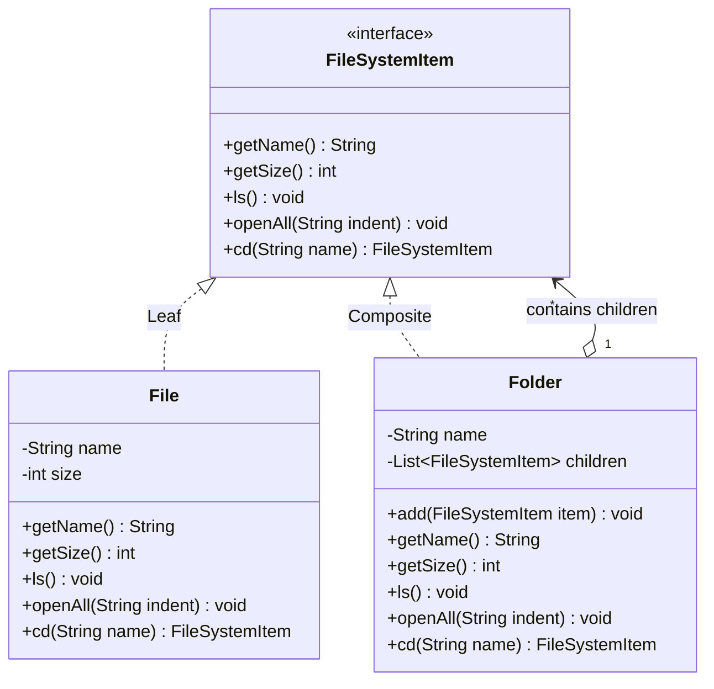

# 19. Composite Design Pattern — File System

> 💡 **Quick Revision Anchor**
> - The **Composite Pattern** composes objects into tree structures to represent part-whole hierarchies, allowing clients to treat individual objects (**Leaf**) and compositions of objects (**Composite**) uniformly.
> - Core Mechanism: Both `File` (Leaf) and `Folder` (Composite) implement the same component interface (`FileSystemItem`). A `Folder` contains a `List<FileSystemItem>` and delegates operations recursively down the tree.
> - Eliminates messy `instanceof` checks and recursive traversal loops in client code.

---

## 1. What Problem Are We Solving?

Consider modeling an operating system's **File System**:
- A **File** has a name and size. It is an atomic unit (Leaf) that cannot contain children.
- A **Folder (Directory)** has a name and can contain multiple files **and** multiple sub-folders.

```text
                  Root [Folder]
                 /      |      \
          file1.txt  file2.txt  docs [Folder]
                                /           \
                         resume.pdf      notes.txt
```

### The Naive Anti-Pattern
Without a unifying abstraction, a `Folder` might maintain two separate lists:
```java
// ❌ Naive Approach: Split collections
class Folder {
    private List<File> files;
    private List<Folder> subFolders;

    public void ls() {
        for (File f : files) f.print();
        for (Folder d : subFolders) d.print();
    }
}
```
**Why this breaks down:**
1. **Loss of Order:** Files and folders sit side-by-side in real directories; two separate lists lose insertion/chronological order.
2. **Type Checking Hell:** If combined into `List<Object>`, every recursive operation requires `instanceof` checks and casting:
   ```java
   if (item instanceof File) { ... }
   else if (item instanceof Folder) { ... }
   ```
3. **Breaks OCP:** Adding a new entity type (e.g., `SymbolicLink` or `ZipArchive`) requires modifying every traversal loop across the entire codebase.

---

## 2. Key Design Idea: Unified Component Interface

The Composite pattern unifies leaves and containers behind a common interface:

```
                          ┌────────────────────────┐
                          │ <<interface>> Component│
                          │   (FileSystemItem)     │
                          ├────────────────────────┤
                          │ +ls()                  │
                          │ +getSize()             │
                          └───────────▲────────────┘
                                      │
                 ┌────────────────────┴────────────────────┐
                 │ (implements)                            │ (implements)
     ┌────────────────────────┐                ┌────────────────────────┐
     │          File          │                │         Folder         │
     │         (Leaf)         │                │      (Composite)       │
     ├────────────────────────┤                ├────────────────────────┤
     │ +getSize() -> size     │                │ -children: List<Item>  │──◇ (HAS-MANY)
     │ +ls() -> print file    │                │ +getSize() -> sum size │
     └────────────────────────┘                │ +ls() -> list children │
                                               └────────────────────────┘
```

When `folder.getSize()` is called:
- The folder loops through its `children` and calls `child.getSize()`.
- If the child is a `File`, it returns its size (base case).
- If the child is a `Folder`, it recursively sums its own children.
- The client treats files and folders **identically** without caring about node types!

---

## 3. Visual Architecture



---

## 4. Concise Java Implementation (Primary Lecture Example)

```java
import java.util.*;

// ==========================================
// 1. COMPONENT INTERFACE
// ==========================================
interface FileSystemItem {
    String getName();
    int getSize();                        // File returns size; Folder sums children
    void ls();                            // List immediate children
    void openAll(String indent);          // Recursive print with indentation
    FileSystemItem cd(String name);       // Navigate into child directory
}

// ==========================================
// 2. LEAF NODE (File)
// ==========================================
class File implements FileSystemItem {
    private final String name;
    private final int size;

    public File(String name, int size) {
        this.name = name;
        this.size = size;
    }

    @Override public String getName() { return name; }
    @Override public int getSize() { return size; }
    @Override public void ls() { System.out.println("  📄 " + name + " (" + size + " KB)"); }
    @Override public void openAll(String indent) { System.out.println(indent + "📄 " + name + " (" + size + " KB)"); }

    @Override
    public FileSystemItem cd(String name) {
        System.out.println("Cannot cd into file: " + this.name);
        return null;
    }
}

// ==========================================
// 3. COMPOSITE NODE (Folder)
// ==========================================
class Folder implements FileSystemItem {
    private final String name;
    private final List<FileSystemItem> children = new ArrayList<>();

    public Folder(String name) {
        this.name = name;
    }

    public void add(FileSystemItem item) {
        children.add(item);
    }

    @Override public String getName() { return name; }

    // Recursive calculation: sums sizes of all children
    @Override
    public int getSize() {
        int total = 0;
        for (FileSystemItem child : children) {
            total += child.getSize(); // Polymorphic recursion
        }
        return total;
    }

    @Override
    public void ls() {
        System.out.println("Directory listing for: " + name);
        for (FileSystemItem child : children) {
            System.out.println("  " + child.getName() + " (" + child.getSize() + " KB)");
        }
    }

    // Recursive tree traversal
    @Override
    public void openAll(String indent) {
        System.out.println(indent + "📁 " + name + "/ (" + getSize() + " KB)");
        for (FileSystemItem child : children) {
            child.openAll(indent + "    ");
        }
    }

    @Override
    public FileSystemItem cd(String targetName) {
        for (FileSystemItem child : children) {
            if (child.getName().equalsIgnoreCase(targetName) && child instanceof Folder) {
                return child;
            }
        }
        System.out.println("Directory not found: " + targetName);
        return null;
    }
}

// ==========================================
// Driver Demonstration
// ==========================================
public class Main {
    public static void main(String[] args) {
        Folder root = new Folder("root");
        root.add(new File("file1.txt", 10));
        root.add(new File("file2.txt", 25));

        Folder docs = new Folder("docs");
        docs.add(new File("resume.pdf", 120));
        docs.add(new File("notes.txt", 15));
        root.add(docs);

        // Recursive tree display
        System.out.println("=== Recursive Tree Traversal ===");
        root.openAll("");

        // Uniform size computation
        System.out.println("\n=== Total Size Computation ===");
        System.out.println("Docs total size: " + docs.getSize() + " KB"); // 135 KB
        System.out.println("Root total size: " + root.getSize() + " KB"); // 170 KB

        // Navigation
        System.out.println("\n=== Directory Navigation ===");
        FileSystemItem cwd = root.cd("docs");
        if (cwd != null) cwd.ls();
    }
}
```

---

## 5. Other Real-World Examples (From Lecture)

1. **DOM Tree in Web Browsers:** HTML tags like `<div>` and `<table>` are Composite containers holding `<p>`, `<span>`, or text Leaf nodes. Calling `render()` cascades down recursively.
2. **GUI Frameworks (Swing / React):** A `Panel` contains child `Button`, `Label`, or nested `Panel` components. Calling `paint()` renders the entire hierarchy.
3. **Dropdown Menus in Document Editors:** A top-level Menu holds MenuItem leaves or nested submenus (Composites).

---

## 6. Interview Questions & Key Discussion Points

1. **How does the Composite Pattern eliminate `instanceof` checks?**
   - *Answer*: By declaring common domain methods (`getSize()`, `openAll()`) on the `FileSystemItem` interface, client code invokes methods polymorphically. Composite nodes recurse across children while Leaf nodes provide base case returns, eliminating type checks.
2. **Where should child-management methods (`add()`, `remove()`) be placed?**
   - *Answer*: Two classical approaches exist:
     - **Transparency:** Place `add()` on the base `FileSystemItem` interface. Leaves throw an `UnsupportedOperationException`. Maximizes uniform treatment.
     - **Safety (Lecture Preference):** Place `add()` only on the `Folder` class. Leaf classes remain clean and cannot be called with invalid operations.
3. **How does recursion terminate in Composite structures?**
   - *Answer*: Leaf nodes act as the base case of recursion (e.g., `File.getSize()` returns its own size directly without further delegation).

---

## 7. Quick Revision

### Core Idea
Composite arranges objects into tree structures so that individual items (Leaves) and container groupings (Composites) can be treated uniformly via a shared interface.

### Remember
- **Participants:** Component (`FileSystemItem`), Leaf (`File`), Composite (`Folder`).
- **Structure:** Composite **HAS-A** collection of Components and recurses down child references.
- **Key Benefit:** Eliminates conditional branching when traversing part-whole hierarchical data structures.
