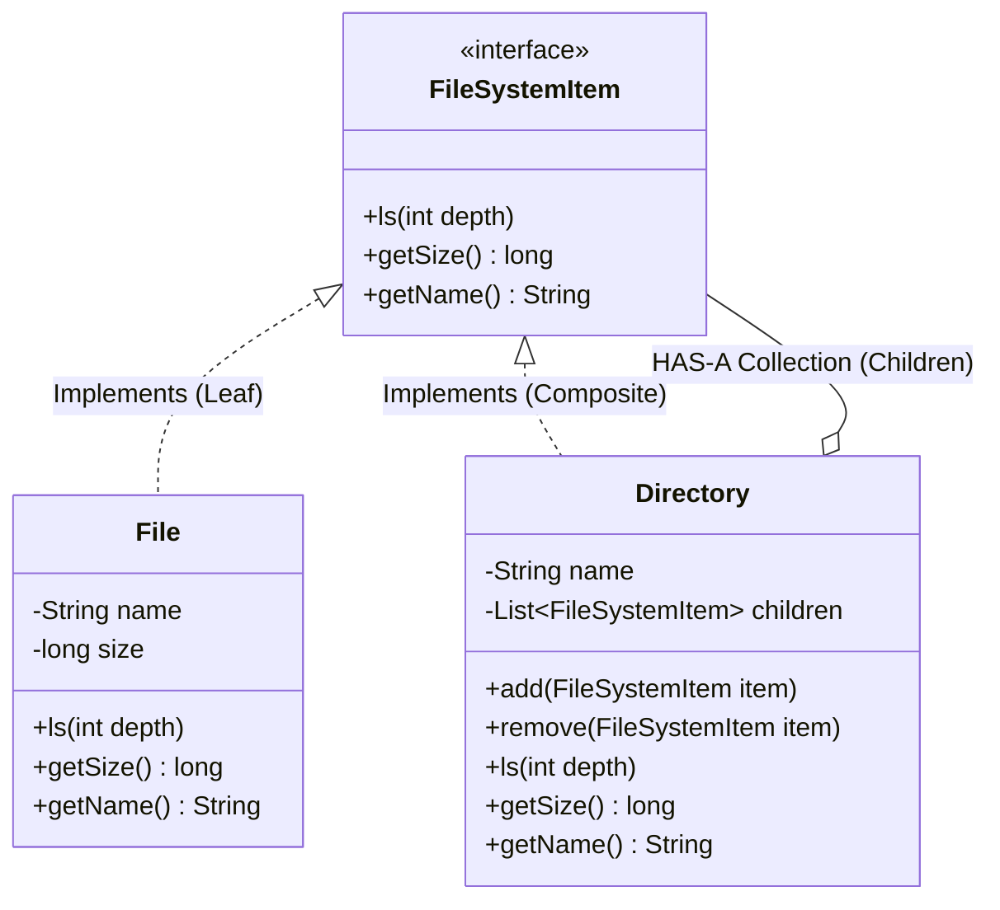

# 19. Composite Design Pattern — File System

> 💡 **Quick Revision Anchor**: The **Composite Pattern** is a structural design pattern used to compose objects into **tree-like part-whole hierarchies**. It allows clients to treat individual objects (**Leaf**) and compositions of objects (**Composite**) uniformly without checking types or writing nested conditionals.

---

## 1. Context & The Problem

Consider modeling an Operating System File System:
- A **File** is an individual item with a name, size, and content.
- A **Directory** (or Folder) can contain multiple Files, but it can also contain other Directories (sub-folders).

### Anti-Pattern: Two Separate Lists
If a Directory maintains separate lists for files and folders:
```java
// BAD DESIGN without Composite Pattern
class Folder {
    List<File> files;
    List<Folder> subFolders;

    public void ls() {
        for (File f : files) f.display();
        for (Folder sub : subFolders) sub.ls(); // Fragile, duplicated code
    }
}
```
**Consequences:**
- Client code must constantly distinguish between a file and a folder using `instanceof` checks.
- Recursive operations (e.g., `getSize()`, `ls()`, `delete()`) require redundant, branchy logic.
- Adding a new file system node type (e.g., Symlink, ZipArchive) breaks every single operation.

---

## 2. Composite Pattern Architecture



### The 3 Core Roles:
1. **Component (`FileSystemItem`)**: The common abstraction declaring operations applicable to both simple and complex objects (`ls()`, `getSize()`).
2. **Leaf (`File`)**: Basic building block with no children. Executes the actual work.
3. **Composite (`Directory`)**: Contains children (both Leaves and other Composites). Implements component methods by delegating recursively to its children.

> 🔍 **Composite vs. Decorator**:
> - Both patterns share the dual **IS-A** and **HAS-A** relationship with the base interface.
> - **Decorator**: Wraps a **single** component to enrich or add dynamic behavior.
> - **Composite**: Aggregates a **collection** of components to represent a part-whole tree hierarchy.

---

## 3. Production Java Implementation: File System

### Step 1: Component Interface
```java
public interface FileSystemItem {
    void ls(int depth);
    long getSize();
    String getName();
}
```

### Step 2: Leaf Node (File)
```java
public class File implements FileSystemItem {
    private final String name;
    private final long sizeInBytes;

    public File(String name, long sizeInBytes) {
        this.name = name;
        this.sizeInBytes = sizeInBytes;
    }

    @Override
    public String getName() {
        return name;
    }

    @Override
    public long getSize() {
        return sizeInBytes;
    }

    @Override
    public void ls(int depth) {
        String indent = "  ".repeat(depth);
        System.out.println(indent + "📄 " + name + " (" + sizeInBytes + " bytes)");
    }
}
```

### Step 3: Composite Node (Directory)
```java
import java.util.ArrayList;
import java.util.List;

public class Directory implements FileSystemItem {
    private final String name;
    private final List<FileSystemItem> children = new ArrayList<>();

    public Directory(String name) {
        this.name = name;
    }

    public void add(FileSystemItem item) {
        children.add(item);
    }

    public void remove(FileSystemItem item) {
        children.remove(item);
    }

    @Override
    public String getName() {
        return name;
    }

    @Override
    public long getSize() {
        // Recursive aggregation: Total size = sum of sizes of all children
        long totalSize = 0;
        for (FileSystemItem child : children) {
            totalSize += child.getSize();
        }
        return totalSize;
    }

    @Override
    public void ls(int depth) {
        String indent = "  ".repeat(depth);
        System.out.println(indent + "📁 [" + name + "] (Total: " + getSize() + " bytes)");
        
        // Uniform recursive traversal over all children
        for (FileSystemItem child : children) {
            child.ls(depth + 1);
        }
    }
}
```

### Step 4: Client Driver & Verification
```java
public class Main {
    public static void main(String[] args) {
        // Build the tree hierarchy:
        // /root
        //   ├── config.json (500 B)
        //   ├── app.log (1200 B)
        //   └── /src
        //         ├── Index.java (3500 B)
        //         └── /assets
        //               └── logo.png (82000 B)

        Directory root = new Directory("root");
        File config = new File("config.json", 500);
        File log = new File("app.log", 1200);

        Directory src = new Directory("src");
        File indexJava = new File("Index.java", 3500);

        Directory assets = new Directory("assets");
        File logo = new File("logo.png", 82000);

        // Assemble hierarchy
        assets.add(logo);
        src.add(indexJava);
        src.add(assets);

        root.add(config);
        root.add(log);
        root.add(src);

        // Client treats 'root' uniformly as a FileSystemItem
        System.out.println("=== Directory Tree Hierarchy (ls) ===");
        root.ls(0);

        System.out.println("\n=== Cumulative Size Query ===");
        System.out.println("Total Root Directory Size: " + root.getSize() + " bytes");
        System.out.println("Total 'src' Sub-directory Size: " + src.getSize() + " bytes");
    }
}
```

---

## 4. Output Execution Simulation

```text
=== Directory Tree Hierarchy (ls) ===
📁 [root] (Total: 87200 bytes)
  📄 config.json (500 bytes)
  📄 app.log (1200 bytes)
  📁 [src] (Total: 85500 bytes)
    📄 Index.java (3500 bytes)
    📁 [assets] (Total: 82000 bytes)
      📄 logo.png (82000 bytes)

=== Cumulative Size Query ===
Total Root Directory Size: 87200 bytes
Total 'src' Sub-directory Size: 85500 bytes
```

---

## 5. Trade-Offs & Design Decisions

### Transparency vs. Safety in Interface Design:
Where should `add(FileSystemItem)` and `remove(FileSystemItem)` be declared?

1. **Safety (Used Above)**:
   - Declare management methods (`add`, `remove`) **only** in `Directory` (Composite).
   - *Advantage*: Type-safe at compile-time. You cannot accidentally call `file.add(...)`.
   - *Trade-off*: Client must know an object is a `Directory` before adding children to it.
2. **Transparency**:
   - Declare `add` and `remove` in the base `FileSystemItem` interface, throwing `UnsupportedOperationException` in `File`.
   - *Advantage*: Complete uniformity across all nodes.
   - *Trade-off*: Runtime exceptions if called on a Leaf node.

---

## 6. Real-World Applications & Interview Checklist

1. **UI Component Trees**:
   - Web DOM (`document.body.appendChild(...)`): A `div` is a composite container holding text nodes (leaves) and nested elements.
   - Swing / JavaFX / React: Containers (`JPanel`, `VBox`) hold basic controls (`JButton`, `JLabel`) or other nested panels.
2. **Arithmetic Expression Trees**:
   - Binary expression `(3 + 5) * (10 - 2)`.
   - Leaves: Numbers (`3`, `5`, `10`, `2`).
   - Composites: Operators (`+`, `*`, `-`) evaluating operands recursively.
3. **Company Hierarchy / Org Chart**:
   - `Employee` (Leaf: Individual contributor, Developer).
   - `Manager` (Composite: Manages a team of Employees and sub-Managers).
   - `manager.getSalary()` computes department budget recursively.
