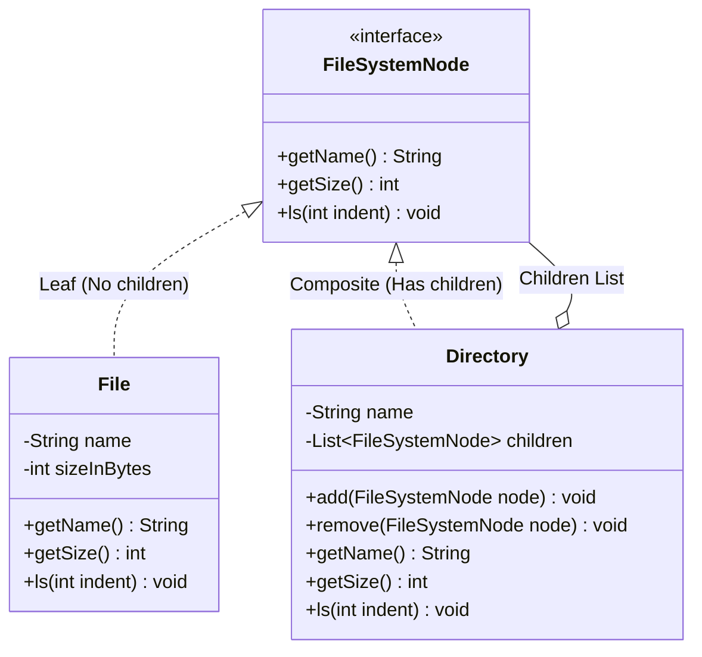
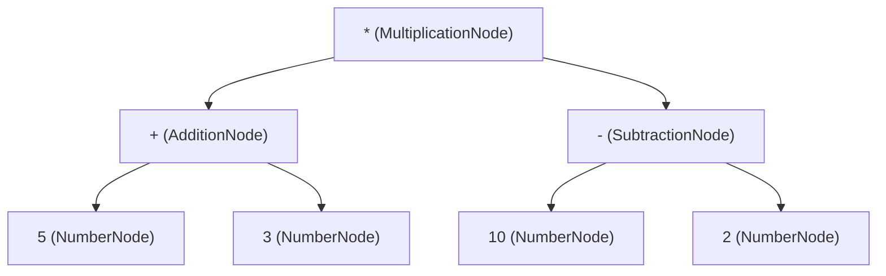

# 19. Composite Design Pattern — File System

> 💡 **Quick Revision Anchor**: 
> - **Type**: Structural Design Pattern.
> - **Core Intent**: Composes objects into **tree structures** to represent **part-whole hierarchies**, allowing clients to treat individual leaf objects and composite containers **identically and uniformly**.
> - **Classic Examples**: Operating System File Systems (`File` vs `Directory`), UI DOM Trees (`HTML Div` vs `TextNode`), Arithmetic Expression Trees (`Number` vs `Operator`).

---

## 1. Context & The Dual-List Anti-Pattern

Imagine building an **Operating System File System**:
- A **File** has a name and a physical size in bytes.
- A **Directory** contains files, but it can also contain other sub-directories (nested to arbitrary depths).

### The Naive Anti-Pattern (Two Separate Lists):
```java
// ❌ Naive Directory: Maintains separate lists for files and folders
public class BadDirectory {
    private String name;
    private List<File> files = new ArrayList<>();
    private List<BadDirectory> subDirectories = new ArrayList<>();

    // Every operation requires dual loops, instanceof checks, and duplicated logic!
    public int calculateTotalSize() {
        int total = 0;
        for (File f : files) total += f.getSize();
        for (BadDirectory d : subDirectories) total += d.calculateTotalSize(); // Dual loop!
        return total;
    }
}
```

#### Why does this violate clean design?
1. If tomorrow we add a new file system entity (e.g. `Symlink` or `ZipArchive`), every method in `BadDirectory` must be rewritten with a third list and third loop!
2. Client code cannot treat files and directories uniformly when executing operations like `delete()`, `search()`, or `ls()`.

---

## 2. Composite Pattern Architecture



### The 3 Key Participants:
1. **Component (`FileSystemNode`)**: The base abstraction declaring operations common to both simple and complex objects.
2. **Leaf (`File`)**: Represents end objects of a composition. A leaf has no children and performs the actual primitive work (e.g., returning its file size).
3. **Composite (`Directory`)**: A container holding a collection of `FileSystemNode` children. It implements component operations by delegating recursively to its children.

---

## 3. Production Java Implementation

```java
import java.util.*;

// 1. Component Interface
public interface FileSystemNode {
    String getName();
    int getSize(); // Returns size in bytes
    void ls(int indentLevel);
}

// 2. Leaf Class: File (Primitive entity)
public class File implements FileSystemNode {
    private final String name;
    private final int sizeInBytes;

    public File(String name, int sizeInBytes) {
        this.name = name;
        this.sizeInBytes = sizeInBytes;
    }

    @Override
    public String getName() {
        return name;
    }

    @Override
    public int getSize() {
        return sizeInBytes;
    }

    @Override
    public void ls(int indentLevel) {
        String indent = "  ".repeat(indentLevel);
        System.out.println(indent + "📄 " + name + " (" + sizeInBytes + " KB)");
    }
}

// 3. Composite Class: Directory (Can hold Files and Sub-Directories uniformly)
public class Directory implements FileSystemNode {
    private final String name;
    // Polymorphic collection: stores both Files and Directories!
    private final List<FileSystemNode> children = new ArrayList<>();

    public Directory(String name) {
        this.name = name;
    }

    public void addComponent(FileSystemNode node) {
        children.add(node);
    }

    public void removeComponent(FileSystemNode node) {
        children.remove(node);
    }

    @Override
    public String getName() {
        return name;
    }

    // Recursive size calculation: sums files + nested subdirectories seamlessly!
    @Override
    public int getSize() {
        int totalSize = 0;
        for (FileSystemNode child : children) {
            totalSize += child.getSize(); // Polymorphic recursive dispatch!
        }
        return totalSize;
    }

    // Recursive directory tree printing with visual indentation
    @Override
    public void ls(int indentLevel) {
        String indent = "  ".repeat(indentLevel);
        System.out.println(indent + "📁 [" + name + "] (Total: " + getSize() + " KB)");
        for (FileSystemNode child : children) {
            child.ls(indentLevel + 1); // Recurse with deeper indentation
        }
    }
}
```

### Demonstration Execution:
```java
public class FileSystemDemo {
    public static void main(String[] args) {
        // Root Directory
        Directory root = new Directory("root");

        // Movies Folder with files
        Directory moviesDir = new Directory("Movies");
        moviesDir.addComponent(new File("Inception.mp4", 1400));
        moviesDir.addComponent(new File("Interstellar.mkv", 2200));

        // Documents Folder with nested subfolder
        Directory docsDir = new Directory("Documents");
        docsDir.addComponent(new File("Resume.pdf", 120));
        
        Directory taxDir = new Directory("Taxes_2024");
        taxDir.addComponent(new File("W2_Form.pdf", 85));
        docsDir.addComponent(taxDir);

        // Add to Root
        root.addComponent(moviesDir);
        root.addComponent(docsDir);
        root.addComponent(new File("hosts.txt", 4));

        // Uniform invocation: ls() and getSize() work across the entire tree!
        System.out.println("=== Recursive Directory Tree ===");
        root.ls(0);

        System.out.println("\nTotal Storage Occupied by Root: " + root.getSize() + " KB");
    }
}
```

---

## 4. Another Classic Use Case: Arithmetic Expression Trees

The Composite pattern models mathematical expressions like `(5 + 3) * (10 - 2)`:
- **Leaf**: `NumberNode(5)`, `NumberNode(3)` $\rightarrow$ returns value.
- **Composite**: `AdditionNode(left, right)`, `MultiplicationNode(left, right)` $\rightarrow$ evaluates children and applies operator.



---

## 5. Summary & Key Interview Takeaways

1. **Uniformity over Rigidity**: The Composite pattern lets clients ignore whether they are dealing with a single leaf or an entire subtree of 1,000 items.
2. **Recursive Traversal**: Methods like `getSize()` and `ls()` utilize the call stack to perform clean, recursive tree traversals without explicit stack manipulation.
3. **Open/Closed Principle**: Adding new composite elements (e.g. `Symlink`, `Shortcut`) requires creating a new class implementing `FileSystemNode`, leaving existing code completely untouched.
