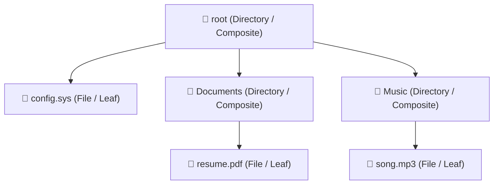
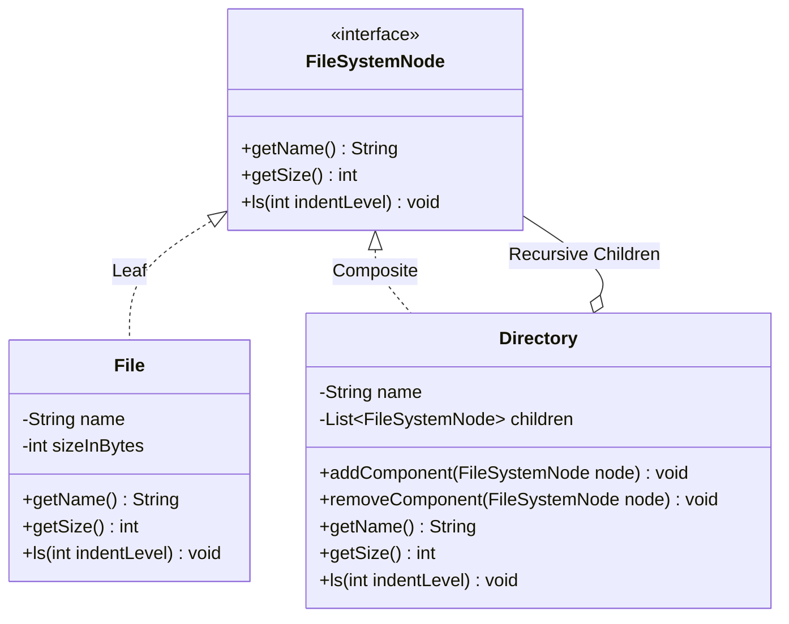
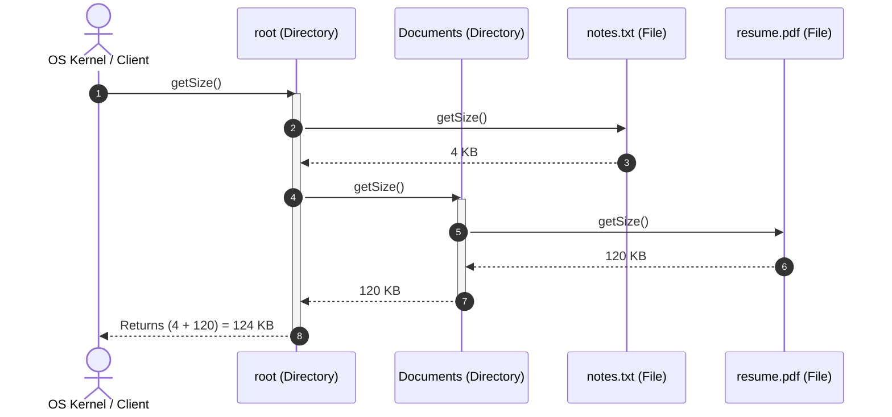

# 19. Composite Design Pattern — File System

## 1. Overview

The **Composite Design Pattern** is a structural design pattern that composes objects into **tree structures** to represent **part-whole hierarchies**. Composite lets client code treat individual leaf objects and composite collections of objects **identically and uniformly**.



---

## 2. What Problem Are We Solving?

Consider modeling an Operating System File System:
- A `File` has a name and size.
- A `Directory` has a name, but can contain both files and other subdirectories (nested to arbitrary depth).
- **The Dual-List Anti-Pattern**: If a `Directory` class maintains two separate lists (`List<File>` and `List<Directory>`), every single operation (`ls()`, `calculateSize()`, `search()`, `delete()`) requires writing separate loops, instanceof checks, and duplicated recursion logic.
- Clients cannot treat files and folders uniformly when calling common operations.

---

## 3. Core Concepts

- **Component (`FileSystemNode`)**: Common interface declaring operations shared by both simple and complex objects (`getName()`, `getSize()`, `ls()`).
- **Leaf (`File`)**: Represents end-node objects that have no children. A leaf performs the actual primitive computation (e.g. returning its file size).
- **Composite (`Directory`)**: Stores a polymorphic collection of `FileSystemNode` children (which can contain both Files and other Directories). It implements operations by delegating recursively to its children.

---

## 4. Important Terminology

- **Part-Whole Hierarchy**: A tree structure where a complex whole is made of parts, and parts can themselves be composed of smaller parts.
- **Uniformity vs. Type Safety**: Composite prioritizes uniformity (client treats all nodes the same) over type safety (child management methods like `add()` may be exposed on leaf nodes, throwing exceptions if not guarded).
- **Recursive Composition**: An object graph where composites contain components that are themselves composites.

---

## 5. Real-World Analogy

### 1. Delivery Packages & Gift Boxes
- You buy a gift. It can be a single item (Leaf: a watch).
- Or it can be a large gift box (Composite) containing a book (Leaf) and a smaller box (Composite) containing earrings (Leaf).
- When the postal courier weighs the delivery, they put the outermost package on the scale (`calculateWeight()`), which automatically weighs all nested items and sub-boxes recursively.

### 2. Company Organizational Hierarchy
- An `Employee` (Leaf) has a salary. A `Department` (Composite) contains employees and sub-departments. Calculating the total departmental budget recursively sums individual salaries and child departmental expenses.

---

## 6. Naive / Bad Design

### Java Example (The Dual-List Anti-Pattern)
```java
// ❌ Naive Anti-Pattern: Separate lists for files and folders
public class BadDirectory {
    private String name;
    private List<File> files = new ArrayList<>();
    private List<BadDirectory> subDirectories = new ArrayList<>();

    // 💥 Every operation requires dual loops and separate logic!
    public int calculateTotalSize() {
        int total = 0;
        for (File f : files) total += f.getSize();
        for (BadDirectory d : subDirectories) total += d.calculateTotalSize();
        return total;
    }
}
```

### Problems
- Adding a new file system node (e.g. `Symlink` or `ZipArchive`) requires modifying every method in `BadDirectory` with a third list and loop.
- Client code cannot treat files and directories polymorphically.

---

## 7. Design Evolution

1. **Step 1**: Identify the shared abstraction: `FileSystemNode` declaring `int getSize()` and `void ls(int indentLevel)`.
2. **Step 2**: Make `File` implement `FileSystemNode` as a leaf node.
3. **Step 3**: Make `Directory` implement `FileSystemNode` as a composite node, holding a single polymorphic collection: `List<FileSystemNode> children`.
4. **Step 4**: Operations like `getSize()` become recursive one-liners: iterating over children and summing their sizes polymorphically.

---

## 8. Final Design

### Architecture (Class Diagram)


### Mermaid Sequence Diagram (Recursive Directory Sizing)


---

## 9. Java Implementation

```java
import java.util.*;

// 1. Component Interface
public interface FileSystemNode {
    String getName();
    int getSize(); // Returns size in KB
    void ls(int indentLevel);
}

// 2. Leaf Class: File (Primitive entity)
public class File implements FileSystemNode {
    private final String name;
    private final int sizeInKB;

    public File(String name, int sizeInKB) {
        this.name = Objects.requireNonNull(name);
        this.sizeInKB = Math.max(0, sizeInKB);
    }

    @Override
    public String getName() {
        return name;
    }

    @Override
    public int getSize() {
        return sizeInKB;
    }

    @Override
    public void ls(int indentLevel) {
        String indent = "  ".repeat(indentLevel);
        System.out.println(indent + "📄 " + name + " (" + sizeInKB + " KB)");
    }
}

// 3. Composite Class: Directory (Can hold Files and Sub-Directories uniformly)
public class Directory implements FileSystemNode {
    private final String name;
    // Polymorphic collection: holds both Files and nested Directories!
    private final List<FileSystemNode> children = new ArrayList<>();

    public Directory(String name) {
        this.name = Objects.requireNonNull(name);
    }

    public void addComponent(FileSystemNode node) {
        if (node != null) children.add(node);
    }

    public void removeComponent(FileSystemNode node) {
        children.remove(node);
    }

    @Override
    public String getName() {
        return name;
    }

    // Recursive size calculation across the entire subtree
    @Override
    public int getSize() {
        int totalSize = 0;
        for (FileSystemNode child : children) {
            totalSize += child.getSize(); // Polymorphic recursive dispatch!
        }
        return totalSize;
    }

    // Recursive directory tree printing with visual indentation
    @Override
    public void ls(int indentLevel) {
        String indent = "  ".repeat(indentLevel);
        System.out.println(indent + "📁 [" + name + "] (Total: " + getSize() + " KB)");
        for (FileSystemNode child : children) {
            child.ls(indentLevel + 1); // Recurse with deeper indentation
        }
    }
}
```

---

## 10. Code Walkthrough

1. `FileSystemNode`: The core contract providing uniform polymorphic access.
2. `File.getSize()`: Base case of the recursion; returns the file's raw size.
3. `Directory.getSize()`: Recursive step; iterates through `children`, invoking `child.getSize()` without knowing whether a child is a leaf file or a nested directory.
4. `Directory.ls()`: Prints the directory header and recurses on all children with `indentLevel + 1` to format a visual folder hierarchy.

---

## 11. Important Design Decisions

- **Uniformity vs. Type Safety**: Child management methods (`addComponent()`, `removeComponent()`) are placed on `Directory` rather than the `FileSystemNode` interface. This preserves compile-time type safety so clients cannot accidentally invoke `addComponent()` on a single `File`.

---

## 12. Edge Cases

- **Empty Directory**: Returns `getSize() == 0` and prints an empty folder without throwing errors.
- **Cyclic References / Symlinks**: If symbolic links are introduced, an object tree could contain a cycle ($A \rightarrow B \rightarrow A$), causing infinite recursion and `StackOverflowError`. Solved by tracking visited nodes via a `Set<FileSystemNode>`.

---

## 13. Production Considerations

- **Arithmetic Expression Trees**: Another canonical use case of Composite:
  - **Leaf**: `Number(5)`, `Number(10)`
  - **Composite**: `AddExpression(left, right)`, `MultiplyExpression(left, right)`
  - Calling `eval()` on the root evaluates the full mathematical formula recursively.

---

## 14. Advantages

- **Simplifies Client Code**: Clients treat complex trees and primitive leaves identically.
- **Open/Closed Principle**: Adding new node types (e.g. `SymlinkNode`, `ZipArchiveNode`) requires zero changes to existing classes.

---

## 15. Disadvantages / Trade-offs

- **Over-generalization**: It can make designs overly general when you want to restrict which components can be children of other components.

---

## 16. Related Patterns / Alternatives

- **Composite vs. Decorator**: Both share similar recursive structures, but Decorator adds responsibilities dynamically to an object, whereas Composite focuses on aggregating tree structures.
- **Composite + Iterator**: Often combined to traverse hierarchical trees sequentially.

---

## 17. SOLID / OOP Connections

- **Open/Closed Principle (OCP)**: New leaves and composites can be introduced without modifying existing tree processing logic.
- **Single Responsibility Principle (SRP)**: Leaves handle primitive operations; composites handle aggregation and delegation.

---

## 18. Common Mistakes

- **Duplicating Lists**: Using separate lists for leaves and composites inside the container class instead of a single polymorphic collection.
- **Forgetting Base Case in Recursion**: Ensuring leaf nodes return values directly without attempting to recurse.

---

## 19. Interview Questions

1. **What problem does the Composite Pattern solve?**
   - *Answer*: It allows client code to treat individual objects (leaves) and compositions of objects (composites) uniformly in a tree structure, avoiding conditional type checking and dual loops.
2. **Where do you declare child management methods (`add`/`remove`) in Composite?**
   - *Answer*: Either in the Component interface (prioritizing Uniformity, but leaves must throw exceptions) or only in the Composite class (prioritizing Type Safety, which is preferred in Java).
3. **How do you calculate directory size in the Composite pattern?**
   - *Answer*: By defining `getSize()` on the component interface; the leaf returns its own size, while the composite iterates over its child collection and returns the sum of `child.getSize()`.

---

## 20. Quick Revision

### Core Idea
> Composite structures objects into tree hierarchies so clients treat individual leaf items and composite collections uniformly.

### Remember
- Component = Shared interface (`FileSystemNode`).
- Leaf = Primitive node with no children (`File`).
- Composite = Container storing polymorphic children (`Directory`).

### Java Implementation Idea
> Store `List<FileSystemNode>` in `Directory`, and implement `getSize()` and `ls()` via recursive delegation to children.

### Most Important Interview Point
> Point out how Composite eliminates dual-list anti-patterns and `instanceof` checks when traversing tree-structured domains.

### Common Trap
> Be vigilant about cyclic links (like symlinks in file systems) that can trigger infinite recursive loops and `StackOverflowError`.
