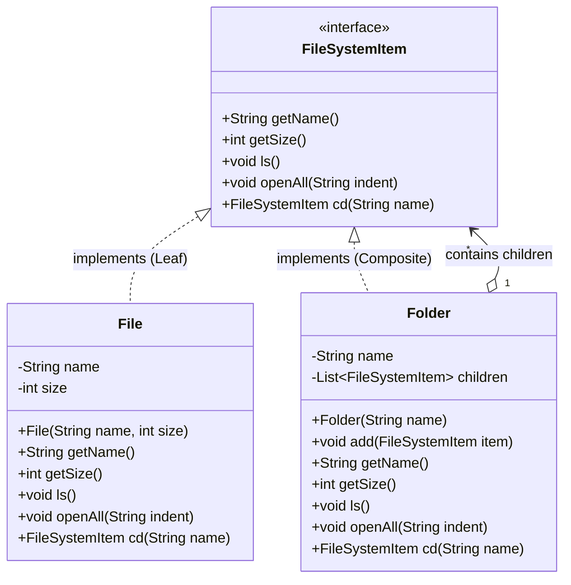

# 19. Composite Design Pattern — File System

> 💡 **Quick Revision Anchor**
> - **Type:** Structural Design Pattern
> - **Core Principle:** Composes objects into tree structures to represent part-whole hierarchies. Enables clients to treat individual objects (**Leaves**) and compositions of objects (**Composites**) uniformly.
> - **Key Idea:** Both single items (`File`) and container items (`Folder`) implement the exact same component interface (`FileSystemItem`).
> - **Rule of Thumb:** *"Use the Composite Pattern whenever your domain forms a tree-like hierarchy (Part-Whole) and you want to avoid `if (isLeaf) ... else if (isComposite) ...` type checks."*

---

## 1. Problem & Motivation

Consider designing an operating system's **File System**:
- A **File** has a name, a size, and content. A file is an atomic leaf element (it cannot contain other files or folders).
- A **Folder (Directory)** has a name, but it can contain multiple files **and** multiple sub-folders.

```
                  Root [Folder]
                 /     |       \
          file1.txt   file2.txt  Docs [Folder]
                                 /          \
                         resume.pdf       notes.txt
```

### The Naive Approach: Treating Files and Folders Distinctly
Without a unifying abstraction, a `Folder` class might be forced to maintain two separate collections:
```java
// ❌ Naive design
class Folder {
    private List<File> files;
    private List<Folder> subFolders;
    
    public void printAll() {
        for (File f : files) { f.print(); }
        for (Folder folder : subFolders) { folder.printAll(); }
    }
}
```

### Why the Naive Approach Fails:
1. **Lost Insertion Order:** In real file systems, files and sub-folders sit side-by-side in arbitrary order. Maintaining two separate lists loses chronological/alphabetical ordering across items.
2. **Type Checking & Polymorphism Breakdown:** If we store them in a single generic `List<Object>`, every traversal requires ugly type checks (`instanceof`) and casting:
   ```java
   for (Object item : items) {
       if (item instanceof File) {
           ((File) item).print();
       } else if (item instanceof Folder) {
           ((Folder) item).printAll();
       }
   }
   ```
3. **Breaks Open-Closed Principle (OCP):** If we introduce a new file-system entity (e.g., `SymbolicLink`, `CompressedArchive`), we must modify every traversal loop across the entire codebase.

---

## 2. The Core Solution: Composite Design Pattern

The **Composite Pattern** solves this by defining a single **Component interface** that both leaf nodes (`File`) and composite containers (`Folder`) implement.

```
                    +--------------------+
                    |   FileSystemItem   | (Component Interface)
                    |--------------------|
                    | +ls()              |
                    | +getSize()         |
                    | +openAll()         |
                    +--------------------+
                              ▲
                 ┌────────────┴────────────┐
                 │                         │
      +--------------------+     +--------------------+
      |        File        |     |       Folder       |
      |       (Leaf)       |     |    (Composite)     |
      |--------------------|     |--------------------|
      | -size              |     | -children: List    |
      | +getSize(): int    |     | +add(item)         |
      +--------------------+     | +getSize(): int    |
                                 +--------------------+
                                           │
                                           └─── Has-Many children ───┘
```

Because `Folder` holds a list of `FileSystemItem` (which can be either `File` or another `Folder`), operations like `getSize()` or `openAll()` naturally recurse down the tree without the client caring about node types!

---

## 3. Structural Participants

1. **Component (`FileSystemItem`):** Declares common operations for all items in the hierarchy (`ls()`, `getSize()`, `openAll()`).
2. **Leaf (`File`):** Represents leaf objects with no children. Implements operations directly.
3. **Composite (`Folder`):** Contains child components (`List<FileSystemItem>`). Implements operations by delegating them recursively across its children.
4. **Client:** Interacts uniformly with components through the `FileSystemItem` interface.

---

## 4. Architecture & Class Diagram



---

## 5. Java Implementation (Primary Lecture Example)

### Step 1: Component Interface
```java
// Component Interface representing both Files and Folders
public interface FileSystemItem {
    String getName();
    int getSize();                         // File returns its size; Folder returns sum of children
    void ls();                             // List immediate contents
    void openAll(String indent);           // Recursively print tree with indentation
    FileSystemItem cd(String targetName);  // Change directory navigation
}
```

---

### Step 2: Leaf Node (`File`)
```java
// Leaf Node: has no children
public class File implements FileSystemItem {
    private final String name;
    private final int sizeInKb;

    public File(String name, int sizeInKb) {
        this.name = name;
        this.sizeInKb = sizeInKb;
    }

    @Override
    public String getName() { return name; }

    @Override
    public int getSize() { return sizeInKb; }

    @Override
    public void ls() {
        System.out.println("  [File] " + name + " (" + sizeInKb + " KB)");
    }

    @Override
    public void openAll(String indent) {
        System.out.println(indent + "📄 " + name + " (" + sizeInKb + " KB)");
    }

    @Override
    public FileSystemItem cd(String targetName) {
        // You cannot cd into a leaf file
        System.out.println("Cannot cd into file: " + name);
        return null;
    }
}
```

---

### Step 3: Composite Node (`Folder`)
```java
import java.util.ArrayList;
import java.util.List;

// Composite Node: can contain other Files and Folders
public class Folder implements FileSystemItem {
    private final String name;
    private final List<FileSystemItem> children = new ArrayList<>();

    public Folder(String name) {
        this.name = name;
    }

    public void add(FileSystemItem item) {
        children.add(item);
    }

    @Override
    public String getName() { return name; }

    // Recursively sums the sizes of all contained items
    @Override
    public int getSize() {
        int totalSize = 0;
        for (FileSystemItem child : children) {
            totalSize += child.getSize(); // Recursive delegation!
        }
        return totalSize;
    }

    // Lists immediate children
    @Override
    public void ls() {
        System.out.println("Directory listing for: " + name);
        for (FileSystemItem child : children) {
            System.out.println("  " + child.getName() + " (" + child.getSize() + " KB)");
        }
    }

    // Recursively prints entire sub-tree with indentation
    @Override
    public void openAll(String indent) {
        System.out.println(indent + "📁 " + name + "/ (" + getSize() + " KB total)");
        for (FileSystemItem child : children) {
            child.openAll(indent + "    "); // Recurse with increased indentation
        }
    }

    // Navigates to an immediate child directory
    @Override
    public FileSystemItem cd(String targetName) {
        for (FileSystemItem child : children) {
            if (child.getName().equalsIgnoreCase(targetName) && child instanceof Folder) {
                return child;
            }
        }
        System.out.println("Directory not found: " + targetName);
        return null;
    }
}
```

---

### Step 4: Client Code & Demonstration
```java
public class Main {
    public static void main(String[] args) {
        // Build the tree hierarchy
        Folder root = new Folder("root");

        File file1 = new File("file1.txt", 10);
        File file2 = new File("file2.txt", 25);
        root.add(file1);
        root.add(file2);

        Folder docs = new Folder("docs");
        File resume = new File("resume.pdf", 120);
        File notes = new File("notes.txt", 15);
        docs.add(resume);
        docs.add(notes);

        root.add(docs);

        // 1. Recursive Tree Printing via openAll()
        System.out.println("=== Recursive Open All ===");
        root.openAll("");

        // 2. Uniform Size Calculation
        System.out.println("\n=== Size Computation ===");
        System.out.println("Docs folder total size: " + docs.getSize() + " KB");
        System.out.println("Root folder total size: " + root.getSize() + " KB");

        // 3. Navigation via cd()
        System.out.println("\n=== Directory Navigation ===");
        FileSystemItem cwd = root.cd("docs");
        if (cwd != null) {
            cwd.ls();
        }
    }
}
```

### Execution Output:
```text
=== Recursive Open All ===
📁 root/ (170 KB total)
    📄 file1.txt (10 KB)
    📄 file2.txt (25 KB)
    📁 docs/ (135 KB total)
        📄 resume.pdf (120 KB)
        📄 notes.txt (15 KB)

=== Size Computation ===
Docs folder total size: 135 KB
Root folder total size: 170 KB

=== Directory Navigation ===
Directory listing for: docs
  resume.pdf (120 KB)
  notes.txt (15 KB)
```

---

## 6. Real-World Applications

1. **DOM Tree in Web Browsers:** HTML `<head>`, `<body>`, `<div>` tags are Composites containing child elements (`<p>`, `<span>`, or plain text Leaf nodes). Calling `.render()` or `.getBoundingClientRect()` triggers recursive aggregation.
2. **GUI Layout Frameworks (Swing / JavaFX / React):** A `Container` / `Panel` holds child `Button`, `Label`, or nested `Panel` components. Calling `paint()` paints the entire container hierarchy.
3. **E-Commerce Product Bundling:** An order item can be an individual product or a "Gift Box / Bundle" containing multiple products and nested smaller gift packs. Calling `getPrice()` recursively calculates the total.
4. **Organizational Hierarchy:** An `Employee` can be an individual contributor or a `Manager` with a team of subordinates. Calling `getHeadcount()` or `calculateBudget()` aggregates recursively.

---

## 7. Trade-offs & Limitations

| Advantages | Limitations |
| :--- | :--- |
| **Uniformity:** Client treats leaves and composites identically; no `instanceof` checks. | **Over-generalization:** Interface must declare operations that might not make sense for leaf nodes (e.g., `cd()` or `add()` on a `File`). |
| **Open-Closed Principle:** Adding new leaf or composite types requires zero modifications to existing traversal code. | **Type Safety vs. Transparency:** If `add()` is placed in the Component interface, leaf nodes must throw `UnsupportedOperationException`. If `add()` is only on `Folder`, client loses transparency when handling references typed as `FileSystemItem`. |

---

## 8. Interview Perspective

- **Q: How does Composite pattern eliminate conditional logic?**
  *A: Instead of the client checking whether an item is a File or a Folder with `if-else` or `switch`, polymorphism handles it automatically. `Folder.getSize()` calls `.getSize()` on its children, which in turn could be files or sub-folders.*
- **Q: Where should child management methods (`add()`, `remove()`) reside?**
  *A: Two classical approaches exist:*
  1. *Transparency:* Put `add()` in the base Component interface. Leaves throw an exception. Maximizes uniform treatment.
  2. *Safety (Instructor's preference):* Put `add()` only in the Composite class (`Folder`). Leaves don't have invalid methods, but client must know it has a `Folder` before calling `add()`.*
- **Q: How does recursion terminate in Composite structures?**
  *A: Leaf nodes serve as the base cases of the recursive traversal (e.g., `File.getSize()` returns its own size without delegating).*

---

## 9. Quick Revision

```text
Tree Hierarchy: Component (base) <- Leaf (File) & Composite (Folder).
Composite HAS-A List<Component> and delegates operations down recursively.
Eliminates instanceof checks, enables uniform client interactions.
```
