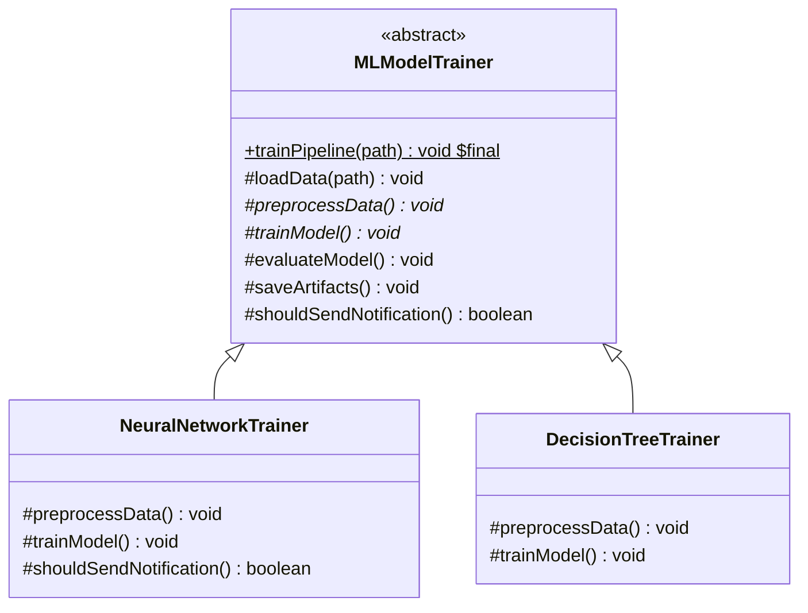
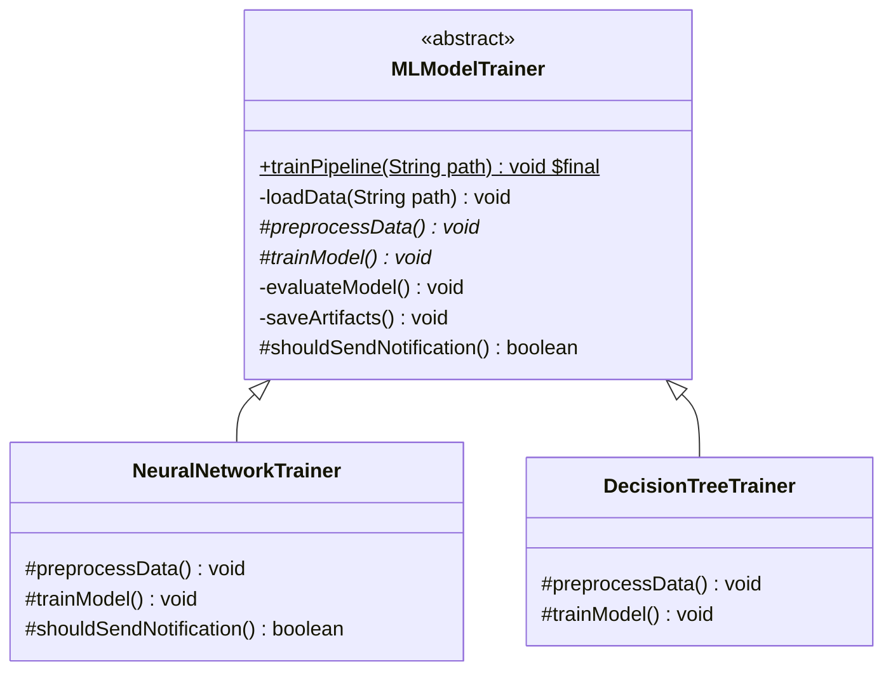
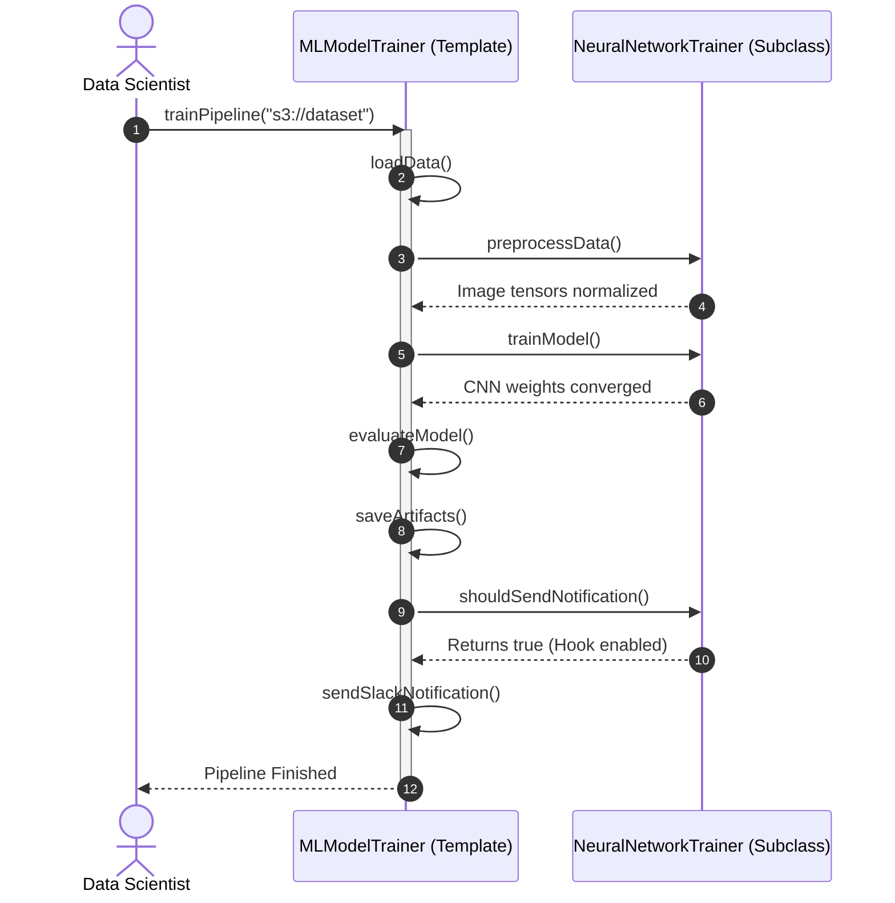

# 20. Template Method Pattern

## 1. Overview

The **Template Method Pattern** is a behavioral design pattern that defines the **invariant skeleton of an algorithm** in a base class, while deferring specific steps to subclasses. It allows subclasses to redefine certain steps of an algorithm without altering the overall algorithm's structure, embodying the **Hollywood Principle**: *"Don't call us, we'll call you."*



---

## 2. What Problem Are We Solving?

Consider building an **End-to-End Machine Learning Model Training Pipeline**:
Every machine learning workflow must follow an invariant series of phases:
1. `loadData()` $\rightarrow$ 2. `preprocessData()` $\rightarrow$ 3. `trainModel()` $\rightarrow$ 4. `evaluateModel()` $\rightarrow$ 5. `saveArtifacts()`.
- **The Code Duplication Anti-Pattern**: If different engineering teams (`ComputerVisionTeam`, `NLPTeam`, `TabularFraudTeam`) implement their own pipelines from scratch, 80% of the workflow (data loading, evaluation metrics, artifact saving) is duplicated across classes.
- If someone forgets to evaluate the model before deploying or fails to save artifacts to S3, the training job fails silently after hours of GPU execution.

---

## 3. Core Concepts

The template class contains four distinct types of methods:
1. **The Template Method**: Marked `final` in Java so subclasses cannot reorder or tamper with the invariant algorithm steps.
2. **Abstract Primitive Steps**: Methods without implementation that subclasses **must** provide (e.g. `preprocessData()`, `trainModel()`).
3. **Concrete Invariant Steps**: Common utility methods implemented once in the base class (e.g. `loadData()`, `evaluateModel()`).
4. **Hook Methods**: Concrete methods with empty or default implementations (e.g. `boolean shouldSendNotification()`) that subclasses **can optionally override** to alter workflow behavior.

---

## 4. Important Terminology

- **Hollywood Principle**: High-level superclasses control the execution flow and invoke subclass methods, inverting traditional procedural control where low-level code calls library utilities.
- **Hook Method**: A method that provides default behavior (often a no-op or boolean check) allowing subclasses to "hook into" the algorithm at specific points.
- **Inversion of Control (IoC)**: The broader architectural concept demonstrated by the Template Method pattern.

---

## 5. Real-World Analogy

### 1. Beverage Preparation (Tea vs. Coffee)
- The recipe follows a fixed template:
  1. Boil water (common).
  2. Brew beverage (abstract: steep tea bag vs brew coffee grounds).
  3. Pour into cup (common).
  4. Add condiments (hook: add lemon vs add sugar/milk).

### 2. Housing Construction Blueprint
- A master architect enforces building phases:
  1. Lay foundation $\rightarrow$ 2. Build walls $\rightarrow$ 3. Install roof $\rightarrow$ 4. Add interior furnishings.
- Subclasses build a Wooden Cabin vs Brick Villa by providing customized materials for walls and roofs, but the construction sequence remains immutable.

---

## 6. Naive / Bad Design

### Java Example (Duplicating the Invariant Workflow)
```java
// ❌ Naive Anti-Pattern: Duplicating the entire pipeline across separate classes
public class BadNeuralNetPipeline {
    public void run() {
        System.out.println("Loading data..."); // Duplicated
        System.out.println("Normalizing images...");
        System.out.println("Training CNN...");
        System.out.println("Evaluating F1 score..."); // Duplicated
        System.out.println("Saving to S3..."); // Duplicated
    }
}

public class BadDecisionTreePipeline {
    public void run() {
        System.out.println("Loading data..."); // Duplicated!
        System.out.println("One-hot encoding...");
        System.out.println("Fitting Decision Tree...");
        // 💥 Forgot to evaluate F1 score! Deploys untested model!
        System.out.println("Saving to S3..."); // Duplicated!
    }
}
```

---

## 7. Design Evolution

1. **Step 1**: Identify the invariant steps and encapsulate them in an abstract base class `MLModelTrainer`.
2. **Step 2**: Mark the orchestration method `trainPipeline()` as `final`.
3. **Step 3**: Declare the varying mathematical steps (`preprocessData()`, `trainModel()`) as `abstract`.
4. **Step 4**: Introduce a hook method `shouldSendNotification()` to allow optional alerting.

---

## 8. Final Design

### Architecture (Class Diagram)


### Mermaid Sequence Diagram


---

## 9. Java Implementation

```java
// Abstract Base Class with the Template Method
public abstract class MLModelTrainer {

    // 1. The Template Method: Marked final to freeze the algorithm sequence!
    public final void trainPipeline(String datasetPath) {
        System.out.println("\n🚀 Starting ML Training Pipeline for: " + datasetPath);
        loadData(datasetPath);
        preprocessData(); // Abstract hook
        trainModel();     // Abstract hook
        evaluateModel();
        saveArtifacts();

        // Optional Hook execution
        if (shouldSendNotification()) {
            sendSlackNotification();
        }
        System.out.println("✅ Pipeline completed successfully.\n");
    }

    // Common invariant step: Shared by all models
    private void loadData(String path) {
        System.out.println("📥 [Step 1] Loading raw dataset from: " + path);
    }

    // Abstract primitive step: Subclass must provide data transformations
    protected abstract void preprocessData();

    // Abstract primitive step: Subclass must provide core training logic
    protected abstract void trainModel();

    // Common invariant step: Standard evaluation metrics
    private void evaluateModel() {
        System.out.println("📊 [Step 4] Evaluating model: Accuracy=94.2%, F1-Score=0.91");
    }

    // Common invariant step: S3 artifact persistence
    private void saveArtifacts() {
        System.out.println("💾 [Step 5] Serializing model weights to AWS S3 bucket.");
    }

    // Hook Method: Default behavior is false; subclasses can optionally override
    protected boolean shouldSendNotification() {
        return false;
    }

    private void sendSlackNotification() {
        System.out.println("📢 [Hook Alert] Dispatching Slack notification: Training complete!");
    }
}

// Concrete Implementation 1: Neural Network (Deep Learning)
public class NeuralNetworkTrainer extends MLModelTrainer {
    @Override
    protected void preprocessData() {
        System.out.println("🔄 [Step 2] Resizing images to 224x224 and normalizing RGB tensors to [-1, 1].");
    }

    @Override
    protected void trainModel() {
        System.out.println("🧠 [Step 3] Training Deep Convolutional Neural Network with Adam Optimizer over 50 Epochs.");
    }

    // Overriding hook to enable alerts for long-running deep learning jobs
    @Override
    protected boolean shouldSendNotification() {
        return true;
    }
}

// Concrete Implementation 2: Decision Tree / Random Forest
public class DecisionTreeTrainer extends MLModelTrainer {
    @Override
    protected void preprocessData() {
        System.out.println("🔄 [Step 2] Imputing missing values and applying One-Hot Encoding.");
    }

    @Override
    protected void trainModel() {
        System.out.println("🌲 [Step 3] Fitting Random Forest of 200 trees with Gini Impurity split.");
    }
    // Uses default hook (no Slack alert)
}
```

---

## 10. Code Walkthrough

1. `trainPipeline()`: Marked `final` to ensure the sequence (`load` $\rightarrow$ `preprocess` $\rightarrow$ `train` $\rightarrow$ `evaluate` $\rightarrow$ `save`) cannot be bypassed or reordered by child classes.
2. `preprocessData()` and `trainModel()`: Declared `protected abstract` to force each model variant to supply its own domain algorithms.
3. `shouldSendNotification()`: Acts as an optional hook, returning `false` by default, but overridden by `NeuralNetworkTrainer` to enable alerts.

---

## 11. Important Design Decisions

- **Why Mark Template Methods `final`?**: If a subclass could override `trainPipeline()`, it could skip critical safety steps like `evaluateModel()`, defeating the purpose of the pattern.
- **Access Modifiers**: Step methods are marked `protected` so they are accessible only to inheritance children, not external callers.

---

## 12. Edge Cases

- **Missing Dataset**: `loadData()` validates the dataset URI and throws an exception before any expensive training steps begin.
- **Hook Method Fallbacks**: Hooks must provide safe default implementations (like returning `false` or an empty method body) so subclasses are never forced to implement them unless needed.

---

## 13. Production Considerations

- **Framework Inversion**: Widely used in Java web frameworks (e.g. Spring's `JdbcTemplate`, `TransactionTemplate`, and Servlet `HttpServlet#service()` dispatching to `doGet()` and `doPost()`).

---

## 14. Advantages

- **Eliminates Duplicate Boilerplate**: Common algorithm steps are written once in the superclass.
- **Enforces Architectural Compliance**: Subclasses cannot omit required invariant steps.
- **Controlled Extension Points**: Hooks provide clean, predictable points for subclass customization.

---

## 15. Disadvantages / Trade-offs

- **Inheritance Rigidity**: Relies on inheritance; subclasses cannot switch algorithms dynamically at runtime.
- **Fragile Base Class Hazard**: Modifying invariant steps in the base class can unexpectedly impact all child implementations.

---

## 16. Related Patterns / Alternatives

- **Template Method vs. Strategy**: Template Method uses **inheritance** to vary individual steps of an algorithm; Strategy uses **composition** to swap the entire algorithm as a whole at runtime.
- **Factory Method**: Often invoked as one of the steps inside a Template Method.

---

## 17. SOLID / OOP Connections

- **Open/Closed Principle (OCP)**: Algorithm steps are extended via new subclasses without modifying the base template method.
- **Hollywood Principle**: Demonstrates Inversion of Control (IoC).

---

## 18. Common Mistakes

- **Forgetting the `final` Keyword**: Leaving the template method non-final allows subclasses to override and break the algorithm sequence.
- **Creating Too Many Abstract Steps**: If a template method has 20 abstract steps, implementing a subclass becomes tedious and error-prone.

---

## 19. Interview Questions

1. **What is the Hollywood Principle and how does it relate to Template Method?**
   - *Answer*: *"Don't call us, we'll call you."* In Template Method, the high-level base class controls the execution flow and calls the subclass methods, rather than the subclass calling library methods.
2. **What is a Hook Method in the Template Method Pattern?**
   - *Answer*: A hook is a concrete method in the abstract base class with a default or empty implementation that subclasses can optionally override to alter or tap into the algorithm flow.
3. **What is the difference between Template Method and Strategy?**
   - *Answer*: Template Method is compile-time and uses inheritance to customize specific steps of an algorithm. Strategy is runtime-swappable and uses composition to swap the entire algorithm as an independent object.

---

## 20. Quick Revision

### Core Idea
> Template Method defines the fixed skeleton of an algorithm in a base class, deferring specific steps and hooks to subclasses.

### Remember
- Template method must be declared `final` to protect algorithm ordering.
- Demonstrates the Hollywood Principle ("Don't call us, we'll call you").
- Uses `protected abstract` for mandatory steps and concrete default methods for optional hooks.

### Java Implementation Idea
> Create an `abstract class` with `public final void templateMethod()`, call `protected abstract` step methods, and implement variations in subclasses.

### Most Important Interview Point
> Template Method varies *steps via inheritance*; Strategy varies *entire algorithms via composition*.

### Common Trap
> Do not forget the `final` keyword on the template method; without it, subclasses can override and disrupt the invariant sequence.
