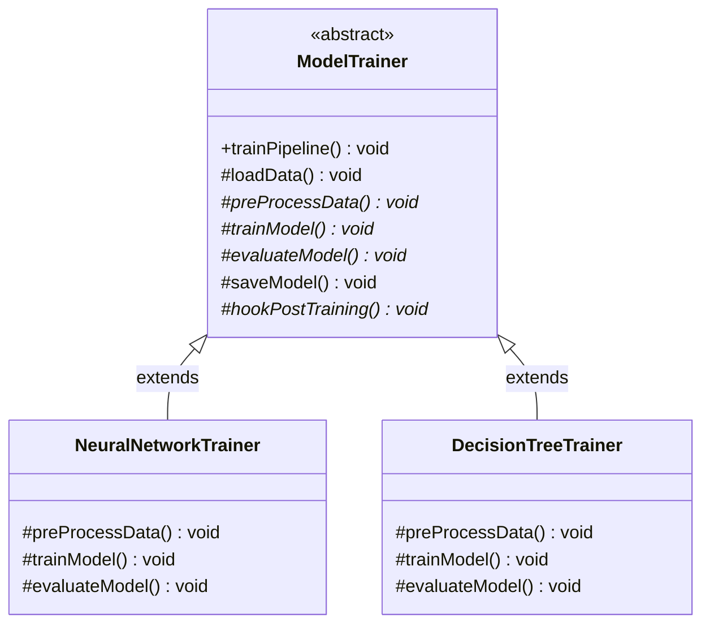

# 20. Template Method Design Pattern

> 💡 **Quick Revision Anchor**
> - **Type:** Behavioral Design Pattern
> - **Core Principle:** Defines the skeleton of an algorithm in a base class method, deferring some steps to subclasses. Subclasses can redefine certain steps of an algorithm without changing the algorithm's overarching structure.
> - **Key Inversion of Control:** Governed by the **Hollywood Principle** — *"Don't call us, we'll call you."* The parent class dictates the execution flow and invokes subclass methods when needed.
> - **Java Rule of Thumb:** Declare the template method as `final` so subclasses cannot override the algorithm's sequence.

---

## 1. Problem

Many real-world algorithms follow an invariant sequence of high-level steps, while specific low-level details differ depending on the variant.

Consider an **AI / Machine Learning Model Training Pipeline**:
Every machine learning workflow must follow an exact sequence:
1. **Load Data** from storage or CSV.
2. **Pre-process Data** (cleaning, normalization, train/test split).
3. **Train Model** (fitting weights, tree splits, or neural network backpropagation).
4. **Evaluate Model** (computing accuracy, precision, recall, or loss).
5. **Save Model** (serializing weights to disk/cloud).

```
[Load Data] ──▶ [Pre-process Data] ──▶ [Train Model] ──▶ [Evaluate Model] ──▶ [Save Model]
```

### The Naive Approach & Its Failure:
If every individual trainer (`NeuralNetworkTrainer`, `DecisionTreeTrainer`, `SVMTrainer`) implements its own training pipeline method from scratch:
- **Order Inconsistency:** One developer might accidentally invoke `train()` before `preProcess()`, or evaluate an unsaved model.
- **Code Duplication:** Steps common to all models (such as default data loading and file serialization) are copied and pasted into every trainer class.
- **Fragile Pipeline Governance:** If a mandatory step is added later (e.g., `auditModelForBias()`), every trainer class across the entire organization must be tracked down and modified manually.

---

## 2. Core Solution: The Template Method

The **Template Method Pattern** solves this by:
1. Placing the fixed sequence of steps inside an abstract base class (`ModelTrainer`).
2. Creating a concrete method (the **Template Method**, e.g., `trainPipeline()`) that calls the step methods in the exact required order.
3. Marking common steps with default implementations in the base class (e.g., standard data loading and saving).
4. Marking variant steps as `abstract` or hooks so concrete subclasses (`NeuralNetworkTrainer`, `DecisionTreeTrainer`) implement only their customized logic.

```
+--------------------------------------------------------+
|                      ModelTrainer                      | (Abstract Base)
+--------------------------------------------------------+
| +trainPipeline()  [final: executes 1 -> 2 -> 3 -> 4 -> 5]
| -loadData()       [concrete / default]                 |
| -preProcessData() [abstract / overridable]             |
| -trainModel()     [abstract]                           |
| -evaluateModel()  [abstract]                           |
| -saveModel()      [concrete / default]                 |
+--------------------------------------------------------+
                           ▲
             ┌─────────────┴─────────────┐
             │                           │
+-------------------------+ +-------------------------+
|  NeuralNetworkTrainer   | |   DecisionTreeTrainer   |
+-------------------------+ +-------------------------+
| +preProcessData()       | | +preProcessData()       |
| +trainModel()           | | +trainModel()           |
| +evaluateModel()        | | +evaluateModel()        |
+-------------------------+ +-------------------------+
```

---

## 3. The Hollywood Principle

The lecture emphasizes that the Template Method pattern is the quintessential representation of the **Hollywood Principle**:
> *"Don't call us; we'll call you."*

- In traditional programming, subclass/client code repeatedly calls library or framework helper methods.
- In the Template Method pattern, **control is inverted**: the high-level base class owns the pipeline and decides **when** and **how** to call the subclass's low-level step implementations.

---

## 4. Architecture & Class Diagram



---

## 5. Java Implementation (Primary Lecture Example)

### Step 1: Abstract Class Defining the Template Method
```java
public abstract class ModelTrainer {

    // The Template Method: marked 'final' so subclasses cannot tamper with the algorithm flow
    public final void trainPipeline() {
        System.out.println("\n--- Initiating Model Training Pipeline ---");
        loadData();
        preProcessData();
        trainModel();
        evaluateModel();
        saveModel();
        hookPostTraining(); // Optional hook
        System.out.println("--- Pipeline Completed Successfully ---");
    }

    // Default common implementation
    protected void loadData() {
        System.out.println("Step 1: Loading raw dataset from cloud storage...");
    }

    // Abstract methods: variants customized by subclasses
    protected abstract void preProcessData();
    protected abstract void trainModel();
    protected abstract void evaluateModel();

    // Default common implementation
    protected void saveModel() {
        System.out.println("Step 5: Serializing and saving trained model artifact to registry.");
    }

    // Hook method: default empty implementation that subclasses may optionally override
    protected void hookPostTraining() {
        // Default: no-op
    }
}
```

---

### Step 2: Concrete Subclass — Neural Network Trainer
```java
public class NeuralNetworkTrainer extends ModelTrainer {

    @Override
    protected void preProcessData() {
        System.out.println("Step 2 (NeuralNet): Normalizing tensors, one-hot encoding, and creating mini-batches.");
    }

    @Override
    protected void trainModel() {
        System.out.println("Step 3 (NeuralNet): Running backpropagation and Adam optimizer over 50 epochs.");
    }

    @Override
    protected void evaluateModel() {
        System.out.println("Step 4 (NeuralNet): Calculating Cross-Entropy Loss and Validation Accuracy.");
    }

    @Override
    protected void hookPostTraining() {
        System.out.println("Hook: Uploading training loss curves to TensorBoard.");
    }
}
```

---

### Step 3: Concrete Subclass — Decision Tree Trainer
```java
public class DecisionTreeTrainer extends ModelTrainer {

    @Override
    protected void preProcessData() {
        System.out.println("Step 2 (DecisionTree): Handling missing categorical values; skipping normalization.");
    }

    @Override
    protected void trainModel() {
        System.out.println("Step 3 (DecisionTree): Splitting nodes using Gini Impurity up to max_depth=10.");
    }

    @Override
    protected void evaluateModel() {
        System.out.println("Step 4 (DecisionTree): Calculating F1-Score and Confusion Matrix on test split.");
    }
}
```

---

### Step 4: Client Execution
```java
public class Main {
    public static void main(String[] args) {
        ModelTrainer nnTrainer = new NeuralNetworkTrainer();
        nnTrainer.trainPipeline();

        ModelTrainer dtTrainer = new DecisionTreeTrainer();
        dtTrainer.trainPipeline();
    }
}
```

### Execution Output:
```text
--- Initiating Model Training Pipeline ---
Step 1: Loading raw dataset from cloud storage...
Step 2 (NeuralNet): Normalizing tensors, one-hot encoding, and creating mini-batches.
Step 3 (NeuralNet): Running backpropagation and Adam optimizer over 50 epochs.
Step 4 (NeuralNet): Calculating Cross-Entropy Loss and Validation Accuracy.
Step 5: Serializing and saving trained model artifact to registry.
Hook: Uploading training loss curves to TensorBoard.
--- Pipeline Completed Successfully ---

--- Initiating Model Training Pipeline ---
Step 1: Loading raw dataset from cloud storage...
Step 2 (DecisionTree): Handling missing categorical values; skipping normalization.
Step 3 (DecisionTree): Splitting nodes using Gini Impurity up to max_depth=10.
Step 4 (DecisionTree): Calculating F1-Score and Confusion Matrix on test split.
Step 5: Serializing and saving trained model artifact to registry.
--- Pipeline Completed Successfully ---
```

---

## 6. Additional Common Example: Payment Processing Flow

### Additional Common Example

In financial transaction systems, the sequence of paying via UPI vs. Credit Card must follow strict regulations:

```java
public abstract class PaymentPipeline {

    // Immutable transaction template
    public final void processTransaction(double amount) {
        validateAccount();
        debitAccount(amount);
        creditBeneficiary(amount);
        generateReceipt();
    }

    protected void validateAccount() {
        System.out.println("Validating account KYC and active status.");
    }

    protected abstract void debitAccount(double amount);
    protected abstract void creditBeneficiary(double amount);

    protected void generateReceipt() {
        System.out.println("Generating encrypted transaction receipt.");
    }
}
```

---

## 7. Template Method vs. Strategy Pattern

| Comparison Dimension | Template Method Pattern | Strategy Pattern |
| :--- | :--- | :--- |
| **Primary Mechanism** | **Inheritance** (Subclassing). | **Composition** (Delegation). |
| **Granularity** | Varies **individual steps** of an algorithm; skeleton remains fixed in parent. | Swaps the **entire algorithm** as an interchangeable unit. |
| **Coupling** | Tighter compile-time coupling to parent class. | Loose runtime coupling via strategy interface. |
| **Modification Ability** | Fixed at compile-time via class hierarchy. | Can be switched dynamically at runtime (`context.setStrategy(...)`). |

---

## 8. Interview Perspective

- **Q: Why must the template method be declared `final` in Java?**
  *A: To prevent child classes from overriding the template method itself and rearranging the algorithmic sequence, which would violate the pattern's core purpose.*
- **Q: What is a "Hook" in Template Method?**
  *A: A hook is a method defined in the base class with default (often empty) behavior. Subclasses are free to override it or ignore it without breaking the pipeline.*
- **Q: What is the Hollywood Principle?**
  *A: "Don't call us, we'll call you." High-level abstract classes govern execution order and invoke concrete subclass methods when required, rather than subclasses controlling the flow.*

---

## 9. Quick Revision

```text
Algorithm Skeleton: Defined in Abstract Parent using a 'final' templateMethod().
Customized Steps: Subclasses override abstract step methods or optional hooks.
Execution: Client calls parent.templateMethod(), guaranteeing uniform execution order.
```
