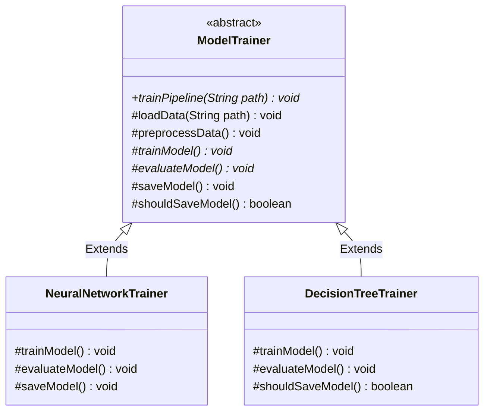

# 20. Template Method Design Pattern

> 💡 **Quick Revision Anchor**: The **Template Method Pattern** is a **behavioral design pattern** that defines the skeleton of an algorithm in a base class, deferring some concrete steps to subclasses. It enforces the **Hollywood Principle** (*"Don't call us, we'll call you"*) without allowing subclasses to alter the fundamental sequence of execution.

---

## 1. Context & Motivation

In many software systems, a complex process must follow a strict, mandatory sequence of stages. 
Consider a **Machine Learning Training Pipeline**:
1. **Load Data**: Read datasets from disk/S3.
2. **Preprocess Data**: Clean nulls, normalize features, train/test split.
3. **Train Model**: Fit algorithmic weights (varies dramatically between Neural Networks, Decision Trees, SVM).
4. **Evaluate Model**: Calculate loss, accuracy, F1-score.
5. **Save Model**: Export serialized weights/checkpoints.

### The Problem without Template Method
If individual developers implement their own training classes from scratch:
- Developer A skips data normalization, causing gradient explosion.
- Developer B trains before splitting data, leaking test data into training sets.
- Developer C forgets to evaluate before saving model artifacts.
- Common code (like loading and saving) is duplicated across dozens of model files.

### The Template Method Solution
Define a `final` template method `trainPipeline()` in an abstract base class `ModelTrainer`. Common steps have default implementations, variant steps are declared `abstract`, and optional steps are provided as **hooks**. Subclasses supply the specialized math while the base class firmly controls the execution pipeline.

---

## 2. The Hollywood Principle & Hook Methods



### Key Architectural Concepts:
1. **The Hollywood Principle (*"Don't call us, we'll call you"*)**:
   - High-level base components decide *when* and *how* low-level components are invoked.
   - Subclasses never directly call the template pipeline; they merely plug in the missing steps when called by the base class.
2. **The `final` Keyword**:
   - The template method itself is marked `final` in Java to prevent subclasses from overriding and breaking the algorithmic sequence.
3. **Hook Methods**:
   - Methods that provide default (often empty or boolean) behavior in the base class (e.g., `boolean shouldSaveModel() { return true; }`).
   - Subclasses can selectively override hooks to conditionally intervene in the algorithm without modifying the pipeline itself.

---

## 3. Production Java Implementation: ML Model Training Pipeline

### Step 1: Abstract Base Class with Template Method
```java
public abstract class ModelTrainer {

    // 1. The Template Method: marked final to lock the algorithm skeleton
    public final void trainPipeline(String dataPath) {
        System.out.println("\n--- Starting Machine Learning Pipeline ---");
        loadData(dataPath);
        preprocessData();
        trainModel();       // Primitive step customized by subclass
        evaluateModel();    // Primitive step customized by subclass

        // Hook: Subclass controls whether model gets persisted
        if (shouldSaveModel()) {
            saveModel();
        } else {
            System.out.println("[Pipeline] Skipped model saving per hook decision.");
        }
        System.out.println("--- Pipeline Completed Successfully ---\n");
    }

    // 2. Common step implemented in base class
    protected void loadData(String path) {
        System.out.println("[Step 1] Loading raw dataset from: " + path);
    }

    // 3. Common data preprocessing step
    protected void preprocessData() {
        System.out.println("[Step 2] Preprocessing: Handling missing values, scaling features, splitting 80/20 train/test.");
    }

    // 4. Abstract primitive operations: MUST be implemented by subclasses
    protected abstract void trainModel();
    protected abstract void evaluateModel();

    // 5. Default save operation (can be overridden if custom serialization is needed)
    protected void saveModel() {
        System.out.println("[Step 5] Serializing model weights to default disk directory.");
    }

    // 6. Hook method: Subclasses can override to alter workflow logic
    protected boolean shouldSaveModel() {
        return true; // Default to saving
    }
}
```

### Step 2: Concrete Implementation 1 — Neural Network
```java
public class NeuralNetworkTrainer extends ModelTrainer {

    @Override
    protected void trainModel() {
        System.out.println("[Step 3 - NeuralNet] Running 100 epochs of Backpropagation with Adam Optimizer.");
    }

    @Override
    protected void evaluateModel() {
        System.out.println("[Step 4 - NeuralNet] Computing Cross-Entropy Loss: 0.042, Accuracy: 98.4%.");
    }

    @Override
    protected void saveModel() {
        System.out.println("[Step 5 - NeuralNet] Exporting weights as PyTorch/ONNX '.pt' tensor file.");
    }
}
```

### Step 3: Concrete Implementation 2 — Decision Tree (Using Hook)
```java
public class DecisionTreeTrainer extends ModelTrainer {
    private final boolean isDraftExperiment;

    public DecisionTreeTrainer(boolean isDraftExperiment) {
        this.isDraftExperiment = isDraftExperiment;
    }

    @Override
    protected void trainModel() {
        System.out.println("[Step 3 - DecisionTree] Calculating Gini Impurity and splitting nodes (max_depth = 8).");
    }

    @Override
    protected void evaluateModel() {
        System.out.println("[Step 4 - DecisionTree] Decision Tree Accuracy: 91.2%, Precision: 89.5%.");
    }

    // Overriding the Hook
    @Override
    protected boolean shouldSaveModel() {
        // Do not persist model artifacts if this is merely a draft test
        return !isDraftExperiment;
    }
}
```

### Step 4: Driver Execution
```java
public class Main {
    public static void main(String[] args) {
        // Run Neural Network Training
        ModelTrainer neuralNet = new NeuralNetworkTrainer();
        neuralNet.trainPipeline("s3://datasets/vision/cifar10.csv");

        // Run Decision Tree Production Experiment
        ModelTrainer treeProd = new DecisionTreeTrainer(false);
        treeProd.trainPipeline("s3://datasets/tabular/credit_risk.csv");

        // Run Decision Tree Draft Experiment (Hook skips saving)
        ModelTrainer treeDraft = new DecisionTreeTrainer(true);
        treeDraft.trainPipeline("s3://datasets/tabular/credit_risk_temp.csv");
    }
}
```

---

## 4. Execution Trace

```text
--- Starting Machine Learning Pipeline ---
[Step 1] Loading raw dataset from: s3://datasets/vision/cifar10.csv
[Step 2] Preprocessing: Handling missing values, scaling features, splitting 80/20 train/test.
[Step 3 - NeuralNet] Running 100 epochs of Backpropagation with Adam Optimizer.
[Step 4 - NeuralNet] Computing Cross-Entropy Loss: 0.042, Accuracy: 98.4%.
[Step 5 - NeuralNet] Exporting weights as PyTorch/ONNX '.pt' tensor file.
--- Pipeline Completed Successfully ---

--- Starting Machine Learning Pipeline ---
[Step 1] Loading raw dataset from: s3://datasets/tabular/credit_risk_temp.csv
[Step 2] Preprocessing: Handling missing values, scaling features, splitting 80/20 train/test.
[Step 3 - DecisionTree] Calculating Gini Impurity and splitting nodes (max_depth = 8).
[Step 4 - DecisionTree] Decision Tree Accuracy: 91.2%, Precision: 89.5%.
[Pipeline] Skipped model saving per hook decision.
--- Pipeline Completed Successfully ---
```

---

## 5. Strategy Pattern vs. Template Method Pattern

| Dimension | Template Method Pattern | Strategy Pattern |
| :--- | :--- | :--- |
| **Mechanism** | **Inheritance** (Subclassing base class). | **Composition** (Delegation to interface). |
| **Granularity** | Varies **parts** of an algorithm; overall structure is fixed. | Swaps the **entire** algorithm interchangeably. |
| **Binding Time** | **Compile-time** (Static via inheritance). | **Runtime** (Dynamic object swapping). |
| **Class Coupling** | Tighter (subclasses bound to base class lifecycle). | Loose (independent strategy classes). |

---

## 6. Real-World Applications & Interview Gotchas

1. **Java Frameworks & Libraries**:
   - `javax.servlet.http.HttpServlet`: Defines `service()` (template method) which orchestrates `doGet()`, `doPost()`, `doPut()`.
   - `java.io.InputStream`: Template method `read(byte[] b, int off, int len)` calls primitive abstract `read()`.
   - **Spring Framework**: `JdbcTemplate`, `AbstractController`.
2. **Interview Best Practices**:
   - Always make the template method `final` in Java or C++ non-virtual to protect algorithmic integrity.
   - Keep primitive abstract methods `protected` so external clients cannot bypass the template method and invoke isolated steps out-of-order.
