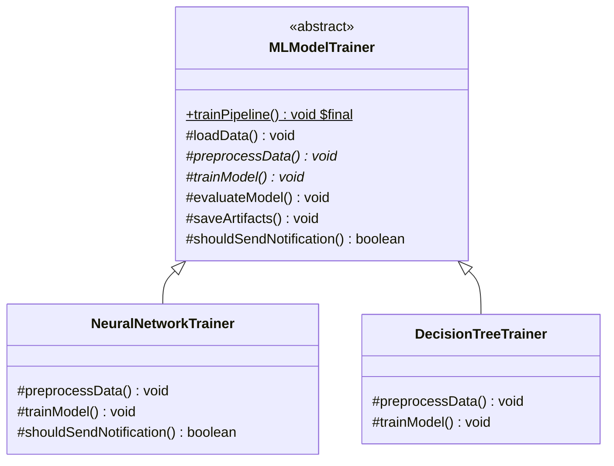

# 20. Template Method Pattern

> 💡 **Quick Revision Anchor**: 
> - **Type**: Behavioral Design Pattern.
> - **Core Intent**: Defines the **fixed skeleton of an algorithm** in a base class, while deferring specific steps to subclasses without altering the algorithm's overarching structure.
> - **Architectural Motto**: The **Hollywood Principle**: *"Don't call us, we'll call you."* (The superclass controls the workflow and calls child methods).

---

## 1. Context & Motivation

Imagine building an **End-to-End Machine Learning Model Training Pipeline**:
Every machine learning workflow follows a mandatory, invariant series of phases:
1. `loadDataset()`: Reading raw CSV / Parquet records from S3.
2. `preprocessData()`: Data cleaning, normalization, and one-hot encoding.
3. `trainModel()`: The actual mathematical training algorithm (e.g. Neural Network backpropagation vs Decision Tree splitting).
4. `evaluatePerformance()`: Calculating Precision, Recall, and F1-score.
5. `saveModel()`: Persisting weights to artifact storage.
6. Optional Hook: `sendNotification()`: Sending a Slack alert if training succeeds.

### The Code Duplication Anti-Pattern:
If each team (`ComputerVisionTeam`, `NLPTeam`, `FraudDetectionTeam`) implements their own separate training classes from scratch, 80% of the workflow (data loading, evaluation metrics, artifact saving) is copy-pasted and prone to diverging bugs.
If someone forgets to run data validation before training, the job fails 5 hours later.

---

## 2. Template Method Architecture



### The 3 Types of Methods in a Template Class:
1. **The Template Method itself (`trainPipeline()`)**: Marked `final` so subclasses cannot tamper with or reorder the invariant algorithm steps.
2. **Abstract Steps (`preprocessData()`, `trainModel()`)**: Primitive operations that **must** be implemented by specific subclasses.
3. **Concrete Default Steps (`loadData()`, `evaluateModel()`)**: Reusable operations shared identically by all subclasses.
4. **Hook Methods (`shouldSendNotification()`)**: Default empty or boolean methods that subclasses **can optionally override** to plug into the algorithm at specific extension points.

---

## 3. Production Java Implementation

```java
// Abstract Superclass containing the Template Method
public abstract class MLModelTrainer {

    // 1. The Template Method: Marked final to freeze the algorithm structure!
    public final void trainPipeline(String datasetPath) {
        System.out.println("\n🚀 Starting ML Training Pipeline for: " + datasetPath);
        loadData(datasetPath);
        preprocessData(); // Abstract step
        trainModel();     // Abstract step
        evaluateModel();
        saveArtifacts();

        // 2. Hook execution
        if (shouldSendNotification()) {
            sendSlackNotification();
        }
        System.out.println("✅ Pipeline completed successfully.\n");
    }

    // Common invariant step: Shared by all algorithms
    private void loadData(String path) {
        System.out.println("📥 [Step 1] Loading raw dataset from: " + path);
    }

    // Abstract primitive step: Subclass must provide data transformations
    protected abstract void preprocessData();

    // Abstract primitive step: Subclass must provide core training math
    protected abstract void trainModel();

    // Common invariant step: Standard evaluation metrics
    private void evaluateModel() {
        System.out.println("📊 [Step 4] Evaluating model: Accuracy=94.2%, F1-Score=0.91");
    }

    // Common invariant step: S3 artifact persistence
    private void saveArtifacts() {
        System.out.println("💾 [Step 5] Serializing model weights to AWS S3 bucket.");
    }

    // Hook Method: Default behavior is false; subclasses can override!
    protected boolean shouldSendNotification() {
        return false;
    }

    private void sendSlackNotification() {
        System.out.println("📢 [Hook Alert] Dispatching Slack alert: Training finished!");
    }
}

// Concrete Implementation 1: Deep Learning Neural Network
public class NeuralNetworkTrainer extends MLModelTrainer {
    @Override
    protected void preprocessData() {
        System.out.println("🔄 [Step 2] Resizing images to 224x224 and normalizing RGB tensors to [-1, 1].");
    }

    @Override
    protected void trainModel() {
        System.out.println("🧠 [Step 3] Training Deep Convolutional Neural Network via Adam Optimizer over 50 Epochs.");
    }

    // Overriding hook to enable alerts for long-running deep learning jobs
    @Override
    protected boolean shouldSendNotification() {
        return true;
    }
}

// Concrete Implementation 2: Decision Tree / Random Forest
public class DecisionTreeTrainer extends MLModelTrainer {
    @Override
    protected void preprocessData() {
        System.out.println("🔄 [Step 2] Imputing missing tabular values and applying One-Hot Encoding.");
    }

    @Override
    protected void trainModel() {
        System.out.println("🌲 [Step 3] Fitting Random Forest of 200 trees with Gini Impurity split.");
    }
    // Uses default hook (no Slack alert)
}
```

### Demonstration Execution:
```java
public class TemplateMethodDemo {
    public static void main(String[] args) {
        // Deep learning training
        MLModelTrainer cnn = new NeuralNetworkTrainer();
        cnn.trainPipeline("s3://bucket/imagenet_data");

        // Tabular Random Forest training
        MLModelTrainer rf = new DecisionTreeTrainer();
        rf.trainPipeline("s3://bucket/customer_churn.csv");
    }
}
```

---

## 4. The Hollywood Principle Explained

> *"Don't call us, we'll call you."*

- In traditional procedural code, your custom code calls library routines whenever it needs them (e.g. `Math.sqrt()`).
- In the **Template Method Pattern**, the **framework/superclass calls your code**. The superclass dictates *when* and *in what order* methods are executed, while the subclass merely provides the custom pieces of the puzzle.

---

## 5. Template Method vs. Strategy Pattern

| Feature | Template Method Pattern | Strategy Pattern |
| :--- | :--- | :--- |
| **Mechanism** | Uses **Inheritance** (Subclassing). | Uses **Composition** (Delegation). |
| **Algorithm Variation** | Varies **individual steps** of a fixed algorithm. | Varies the **entire algorithm** as a black box. |
| **Runtime Swapping** | **No**. Decided at compile time by class instantiation. | **Yes**. Swappable dynamically at runtime via setters. |
| **Granularity** | Fine-grained (shared skeleton with custom steps). | Coarse-grained (completely independent strategies). |
