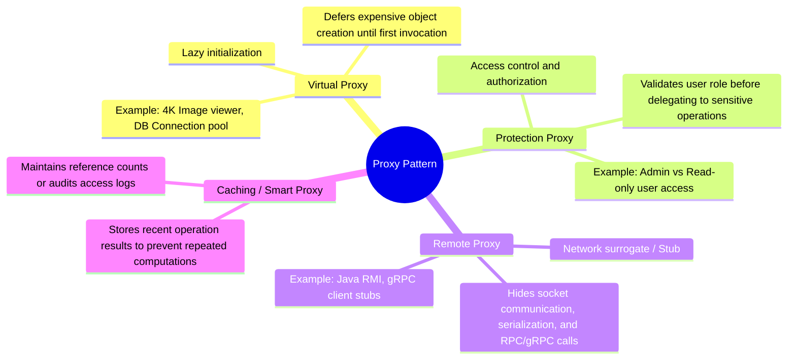
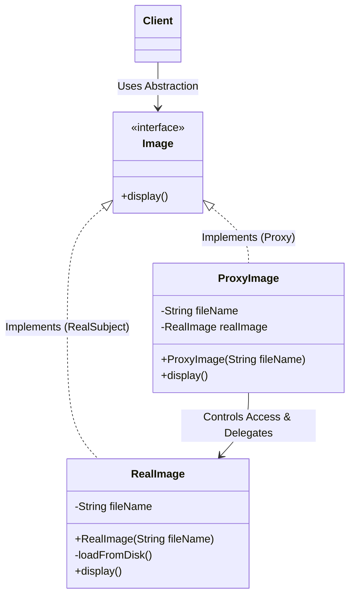

# 21. Proxy Design Pattern

> 💡 **Quick Revision Anchor**: The **Proxy Pattern** is a **structural design pattern** that provides a surrogate or placeholder object that controls access to another object (the RealSubject). The Proxy and RealSubject implement the **exact same interface**, allowing the proxy to transparently intercept, validate, lazily load, or cache calls before delegating to the target.

---

## 1. Context & Motivation

Imagine working with an image viewer application that loads an album containing thousands of high-resolution 4K images:
- **Without Proxy**: Instantiating all image objects immediately triggers network downloads or disk I/O for gigabytes of image bitmaps into RAM. The application hangs or crashes with `OutOfMemoryError` even if the user only views the first two photos.
- **With Proxy**: We instantiate lightweight **Proxy** objects that only store metadata (file path, dimensions). The heavy `RealImage` is only instantiated and loaded into RAM on demand when the user scrolls to and calls `display()`.

---

## 2. Core Taxonomy: The 4 Types of Proxies



---

## 3. Proxy Architecture & UML



### The 3 Key Participants:
1. **Subject Interface (`Image`)**: Common contract implemented by both `RealImage` and `ProxyImage`.
2. **RealSubject (`RealImage`)**: The real, heavyweight underlying object doing the actual work.
3. **Proxy (`ProxyImage`)**: Maintains a reference to the RealSubject. Controls its lifecycle (lazy creation), performs checks, and delegates calls.

---

## 4. Production Java Implementation

### Case A: Virtual Proxy (Lazy Loading Heavy 4K Image)

```java
// Subject Interface
public interface Image {
    void display();
}

// RealSubject: Heavy object with expensive disk/network initialization
public class RealImage implements Image {
    private final String fileName;

    public RealImage(String fileName) {
        this.fileName = fileName;
        loadFromDisk(); // Expensive simulated loading
    }

    private void loadFromDisk() {
        System.out.println("[Disk I/O] Loading high-resolution 4K bitmap: " + fileName + " (takes 300ms)...");
    }

    @Override
    public void display() {
        System.out.println("[Rendering] Displaying image on canvas: " + fileName);
    }
}

// Virtual Proxy: Defers RealImage loading until display() is invoked
public class ProxyImage implements Image {
    private final String fileName;
    private RealImage realImage; // Lazy reference

    public ProxyImage(String fileName) {
        this.fileName = fileName;
        System.out.println("[ProxyImage] Proxy created for: " + fileName + " (Zero disk I/O, Instantaneous)");
    }

    @Override
    public void display() {
        // Lazy Loading: Instantiated only on first actual demand
        if (realImage == null) {
            System.out.println("[ProxyImage] First display request -> Initializing RealImage now.");
            realImage = new RealImage(fileName);
        }
        realImage.display();
    }
}
```

---

### Case B: Protection Proxy (Role-Based Access Control)

```java
// RealSubject Interface
public interface DatabaseExecutor {
    void executeQuery(String sql, String userRole) throws SecurityException;
}

// Real Database Executor
public class RealDatabaseExecutor implements DatabaseExecutor {
    @Override
    public void executeQuery(String sql, String userRole) {
        System.out.println("[Database Server] Executing SQL: " + sql + " on production tables.");
    }
}

// Protection Proxy: Intercepts and validates role permissions
public class DatabaseSecurityProxy implements DatabaseExecutor {
    private final RealDatabaseExecutor realExecutor = new RealDatabaseExecutor();

    @Override
    public void executeQuery(String sql, String userRole) {
        String trimmed = sql.trim().toUpperCase();
        if (trimmed.startsWith("DELETE") || trimmed.startsWith("DROP") || trimmed.startsWith("TRUNCATE")) {
            if (!"ADMIN".equalsIgnoreCase(userRole)) {
                System.err.println("[SECURITY ALERT] Unauthorized query blocked: " + sql + " by user role: " + userRole);
                throw new SecurityException("Permission Denied: Destructive operations require ADMIN privileges.");
            }
        }
        // Allowed: delegate to real database
        realExecutor.executeQuery(sql, userRole);
    }
}
```

---

### Step 3: Test Driver
```java
public class Main {
    public static void main(String[] args) {
        System.out.println("=== 1. VIRTUAL PROXY DEMONSTRATION ===");
        // Fast instant creation of proxies (gallery view)
        Image photo1 = new ProxyImage("nature_4k.raw");
        Image photo2 = new ProxyImage("profile_portrait.png");

        System.out.println("\nUser scrolls down to photo 1...");
        photo1.display(); // Loads on demand

        System.out.println("\nUser views photo 1 again (Cached in memory)...");
        photo1.display(); // Reuses already-loaded instance

        System.out.println("\n=== 2. PROTECTION PROXY DEMONSTRATION ===");
        DatabaseExecutor dbProxy = new DatabaseSecurityProxy();

        // Safe query by normal user
        dbProxy.executeQuery("SELECT * FROM users WHERE id = 10", "GUEST");

        // Destructive query by ADMIN (Allowed)
        dbProxy.executeQuery("DELETE FROM audit_logs WHERE timestamp < NOW()", "ADMIN");

        // Destructive query by standard user (Rejected)
        try {
            dbProxy.executeQuery("DROP TABLE accounts", "USER");
        } catch (SecurityException e) {
            System.out.println("[Client Handled Exception]: " + e.getMessage());
        }
    }
}
```

---

## 5. Execution Output

```text
=== 1. VIRTUAL PROXY DEMONSTRATION ===
[ProxyImage] Proxy created for: nature_4k.raw (Zero disk I/O, Instantaneous)
[ProxyImage] Proxy created for: profile_portrait.png (Zero disk I/O, Instantaneous)

User scrolls down to photo 1...
[ProxyImage] First display request -> Initializing RealImage now.
[Disk I/O] Loading high-resolution 4K bitmap: nature_4k.raw (takes 300ms)...
[Rendering] Displaying image on canvas: nature_4k.raw

User views photo 1 again (Cached in memory)...
[Rendering] Displaying image on canvas: nature_4k.raw

=== 2. PROTECTION PROXY DEMONSTRATION ===
[Database Server] Executing SQL: SELECT * FROM users WHERE id = 10 on production tables.
[Database Server] Executing SQL: DELETE FROM audit_logs WHERE timestamp < NOW() on production tables.
[SECURITY ALERT] Unauthorized query blocked: DROP TABLE accounts by user role: USER
[Client Handled Exception]: Permission Denied: Destructive operations require ADMIN privileges.
```

---

## 6. Comparison: Proxy vs. Adapter vs. Decorator

| Dimension | Proxy Pattern | Adapter Pattern | Decorator Pattern |
| :--- | :--- | :--- | :--- |
| **Interface** | **Identical** to the RealSubject. | **Different** interface adapted to match Target. | **Identical** or extended interface. |
| **Primary Intent** | **Controls access** or lifecycle of target. | **Translates** between incompatible APIs. | **Enriches functionality** without subclassing. |
| **Lifecycle Control** | Often instantiates or manages target object internally. | Wraps an existing object passed from outside. | Wraps an existing object passed via constructor. |

---

## 7. Real-World Applications & Interview Checklist

1. **Spring AOP & Hibernate**:
   - **Hibernate Lazy Loading**: When fetching an entity with `@ManyToOne(fetch = FetchType.LAZY)`, Hibernate returns a CGLIB/ByteBuddy **proxy** object. Database queries fire only when you call a getter like `order.getCustomer().getName()`.
   - **Spring Transactions (`@Transactional`)**: Spring injects a dynamic proxy around your service class that manages `connection.beginTransaction()` and `commit()` before and after your method.
2. **Reverse Proxies (System Design)**:
   - NGINX and Cloudflare act as reverse proxies to real backend servers, handling SSL termination, DDoS protection, rate limiting, and caching.
