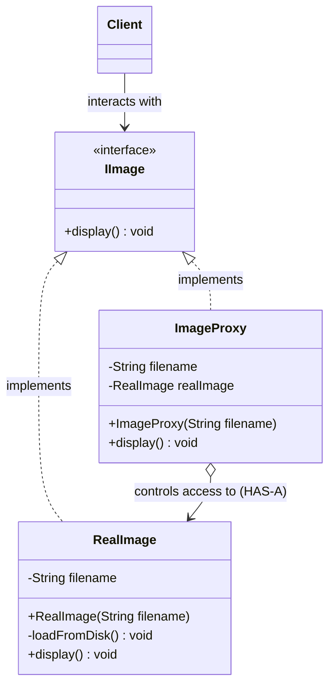

# 21. Proxy Design Pattern

> 💡 **Quick Revision Anchor**
> - The **Proxy Pattern** provides a placeholder or surrogate object that controls, filters, or optimizes access to another target object (**RealSubject**).
> - Key Invariant: Both **Proxy** and **RealSubject** implement the exact same interface; the client interacts with the proxy transparently.
> - The 3 Core Variants:
>   1. **Virtual Proxy:** Defers expensive object instantiation until actual usage (Lazy Loading).
>   2. **Protection Proxy:** Enforces authorization, permissions, and security checks before delegation.
>   3. **Remote Proxy:** Manages communication over network protocols (RPC/HTTP), acting as a local representative.

---

## 1. What Problem Are We Solving?

Direct access to an object is not always desirable or efficient:
1. **Expensive Object Creation:** An image rendering service might load huge 50 MB RAW image files from disk and decompress pixels in memory inside its constructor. If a user opens a gallery of 50 photos, instantiating all 50 upfront hangs the application and consumes 2.5 GB of RAM immediately, even if the user only views the first photo.
2. **Security & Permissions:** Directly handing out domain object references allows any caller to invoke sensitive actions (e.g., `deleteUser()`) without credential validation.
3. **Network Overhead:** In distributed systems, client code should not be burdened with sockets, HTTP connections, and serialization logic every time it interacts with a remote service.

---

## 2. Key Design Idea: The Intercepting Proxy

Introduce an intermediate **Proxy** class that:
- Implements the exact same interface as the target (`IImage`).
- Holds a reference to the `RealSubject` (**HAS-A**).
- Intercepts method calls to perform checks, lazy instantiation, or security audits before forwarding the request.

```
┌──────────┐              ┌────────────────┐              ┌────────────────┐
│  Client  │ ──calls──▶   │   ImageProxy   │ ──delegates─▶│   RealImage    │
│          │  display()   │ (Checks/Loads) │   on demand  │  (Heavy Work)  │
└──────────┘              └────────────────┘              └────────────────┘
```

---

## 3. Visual Architecture



---

## 4. Concise Java Implementation (Primary Lecture Example)

```java
// ==========================================
// 1. SUBJECT INTERFACE
// ==========================================
interface IImage {
    void display();
}

// ==========================================
// 2. REALSUBJECT (Heavyweight Initialization)
// ==========================================
class RealImage implements IImage {
    private final String filename;

    public RealImage(String filename) {
        this.filename = filename;
        loadFromDisk(); // Expensive disk I/O at instantiation
    }

    private void loadFromDisk() {
        System.out.println("💾 [Disk I/O] Loading heavy image: " + filename + " (Takes 2000ms, 50MB RAM)");
    }

    @Override
    public void display() {
        System.out.println("🖼️ Displaying image on screen: " + filename);
    }
}

// ==========================================
// 3. VIRTUAL PROXY (Lazy Loading)
// ==========================================
class ImageProxy implements IImage {
    private final String filename;
    private RealImage realImage; // Instantiated only on demand

    public ImageProxy(String filename) {
        this.filename = filename; // Instant: No disk read here!
    }

    @Override
    public void display() {
        // Lazy initialization
        if (realImage == null) {
            System.out.println("Proxy: First access detected. Initializing RealImage...");
            realImage = new RealImage(filename);
        }
        realImage.display();
    }
}

// ==========================================
// 4. PROTECTION PROXY (Access Control)
// ==========================================
interface DocumentService {
    void deleteDocument(String docId);
}

class RealDocumentService implements DocumentService {
    @Override public void deleteDocument(String docId) {
        System.out.println("Document " + docId + " deleted successfully.");
    }
}

class DocumentSecurityProxy implements DocumentService {
    private final RealDocumentService realService = new RealDocumentService();
    private final String userRole;

    public DocumentSecurityProxy(String userRole) {
        this.userRole = userRole;
    }

    @Override
    public void deleteDocument(String docId) {
        if (!"ADMIN".equalsIgnoreCase(userRole)) {
            System.out.println("❌ Access Denied: User role '" + userRole + "' cannot delete documents.");
            return;
        }
        realService.deleteDocument(docId);
    }
}

// ==========================================
// Driver Demonstration
// ==========================================
public class Main {
    public static void main(String[] args) {
        // Virtual Proxy Demo
        IImage photo1 = new ImageProxy("high_res_photo_1.raw");
        System.out.println("Proxy created. Zero memory overhead so far.\n");

        System.out.println("User views Photo 1 (First time):");
        photo1.display(); // Loads from disk

        System.out.println("\nUser views Photo 1 (Second time):");
        photo1.display(); // Uses cached RealImage, zero reload!

        // Protection Proxy Demo
        System.out.println("\n--- Protection Proxy ---");
        DocumentService guestService = new DocumentSecurityProxy("GUEST");
        guestService.deleteDocument("DOC-101"); // Blocked

        DocumentService adminService = new DocumentSecurityProxy("ADMIN");
        adminService.deleteDocument("DOC-101"); // Allowed
    }
}
```

---

## 5. Proxy vs. Decorator vs. Adapter vs. Facade

| Pattern | Interface Relationship | Core Intent / Purpose |
| :--- | :--- | :--- |
| **Proxy** | **Same interface** | **Controls access** (lazy initialization, auth, remote network, caching). |
| **Decorator** | **Same interface** | **Enhances behavior** dynamically without altering the class. |
| **Adapter** | **Different interface** | **Translates** an incompatible interface into an expected target interface. |
| **Facade** | **Different interface (Simplified)** | **Simplifies** a multi-class subsystem behind a unified interface. |

> 🔑 **Proxy vs. Decorator**: Both implement the same interface and wrap an object. The difference is **intent**: Decorator adds new features/responsibilities; Proxy controls *when* or *if* the underlying object is accessed.

---

## 6. Interview Questions & Key Discussion Points

1. **How is the Proxy Pattern used in the Spring Framework?**
   - *Answer*: Spring AOP heavily relies on dynamic proxies (JDK Dynamic Proxies or CGLIB) to wrap service beans, enabling cross-cutting concerns like `@Transactional` boundary management, `@PreAuthorize` security checks, and logging without polluting domain classes.
2. **What is a Remote Proxy?**
   - *Answer*: A Remote Proxy acts as a local representative for an object that lives in another address space (e.g., across a network in a microservice). It abstracts away network communication, socket handling, and payload serialization so clients make remote calls like local method calls.
3. **What are the trade-offs of using Proxies?**
   - *Answer*: Introduces extra indirection and minor latency overhead. In Virtual Proxies, multiple concurrent threads calling `display()` simultaneously might trigger race conditions if initialization is not synchronized properly.

---

## 7. Quick Revision

### Core Idea
Proxy acts as an intermediary with the same interface as the target, controlling access to the real object for lazy loading, security, or remote communication.

### Remember
- **3 Variants:** Virtual (lazy load), Protection (permissions), Remote (network RPC).
- **Key Invariant:** `Proxy` and `RealSubject` implement the same `Subject` interface.
- **Comparison:** Proxy = *access control*; Decorator = *behavior enhancement*; Adapter = *interface translation*.
