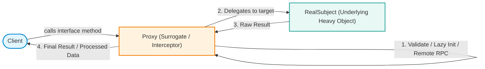
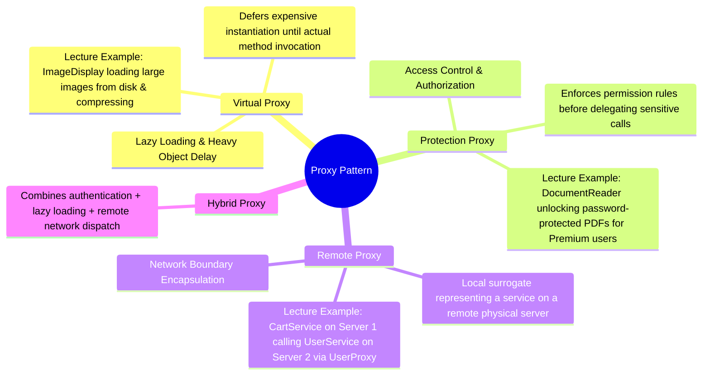
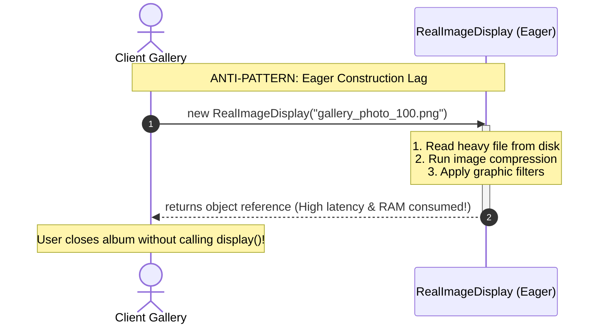
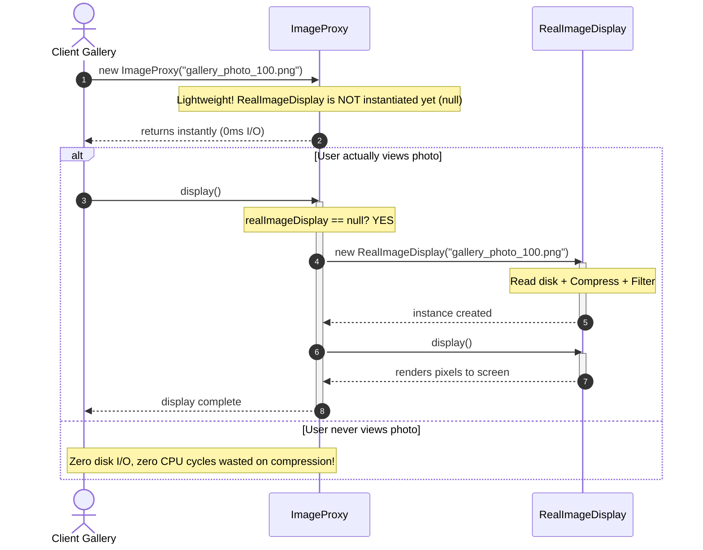
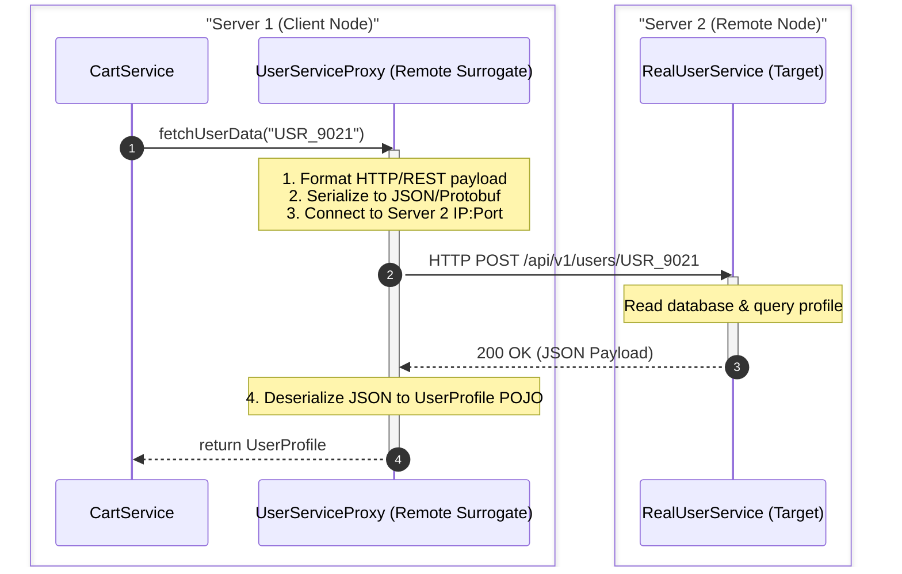
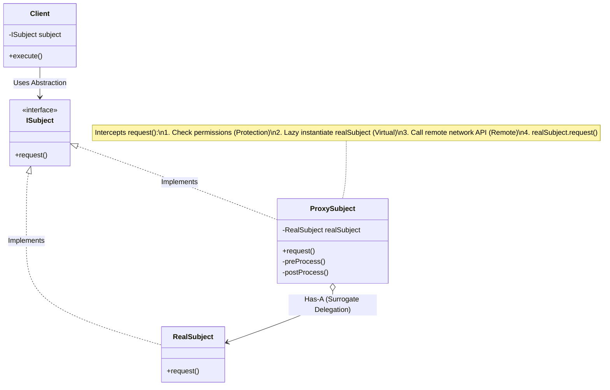

# 21. Proxy Design Pattern

> 💡 **Quick Revision Anchor**: The **Proxy Design Pattern** is a **structural pattern** that provides a **surrogate or placeholder (middleman)** for another object to control, manage, and intercept access to it. Both the `Proxy` and the `RealSubject` implement the **identical interface**, making the proxy completely transparent to the client. Proxies are fundamentally used for **lazy loading heavy resources (Virtual Proxy)**, **access control and authorization (Protection Proxy)**, and **remote network encapsulation (Remote Proxy)**.

---

## 1. Executive Summary & Transcript Overview

In enterprise software engineering, directly granting client code unimpeded access to an underlying object often creates severe architectural, performance, and security problems:
1. **Heavy Resource Initialization**: An object may require expensive operations during creation (e.g., loading large bitmap images from disk, uncompressing media files, establishing heavy socket connections). If clients instantiate objects eagerly without immediately using them, memory overflows and latency spikes occur.
2. **Access Control & Security**: Certain operations (e.g., unlocking encrypted documents, modifying account balances, running premium features) must only be accessible to authorized users. Embedding permission checks inside business classes violates the Single Responsibility Principle.
3. **Distributed Communication**: When target services run on remote servers across the network (e.g., microservices communicating over HTTP/gRPC), client components should not be burdened with network sockets, serialization, IP lookups, or retry policies.

The **Proxy Pattern** solves these challenges by introducing an intermediate surrogate object. The proxy intercepts all client requests, performs necessary pre-processing (permission verification, lazy initialization, caching, network transmission), delegates to the real object, and performs post-processing before returning the result.



---

## 2. The Core Proxy Taxonomy Taught in the Lecture

The lecture examines three fundamental variations of the Proxy Pattern, showing how a single structural design cleanly addresses three completely distinct architectural requirements:



---

## 3. Deep Dive 1: Virtual Proxy (Lazy Loading Heavy Image Display)

### The Problem in the Lecture
Consider a media viewer application featuring an image display component:
- When an `ImageDisplay` instance is created, its constructor takes an image `path`.
- In its constructor, it executes expensive operations:
  1. Loads raw image bytes from disk or remote file server.
  2. Executes complex compression algorithms to fit the image into UI dimensions.
  3. Applies rendering filters.
- **The Pitfall**: If a gallery loads 100 images upon opening, 100 heavy objects are constructed immediately in memory. The UI freezes for seconds, consuming gigabytes of RAM—even if the user only views the first two photos and closes the screen!



### The Virtual Proxy Solution
Instead of letting the client instantiate `RealImageDisplay` directly, we introduce an `IDisplay` interface and an `ImageProxy`:
- `ImageProxy` implements `IDisplay` and accepts the `path` in its constructor.
- Inside `ImageProxy`'s constructor, **no expensive object is created**; it simply stores the file path and sets `realImageDisplay = null`.
- Only when the client actually invokes `display()` does the proxy check:
  $$\text{if } (\text{realImageDisplay} == \text{null}) \implies \text{realImageDisplay} = \text{new RealImageDisplay(path)}$$
- Once created, it delegates `realImageDisplay.display()`. Subsequent calls reuse the already instantiated real object.



---

## 4. Deep Dive 2: Protection Proxy (Access Control & PDF Unlock)

### The Problem in the Lecture
Consider a document reader application (`IDocumentReader`) with a high-value method:
```java
void unlockPdf(String filePath, String password);
```
- Unlocking encrypted PDFs uses proprietary decryption algorithms reserved exclusively for **Premium Subscribers**.
- Standard/Free users must be blocked and informed to upgrade.
- Placing `if (user.isPremium())` checks inside the core `RealDocumentReader` pollutes document rendering logic with billing/user authorization logic, violating SRP and OCP.

### The Protection Proxy Solution
- Define `DocumentReaderProxy` implementing `IDocumentReader`.
- The proxy holds a reference to the active `User` object (which exposes `user.isPremium()`) and a reference to `RealDocumentReader`.
- When `unlockPdf(file, password)` is called on the proxy:
  1. The proxy inspects `user.isPremium()`.
  2. If `true`: It delegates to `realDocumentReader.unlockPdf(file, password)`.
  3. If `false`: It rejects the request immediately, throwing a `SecurityException` or logging an unauthorized access attempt without executing any decryption algorithms.

```mermaid
flowchart TD
    Client([Client Application]) -->|unlockPdf(file, pwd)| Proxy["DocumentReaderProxy"]
    Proxy --> Check{"user.isPremium() == true?"}
    Check -- No --> Deny["Throw SecurityException:<br/>'Feature available only for Premium subscribers!'"]
    Check -- Yes --> Delegate["Delegate to RealDocumentReader.unlockPdf(file, pwd)"]
    Delegate --> RealDoc["Execute Decryption & Render PDF"]

    style Proxy fill:#fff3e0,stroke:#f57c00,stroke-width:2px
    style Deny fill:#ffebee,stroke:#c62828,stroke-width:2px
    style RealDoc fill:#e8f8f5,stroke:#26a69a,stroke-width:2px
```

---

## 5. Deep Dive 3: Remote Proxy (Microservices & Network RPC)

### The Problem in the Lecture
In modern distributed microservice architectures:
- **Server 1** hosts a `CartService`.
- **Server 2** hosts a `UserService` that manages user profiles and addresses.
- When `CartService` needs user information to calculate shipping, it must communicate across the network to Server 2.
- If `CartService` business logic is filled with socket handlers, HTTP client configuration, URL formatting, JSON serialization, and status code checks, code maintainability degrades completely.

### The Remote Proxy Solution
- Define a common service interface `IUserService` with method `UserProfile fetchUserData(String userId)`.
- `CartService` on Server 1 depends strictly on `IUserService`.
- We inject a local `UserServiceProxy` into `CartService`.
- To `CartService`, `UserServiceProxy` looks like a normal local Java object.
- Internally, `UserServiceProxy`:
  1. Serializes the request into a network packet (HTTP/REST or gRPC).
  2. Dispatches the packet across the network to Server 2's IP and port.
  3. Awaits the response from `RealUserService` running on Server 2.
  4. Deserializes the payload into a `UserProfile` object and returns it to `CartService`.



---

## 6. Standard GoF Proxy Architecture & UML

The classic Gang of Four (GoF) structural design applies seamlessly to all three proxy types:



### Key Participants and Responsibilities
| Participant | Role in Architecture |
| :--- | :--- |
| **`ISubject`** | The common interface shared by both `RealSubject` and `Proxy`. Enables the client to interact with the proxy transparently without knowing an intermediary exists. |
| **`RealSubject`** | The real underlying business object performing the heavy, sensitive, or remote computation. |
| **`Proxy`** | Maintains a reference (`has-a`) to `RealSubject`. Controls its lifecycle, restricts unauthorized access, or translates network calls. |
| **`Client`** | Holds a reference typed to `ISubject`. Operates entirely through polymorphic calls. |

---

## 7. Complete, Compilable Java Implementation

Below is the complete, self-contained Java code directly reflecting the instructor's three lecture designs.

```java
package com.designpatterns.proxy;

// ============================================================================
// PART 1: VIRTUAL PROXY (LAZY LOADING IMAGE DISPLAY)
// ============================================================================

/**
 * Common subject interface for displaying graphic resources.
 */
interface IDisplay {
    void display();
}

/**
 * RealSubject: Performs heavy file loading, compression, and filtering
 * during construction.
 */
class RealImageDisplay implements IDisplay {
    private final String imagePath;

    public RealImageDisplay(String imagePath) {
        this.imagePath = imagePath;
        loadAndProcessImageFromDisk(); // Expensive operation!
    }

    private void loadAndProcessImageFromDisk() {
        System.out.println("  [Disk I/O] Loading image bytes from path: " + imagePath);
        System.out.println("  [CPU Intensive] Applying decompression algorithm...");
        System.out.println("  [CPU Intensive] Applying color contrast filters...");
    }

    @Override
    public void display() {
        System.out.println(">> [Screen Render] Displaying image on viewport: " + imagePath);
    }
}

/**
 * Virtual Proxy: Defers RealImageDisplay creation until display() is invoked.
 */
class ImageProxy implements IDisplay {
    private final String imagePath;
    private RealImageDisplay realImageDisplay; // Initially null

    public ImageProxy(String imagePath) {
        this.imagePath = imagePath;
        // Notice: No disk I/O, no heavy CPU work done here!
    }

    @Override
    public void display() {
        // Lazy Initialization check
        if (realImageDisplay == null) {
            System.out.println("[ImageProxy] First display request received. Instantiating RealImageDisplay now...");
            realImageDisplay = new RealImageDisplay(imagePath);
        } else {
            System.out.println("[ImageProxy] Reusing cached RealImageDisplay instance.");
        }
        realImageDisplay.display();
    }
}

// ============================================================================
// PART 2: PROTECTION PROXY (ACCESS CONTROL & PDF UNLOCK)
// ============================================================================

/**
 * User domain entity representing the caller and their subscription tier.
 */
class User {
    private final String name;
    private final boolean isPremium;

    public User(String name, boolean isPremium) {
        this.name = name;
        this.isPremium = isPremium;
    }

    public String getName() {
        return name;
    }

    public boolean isPremium() {
        return isPremium;
    }
}

/**
 * Subject interface for document operations.
 */
interface IDocumentReader {
    void unlockPdf(String filePath, String password);
}

/**
 * RealSubject: Contains sensitive PDF decryption algorithm.
 */
class RealDocumentReader implements IDocumentReader {
    @Override
    public void unlockPdf(String filePath, String password) {
        System.out.println(">> [Security Engine] Decrypting 256-bit AES PDF: " + filePath 
                           + " with key hash. Document unlocked successfully!");
    }
}

/**
 * Protection Proxy: Intercepts unlock requests and checks user subscription status.
 */
class DocumentReaderProxy implements IDocumentReader {
    private final User user;
    private final RealDocumentReader realReader;

    public DocumentReaderProxy(User user) {
        this.user = user;
        this.realReader = new RealDocumentReader();
    }

    @Override
    public void unlockPdf(String filePath, String password) {
        System.out.println("[DocumentReaderProxy] Verifying permissions for user: " + user.getName());
        if (!user.isPremium()) {
            throw new SecurityException("Access Denied: User '" + user.getName() 
                                       + "' does not have a Premium subscription. PDF unlock is locked!");
        }
        System.out.println("[DocumentReaderProxy] User authorized. Forwarding to RealDocumentReader...");
        realReader.unlockPdf(filePath, password);
    }
}

// ============================================================================
// PART 3: REMOTE PROXY (MICROSERVICE COMMUNICATION SURROGATE)
// ============================================================================

/**
 * Shared DTO for user information.
 */
class UserProfile {
    private final String userId;
    private final String name;
    private final String deliveryCity;

    public UserProfile(String userId, String name, String deliveryCity) {
        this.userId = userId;
        this.name = name;
        this.deliveryCity = deliveryCity;
    }

    @Override
    public String toString() {
        return "UserProfile[ID=" + userId + ", Name=" + name + ", City=" + deliveryCity + "]";
    }
}

/**
 * Common service interface across distributed nodes.
 */
interface IUserService {
    UserProfile fetchUserData(String userId);
}

/**
 * RealSubject on Remote Server 2: Talks to internal database.
 */
class RealUserService implements IUserService {
    @Override
    public UserProfile fetchUserData(String userId) {
        System.out.println("  [Server 2 Database] Executing SQL Query for user: " + userId);
        return new UserProfile(userId, "Aditya Sharma", "Bangalore");
    }
}

/**
 * Remote Proxy on Local Server 1: Hides network protocol, serialization, and RPC.
 */
class UserServiceProxy implements IUserService {
    private final String remoteServerUrl;
    // In actual distributed systems, this communicates over sockets/HTTP to Server 2.
    // For local simulation, we hold the remote service reference:
    private final RealUserService remoteService;

    public UserServiceProxy(String remoteServerUrl) {
        this.remoteServerUrl = remoteServerUrl;
        this.remoteService = new RealUserService();
    }

    @Override
    public UserProfile fetchUserData(String userId) {
        System.out.println("[UserServiceProxy] Packaging request into HTTP packet to: " 
                           + remoteServerUrl + "/api/v1/users/" + userId);
        System.out.println("[UserServiceProxy] Transmitting over TCP socket...");
        UserProfile result = remoteService.fetchUserData(userId);
        System.out.println("[UserServiceProxy] Response deserialized successfully.");
        return result;
    }
}

// ============================================================================
// MAIN DEMONSTRATION DRIVER
// ============================================================================

public class ProxyPatternDemo {
    public static void main(String[] args) {
        System.out.println("=================================================");
        System.out.println("DEMO 1: VIRTUAL PROXY (LAZY IMAGE DISPLAY)");
        System.out.println("=================================================");
        IDisplay image1 = new ImageProxy("vacation_photo_4k.png");
        System.out.println("ImageProxy created. Notice NO loading has occurred yet!\n");

        System.out.println("First call to display():");
        image1.display();

        System.out.println("\nSecond call to display():");
        image1.display(); // Notice image loading is not repeated

        System.out.println("\n=================================================");
        System.out.println("DEMO 2: PROTECTION PROXY (AUTHORIZATION CHECK)");
        System.out.println("=================================================");
        User freeUser = new User("Rahul (Free Tier)", false);
        User premiumUser = new User("Rohit (Gold Tier)", true);

        IDocumentReader readerForFree = new DocumentReaderProxy(freeUser);
        try {
            readerForFree.unlockPdf("salary_slip_2026.pdf", "pass123");
        } catch (SecurityException e) {
            System.err.println("BLOCKED BY PROXY: " + e.getMessage());
        }

        System.out.println();
        IDocumentReader readerForPremium = new DocumentReaderProxy(premiumUser);
        readerForPremium.unlockPdf("salary_slip_2026.pdf", "pass123");

        System.out.println("\n=================================================");
        System.out.println("DEMO 3: REMOTE PROXY (MICROSERVICE RPC)");
        System.out.println("=================================================");
        IUserService userProxy = new UserServiceProxy("https://server2.internal.network:8443");
        UserProfile profile = userProxy.fetchUserData("USR_101");
        System.out.println("CartService received: " + profile);
    }
}
```

---

## 8. Structural Comparison: Proxy vs Related Design Patterns

Understanding how Proxy differs from structurally similar patterns is one of the most frequently asked LLD interview questions:

| Feature | Proxy Pattern | Decorator Pattern | Adapter Pattern | Facade Pattern |
| :--- | :--- | :--- | :--- | :--- |
| **Primary Intent** | **Control access**, manage lifecycle, lazy-load, or secure an object | **Dynamically augment** or add new responsibilities/features | **Convert incompatible interface** into a desired interface | Provide a **simplified high-level entry point** to a subsystem |
| **Interface Match** | **Identical**: Proxy and RealSubject implement the same interface | **Identical**: Decorator implements the same interface as Component | **Different**: Translates Old Interface $\to$ Target Interface | **New**: Defines an entirely new, unified high-level interface |
| **Target Reference** | Holds a single `RealSubject` reference | Wraps one or more nested components | Wraps an incompatible `Adaptee` | Coordinates multiple diverse subsystem classes |
| **Lifecycle Control** | Proxy often **creates and manages** the lifecycle of the target (e.g. lazy loading) | Client usually creates components and wraps them hierarchically | Usually accepts an existing Adaptee instance | Manages or aggregates internal subsystem lifecycle |

---

## 9. Additional Java Insight: Java Dynamic Proxies & Spring AOP

> [!NOTE]
> ### Reflection & Dynamic Proxies in the Java Ecosystem
> In modern enterprise Java (Spring Framework, Hibernate, Mockito), writing manual static proxy classes for hundreds of services is avoided using **Dynamic Proxies**:
> 1. **`java.lang.reflect.Proxy` (JDK Dynamic Proxy)**: Generates a proxy class at runtime for any list of interfaces using an `InvocationHandler`.
> 2. **CGLIB / ByteBuddy**: Generates dynamic subclasses through bytecode manipulation when target classes do not implement interfaces.
> 3. **Spring AOP & `@Transactional`**: When you annotate a Spring bean with `@Transactional` or `@PreAuthorize`, Spring wraps your bean in a dynamic proxy. Calling a method executes proxy code to begin a database transaction or verify user security roles before delegating to your actual method.
> 4. **Hibernate Lazy Loading**: When an entity has a `@ManyToOne(fetch = FetchType.LAZY)` relationship, Hibernate injects a Virtual Proxy. The database SQL query is only executed when the getter method (e.g., `order.getCustomer().getName()`) is invoked!

---

## 10. Common Pitfalls & Concurrency Traps

### 1. Thread Safety in Lazy Virtual Proxies
In multithreaded environments (such as web servers handling concurrent user requests), naive lazy initialization in a Virtual Proxy suffers from race conditions:
```java
// Anti-Pattern: Race condition in multithreaded Virtual Proxy
if (realImageDisplay == null) {
    // Two threads can evaluate this simultaneously!
    realImageDisplay = new RealImageDisplay(path); // Duplicate expensive initialization!
}
```
**Production Remedy**: Use **Double-Checked Locking (DCL)** with a `volatile` reference, or leverage Java's `AtomicReference`:
```java
private volatile RealImageDisplay realImageDisplay;

@Override
public void display() {
    if (realImageDisplay == null) {
        synchronized (this) {
            if (realImageDisplay == null) {
                realImageDisplay = new RealImageDisplay(imagePath);
            }
        }
    }
    realImageDisplay.display();
}
```

### 2. The "Self-Invocation" Bypass Trap
In proxy-based architectures (like Spring AOP), calling an internal method within the same class (`this.methodB()`) **bypasses the proxy completely**. Security checks or transaction management on `methodB()` will not execute because the call does not pass through the surrogate boundary.

---

## Quick Revision

### Core Idea
A surrogate or middleman object that implements the **exact same interface** as the target object to intercept calls and control access, manage initialization, or encapsulate network communication.

### Remember
- **Virtual Proxy** = Defers expensive object creation (disk I/O, heavy memory allocation) until a method is actually invoked.
- **Protection Proxy** = Validates permissions, user roles, or credentials before forwarding sensitive method calls.
- **Remote Proxy** = Represents a remote server object locally, abstracting socket connection, serialization, and network dispatch.

### Java Implementation Idea
```java
interface ISubject { void execute(); }

class ProxySubject implements ISubject {
    private RealSubject realSubject;
    @Override
    public void execute() {
        if (realSubject == null) realSubject = new RealSubject(); // Lazy Load
        if (!isAuthorized()) throw new SecurityException();        // Protection
        realSubject.execute();
    }
}
```

### Most Important Interview Point
**Proxy vs Decorator**: While both wrap an object and implement the same interface, their *intents* are completely different. A **Decorator** adds dynamic behaviors and responsibilities to an already existing object without managing its lifecycle. A **Proxy** controls access to, restricts permissions for, or manages the lifecycle (lazy loading / remote invocation) of the target object.

### Common Trap
Assuming the Proxy always instantiates the RealSubject upfront in its constructor. Doing so destroys the core purpose of a **Virtual Proxy** (which relies on deferred/lazy instantiation) and couples the surrogate tightly to eager resource consumption.
