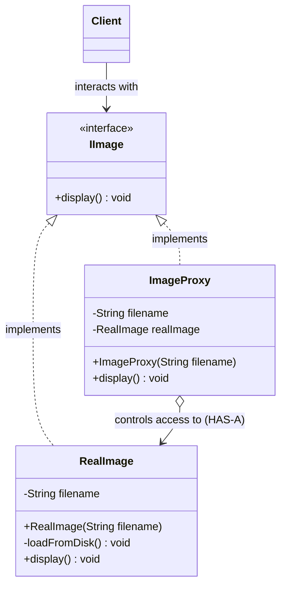

# 21. Proxy Design Pattern

> 💡 **Quick Revision Anchor**
> - **Type:** Structural Design Pattern
> - **Core Principle:** Provides a surrogate or placeholder for another object to control, filter, or optimize access to it.
> - **Key Invariant:** Both the **Proxy** and the **RealSubject** implement the exact same interface. The client cannot tell whether it is interacting with the proxy or the real object.
> - **Primary Variants:**
>   1. **Virtual Proxy:** Defers expensive object instantiation (Lazy Loading).
>   2. **Protection Proxy:** Enforces authorization, permissions, and security checks.
>   3. **Remote Proxy:** Manages communication over network protocols (gRPC, RPC, HTTP).

---

## 1. Real-World Analogy

- **College Attendance Proxy:** When a student is absent, a friend calls out attendance on their behalf. The friend acts as a proxy standing in for the real student.
- **Credit Card / Debit Card:** The card is a proxy for the actual cash resting inside your physical bank account. It can be validated, swiped, or blocked without handling the physical currency directly.
- **Security Guard at a VIP Office:** You cannot walk straight into the CEO's office. You must check in with the security guard/secretary (Proxy), who validates your appointment and badge (Protection Proxy) before ushering you inside.

---

## 2. The Problem: Uncontrolled Direct Access

Suppose our application renders high-resolution graphics and documents. A `RealImage` class loads heavy images (e.g., 50 MB TIFF/RAW files) from disk, decompresses pixel matrices, and loads them into memory inside its constructor.

```java
// ❌ Problematic Direct Instantiation
Image image1 = new RealImage("heavy_photo_1.jpg"); // 50MB disk load + decompression
Image image2 = new RealImage("heavy_photo_2.jpg"); // 50MB disk load + decompression
Image image3 = new RealImage("heavy_photo_3.jpg"); // 50MB disk load + decompression
```

If a user opens an album with 100 photos, the application immediately hangs trying to read 5 GB into RAM, even if the user only views the first photo!

Other direct-access problems:
- **Security:** Anyone holding a reference can invoke sensitive methods without permission checks.
- **Network Boundaries:** Client code must explicitly handle socket connections, serialization, and network timeouts whenever an object resides on a remote server.

---

## 3. Core Solution: The Proxy Structure

Introduce an intermediate **Proxy** class that:
1. Implements the exact same interface as the target (`IImage`).
2. Holds a reference to the `RealImage` (`HAS-A`).
3. Intercepts method calls (`display()`) to perform access control, lazy initialization, caching, or logging before delegating to `RealImage`.

```
+--------+            +----------------+            +----------------+
| Client | ---------> |   ImageProxy   | ---------> |   RealImage    |
+--------+  calls     +----------------+  delegates +----------------+
           display()    (Checks/Loads)               (Heavy Work)
```

---

## 4. The 3 Primary Types of Proxies

### 1. Virtual Proxy (Lazy Loading)
- Defers the creation of expensive objects until they are actually needed.
- `ImageProxy` stores only the file path string initially. Only when `display()` is invoked does it create `new RealImage(filename)` and cache it for subsequent calls.

### 2. Protection Proxy (Access Control & Security)
- Validates user credentials, role permissions, or session tokens before permitting invocation of the real object's methods.
- Example: Only users with `Role.ADMIN` can invoke `deleteUser()` or `viewFinancialData()`.

### 3. Remote Proxy (RPC & Remote Services)
- Acts as a local representative for an object in a different address space (e.g., separate server, container, or JVM).
- Hides networking complexity (sockets, HTTP/REST, gRPC, serialization, deserialization). The client calls `service.getUser(id)` as if it were a local object.

*(Other common variants: **Caching Proxy** to memoize expensive computations, **Logging / Audit Proxy** to track invocations).*

---

## 5. Architecture & Class Diagram



---

## 6. Java Implementation

### Variant 1: Virtual Proxy (Primary Lecture Example)

#### Step 1: Subject Interface
```java
// Subject Interface
public interface IImage {
    void display();
}
```

#### Step 2: RealSubject (Heavyweight)
```java
// RealSubject: Expensive initialization
public class RealImage implements IImage {
    private final String filename;

    public RealImage(String filename) {
        this.filename = filename;
        loadFromDisk(); // Expensive operation performed at instantiation
    }

    private void loadFromDisk() {
        System.out.println("[Disk I/O] Loading heavy image from disk: " + filename + " (Takes 2000ms, allocates 50MB RAM)");
    }

    @Override
    public void display() {
        System.out.println("Rendering image on screen: " + filename);
    }
}
```

#### Step 3: Virtual Proxy (Lazy Loading Wrapper)
```java
// Proxy: Lightweight, defers RealImage instantiation
public class ImageProxy implements IImage {
    private final String filename;
    private RealImage realImage; // Instantiated only on demand

    public ImageProxy(String filename) {
        this.filename = filename;
        // Notice: disk loading is NOT triggered here!
    }

    @Override
    public void display() {
        // Lazy initialization
        if (realImage == null) {
            System.out.println("Proxy: First access detected. Initializing RealImage...");
            realImage = new RealImage(filename);
        }
        realImage.display();
    }
}
```

#### Step 4: Client Code & Demonstration
```java
public class Main {
    public static void main(String[] args) {
        // Instant creation: No heavy disk load occurs yet!
        IImage photo1 = new ImageProxy("vacation_4k.raw");
        IImage photo2 = new ImageProxy("family_portrait_4k.raw");

        System.out.println("--- Proxies created successfully without memory lag ---\n");

        // First display() -> Triggers on-demand disk load
        System.out.println("User clicks on Photo 1:");
        photo1.display();

        System.out.println("\nUser clicks on Photo 1 again:");
        // Second display() -> Uses already cached RealImage, zero disk reload!
        photo1.display();
    }
}
```

#### Execution Output:
```text
--- Proxies created successfully without memory lag ---

User clicks on Photo 1:
Proxy: First access detected. Initializing RealImage...
[Disk I/O] Loading heavy image from disk: vacation_4k.raw (Takes 2000ms, allocates 50MB RAM)
Rendering image on screen: vacation_4k.raw

User clicks on Photo 1 again:
Rendering image on screen: vacation_4k.raw
```

---

### Variant 2: Protection Proxy (Authorization Example)

```java
public interface DocumentService {
    void deleteDocument(String docId);
}

public class RealDocumentService implements DocumentService {
    @Override
    public void deleteDocument(String docId) {
        System.out.println("Permanent: Document " + docId + " deleted from database.");
    }
}

public class DocumentSecurityProxy implements DocumentService {
    private final RealDocumentService realService = new RealDocumentService();
    private final String userRole;

    public DocumentSecurityProxy(String userRole) {
        this.userRole = userRole;
    }

    @Override
    public void deleteDocument(String docId) {
        if (!"ADMIN".equalsIgnoreCase(userRole)) {
            System.out.println("❌ Access Denied: User with role '" + userRole + "' cannot delete documents.");
            return;
        }
        realService.deleteDocument(docId);
    }
}
```

---

## 7. Comparison: Proxy vs. Decorator vs. Adapter vs. Facade

### Additional Java / Interview Insight

| Pattern | Interface Compared to Real Object | Primary Purpose / Intent |
| :--- | :--- | :--- |
| **Proxy** | **Identical interface** | **Controls access** (lazy load, auth, remote call, cache). |
| **Decorator** | **Identical interface** | **Adds new functionality / behavior** dynamically without altering structure. |
| **Adapter** | **Different interface** | **Translates/converts** an incompatible interface to match the client's expectation. |
| **Facade** | **Different interface (simplified)** | **Simplifies and hides** a multi-class complex subsystem behind a unified entrance. |

---

## 8. Interview Perspective

- **Q: How does Proxy differ from Decorator when both implement the same interface and wrap an object?**
  *A: The key difference is **Intent**. A Decorator's intent is enhancement—adding new responsibilities/features at runtime (e.g., adding encryption, scrollbars, borders). A Proxy's intent is access management—controlling **when** or **if** the underlying object is accessed (lazy instantiation, permission gatekeeping, remote RPC).*
- **Q: Where is Proxy used in the Spring Framework?**
  *A: Spring AOP (Aspect-Oriented Programming) uses dynamic JDK / CGLIB proxies to inject transactions (`@Transactional`), security checks (`@PreAuthorize`), and logging around target service beans.*
- **Q: Can a Proxy create multiple instances of RealSubject?**
  *A: A proxy typically manages access to a single instance or connection pool. If multiple distinct objects are dynamically assembled, that falls under Abstract Factory or Builder.*

---

## 9. Quick Revision

```text
Structure: Client ---> Proxy (implements Subject) ---> RealSubject (implements Subject).
Virtual Proxy: Delays instantiation until first method call (Lazy Loading).
Protection Proxy: Validates authentication / role before delegating.
Remote Proxy: Hides network RPC / serialization complexity behind a local interface.
```
