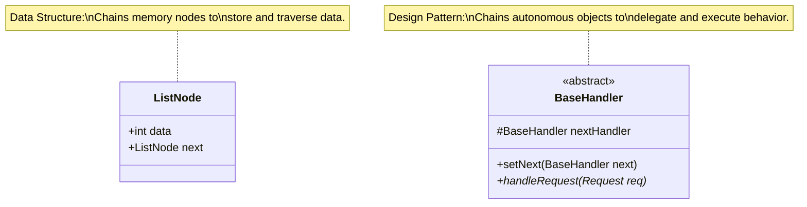
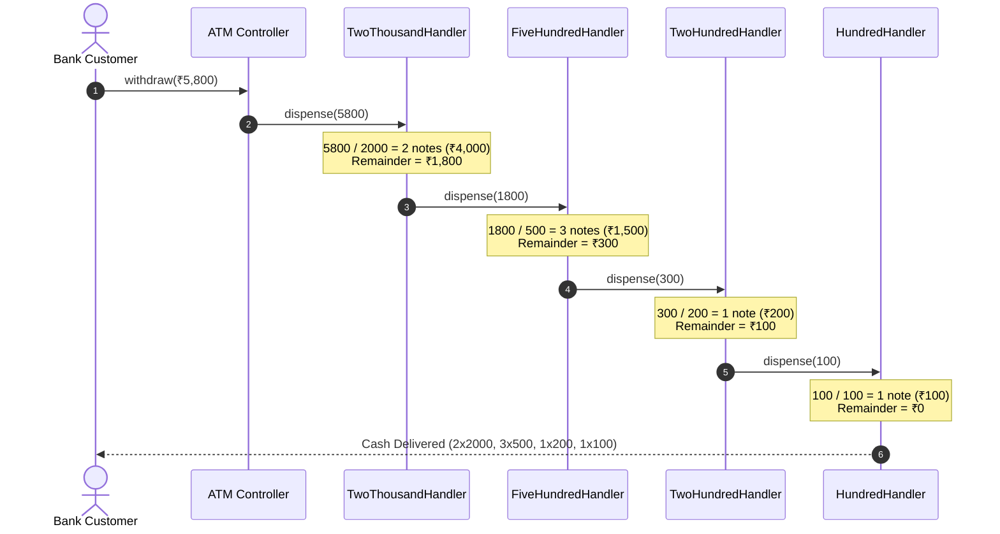
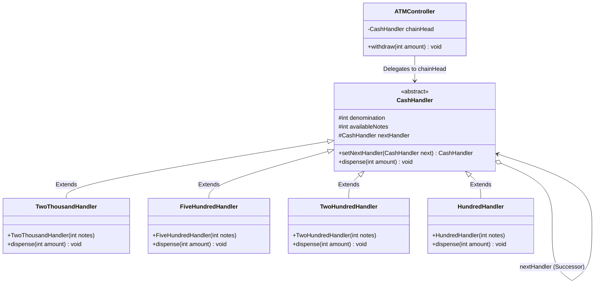
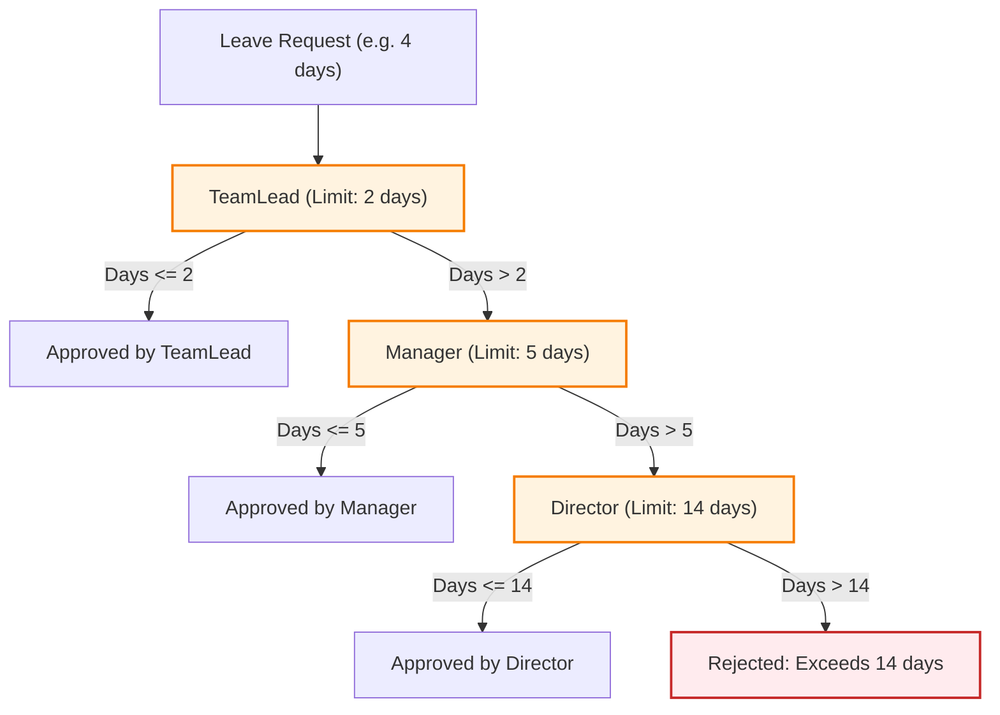

# 22. Chain of Responsibility Design Pattern

> 💡 **Quick Revision Anchor**: The **Chain of Responsibility Pattern** is a **behavioral design pattern** that lets you pass requests along a chain of handlers. Upon receiving a request, each handler decides either to process it, partially process and forward it, or pass it directly to the next handler in the chain. It completely decouples the **sender of a request** from its **receivers**, allowing dynamic restructuring of the processing pipeline at runtime.

---

## 1. Executive Summary & Lecture Motivation

In traditional software design, when a request requires processing across multiple stages or by one of several candidates, developers often write massive nested conditional blocks:
```java
// Anti-pattern: Monolithic conditional chain
if (conditionA) {
    handleA();
} else if (conditionB) {
    handleB();
} else if (conditionC) {
    handleC();
}
```
### Why This Breaks in Real Systems:
1. **Violation of Open-Closed Principle (OCP)**: Every time a new handler or business rule is added, the monolithic class must be opened and modified, risking regressions across existing stages.
2. **Violation of Single Responsibility Principle (SRP)**: A single controller or class becomes coupled to every conceivable processing detail, validation rule, or hardware cassette.
3. **Rigid Execution Topology**: The order of checks is hardcoded. Reordering handlers or dynamically skipping steps based on runtime configurations is impossible.

The **Chain of Responsibility (CoR)** decouples the client from individual handlers. The client submits a request to the **head of a chain**. Each handler in the chain holds a reference (`nextHandler`) to its successor, forming a behavioral pipeline.

```mermaid
flowchart LR
    Client([Client]) -->|1. Submit Request| H1["Handler 1<br/>(e.g., ₹2000 Note)"]
    H1 -->|Can handle? Yes: Deduct<br/>Remainder > 0| H2["Handler 2<br/>(e.g., ₹500 Note)"]
    H2 -->|Can handle? Yes: Deduct<br/>Remainder > 0| H3["Handler 3<br/>(e.g., ₹200 Note)"]
    H3 -->|Can handle? Yes: Deduct<br/>Remainder > 0| H4["Handler 4<br/>(e.g., ₹100 Note)"]
    H4 -->|Remainder == 0| Success([Success: Dispense Cash])
    H4 -.->|Remainder > 0 & next == null| Error([Fail: Unsupported Denomination])

    style Client fill:#e1f5fe,stroke:#0288d1,stroke-width:2px
    style H1 fill:#fff3e0,stroke:#f57c00,stroke-width:2px
    style H2 fill:#fff3e0,stroke:#f57c00,stroke-width:2px
    style H3 fill:#fff3e0,stroke:#f57c00,stroke-width:2px
    style H4 fill:#fff3e0,stroke:#f57c00,stroke-width:2px
    style Success fill:#e8f8f5,stroke:#26a69a,stroke-width:2px
    style Error fill:#ffebee,stroke:#c62828,stroke-width:2px
```



---

## 2. Theoretical Insight: Chain of Responsibility vs Linked List

In the lecture, the instructor draws a profound conceptual analogy between the **Chain of Responsibility Pattern** and the **Singly Linked List Data Structure**:



| Aspect | Singly Linked List (`ListNode`) | Chain of Responsibility (`Handler`) |
| :--- | :--- | :--- |
| **Primary Purpose** | Structural organization of **data in memory**. | Behavioral delegation of **responsibilities and logic**. |
| **Node State** | Stores passive payload (e.g. `int val`, `String item`). | Encapsulates active business logic, policies, and algorithms. |
| **Successor Pointer** | `ListNode next` points to the next memory container. | `Handler nextHandler` points to the next operational worker. |
| **Termination Condition** | `next == null` indicates end of sequence. | Request is fully satisfied, or `nextHandler == null` (triggering default/rejection behavior). |

---

## 3. Primary Lecture Example: ATM Currency Dispenser System

### The Problem
An automated teller machine (ATM) must dispense a requested cash amount (e.g., `₹5,800` or `₹3,700`):
- The ATM contains physical cassettes holding notes of denominations: `₹2,000`, `₹500`, `₹200`, and `₹100`.
- Each cassette possesses a finite inventory of notes.
- When an amount arrives:
  1. The largest denomination handler calculates how many notes it can provide.
  2. It deducts those notes from its cassette inventory.
  3. It computes the remaining unpaid balance: $\text{remainder} = \text{amount} - (\text{dispensedNotes} \times \text{denomination})$.
  4. If $\text{remainder} > 0$, it forwards the balance to its successor handler.
  5. If the chain ends and $\text{remainder} > 0$ (e.g. user requested `₹150`, but minimum note is `₹100`), the transaction must abort cleanly without partial cash loss.



---

## 4. Standard GoF Architecture & UML



---

## 5. Complete, Compilable Java Implementation (ATM Dispenser)

```java
package com.designpatterns.cor;

/**
 * Base Abstract Handler for ATM Cash Cassettes.
 */
abstract class CashHandler {
    protected final int denomination;
    protected int availableNotes;
    protected CashHandler nextHandler;

    public CashHandler(int denomination, int availableNotes) {
        this.denomination = denomination;
        this.availableNotes = availableNotes;
    }

    /**
     * Fluent helper to chain handlers: h1.setNextHandler(h2).setNextHandler(h3)
     */
    public CashHandler setNextHandler(CashHandler nextHandler) {
        this.nextHandler = nextHandler;
        return nextHandler;
    }

    public void dispense(int amount) {
        if (amount <= 0) {
            return;
        }

        int notesNeeded = amount / denomination;
        int notesToDispense = 0;

        if (notesNeeded > 0) {
            notesToDispense = Math.min(notesNeeded, availableNotes);
            availableNotes -= notesToDispense;

            if (notesToDispense > 0) {
                System.out.println("  [Dispensed] " + notesToDispense + " x ₹" + denomination 
                                   + " note(s). (Cassette remaining: " + availableNotes + ")");
            }
        }

        int remainder = amount - (notesToDispense * denomination);

        if (remainder > 0) {
            if (nextHandler != null) {
                nextHandler.dispense(remainder);
            } else {
                // End of chain reached with unfulfilled balance
                System.err.println("  [ERROR] Cannot dispense exact remainder of ₹" + remainder 
                                   + ". No smaller denomination cassette available!");
                throw new IllegalStateException("ATM cannot fulfill exact amount with available denominations.");
            }
        }
    }
}

/**
 * Concrete Cassette for ₹2,000 notes.
 */
class TwoThousandHandler extends CashHandler {
    public TwoThousandHandler(int availableNotes) {
        super(2000, availableNotes);
    }
}

/**
 * Concrete Cassette for ₹500 notes.
 */
class FiveHundredHandler extends CashHandler {
    public FiveHundredHandler(int availableNotes) {
        super(500, availableNotes);
    }
}

/**
 * Concrete Cassette for ₹200 notes.
 */
class TwoHundredHandler extends CashHandler {
    public TwoHundredHandler(int availableNotes) {
        super(200, availableNotes);
    }
}

/**
 * Concrete Cassette for ₹100 notes.
 */
class HundredHandler extends CashHandler {
    public HundredHandler(int availableNotes) {
        super(100, availableNotes);
    }
}

/**
 * Client-facing ATM Machine coordinating the chain.
 */
class ATM {
    private final CashHandler chainHead;

    public ATM() {
        // Assemble the processing pipeline: 2000 -> 500 -> 200 -> 100
        CashHandler h2000 = new TwoThousandHandler(3); // 3 * 2000 = ₹6,000
        CashHandler h500  = new FiveHundredHandler(10); // 10 * 500  = ₹5,000
        CashHandler h200  = new TwoHundredHandler(10); // 10 * 200  = ₹2,000
        CashHandler h100  = new HundredHandler(20);  // 20 * 100  = ₹2,000

        h2000.setNextHandler(h500)
             .setNextHandler(h200)
             .setNextHandler(h100);

        this.chainHead = h2000;
    }

    public void withdraw(int amount) {
        System.out.println("\n>>> Initiating Withdrawal Request for: ₹" + amount);
        if (amount <= 0 || amount % 100 != 0) {
            System.err.println("Transaction Rejected: Amount must be positive and in multiples of ₹100.");
            return;
        }

        try {
            chainHead.dispense(amount);
            System.out.println(">>> Withdrawal of ₹" + amount + " successful! Please take your cash.");
        } catch (IllegalStateException e) {
            System.err.println(">>> Transaction Cancelled: " + e.getMessage());
        }
    }
}
```

---

## 6. Lecture Problem 2: Hierarchical Logger System

In the lecture, the instructor highlights another industry-standard CoR problem: **Designing a Logger System**:
- Loggers have distinct severity levels:
  1. `INFO` = Level 1 (standard operational events)
  2. `DEBUG` = Level 2 (granular developer diagnostics)
  3. `ERROR` = Level 3 (system failures, exceptions)
- A request with `ERROR` level must print across the appropriate logger or chain of loggers.

```java
package com.designpatterns.cor.logger;

abstract class LogHandler {
    public static final int INFO = 1;
    public static final int DEBUG = 2;
    public static final int ERROR = 3;

    protected int level;
    protected LogHandler nextLogger;

    public LogHandler(int level) {
        this.level = level;
    }

    public LogHandler setNextLogger(LogHandler nextLogger) {
        this.nextLogger = nextLogger;
        return nextLogger;
    }

    public void logMessage(int level, String message) {
        if (this.level <= level) {
            write(message);
        }
        if (nextLogger != null) {
            nextLogger.logMessage(level, message);
        }
    }

    protected abstract void write(String message);
}

class InfoLogHandler extends LogHandler {
    public InfoLogHandler(int level) { super(level); }
    @Override
    protected void write(String message) {
        System.out.println("[INFO LOGGER]: " + message);
    }
}

class DebugLogHandler extends LogHandler {
    public DebugLogHandler(int level) { super(level); }
    @Override
    protected void write(String message) {
        System.out.println("[DEBUG LOGGER]: " + message);
    }
}

class ErrorLogHandler extends LogHandler {
    public ErrorLogHandler(int level) { super(level); }
    @Override
    protected void write(String message) {
        System.err.println("[ERROR LOGGER]: " + message);
    }
}
```

---

## 7. Lecture Homework & Interview Challenge: Corporate Leave Request System

In the video, the instructor tasks students with modeling a corporate leave approval hierarchy:
1. **Employee** submits a leave request with a specific duration (`days`).
2. **Team Leader**: Can approve requests $\le 2$ days. If $> 2$ days, forwards to Manager.
3. **Manager**: Can approve requests $\le 5$ days. If $> 5$ days, forwards to Director.
4. **Director**: Can approve requests up to 14 days. If $> 14$ days, rejects the leave.



```java
package com.designpatterns.cor.leave;

abstract class LeaveApprover {
    protected String role;
    protected LeaveApprover nextApprover;

    public LeaveApprover(String role) {
        this.role = role;
    }

    public LeaveApprover setNext(LeaveApprover nextApprover) {
        this.nextApprover = nextApprover;
        return nextApprover;
    }

    public abstract void processLeave(String employeeName, int leaveDays);
}

class TeamLead extends LeaveApprover {
    public TeamLead() { super("Team Lead"); }
    @Override
    public void processLeave(String employeeName, int leaveDays) {
        if (leaveDays <= 2) {
            System.out.println(">> [" + role + "] Approved " + leaveDays + " day(s) leave for " + employeeName);
        } else if (nextApprover != null) {
            System.out.println(">> [" + role + "] Cannot approve > 2 days. Escalating to Manager...");
            nextApprover.processLeave(employeeName, leaveDays);
        }
    }
}

class Manager extends LeaveApprover {
    public Manager() { super("Project Manager"); }
    @Override
    public void processLeave(String employeeName, int leaveDays) {
        if (leaveDays <= 5) {
            System.out.println(">> [" + role + "] Approved " + leaveDays + " day(s) leave for " + employeeName);
        } else if (nextApprover != null) {
            System.out.println(">> [" + role + "] Cannot approve > 5 days. Escalating to Director...");
            nextApprover.processLeave(employeeName, leaveDays);
        }
    }
}

class Director extends LeaveApprover {
    public Director() { super("Engineering Director"); }
    @Override
    public void processLeave(String employeeName, int leaveDays) {
        if (leaveDays <= 14) {
            System.out.println(">> [" + role + "] Approved " + leaveDays + " day(s) leave for " + employeeName);
        } else {
            System.err.println(">> [" + role + "] REJECTED leave request for " + employeeName 
                               + ". Leave exceeds corporate policy limit (14 days)!");
        }
    }
}
```

---

## 8. Real-World Applications & Edge Cases

### Real-World Production Implementations
1. **Servlet Filters (`javax.servlet.FilterChain`)**: Web servers process incoming HTTP requests through security filters, logging filters, and rate limiters before reaching the servlet controller.
2. **Spring Security (`SecurityFilterChain`)**: Evaluates token verification, CORS headers, CSRF protection, and role-based permissions sequentially.
3. **Exception Handling in Languages**: `try / catch` blocks in runtime engines follow the chain of responsibility up the call stack to find a matching catch block.

### Crucial Edge Cases & Pitfalls
- **Cyclic Chains**: If handler $A \to B \to A$ is constructed accidentally, invoking `handle()` will trigger a fatal `StackOverflowError`. Always construct chains through unidirectional builder patterns or directed acyclic graph (DAG) validators.
- **Unhandled Requests**: Unlike simple method calls, requests entering a chain might reach the end without being processed by any handler. In financial systems (like ATMs), you **must** have an end-of-chain fallback that raises an exception or triggers compensation logic.

---

## Quick Revision

### Core Idea
Decouples the sender of a request from its receivers by giving multiple handlers a chance to process the request along a sequential chain.

### Remember
- Handlers implement a common abstract class/interface and maintain a pointer to their successor (`nextHandler`).
- Handlers can either **consume and stop** the request (Leave approval / Filter), or **partially consume and forward** the remainder (ATM Currency Dispenser).
- Resembles a **Singly Linked List**, but links *executable behavior* rather than passive data.

### Java Implementation Idea
```java
abstract class Handler {
    protected Handler next;
    public Handler setNext(Handler next) { this.next = next; return next; }
    public abstract void handle(Request req);
}
```

### Most Important Interview Point
**How does CoR satisfy the Open-Closed Principle (OCP)?**
New handlers (e.g. `TwoHundredHandler` or `Director`) can be added to the system without modifying a single line of existing handler code. The client or DI container simply rearranges the chain pointers (`setNextHandler`).

### Common Trap
Forgetting to handle the end of the chain (`nextHandler == null`). If no handler satisfies the request and there is no terminal fallback or exception check, requests silently disappear into a black hole.
