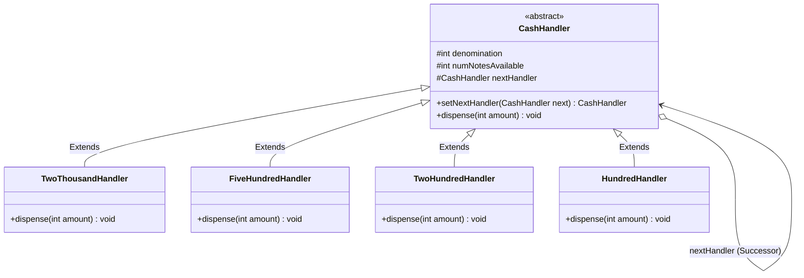
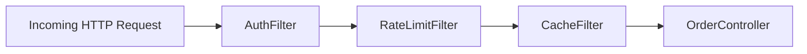

# 22. Chain of Responsibility Design Pattern

> 💡 **Quick Revision Anchor**: The **Chain of Responsibility Pattern** is a **behavioral design pattern** that passes requests along a chain of handlers. Upon receiving a request, each handler decides either to process the request (fully or partially) or to pass it to the next handler in the chain, decoupling the sender from receivers.

---

## 1. Context & Motivation

Imagine building an **ATM Cash Dispenser System**:
- A user requests to withdraw `₹5,800`.
- The ATM contains multiple distinct hardware cassettes: `₹2,000`, `₹500`, `₹200`, and `₹100` notes.
- Each cassette has finite inventory and can only dispense its specific denomination.
- If we write nested conditionals (`if / else if / else` with hardcoded denomination logic):
  - Adding a new `₹50` cassette requires rewriting and testing the entire withdrawal engine.
  - Handling limited note inventory creates monolithic, messy code.
- **Chain of Responsibility Solution**:
  - Model each denomination cassette as a self-contained handler.
  - Link handlers sequentially: `TwoThousandHandler` -> `FiveHundredHandler` -> `TwoHundredHandler` -> `HundredHandler`.
  - The client only passes the withdrawal amount to the head of the chain.

---

## 2. Core Architecture & UML



### The 3 Core Roles:
1. **Handler (`CashHandler`)**: Abstract class declaring the common interface (`dispense`) and holding a reference to the `nextHandler` successor.
2. **Concrete Handlers (`TwoThousandHandler`, etc.)**: Implements request processing. Checks whether it can dispense its denomination, calculates notes required based on available inventory, deducts inventory, and forwards the remainder.
3. **Client**: Configures the chain sequence once and injects requests into the first handler without worrying about downstream topology.

---

## 3. Production Java Implementation: ATM Dispense Pipeline

### Step 1: Base Abstract Handler
```java
public abstract class CashHandler {
    protected final int denomination;
    protected int availableNotes;
    protected CashHandler nextHandler;

    public CashHandler(int denomination, int availableNotes) {
        this.denomination = denomination;
        this.availableNotes = availableNotes;
    }

    // Method chaining helper to build pipeline fluently
    public CashHandler setNextHandler(CashHandler nextHandler) {
        this.nextHandler = nextHandler;
        return nextHandler; // Returns next handler to enable: h1.setNext(h2).setNext(h3)
    }

    public void dispense(int amount) {
        if (amount <= 0) return;

        int notesNeeded = amount / denomination;
        int notesToDispense = 0;

        if (notesNeeded > 0) {
            // Take as many notes as available in current cassette
            notesToDispense = Math.min(notesNeeded, availableNotes);
            availableNotes -= notesToDispense;

            if (notesToDispense > 0) {
                System.out.println("[Dispenser] Dispensed " + notesToDispense + " x ₹" 
                                   + denomination + " notes. (Remaining in cassette: " + availableNotes + ")");
            }
        }

        int remainder = amount - (notesToDispense * denomination);

        // Forward remainder to the successor handler
        if (remainder > 0) {
            if (nextHandler != null) {
                nextHandler.dispense(remainder);
            } else {
                System.err.println("[ERROR] Unable to dispense remaining ₹" + remainder 
                                   + "! No smaller denomination available or insufficient cash in ATM.");
                throw new IllegalStateException("ATM cannot fulfill exact amount. Transaction cancelled.");
            }
        }
    }
}
```

### Step 2: Concrete Denomination Handlers
```java
public class TwoThousandHandler extends CashHandler {
    public TwoThousandHandler(int availableNotes) {
        super(2000, availableNotes);
    }
}

public class FiveHundredHandler extends CashHandler {
    public FiveHundredHandler(int availableNotes) {
        super(500, availableNotes);
    }
}

public class TwoHundredHandler extends CashHandler {
    public TwoHundredHandler(int availableNotes) {
        super(200, availableNotes);
    }
}

public class HundredHandler extends CashHandler {
    public HundredHandler(int availableNotes) {
        super(100, availableNotes);
    }
}
```

### Step 3: ATM Controller & Chain Assembly
```java
public class ATM {
    private final CashHandler chainHead;

    public ATM() {
        // Assemble the chain: 2000 -> 500 -> 200 -> 100
        CashHandler h2000 = new TwoThousandHandler(3); // 3 x 2000 = 6000
        CashHandler h500 = new FiveHundredHandler(10);  // 10 x 500 = 5000
        CashHandler h200 = new TwoHundredHandler(10);   // 10 x 200 = 2000
        CashHandler h100 = new HundredHandler(20);      // 20 x 100 = 2000

        h2000.setNextHandler(h500)
             .setNextHandler(h200)
             .setNextHandler(h100);

        this.chainHead = h2000;
    }

    public void withdraw(int amount) {
        System.out.println("\n=== Processing Withdrawal Request: ₹" + amount + " ===");
        if (amount % 100 != 0) {
            System.err.println("[Rejected] Amount must be a multiple of ₹100.");
            return;
        }

        try {
            chainHead.dispense(amount);
            System.out.println("=== Withdrawal of ₹" + amount + " Complete! Please collect your cash. ===");
        } catch (IllegalStateException e) {
            System.out.println("[Transaction Aborted]: " + e.getMessage());
        }
    }
}
```

### Step 4: Test Driver
```java
public class Main {
    public static void main(String[] args) {
        ATM atm = new ATM();

        // Test 1: Standard withdrawal using multiple denominations
        atm.withdraw(5800); // Expect: 2x2000 (rem: 1800) -> 3x500 (rem: 300) -> 1x200 (rem: 100) -> 1x100

        // Test 2: Another withdrawal exhausting remaining 2000 note
        atm.withdraw(3700); // 1x2000 remaining used -> 3x500 -> 1x200

        // Test 3: Invalid denomination granularity
        atm.withdraw(550);  // Blocked (not multiple of 100)
    }
}
```

---

## 4. Execution Trace

```text
=== Processing Withdrawal Request: ₹5800 ===
[Dispenser] Dispensed 2 x ₹2000 notes. (Remaining in cassette: 1)
[Dispenser] Dispensed 3 x ₹500 notes. (Remaining in cassette: 7)
[Dispenser] Dispensed 1 x ₹200 notes. (Remaining in cassette: 9)
[Dispenser] Dispensed 1 x ₹100 notes. (Remaining in cassette: 19)
=== Withdrawal of ₹5800 Complete! Please collect your cash. ===

=== Processing Withdrawal Request: ₹3700 ===
[Dispenser] Dispensed 1 x ₹2000 notes. (Remaining in cassette: 0)
[Dispenser] Dispensed 3 x ₹500 notes. (Remaining in cassette: 4)
[Dispenser] Dispensed 1 x ₹200 notes. (Remaining in cassette: 8)
=== Withdrawal of ₹3700 Complete! Please collect your cash. ===

=== Processing Withdrawal Request: ₹550 ===
[Rejected] Amount must be a multiple of ₹100.
```

---

## 5. Other Classical Examples: Request Filtering & Logging

### Example: HTTP Servlet Middleware Pipeline

If `AuthFilter` fails, request execution is aborted immediately without ever hitting `RateLimitFilter` or `OrderController`.

---

## 6. Real-World Applications & Interview Gotchas

1. **Framework Examples**:
   - **Java Logging (`java.util.logging.Logger`)**: Log messages pass through handlers (ConsoleHandler -> FileHandler -> SocketHandler) based on log level.
   - **Spring Security (`FilterChainProxy`)**: A chain of servlet filters (`SecurityContextPersistenceFilter`, `UsernamePasswordAuthenticationFilter`, `FilterSecurityInterceptor`).
   - **Express.js / Node Middleware**: `app.use((req, res, next) => { ... next(); })`.
2. **Key Design Considerations**:
   - **Request Dropping**: In some implementations, if no handler processes the request, it simply falls off the end of the chain silently. In financial transactions (like ATM), this must be treated as an explicit error.
   - **Cyclic Reference Hazard**: Ensure circular links (`A -> B -> A`) are impossible during chain construction to avoid infinite loops and `StackOverflowError`.
