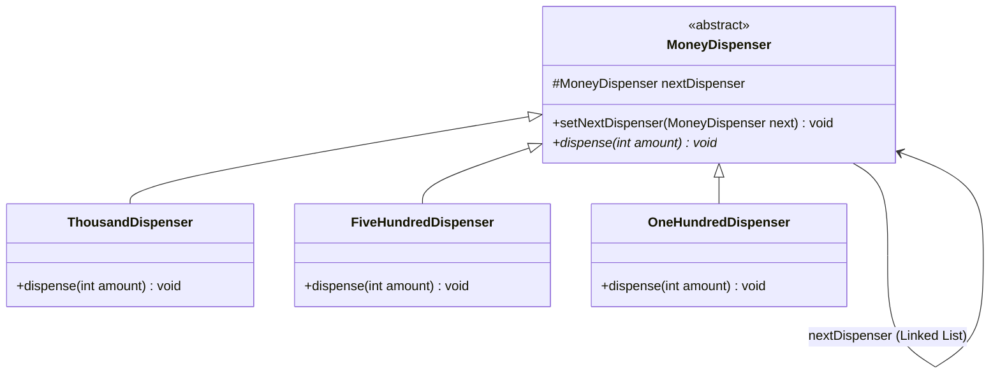

# 22. Chain of Responsibility Design Pattern

> 💡 **Quick Revision Anchor**
> - **Type:** Behavioral Design Pattern
> - **Core Principle:** Decouples the sender of a request from its receivers by giving more than one object a chance to handle the request. Chains the receiving objects and passes the request along the chain until an object handles it (or all have processed their portion).
> - **Mental Model:** A **Singly Linked List** of Handler objects. Each handler processes what it can and passes the remainder / request to `nextHandler`.
> - **Primary Lecture Example:** ATM Cash Dispenser Machine (₹1000 ➔ ₹500 ➔ ₹100 notes).

---

## 1. Problem & Real-World Motivation

Consider an **ATM Machine Dispensing Cash**:
When a user requests to withdraw ₹6,700:
- The ATM must dispense cash using specific denominations: ₹1000 notes, ₹500 notes, and ₹100 notes.
- Optimal dispensing begins with the largest available denomination (₹1000 notes), passes the remaining balance to the next smaller denomination (₹500 notes), and finally dispenses the rest with ₹100 notes.

### The Naive Approach: Massive Monolithic `if-else` Block
```java
// ❌ Naive monolithic controller
public class ATMDispenser {
    public void withdraw(int amount) {
        if (amount >= 1000) {
            int num1000 = amount / 1000;
            int remainder = amount % 1000;
            // process 1000s...
            if (remainder >= 500) {
                // process 500s...
                if (remainder >= 100) {
                    // process 100s...
                }
            }
        }
    }
}
```

### Why the Naive Design Fails:
1. **Violates Single Responsibility Principle (SRP):** The ATM class is loaded with the inventory, math, and dispensing rules for every single currency denomination.
2. **Violates Open-Closed Principle (OCP):** Adding a new currency note (e.g., ₹2000 or ₹200) or removing a deprecated note requires editing and potentially breaking this fragile, deeply nested `if-else` logic.
3. **Rigid Flow:** Denomination priority cannot be configured or modified dynamically at runtime.

---

## 2. Core Pattern Idea: Linked Chain of Handlers

Instead of one centralized decision-maker, we break the solution into **independent Handler objects** arranged in a **Chain (like a Linked List)**:

```
Request(₹6,700)
      │
      ▼
┌──────────────┐   Remainder: ₹700   ┌──────────────┐   Remainder: ₹200   ┌──────────────┐
│ 1000 Handler │ ──────────────────▶ │  500 Handler │ ──────────────────▶ │  100 Handler │
│  (6 x 1000)  │                     │  (1 x 500)   │                     │  (2 x 100)   │
└──────────────┘                     └──────────────┘                     └──────────────┘
                                                                                 │
                                                                   Remainder: ₹0 (Complete!)
```

Each Handler in the chain:
- Inspects the request.
- Handles its designated portion (or checks if it can handle the request entirely).
- If remaining work exists and a `nextHandler` is registered, it forwards the request down the chain.

---

## 3. Architecture & Class Diagram



---

## 4. Java Implementation (Primary Lecture Example)

### Step 1: Base Handler Class
```java
public abstract class MoneyDispenser {
    protected MoneyDispenser nextDispenser;

    // Sets the next link in the chain
    public void setNextDispenser(MoneyDispenser nextDispenser) {
        this.nextDispenser = nextDispenser;
    }

    // Abstract method to be implemented by each denomination handler
    public abstract void dispense(int amount);
}
```

---

### Step 2: Concrete Handlers (Denominations)

```java
// Handles ₹1000 notes
public class ThousandDispenser extends MoneyDispenser {
    @Override
    public void dispense(int amount) {
        if (amount >= 1000) {
            int notes = amount / 1000;
            int remainder = amount % 1000;
            System.out.println("Dispensing " + notes + " note(s) of ₹1000");

            if (remainder > 0 && nextDispenser != null) {
                nextDispenser.dispense(remainder);
            }
        } else if (nextDispenser != null) {
            nextDispenser.dispense(amount);
        }
    }
}

// Handles ₹500 notes
public class FiveHundredDispenser extends MoneyDispenser {
    @Override
    public void dispense(int amount) {
        if (amount >= 500) {
            int notes = amount / 500;
            int remainder = amount % 500;
            System.out.println("Dispensing " + notes + " note(s) of ₹500");

            if (remainder > 0 && nextDispenser != null) {
                nextDispenser.dispense(remainder);
            }
        } else if (nextDispenser != null) {
            nextDispenser.dispense(amount);
        }
    }
}

// Handles ₹100 notes
public class OneHundredDispenser extends MoneyDispenser {
    @Override
    public void dispense(int amount) {
        if (amount >= 100) {
            int notes = amount / 100;
            int remainder = amount % 100;
            System.out.println("Dispensing " + notes + " note(s) of ₹100");

            if (remainder > 0) {
                if (nextDispenser != null) {
                    nextDispenser.dispense(remainder);
                } else {
                    System.out.println("❌ Error: Cannot dispense remaining balance of ₹" + remainder + " (No matching denomination).");
                }
            }
        } else if (nextDispenser != null) {
            nextDispenser.dispense(amount);
        } else if (amount > 0) {
            System.out.println("❌ Error: Cannot dispense ₹" + amount + " (Amount too small for ATM denominations).");
        }
    }
}
```

---

### Step 3: ATM Client & Chain Construction
```java
public class ATMClient {
    private final MoneyDispenser chain;

    public ATMClient() {
        // Constructing the chain: Thousand -> FiveHundred -> OneHundred
        MoneyDispenser c1 = new ThousandDispenser();
        MoneyDispenser c2 = new FiveHundredDispenser();
        MoneyDispenser c3 = new OneHundredDispenser();

        c1.setNextDispenser(c2);
        c2.setNextDispenser(c3);

        this.chain = c1; // Head of chain
    }

    public void withdraw(int amount) {
        System.out.println("\n=== Processing Withdrawal Request for ₹" + amount + " ===");
        if (amount <= 0) {
            System.out.println("Invalid amount entered.");
            return;
        }
        chain.dispense(amount);
    }
}

public class Main {
    public static void main(String[] args) {
        ATMClient atm = new ATMClient();

        atm.withdraw(6700); // 6 x 1000, 1 x 500, 2 x 100
        atm.withdraw(2300); // 2 x 1000, 3 x 100
        atm.withdraw(550);  // 1 x 500, fails remainder 50
    }
}
```

### Execution Output:
```text
=== Processing Withdrawal Request for ₹6700 ===
Dispensing 6 note(s) of ₹1000
Dispensing 1 note(s) of ₹500
Dispensing 2 note(s) of ₹100

=== Processing Withdrawal Request for ₹2300 ===
Dispensing 2 note(s) of ₹1000
Dispensing 3 note(s) of ₹100

=== Processing Withdrawal Request for ₹550 ===
Dispensing 1 note(s) of ₹500
❌ Error: Cannot dispense remaining balance of ₹50 (No matching denomination).
```

---

## 5. Additional Common Example: Multi-Level Logging

### Additional Common Example

A classic software application of Chain of Responsibility is a hierarchical **Logger System**:

```
Client Log Request (Level, Message)
               │
               ▼
       ┌───────────────┐
       │  InfoLogger   │ (Handles INFO; passes to next)
       └───────┬───────┘
               │
               ▼
       ┌───────────────┐
       │  DebugLogger  │ (Handles DEBUG; passes to next)
       └───────┬───────┘
               │
               ▼
       ┌───────────────┐
       │  ErrorLogger  │ (Handles ERROR / Critical alerts)
       └───────────────┘
```

```java
public abstract class Logger {
    public static int INFO = 1;
    public static int DEBUG = 2;
    public static int ERROR = 3;

    protected int level;
    protected Logger nextLogger;

    public void setNextLogger(Logger nextLogger) {
        this.nextLogger = nextLogger;
    }

    public void logMessage(int level, String message) {
        if (this.level <= level) {
            write(message);
        }
        if (nextLogger != null) {
            nextLogger.logMessage(level, message);
        }
    }

    protected abstract void write(String message);
}
```

---

## 6. Real-World Applications

1. **Web Server Interceptors & Middleware:**
   - In Express.js / Spring Security / Servlet Filters:
     `AuthMiddleware` ➔ `CorsMiddleware` ➔ `RateLimitMiddleware` ➔ `Controller`.
   - Any filter can intercept and reject the request (`403 Forbidden` or `429 Too Many Requests`), stopping the chain immediately.
2. **UI Event Bubbling (DOM / Android View Hierarchy):**
   - When a button is clicked, the click event bubbles from `Button` ➔ `ParentLayout` ➔ `Activity/Window` until one handler consumes the event.
3. **Customer Support Escalation:**
   - Level 1 Chatbot ➔ Level 2 Human Support Agent ➔ Level 3 Technical Lead / Engineering Manager.

---

## 7. Trade-offs & Limitations

| Advantages | Limitations |
| :--- | :--- |
| **Loose Coupling:** Sender does not know which concrete receiver will satisfy the request. | **Uncertainty of Handling:** If the chain is misconfigured or a request is unsupported, it may drop off the end unhandled. |
| **Flexibility:** Dynamically insert, reorder, or remove links in the chain without changing other classes. | **Performance Latency:** Traversal through a lengthy chain can add latency if deep filtering is involved. |
| **Adheres to SRP & OCP:** Each handler focuses exclusively on its own responsibility. | **Debugging Complexity:** Stack traces weave through recursive chains, making runtime flow harder to follow. |

---

## 8. Interview Perspective

- **Q: What is the primary architectural difference between Composite Pattern and Chain of Responsibility?**
  *A: Composite forms a **Tree Hierarchy** (branching out with multiple children per node) for part-whole representation. Chain of Responsibility forms a **Linear Sequence (Linked List)** where each handler points to a single `next` receiver.*
- **Q: Can multiple handlers in the chain process the same request?**
  *A: Yes! There are two variations: (1) **Pure CoR:** exactly one handler absorbs and stops the request. (2) **Pipeline/Filter CoR:** multiple handlers each process a piece or enrich the request and pass it along (like our ATM dispenser or servlet filter).*
- **Q: How do you prevent requests from dropping off unhandled?**
  *A: Install a terminal default / fallback handler at the tail of the chain that logs a warning or throws an `UnsupportedOperationException`.*

---

## 9. Quick Revision

```text
Structure: Handlers linked like a Singly Linked List via nextHandler reference.
Execution: Client calls head.handle(request) -> each node processes/forwards to next.
Key Advantage: OCP-compliant, loosely coupled, dynamically reconfigurable pipelines.
```
