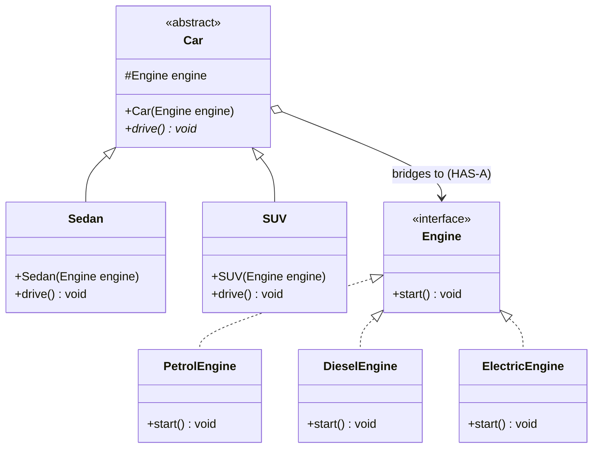

# 25. Bridge Design Pattern

> 💡 **Quick Revision Anchor**
> - The **Bridge Pattern** decouples an **Abstraction** from its **Implementation** so that both can vary independently.
> - Primary Problem Solved: Eliminates the **$M \times N$ class explosion** caused by rigid multi-dimensional inheritance, converting it into an additive **$M + N$** composition.
> - Primary lecture example: **Vehicles & Engines** (`Sedan`, `SUV` bridged to `PetrolEngine`, `DieselEngine`, `ElectricEngine`). Other lecture examples: **Remotes & TVs**, **Cross-Platform UI Widgets & OS Renderers**.

---

## 1. What Problem Are We Solving?

Suppose you are modeling vehicles with two orthogonal dimensions of variation:
1. **Car Body / Form Factor (High-Level Abstraction):** `Sedan`, `SUV`, `Hatchback` ($M = 3$).
2. **Engine / Propulsion (Low-Level Implementation):** `PetrolEngine`, `DieselEngine`, `ElectricEngine` ($N = 3$).

### The Multiplicative Inheritance Trap ($M \times N$)
If modeled with pure inheritance:
```text
                            Car
            ┌────────────────┼────────────────┐
          Sedan             SUV           Hatchback
      ┌─────┼─────┐     ┌────┼────┐     ┌─────┼─────┐
   Petrol Diesel Electric Petrol Diesel Electric Petrol Diesel Electric
```
- Total classes required = $M \times N = 3 \times 3 = 9$ classes.
- If a new engine is introduced (e.g., `HybridEngine`), we must create 3 new classes (`HybridSedan`, `HybridSUV`, `HybridHatchback`).
- If a new car model is added (e.g., `Coupe`), we must create 4 new engine-specific subclasses for it.
- The number of subclasses grows **multiplicatively**, causing massive code duplication and rigid hierarchies.

---

## 2. Key Design Idea: Decouple Abstraction from Implementation

Instead of combining dimensions through deep inheritance, the **Bridge Pattern** splits the system into two independent hierarchies connected via a bridge (**HAS-A** composition):

1. **Abstraction (High-Level):** What the client interacts with (`Car`, `Sedan`, `SUV`).
2. **Implementor (Low-Level):** The underlying engine performing the core work (`Engine`, `PetrolEngine`, `ElectricEngine`).

```text
  [Abstraction Hierarchy (M)]                     [Implementor Hierarchy (N)]
          Car ──────────────────── HAS-A ──────────────▶ Engine
           ▲                    (The Bridge)               ▲
      ┌────┴────┐                                     ┌────┼────┐
    Sedan      SUV                                 Petrol Diesel Electric
```

### The Math:
- Inheritance: $M \times N$ classes (e.g., $4 \times 4 = 16$).
- Bridge: $M + N$ classes (e.g., $4 + 4 = 8$).

---

## 3. Visual Architecture



---

## 4. Concise Java Implementation (Primary Lecture Example)

```java
// ==========================================
// 1. IMPLEMENTOR HIERARCHY (Low-Level Engine)
// ==========================================
interface Engine {
    void start();
}

class PetrolEngine implements Engine {
    @Override public void start() { System.out.println("Petrol Engine: Combustion rumbling."); }
}

class DieselEngine implements Engine {
    @Override public void start() { System.out.println("Diesel Engine: High-torque ignition."); }
}

class ElectricEngine implements Engine {
    @Override public void start() { System.out.println("Electric Engine: Silent electric induction."); }
}

// ==========================================
// 2. ABSTRACTION HIERARCHY (High-Level Car)
// ==========================================
abstract class Car {
    protected final Engine engine; // The Bridge (HAS-A)

    public Car(Engine engine) {
        this.engine = engine;
    }

    public abstract void drive();
}

class Sedan extends Car {
    public Sedan(Engine engine) { super(engine); }

    @Override
    public void drive() {
        System.out.print("Sedan cruising on highway -> ");
        engine.start();
    }
}

class SUV extends Car {
    public SUV(Engine engine) { super(engine); }

    @Override
    public void drive() {
        System.out.print("SUV powering off-road -> ");
        engine.start();
    }
}

// ==========================================
// Driver Demonstration
// ==========================================
public class Main {
    public static void main(String[] args) {
        // Any Car can be paired with any Engine dynamically at runtime!
        Car electricSedan = new Sedan(new ElectricEngine());
        electricSedan.drive();

        Car dieselSUV = new SUV(new DieselEngine());
        dieselSUV.drive();

        Car petrolSedan = new Sedan(new PetrolEngine());
        petrolSedan.drive();
    }
}
```

---

## 5. Other Lecture Examples

1. **Universal Remote & TVs:**
   - Abstraction: `RemoteControl` (`BasicRemote`, `AdvancedSmartRemote`).
   - Implementor: `Device` (`SonyTV`, `SamsungTV`, `LGTV`).
   - Any remote can be paired with any TV brand without multiplying remote classes.
2. **Cross-Platform UI Toolkits:**
   - Abstraction: UI components (`Button`, `TextBox`, `Dialog`).
   - Implementor: OS Renderers (`WindowsRenderer`, `MacOSRenderer`, `LinuxRenderer`).

---

## 6. Bridge vs. Strategy vs. Adapter

| Dimension | Bridge Pattern | Strategy Pattern | Adapter Pattern |
| :--- | :--- | :--- | :--- |
| **Primary Intent** | **Structural:** Decouples abstraction from implementation to prevent $M \times N$ class explosion. | **Behavioral:** Encapsulates interchangeable algorithms so they can be switched at runtime. | **Structural:** Converts an existing incompatible interface into an expected target interface. |
| **When Decided** | Planned **upfront** during system design. | Configured or swapped at **runtime**. | Added **retroactively** to bridge pre-existing code. |
| **Hierarchies** | Two parallel hierarchies that grow independently ($M + N$). | A context class referencing a strategy hierarchy. | A wrapper adapting a single incompatible adaptee. |

---

## 7. Interview Questions & Key Discussion Points

1. **What is the clearest symptom that a system needs the Bridge pattern?**
   - *Answer*: Class names created by combining two orthogonal characteristics (e.g., `WindowsButton`, `MacButton`, `ElectricSedan`, `DieselSUV`). This indicates a Cartesian product that will cause an $M \times N$ class explosion.
2. **How does Bridge differ from Adapter?**
   - *Answer*: Adapter is added after code is already written to make incompatible classes talk to each other. Bridge is designed upfront to let abstractions and implementations evolve independently.
3. **Why does Bridge use composition instead of inheritance?**
   - *Answer*: It replaces deep, rigid multi-tier inheritance trees with a loose `HAS-A` composition reference, allowing both sides to be extended without multiplying subclasses.

---

## 8. Quick Revision

### Core Idea
Bridge separates two orthogonal dimensions of variation into two independent hierarchies (Abstraction and Implementor) connected via composition.

### Remember
- **Converts:** $M \times N$ multiplicative subclasses into $M + N$ additive classes.
- **Lecture Example:** `Car` (`Sedan`, `SUV`) bridged to `Engine` (`Petrol`, `Diesel`, `Electric`).
- **Analogy:** Universal remote control driving any television brand.
