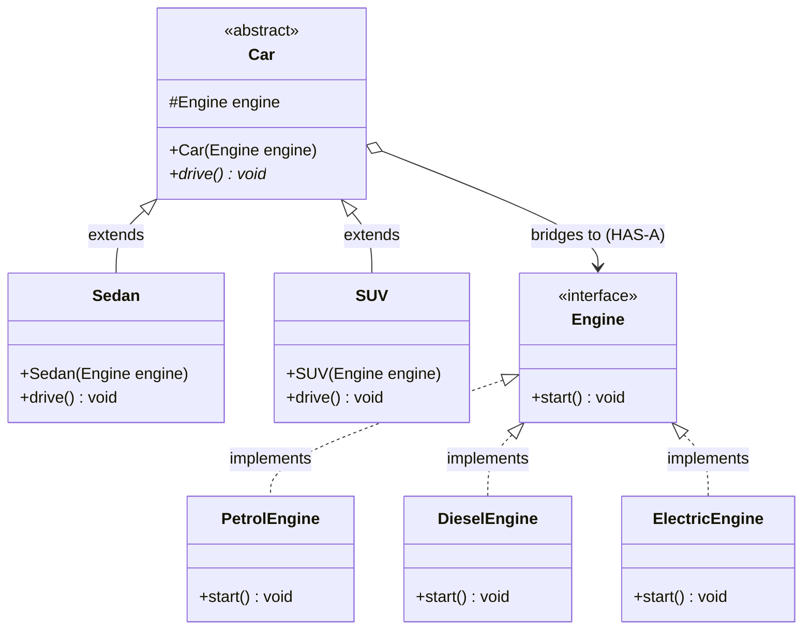

# 25. Bridge Design Pattern

> 💡 **Quick Revision Anchor**
> - **Type:** Structural Design Pattern
> - **Core Principle:** Decouples an **Abstraction** from its **Implementation** so that both can vary independently.
> - **Primary Problem Solved:** Eliminates the **$M \times N$ Class Explosion Problem** caused by rigid multi-dimensional inheritance.
> - **Rule of Thumb:** Converts multiplicative inheritance ($M \times N$) into additive composition ($M + N$) by bridging the High-Level entity to its Low-Level driver via `HAS-A`.

---

## 1. Problem: The $M \times N$ Class Explosion

Suppose you are modeling a vehicle manufacturing software with two orthogonal dimensions of variation:
1. **Car Body / Form Factor (High-level abstraction):** Sedan, SUV, Hatchback ($M = 3$).
2. **Engine / Propulsion Mechanism (Low-level implementation):** Petrol Engine, Diesel Engine, Electric Engine ($N = 3$).

### The Naive Inheritance Approach:
If we model this using classic inheritance:

```
                            Car
            ┌────────────────┼────────────────┐
          Sedan             SUV           Hatchback
      ┌─────┼─────┐     ┌────┼────┐     ┌─────┼─────┐
   Petrol Diesel Electric Petrol Diesel Electric Petrol Diesel Electric
```

- Total Classes required = $M \times N = 3 \times 3 = 9$ subclasses!
- If marketing introduces a **Hybrid Engine**, we must create 3 new classes (`HybridSedan`, `HybridSUV`, `HybridHatchback`).
- If engineering introduces a **Coupe Car**, we must create 4 new engine variations for it.
- Classes grow **multiplicatively** ($M \times N$). The code quickly spirals out of control with duplicate, tightly coupled boilerplate.

---

## 2. Core Solution: The Bridge Pattern

Instead of combining dimensions through deep inheritance, the **Bridge Pattern** splits the monolithic concept into two separate, independent class hierarchies:

1. **Abstraction (High-Level Part):** What the client interacts with (e.g., `Car`, `Sedan`, `SUV`). Defines high-level operations.
2. **Implementor (Low-Level Part):** The underlying engine/driver that executes the heavy lifting (e.g., `Engine`, `PetrolEngine`, `ElectricEngine`).

The **Bridge** is simply a composition reference: the Abstraction holds a reference to the Implementor (`Car HAS-A Engine`).

```
  [Abstraction Hierarchy]                      [Implementor Hierarchy]
      (Car Types: M)                              (Engine Types: N)

         Car ─────────────────── HAS-A ──────────────▶  Engine
          ▲                 (The Bridge)                  ▲
     ┌────┴────┐                                     ┌────┼────┐
   Sedan      SUV                                 Petrol Diesel Electric
```

### The Math:
- Pure Inheritance: $M \times N$ classes (e.g., $4 \times 4 = 16$).
- Bridge Pattern: $M + N$ classes (e.g., $4 + 4 = 8$).
- Both hierarchies can evolve and be subclassed completely independently.

---

## 3. Architecture & Class Diagram



---

## 4. Java Implementation (Primary Lecture Example)

### Step 1: Implementor Interface (Low-Level Part)
```java
// Implementor Interface: defines low-level primitive operations
public interface Engine {
    void start();
}

// Concrete Implementor 1
public class PetrolEngine implements Engine {
    @Override
    public void start() {
        System.out.println("Petrol Engine: Spark plugs firing, internal combustion rumbling.");
    }
}

// Concrete Implementor 2
public class DieselEngine implements Engine {
    @Override
    public void start() {
        System.out.println("Diesel Engine: High compression cylinders igniting fuel.");
    }
}

// Concrete Implementor 3
public class ElectricEngine implements Engine {
    @Override
    public void start() {
        System.out.println("Electric Engine: Lithium battery powering silent induction motor.");
    }
}
```

---

### Step 2: Abstraction Class (High-Level Part)
```java
// Abstraction: holds a reference to Implementor (the Bridge)
public abstract class Car {
    protected final Engine engine; // The Bridge

    public Car(Engine engine) {
        this.engine = engine;
    }

    public abstract void drive();
}

// Refined Abstraction 1
public class Sedan extends Car {
    public Sedan(Engine engine) {
        super(engine);
    }

    @Override
    public void drive() {
        System.out.print("Sedan driving smoothly on highway -> ");
        engine.start();
    }
}

// Refined Abstraction 2
public class SUV extends Car {
    public SUV(Engine engine) {
        super(engine);
    }

    @Override
    public void drive() {
        System.out.print("SUV powering through rugged off-road terrain -> ");
        engine.start();
    }
}
```

---

### Step 3: Client Application & Arbitrary Pairing
```java
public class Main {
    public static void main(String[] args) {
        // We can pair ANY car with ANY engine dynamically at runtime!

        // 1. Electric Sedan
        Car electricSedan = new Sedan(new ElectricEngine());
        electricSedan.drive();

        // 2. Diesel SUV
        Car dieselSUV = new SUV(new DieselEngine());
        dieselSUV.drive();

        // 3. Petrol Sedan
        Car petrolSedan = new Sedan(new PetrolEngine());
        petrolSedan.drive();
    }
}
```

### Execution Output:
```text
Sedan driving smoothly on highway -> Electric Engine: Lithium battery powering silent induction motor.
SUV powering through rugged off-road terrain -> Diesel Engine: High compression cylinders igniting fuel.
Sedan driving smoothly on highway -> Petrol Engine: Spark plugs firing, internal combustion rumbling.
```

---

## 5. Additional Common Examples Discussed in Lecture

### Example 1: Universal Remote Controls & Entertainment Devices
- **Abstraction:** `RemoteControl` (e.g., `BasicRemote`, `AdvancedTouchRemote`).
- **Implementor:** `Device` (e.g., `SonyTV`, `SamsungTV`, `BoseSoundSystem`).
- Client can use any remote to drive any underlying electronics brand without creating `SonyBasicRemote`, `SamsungTouchRemote`, etc.

### Example 2: Cross-Platform GUI Toolkits
- **Abstraction:** UI Component hierarchy (`Button`, `Window`, `Scrollbar`).
- **Implementor:** OS Graphics API (`WindowsRenderer`, `MacOSRenderer`, `LinuxX11Renderer`).
- A single `Button` class renders identically across Windows and Mac without multiplying button subclasses.

---

## 6. Bridge vs. Strategy Pattern (Critical Distinction)

While Bridge and Strategy share similar class diagrams (Context holding an Interface reference), their **intent and lifecycle** differ completely:

| Dimension | Bridge Pattern | Strategy Pattern |
| :--- | :--- | :--- |
| **Primary Intent** | **Structural Decomposition:** Prevents $M \times N$ class explosion by separating two orthogonal dimensions of growth (Abstraction vs. Implementation). | **Behavioral Interchangeability:** Encapsulates interchangeable algorithms so they can be switched at runtime. |
| **Design Time vs Runtime** | Chosen upfront during **system architecture** to structure class hierarchies cleanly. | Applied at **execution time** to switch business logic on the fly. |
| **Hierarchies** | **Two independent, parallel class hierarchies** that grow together. | **One client context** delegating to a family of algorithms. |

---

## 7. Interview Perspective

- **Q: What is the primary indicator that a codebase needs the Bridge Pattern?**
  *A: The presence of class names formed by combining two independent adjectives (e.g., `WindowsButton`, `MacButton`, `LinuxButton`, `WindowsCheckbox`, `MacCheckbox` or `ElectricSedan`, `DieselSedan`, `ElectricSUV`). This reveals an $M \times N$ Cartesian product.*
- **Q: How does Bridge differ from Adapter?**
  *A: Adapter is applied **after** code is written to make two incompatible, pre-existing classes work together. Bridge is designed **upfront** to let abstractions and implementations evolve independently.*
- **Q: Is Bridge an example of favoring composition over inheritance?**
  *A: Absolutely. It replaces multi-tier class inheritance with a composition reference (`Car HAS-A Engine`).*

---

## 8. Quick Revision

```text
Problem: Multi-dimensional inheritance leads to M x N class proliferation.
Solution: Split into Abstraction (Car) and Implementor (Engine). Connect via HAS-A bridge.
Complexity: Reduced from M x N multiplicative to M + N linear.
```
