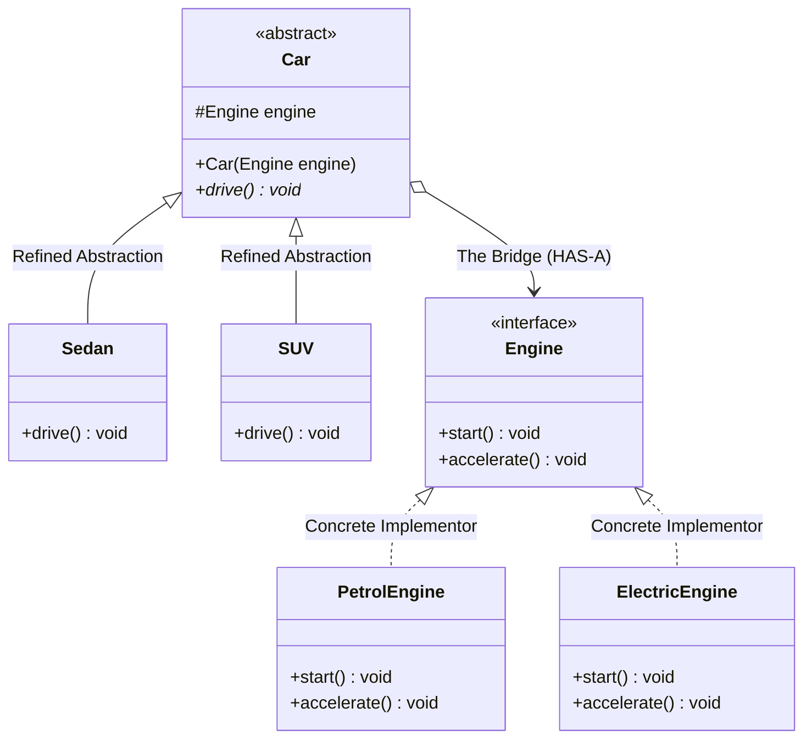

# 25. Bridge Design Pattern

> 💡 **Quick Revision Anchor**: The **Bridge Pattern** is a **structural design pattern** that decouples an **abstraction** (high-level control logic) from its **implementation** (low-level platform execution) so that the two can vary independently. It converts an exponential $M \times N$ **combinatorial class explosion** into a manageable $M + N$ modular architecture using composition.

---

## 1. Context & The "Class Explosion" Problem

Imagine building a vehicle manufacturing simulation:
- You have **Car Types** ($M$): `Sedan`, `SUV`, `Hatchback`.
- You have **Engine Types** ($N$): `PetrolEngine`, `DieselEngine`, `ElectricEngine`, `CNGEngine`.

### The Anti-Pattern: Deep Multi-Tier Inheritance
If you model this with simple subclassing:
```text
Vehicle
├── SedanPetrol
├── SedanDiesel
├── SedanElectric
├── SedanCNG
├── SUVPetrol
├── SUVDiesel
├── SUVElectric
├── SUVCNG
├── HatchbackPetrol
...
```
- Total classes needed: $M \times N = 3 \times 4 = 12$ classes.
- Adding 1 new car type (`Truck`) requires $4$ new classes.
- Adding 1 new fuel type (`Hydrogen`) requires $4$ new classes.
- **Result**: Exponential class explosion, massive code duplication, and tight coupling.

---

## 2. The Bridge Solution: Decoupling Abstraction & Implementation

Instead of combining features into a monolithic inheritance hierarchy, we recognize that **Car Type** and **Engine Type** are two orthogonal dimensions of variation. We split them into two separate hierarchies and bridge them via **composition**.



### The 4 Key Roles:
1. **Abstraction (`Car`)**: High-level interface defining the control operations. Maintains a reference to the `Engine` implementor.
2. **Refined Abstraction (`Sedan`, `SUV`)**: Extends the abstraction to provide specialized high-level domain variants.
3. **Implementor (`Engine`)**: Low-level interface declaring platform/primitive operations (`start()`, `accelerate()`).
4. **Concrete Implementors (`PetrolEngine`, `ElectricEngine`)**: Actual concrete executions of the low-level primitives.

> 📉 **Complexity Reduction**: From $M \times N$ classes down to $M + N$ classes! ($3 + 4 = 7$ classes instead of $12$).

---

## 3. Production Java Implementation

### Step 1: Implementor Interface & Concrete Implementors
```java
// Implementor: Low-level primitive operations
public interface Engine {
    void start();
    void accelerate(int targetSpeedKmH);
}

// Concrete Implementor 1: Petrol Engine
public class PetrolEngine implements Engine {
    @Override
    public void start() {
        System.out.println("[Petrol Engine] Spark plug fired. Fuel injected. Engine rumbling: Vroom!");
    }

    @Override
    public void accelerate(int targetSpeedKmH) {
        System.out.println("[Petrol Engine] Burning petrol to accelerate to " + targetSpeedKmH + " km/h.");
    }
}

// Concrete Implementor 2: Electric Engine
public class ElectricEngine implements Engine {
    @Override
    public void start() {
        System.out.println("[Electric Motor] Battery contactors closed. Inverter active. Silent hum: ...");
    }

    @Override
    public void accelerate(int targetSpeedKmH) {
        System.out.println("[Electric Motor] Drawing instantaneous torque from lithium pack to reach " 
                           + targetSpeedKmH + " km/h.");
    }
}
```

### Step 2: Abstraction & Refined Abstractions
```java
// Abstraction: Holds the Bridge reference to the Implementor
public abstract class Car {
    protected final Engine engine; // The Bridge

    public Car(Engine engine) {
        this.engine = engine;
    }

    public abstract void drive();
}

// Refined Abstraction 1: Sedan
public class Sedan extends Car {
    public Sedan(Engine engine) {
        super(engine);
    }

    @Override
    public void drive() {
        System.out.println("\n[Sedan] Starting comfortable city cruise...");
        engine.start();
        engine.accelerate(60);
    }
}

// Refined Abstraction 2: SUV
public class SUV extends Car {
    public SUV(Engine engine) {
        super(engine);
    }

    @Override
    public void drive() {
        System.out.println("\n[SUV] Engaging all-wheel traction for rugged terrain...");
        engine.start();
        engine.accelerate(100);
    }
}
```

### Step 3: Client Driver & Verification
```java
public class Main {
    public static void main(String[] args) {
        // Compose Sedan with Petrol Engine
        Car petrolSedan = new Sedan(new PetrolEngine());
        petrolSedan.drive();

        // Compose Same Sedan with Electric Engine
        Car evSedan = new Sedan(new ElectricEngine());
        evSedan.drive();

        // Compose SUV with Electric Engine
        Car evSuv = new SUV(new ElectricEngine());
        evSuv.drive();

        // Compose SUV with Petrol Engine
        Car petrolSuv = new SUV(new PetrolEngine());
        petrolSuv.drive();
    }
}
```

---

## 4. Output Execution Simulation

```text
[Sedan] Starting comfortable city cruise...
[Petrol Engine] Spark plug fired. Fuel injected. Engine rumbling: Vroom!
[Petrol Engine] Burning petrol to accelerate to 60 km/h.

[Sedan] Starting comfortable city cruise...
[Electric Motor] Battery contactors closed. Inverter active. Silent hum: ...
[Electric Motor] Drawing instantaneous torque from lithium pack to reach 60 km/h.

[SUV] Engaging all-wheel traction for rugged terrain...
[Electric Motor] Battery contactors closed. Inverter active. Silent hum: ...
[Electric Motor] Drawing instantaneous torque from lithium pack to reach 100 km/h.

[SUV] Engaging all-wheel traction for rugged terrain...
[Petrol Engine] Spark plug fired. Fuel injected. Engine rumbling: Vroom!
[Petrol Engine] Burning petrol to accelerate to 100 km/h.
```

---

## 5. Bridge vs. Strategy Pattern: Key Differences

| Feature | Bridge Pattern | Strategy Pattern |
| :--- | :--- | :--- |
| **Category** | **Structural Design Pattern**. | **Behavioral Design Pattern**. |
| **Intent** | Prevents combinatorial class explosion by splitting **two independent hierarchies** (Abstraction and Implementation). | Encapsulates interchangeable algorithms/behaviors in a family of classes. |
| **Architectural Scope** | Decided **upfront at architectural design time** to structure the entire system. | Introduced to vary specific business logic or operations at **runtime**. |
| **Hierarchy** | Features **two parallel inheritance trees** connected by a bridge reference. | Usually has **one context class** delegating to a strategy hierarchy. |

---

## 6. Real-World Applications & Interview Checklist

1. **Cross-Platform Graphics & UI Toolkits**:
   - Abstraction: `Window` (`DialogWindow`, `IconWindow`).
   - Implementor: `WindowImp` (`XWindowImp` for Linux, `MSWindowImp` for Windows, `MacWindowImp` for macOS).
2. **Database Drivers**:
   - Abstraction: Standard JDBC `java.sql.Connection` / `Statement`.
   - Implementor: Vendor-specific database protocols (PostgreSQL driver, MySQL driver, Oracle OCI driver).
3. **Interview Gotcha**:
   - Why not just use multiple interfaces? Multiple inheritance causes diamond ambiguity and tightly couples concrete implementations. Bridge uses composition, keeping both abstractions flexible and extensible.
