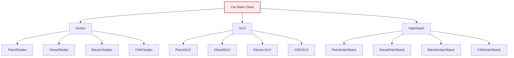
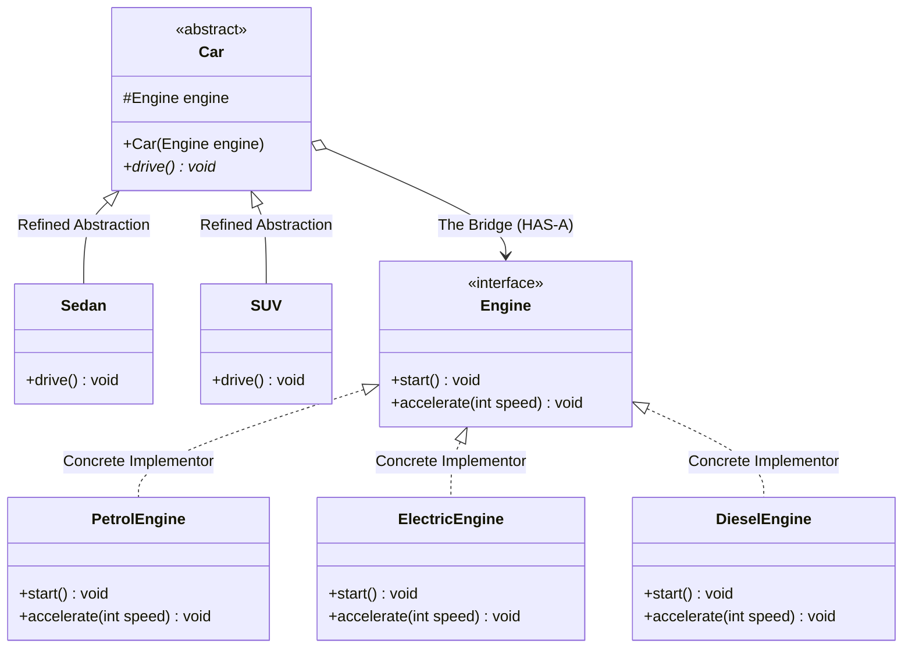
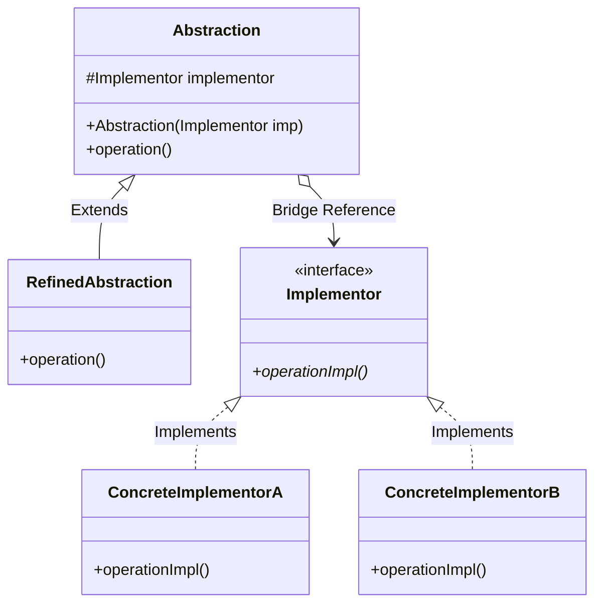

# 25. Bridge Design Pattern

> 💡 **Quick Revision Anchor**: The **Bridge Pattern** is a **structural design pattern** that decouples an **abstraction (high-level control logic)** from its **implementation (low-level platform execution)** so that both can vary independently. It converts an exponential $M \times N$ **combinatorial class explosion** into a clean $M + N$ modular architecture by replacing deep inheritance with **object composition**.

---

## 1. Executive Summary & Lecture Motivation

When designing systems that operate across multiple dimensions of variation, developers frequently fall into the trap of using multi-level inheritance hierarchies.

### The Problem: Cartesian Product Class Explosion ($M \times N$)
Consider a vehicle manufacturing system where vehicles vary across two independent orthogonal axes:
1. **Car Body Types ($M$)**: `Sedan`, `SUV`, `Hatchback`.
2. **Engine / Powertrain Types ($N$)**: `PetrolEngine`, `DieselEngine`, `ElectricEngine`, `CNGEngine`.



### Consequences of Pure Inheritance:
- **Combinatorial Growth**: $3 \text{ car types} \times 4 \text{ engine types} = 12$ distinct classes.
- **Maintenance Nightmare**: Adding a single new car type (e.g. `Truck`) forces the creation of $4$ new classes. Adding a single new fuel type (e.g. `HydrogenEngine`) forces modifying and adding classes across every car type.
- **Violates OCP & SRP**: Classes end up with duplicated drive logic, mixing chassis aerodynamics with internal combustion mechanics.

---

## 2. The Bridge Solution: Decoupling Abstraction & Implementation

The GoF Bridge Pattern solves this by separating the two axes into **two parallel, independent hierarchies** linked together by a composition bridge (`has-a` relationship):
1. **Abstraction Hierarchy (High-Level Control)**: What the client interacts with (`Car`, `Sedan`, `SUV`).
2. **Implementation Hierarchy (Low-Level Execution)**: How the underlying platform operates (`Engine`, `PetrolEngine`, `ElectricEngine`).



> 📉 **Complexity Transformation**: Reduced from $M \times N$ classes down to $M + N$ classes! ($3 + 4 = 7$ classes instead of $12$).

---

## 3. Standard GoF Architecture & Participants



| Participant | Responsibility in Architecture |
| :--- | :--- |
| **`Abstraction`** | Defines the high-level domain control interface. Maintains a reference (`bridge`) to an object of type `Implementor`. |
| **`RefinedAbstraction`** | Extends the `Abstraction` to provide customer-facing specialized variants (e.g. `Sedan`, `SUV`, `AdvancedRemote`). |
| **`Implementor`** | Interface for all implementation classes. Defines primitive, platform-level operations (e.g. `start()`, `accelerate()`, `turnOn()`). |
| **`ConcreteImplementor`** | Implements the `Implementor` interface for a specific platform, hardware device, or operating system. |

---

## 4. Production Java Implementation: Vehicle & Powertrain Engine

```java
package com.designpatterns.bridge.car;

// ============================================================================
// 1. IMPLEMENTOR HIERARCHY (LOW-LEVEL EXECUTION ENGINE)
// ============================================================================

interface Engine {
    void start();
    void accelerate(int targetSpeedKmH);
}

class PetrolEngine implements Engine {
    @Override
    public void start() {
        System.out.println("  [Petrol Engine] Spark plug ignited. Fuel injected. Engine roaring: Vroom!");
    }

    @Override
    public void accelerate(int targetSpeedKmH) {
        System.out.println("  [Petrol Engine] Burning petrol to accelerate to " + targetSpeedKmH + " km/h.");
    }
}

class DieselEngine implements Engine {
    @Override
    public void start() {
        System.out.println("  [Diesel Engine] Glow plugs heated. Compression ignition active. Deep rumble...");
    }

    @Override
    public void accelerate(int targetSpeedKmH) {
        System.out.println("  [Diesel Engine] Delivering high low-end torque up to " + targetSpeedKmH + " km/h.");
    }
}

class ElectricEngine implements Engine {
    @Override
    public void start() {
        System.out.println("  [Electric Motor] High-voltage contactors closed. Inverter active. Silent hum...");
    }

    @Override
    public void accelerate(int targetSpeedKmH) {
        System.out.println("  [Electric Motor] Drawing instantaneous battery torque to reach " + targetSpeedKmH + " km/h.");
    }
}

// ============================================================================
// 2. ABSTRACTION HIERARCHY (HIGH-LEVEL CAR DOMAIN)
// ============================================================================

abstract class Car {
    protected final Engine engine; // The Bridge Reference

    public Car(Engine engine) {
        this.engine = engine;
    }

    public abstract void drive();
}

class Sedan extends Car {
    public Sedan(Engine engine) {
        super(engine);
    }

    @Override
    public void drive() {
        System.out.println("\n>>> [Sedan] Cruising comfortably in urban traffic...");
        engine.start();
        engine.accelerate(60);
    }
}

class SUV extends Car {
    public SUV(Engine engine) {
        super(engine);
    }

    @Override
    public void drive() {
        System.out.println("\n>>> [SUV] Engaging all-wheel traction for rough terrain...");
        engine.start();
        engine.accelerate(110);
    }
}

// ============================================================================
// 3. CLIENT VERIFICATION
// ============================================================================

public class BridgeCarDemo {
    public static void main(String[] args) {
        // Any Car can be dynamically paired with Any Engine!
        Car petrolSedan = new Sedan(new PetrolEngine());
        petrolSedan.drive();

        Car electricSedan = new Sedan(new ElectricEngine());
        electricSedan.drive();

        Car dieselSuv = new SUV(new DieselEngine());
        dieselSuv.drive();

        Car electricSuv = new SUV(new ElectricEngine());
        electricSuv.drive();
    }
}
```

---

## 5. Lecture Example 2: Universal Remote Control & Televisions

In the lecture, the instructor presents a classic hardware application:
- **Abstraction**: `RemoteControl` (`BasicButtonRemote`, `TouchScreenRemote`).
- **Implementor**: `Device` (`SonyTV`, `LgTV`, `OledTV`, `LcdTV`).
- Any newly engineered remote can seamlessly pair with any TV hardware without modifying either class hierarchy.

```mermaid
flowchart LR
    subgraph "Remotes (Abstraction)"
        R1["BasicButtonRemote"]
        R2["TouchScreenRemote"]
    end

    subgraph "Bridge"
        Bridge["device.turnOn()<br/>device.setChannel()"]
    end

    subgraph "TVs (Implementor)"
        T1["SonyOledTV"]
        T2["LgLcdTV"]
    end

    R1 --> Bridge
    R2 --> Bridge
    Bridge --> T1
    Bridge --> T2
```

```java
package com.designpatterns.bridge.tv;

interface TVDevice {
    void turnOn();
    void turnOff();
    void setChannel(int channel);
}

class SonyOledTV implements TVDevice {
    @Override public void turnOn() { System.out.println("  [Sony OLED] Displaying 4K splash screen. Power ON."); }
    @Override public void turnOff() { System.out.println("  [Sony OLED] Pixels dimmed to zero. Power OFF."); }
    @Override public void setChannel(int channel) { System.out.println("  [Sony OLED] Tuned to HD channel: " + channel); }
}

class LgLcdTV implements TVDevice {
    @Override public void turnOn() { System.out.println("  [LG LCD] Backlight warming up. Power ON."); }
    @Override public void turnOff() { System.out.println("  [LG LCD] Backlight turned off. Standby."); }
    @Override public void setChannel(int channel) { System.out.println("  [LG LCD] Tuned to digital channel: " + channel); }
}

abstract class RemoteControl {
    protected final TVDevice device;

    public RemoteControl(TVDevice device) {
        this.device = device;
    }

    public void power() { device.turnOn(); }
    public abstract void changeChannel(int ch);
}

class BasicButtonRemote extends RemoteControl {
    public BasicButtonRemote(TVDevice device) { super(device); }
    @Override
    public void changeChannel(int ch) {
        System.out.println("[Button Remote] Physical button clicked for channel " + ch);
        device.setChannel(ch);
    }
}

class TouchScreenRemote extends RemoteControl {
    public TouchScreenRemote(TVDevice device) { super(device); }
    @Override
    public void changeChannel(int ch) {
        System.out.println("[Touch Remote] Haptic swipe gesture routed to channel " + ch);
        device.setChannel(ch);
    }
}
```

---

## 6. Lecture Example 3: Cross-Platform GUI Toolkits

In graphic windowing systems (e.g. Java AWT, Flutter, Qt):
- **High-level UI Abstraction**: `TextBox`, `Dropdown`, `RadioButton`, `Window`.
- **Low-level OS Implementation**: `WindowsOSImp`, `MacOSImp`, `LinuxOSImp`.
- A `TextBox` renders using native OS font rendering and native window handles without the application UI code ever knowing which operating system is hosting the screen.

---

## 7. Comparison: Bridge vs Strategy vs Adapter

| Feature | Bridge Pattern | Strategy Pattern | Adapter Pattern |
| :--- | :--- | :--- | :--- |
| **Category** | **Structural Pattern** | **Behavioral Pattern** | **Structural Pattern** |
| **Primary Intent** | Decouple **abstraction and implementation** to avoid $M \times N$ class explosion | Interchangeable **algorithms / behaviors** at runtime | Make **incompatible interfaces** work together |
| **Timing** | Designed **upfront** before coding large multi-platform architectures | Introduced when multiple business algorithms exist | Applied **retrospectively** to integrate legacy or third-party code |
| **Structure** | **Two parallel inheritance hierarchies** connected by a bridge reference | A single context class holding a reference to a Strategy interface | Adapter wraps an existing Adaptee to conform to Target interface |

---

## Quick Revision

### Core Idea
Decouples an abstraction from its implementation so that both can vary independently, eliminating combinatorial $M \times N$ class explosion through composition.

### Remember
- **Abstraction** = The high-level control entity the client calls (e.g. `Car`, `RemoteControl`).
- **Implementor** = The low-level execution interface performing primitive tasks (e.g. `Engine`, `TVDevice`).
- Complexity decreases from **exponential product** ($M \times N$) to **additive sum** ($M + N$).

### Java Implementation Idea
```java
abstract class Abstraction {
    protected Implementor implementor;
    public Abstraction(Implementor imp) { this.implementor = imp; }
    public abstract void operation();
}
```

### Most Important Interview Point
**Bridge vs Adapter**: An **Adapter** is introduced *after* systems are built to bridge incompatible, pre-existing legacy classes. A **Bridge** is designed *upfront* at system architecture time to ensure that high-level abstractions and low-level platform primitives can evolve independently.

### Common Trap
Confusing Bridge with Strategy. While both use composition, **Strategy** alters a single runtime algorithm inside a class, whereas **Bridge** links two entirely distinct multi-tiered inheritance hierarchies together.
