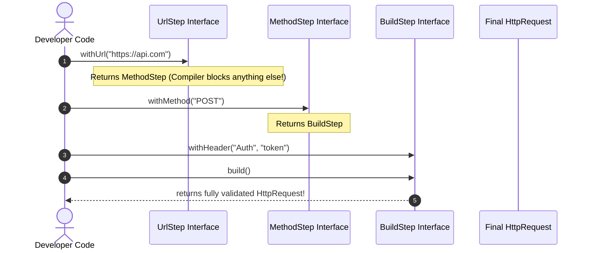

# 28. Builder Design Pattern

> 💡 **Quick Revision Anchor**: The **Builder Pattern** is a **creational design pattern** that separates the construction of a complex object from its representation, allowing the same construction process to create diverse representations. It eliminates the **Telescoping Constructor Anti-Pattern** and the **JavaBean Setter Mutability Trap**, delivering clean, immutable objects with compile-time verification via **Step Builders** and reusable construction templates via the **Director**.

---

## 1. Executive Summary & The Two Anti-Patterns Solved

Creating complex objects with dozens of configuration attributes (e.g., an enterprise `HttpRequest` with URL, HTTP method, headers, query parameters, payload body, timeouts, redirect policies, and retry counts) leads to two classical anti-patterns:

### Anti-Pattern 1: Telescoping Constructors
```java
// PROBLEM: Monolithic constructor explosion
public HttpRequest(String url) { ... }
public HttpRequest(String url, String method) { ... }
public HttpRequest(String url, String method, Map<String, String> headers) { ... }
public HttpRequest(String url, String method, Map<String, String> headers, String body) { ... }
public HttpRequest(String url, String method, Map<String, String> headers, String body, int timeout, int retries) { ... }

// Client usage is illegible and hazardous:
HttpRequest req = new HttpRequest("https://api.com", "POST", null, "{...}", 5000, 3);
```
- **Danger**: Swapping adjacent parameters of identical types (e.g. `timeout` vs `retries`) causes catastrophic silent runtime bugs. Callers are forced to pass confusing `null` values for unused parameters.

### Anti-Pattern 2: JavaBeans Mutability Trap (Zero-Arg Constructor + Setters)
```java
// PROBLEM: Half-baked objects & lost immutability
HttpRequest req = new HttpRequest();
req.setUrl("https://api.stripe.com/v1/charges");
// Thread context switch occurs here -> Object is incomplete and invalid!
req.setMethod("POST");
req.setTimeout(5000);
```
- **Danger**: The object is in an **inconsistent, half-baked state** between setter calls. Fields cannot be marked `final`, destroying **immutability** and causing race conditions in multi-threaded environments.

---

## 2. The Solution: Standard Builder Pattern (Fluent API)

The Builder pattern introduces an auxiliary builder object that collects parameters step-by-step and constructs the target object only when `.build()` is called.

```mermaid
classDiagram
    class HttpRequest {
        -String url
        -String method
        -Map~String, String~ headers
        -String body
        -int timeoutMs
        -HttpRequest(Builder b)
        +getUrl() String
        +getMethod() String
    }

    class Builder {
        -String url
        -String method
        -Map~String, String~ headers
        -String body
        -int timeoutMs
        +Builder(String url, String method)
        +withHeader(String k, String v) Builder
        +withBody(String b) Builder
        +withTimeout(int ms) Builder
        +build() HttpRequest
    }

    HttpRequest +-- Builder : Static Nested Class
    HttpRequest <-- Builder : Constructs Immutable Instance
```

### Core Architecture Rules:
1. **Target Object is Immutable**: All fields in `HttpRequest` are `private final`. No public setters exist.
2. **Private Constructor**: `HttpRequest` has a `private` constructor accepting only its `Builder`.
3. **Fluent Chaining**: Every configuration method inside the `Builder` returns `this`.
4. **Validation at Build Time**: Invariants are validated inside `.build()` before instantiating the object.

---

## 3. Evolution 2: Builder with Director Pattern

In classic Gang of Four architecture, a **Director** class encapsulates predefined, reusable assembly recipes for common object configurations:


The Director knows the exact sequence of builder method calls required to produce standard products (e.g., a standard `JSON POST` request or an authenticated `Bearer Token` request).

---

## 4. Evolution 3: Step Builder Pattern (Compile-Time Validation)

### The Problem with Standard Builders
In a standard builder, if a developer forgets to call `.withUrl()`, the error is only caught at **runtime** when `.build()` is executed. 
Can we force mandatory fields to be provided in a strict sequence at **compile-time**?

### The Step Builder Solution
By defining a chain of nested interfaces, each method return type forces the developer to call the next required method in the chain:
$$\text{UrlStep} \longrightarrow \text{MethodStep} \longrightarrow \text{Optional/BuildStep}$$



---

## 5. Complete, Compilable Java Implementation

Below is the complete Java implementation featuring:
1. The **Standard Immutable Builder**.
2. The **Director** with standard pre-configured templates.
3. The **Step Builder** enforcing compilation-stage ordering.

```java
package com.designpatterns.builder;

import java.util.Collections;
import java.util.HashMap;
import java.util.Map;

// ============================================================================
// PART 1: STANDARD IMMUTABLE BUILDER
// ============================================================================

class HttpRequest {
    // Immutable fields
    private final String url;
    private final String method;
    private final Map<String, String> headers;
    private final String body;
    private final int timeoutMs;

    private HttpRequest(Builder builder) {
        this.url = builder.url;
        this.method = builder.method;
        this.headers = Collections.unmodifiableMap(new HashMap<>(builder.headers));
        this.body = builder.body;
        this.timeoutMs = builder.timeoutMs;
    }

    public String getUrl() { return url; }
    public String getMethod() { return method; }
    public Map<String, String> getHeaders() { return headers; }
    public String getBody() { return body; }
    public int getTimeoutMs() { return timeoutMs; }

    @Override
    public String toString() {
        return "HttpRequest[Method=" + method + ", URL=" + url + ", Timeout=" + timeoutMs 
               + "ms, Headers=" + headers + ", Body=" + body + "]";
    }

    // Static nested Builder
    public static class Builder {
        private String url;
        private String method = "GET"; // Default
        private final Map<String, String> headers = new HashMap<>();
        private String body = "";
        private int timeoutMs = 3000;  // Default 3s

        public Builder withUrl(String url) {
            this.url = url;
            return this;
        }

        public Builder withMethod(String method) {
            this.method = method.toUpperCase();
            return this;
        }

        public Builder withHeader(String key, String value) {
            this.headers.put(key, value);
            return this;
        }

        public Builder withBody(String body) {
            this.body = body;
            return this;
        }

        public Builder withTimeout(int timeoutMs) {
            this.timeoutMs = timeoutMs;
            return this;
        }

        public HttpRequest build() {
            // Invariant validations
            if (url == null || url.trim().isEmpty()) {
                throw new IllegalStateException("Validation Failed: URL cannot be null or empty!");
            }
            if (timeoutMs < 0) {
                throw new IllegalStateException("Validation Failed: Timeout cannot be negative!");
            }
            return new HttpRequest(this);
        }
    }
}

// ============================================================================
// PART 2: BUILDER WITH DIRECTOR PATTERN
// ============================================================================

class HttpRequestDirector {
    public static HttpRequest createStandardJsonPost(String url, String jsonPayload) {
        return new HttpRequest.Builder()
                .withUrl(url)
                .withMethod("POST")
                .withHeader("Content-Type", "application/json")
                .withHeader("Accept", "application/json")
                .withBody(jsonPayload)
                .withTimeout(5000)
                .build();
    }

    public static HttpRequest createQuickGet(String url) {
        return new HttpRequest.Builder()
                .withUrl(url)
                .withMethod("GET")
                .withTimeout(2000)
                .build();
    }
}

// ============================================================================
// PART 3: STEP BUILDER PATTERN (COMPILE-TIME STEP ENFORCEMENT)
// ============================================================================

class StepHttpRequest {
    private String url;
    private String method;
    private Map<String, String> headers = new HashMap<>();
    private String body = "";

    private StepHttpRequest() {}

    public String getUrl() { return url; }
    public String getMethod() { return method; }

    @Override
    public String toString() {
        return "StepHttpRequest[" + method + " " + url + ", Headers=" + headers + ", Body=" + body + "]";
    }

    // Step 1: Mandatory URL
    public interface UrlStep {
        MethodStep withUrl(String url);
    }

    // Step 2: Mandatory Method
    public interface MethodStep {
        BuildStep withMethod(String method);
    }

    // Step 3: Optional configurations & terminal build()
    public interface BuildStep {
        BuildStep withHeader(String key, String value);
        BuildStep withBody(String body);
        StepHttpRequest build();
    }

    // Entry point initiating the step chain
    public static UrlStep stepBuilder() {
        return new StepBuilderImpl();
    }

    private static class StepBuilderImpl implements UrlStep, MethodStep, BuildStep {
        private final StepHttpRequest request = new StepHttpRequest();

        @Override
        public MethodStep withUrl(String url) {
            request.url = url;
            return this; // Transitions to MethodStep
        }

        @Override
        public BuildStep withMethod(String method) {
            request.method = method.toUpperCase();
            return this; // Transitions to BuildStep
        }

        @Override
        public BuildStep withHeader(String key, String value) {
            request.headers.put(key, value);
            return this;
        }

        @Override
        public BuildStep withBody(String body) {
            request.body = body;
            return this;
        }

        @Override
        public StepHttpRequest build() {
            return request;
        }
    }
}

// ============================================================================
// MAIN DEMONSTRATION DRIVER
// ============================================================================

public class BuilderPatternDemo {
    public static void main(String[] args) {
        System.out.println("=================================================");
        System.out.println("1. STANDARD BUILDER PATTERN");
        System.out.println("=================================================");
        HttpRequest customReq = new HttpRequest.Builder()
                .withUrl("https://api.stripe.com/v1/charges")
                .withMethod("POST")
                .withHeader("Authorization", "Bearer sk_test_secret123")
                .withHeader("Content-Type", "application/json")
                .withBody("{\"amount\": 5000}")
                .withTimeout(8000)
                .build();
        System.out.println(customReq);

        System.out.println("\n=================================================");
        System.out.println("2. DIRECTOR RECIPES");
        System.out.println("=================================================");
        HttpRequest quickGet = HttpRequestDirector.createQuickGet("https://api.github.com/users/octocat");
        System.out.println("Quick GET: " + quickGet);

        HttpRequest jsonPost = HttpRequestDirector.createStandardJsonPost("https://api.server.com/orders", "{\"item\": \"Laptop\"}");
        System.out.println("JSON POST: " + jsonPost);

        System.out.println("\n=================================================");
        System.out.println("3. COMPILE-TIME STEP BUILDER");
        System.out.println("=================================================");
        // Notice: You CANNOT call withMethod() before withUrl()! The compiler prevents it!
        StepHttpRequest stepReq = StepHttpRequest.stepBuilder()
                .withUrl("https://auth.mycompany.com/oauth/token") // Returns MethodStep
                .withMethod("POST")                               // Returns BuildStep
                .withHeader("Client-Id", "mobile-app")
                .withBody("grant_type=client_credentials")
                .build();
        System.out.println(stepReq);
    }
}
```

---

## 6. Execution Output

```text
=================================================
1. STANDARD BUILDER PATTERN
=================================================
HttpRequest[Method=POST, URL=https://api.stripe.com/v1/charges, Timeout=8000ms, Headers={Authorization=Bearer sk_test_secret123, Content-Type=application/json}, Body={"amount": 5000}]

=================================================
2. DIRECTOR RECIPES
=================================================
Quick GET: HttpRequest[Method=GET, URL=https://api.github.com/users/octocat, Timeout=2000ms, Headers={}, Body=]
JSON POST: HttpRequest[Method=POST, URL=https://api.server.com/orders, Timeout=5000ms, Headers={Accept=application/json, Content-Type=application/json}, Body={"item": "Laptop"}]

=================================================
3. COMPILE-TIME STEP BUILDER
=================================================
StepHttpRequest[POST https://auth.mycompany.com/oauth/token, Headers={Client-Id=mobile-app}, Body=grant_type=client_credentials]
```

---

## Quick Revision

### Core Idea
Separates the construction of a complex object from its representation, enabling step-by-step assembly of immutable objects while eliminating telescoping constructors and mutable JavaBean setters.

### Remember
- **Standard Builder**: Static nested `Builder` class with fluent method chaining returning `this`, and terminal `.build()` instantiating an immutable target.
- **Director**: Coordinates reusable pre-assembled recipes for common object variations.
- **Step Builder**: Chains sequential nested interfaces (`UrlStep` $\to$ `MethodStep` $\to$ `BuildStep`) to enforce mandatory construction steps at **compile time**.

### Java Implementation Idea
```java
public static class Builder {
    private String url;
    public Builder withUrl(String u) { this.url = u; return this; }
    public HttpRequest build() {
        if (url == null) throw new IllegalStateException();
        return new HttpRequest(this);
    }
}
```

### Most Important Interview Point
**Builder vs Factory**: A **Factory** instantiates an entire family or polymorphic subtype in a single invocation (`createBurger()`), whereas a **Builder** constructs a single complex, highly configurable object through incremental, multi-step parameter assembly (`withBread().withCheese().build()`).

### Common Trap
Exposing public setters on the target object alongside a Builder. Setters break **immutability**, allowing external callers to corrupt the object's validated internal invariants after construction.
