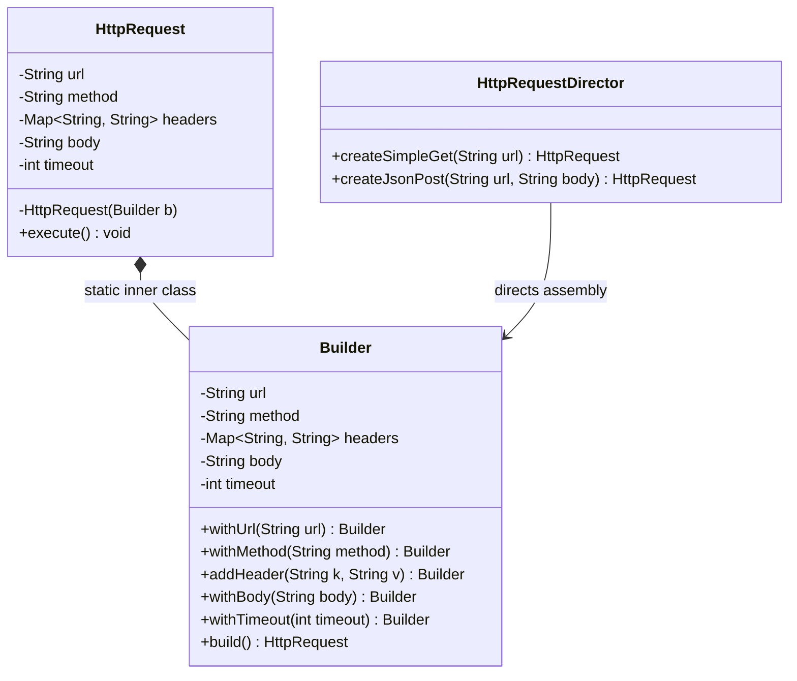

# 28. Builder Design Pattern

> 💡 **Quick Revision Anchor**
> - The **Builder Pattern** separates the construction of a complex object from its representation, allowing the same construction process to produce various configurations.
> - Solves two classic anti-patterns:
>   1. **Telescoping Constructors:** Constructors with dozens of confusing parameters (`new Request("url", "GET", null, null, true, 5000)`).
>   2. **JavaBeans / Setter Mutation:** Calling setters leaves objects in inconsistent, mutable states during creation.
> - Key Variants:
>   - **Fluent Builder:** Method chaining (`return this;`) building an immutable object on `.build()`.
>   - **Director:** Encapsulates pre-packaged configuration recipes.
>   - **Step Builder:** Enforces mandatory fields in strict compile-time sequence.

---

## 1. What Problem Are We Solving?

Consider building an **HTTP Request** object containing both mandatory and optional attributes:
- **Mandatory:** `url`, `method` (GET, POST, etc.).
- **Optional:** `headers`, `body`, `timeout`, `retries`, `queryParams`.

### Anti-Pattern 1: Telescoping Constructors
```java
// ❌ Constructor explosion: confusing, unreadable, error-prone
public HttpRequest(String url, String method) { ... }
public HttpRequest(String url, String method, Map headers) { ... }
public HttpRequest(String url, String method, Map headers, String body) { ... }
public HttpRequest(String url, String method, Map headers, String body, int timeout) { ... }
```
- Developers pass `null` values for optional fields they don't need: `new HttpRequest("url", "GET", null, null, 5000)`.
- Easy to accidentally swap arguments of the same type (e.g., `timeout` vs `retries`).

### Anti-Pattern 2: JavaBeans Pattern (Setters)
```java
// ❌ Inconsistent state & loss of immutability
HttpRequest req = new HttpRequest();
req.setUrl("https://api.com");
// If another thread accesses 'req' here, method is null!
req.setMethod("POST");
```
- Object is mutable and exists in a partially constructed, invalid state during construction.

---

## 2. Key Design Idea: Fluent Builder & Step Builder

Extract the construction logic into a companion **Builder**:
1. The target object has a `private` constructor and final fields (immutable).
2. The Builder collects parameters via fluent chaining (`return this;`).
3. The `.build()` method validates invariants and returns the completed object.
4. **Step Builder:** Uses chained step-interfaces to enforce mandatory parameters at **compile-time** before allowing `.build()`.

```
Client ──▶ Builder()
              .withUrl("https://api.com")
              .withMethod("POST")
              .withBody("{\"data\": 1}")
              .build() ─────────────────────▶ Immutable HttpRequest
```

---

## 3. Visual Architecture




---

## 4. Concise Java Implementation (Primary Lecture Example)

```java
import java.util.*;

// ==========================================
// 1. TARGET ENTITY WITH FLUENT INNER BUILDER
// ==========================================
public class HttpRequest {
    private final String url;
    private final String method;
    private final Map<String, String> headers;
    private final String body;
    private final int timeout;

    // Private constructor: instantiated exclusively by Builder
    private HttpRequest(Builder b) {
        this.url = b.url;
        this.method = b.method;
        this.headers = Collections.unmodifiableMap(new HashMap<>(b.headers));
        this.body = b.body;
        this.timeout = b.timeout;
    }

    public void execute() {
        System.out.println("Executing [" + method + "] to " + url);
        System.out.println("  Headers: " + headers);
        if (body != null) System.out.println("  Body: " + body);
        System.out.println("  Timeout: " + timeout + " ms\n");
    }

    // Static Inner Builder
    public static class Builder {
        private String url;
        private String method = "GET"; // Default
        private final Map<String, String> headers = new HashMap<>();
        private String body;
        private int timeout = 30000;   // Default 30s

        public Builder withUrl(String url) {
            this.url = url;
            return this; // Enables fluent chaining
        }

        public Builder withMethod(String method) {
            this.method = method;
            return this;
        }

        public Builder addHeader(String key, String value) {
            this.headers.put(key, value);
            return this;
        }

        public Builder withBody(String body) {
            this.body = body;
            return this;
        }

        public Builder withTimeout(int timeout) {
            this.timeout = timeout;
            return this;
        }

        public HttpRequest build() {
            // Validation at build time
            if (url == null || url.trim().isEmpty()) {
                throw new IllegalStateException("URL is mandatory for HttpRequest.");
            }
            return new HttpRequest(this);
        }
    }
}

// ==========================================
// 2. DIRECTOR (Predefined Configuration Recipes)
// ==========================================
class HttpRequestDirector {
    public HttpRequest createSimpleGet(String url) {
        return new HttpRequest.Builder()
                .withUrl(url)
                .withMethod("GET")
                .addHeader("Accept", "application/json")
                .withTimeout(5000)
                .build();
    }

    public HttpRequest createJsonPost(String url, String json) {
        return new HttpRequest.Builder()
                .withUrl(url)
                .withMethod("POST")
                .addHeader("Content-Type", "application/json")
                .withBody(json)
                .withTimeout(10000)
                .build();
    }
}

// ==========================================
// 3. STEP BUILDER (Compile-Time Enforced Sequence)
// ==========================================
class StepHttpRequest {
    public interface UrlStep { MethodStep withUrl(String url); }
    public interface MethodStep { OptionalStep withMethod(String method); }
    public interface OptionalStep {
        OptionalStep withBody(String body);
        StepHttpRequest build();
    }

    private String url, method, body;

    public static UrlStep getBuilder() {
        return new InnerStepBuilder();
    }

    private static class InnerStepBuilder implements UrlStep, MethodStep, OptionalStep {
        private String url, method, body;

        @Override public MethodStep withUrl(String url) { this.url = url; return this; }
        @Override public OptionalStep withMethod(String method) { this.method = method; return this; }
        @Override public OptionalStep withBody(String body) { this.body = body; return this; }

        @Override public StepHttpRequest build() {
            StepHttpRequest req = new StepHttpRequest();
            req.url = this.url;
            req.method = this.method;
            req.body = this.body;
            return req;
        }
    }
}

// ==========================================
// Driver Demonstration
// ==========================================
class Main {
    public static void main(String[] args) {
        // 1. Fluent Builder
        HttpRequest customReq = new HttpRequest.Builder()
                .withUrl("https://api.example.com/users")
                .withMethod("POST")
                .addHeader("Authorization", "Bearer token123")
                .withBody("{\"name\": \"Rohit\"}")
                .withTimeout(15000)
                .build();
        customReq.execute();

        // 2. Director Predefined Recipe
        HttpRequestDirector director = new HttpRequestDirector();
        HttpRequest getReq = director.createSimpleGet("https://api.example.com/status");
        getReq.execute();

        // 3. Step Builder (Compile-time safety: must call withUrl -> withMethod -> build)
        StepHttpRequest stepReq = StepHttpRequest.getBuilder()
                .withUrl("https://api.example.com/ping")
                .withMethod("GET")
                .build();
    }
}
```

---

## 5. Builder vs. Factory Pattern

| Dimension | Builder Pattern | Factory Pattern |
| :--- | :--- | :--- |
| **Primary Intent** | Assembles a **single complex object** step-by-step with many configurable parameters. | Creates **polymorphic types or families** of related objects in a single shot. |
| **Multi-Step Assembly** | Yes (`.withX().withY().build()`). | No (`factory.create(type)` in one call). |
| **Product Representation**| Produces diverse configurations of the same product class. | Yields distinct concrete subclass implementations of an interface. |

---

## 6. Interview Questions & Key Discussion Points

1. **How does the Builder pattern ensure thread safety and immutability?**
   - *Answer*: All fields in the target class are declared `final`, no public setters exist, and the constructor is private. Parameters are gathered in a mutable builder workspace, then passed atomically to the target object upon calling `.build()`.
2. **What is a Step Builder?**
   - *Answer*: A variation of the Builder pattern that uses an interface chain to enforce mandatory construction steps in an exact sequence at compile time, preventing developers from calling `.build()` until all required fields are set.
3. **When should you NOT use the Builder pattern?**
   - *Answer*: When a class has only 2 or 3 attributes that are all mandatory. Using a builder for tiny, simple data classes adds needless boilerplate without architectural value.

---

## 7. Quick Revision

### Core Idea
Builder constructs complex, immutable objects step-by-step using fluent method chaining, avoiding telescoping constructors and mutable JavaBean setters.

### Remember
- **Structure:** Private constructor on target; public static inner `Builder` class with `return this;`.
- **Director:** Optional helper encapsulating common configuration recipes.
- **Step Builder:** Chained interfaces enforcing mandatory parameters at compile time.
- **Industry Standard:** Used heavily in `java.lang.StringBuilder`, `HttpRequest.newBuilder()`, and Lombok's `@Builder`.
