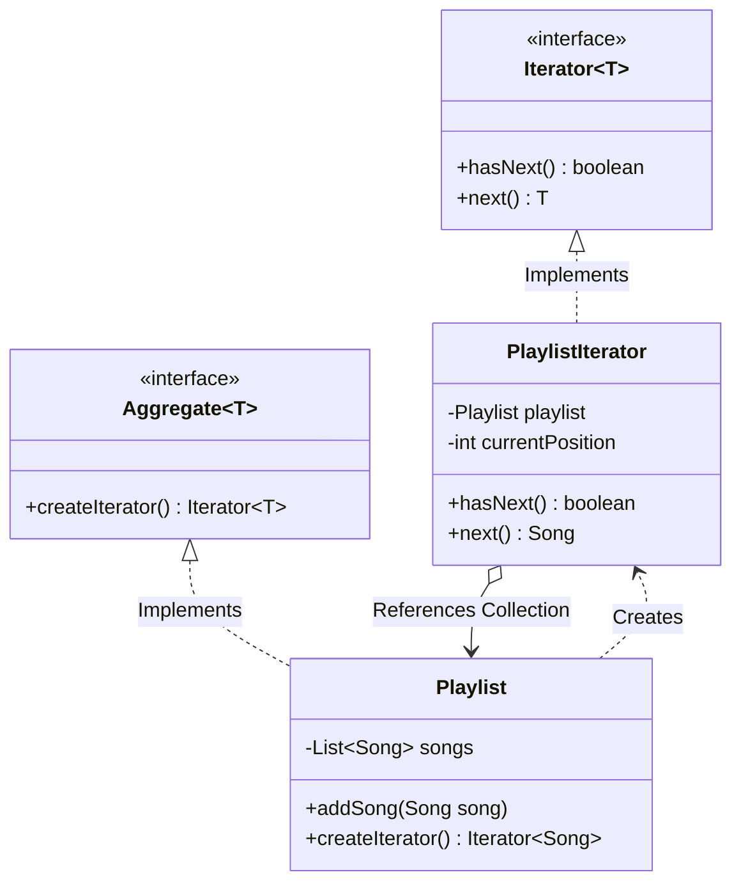

# 29. Iterator Design Pattern

> 💡 **Quick Revision Anchor**: The **Iterator Pattern** is a **behavioral design pattern** that provides a uniform way to sequentially access elements of an aggregate object (Array, LinkedList, Tree, Graph) without exposing its underlying internal data structure or representation.

---

## 1. Context & Motivation

Imagine building a custom `Playlist` service that contains `Song` objects. 
- In Version 1, you store songs inside an array `Song[]`. Clients write: `for (int i = 0; i < songs.length; i++)`.
- In Version 2, you optimize insertions by changing internal storage to a `DoublyLinkedList` or a custom `BinarySearchTree`.
- **The Problem**: Every single client traversal loop in your entire codebase breaks because clients directly depended on array indexing!
- **Violations**:
  - **Encapsulation Broken**: The collection exposes whether it is backed by nodes, pointers, arrays, or buckets.
  - **SRP Violation**: The collection is burdened with both *data storage management* and *traversal state management*.
  - **No Concurrent Traversals**: The collection cannot track multiple users traversing the playlist at different paces without messy index parameters.

---

## 2. Iterator Architecture & UML



### The 4 Key Roles:
1. **Iterator Interface (`Iterator<T>`)**: Declares operations required for traversing a sequence (`hasNext()`, `next()`).
2. **Concrete Iterator (`PlaylistIterator`)**: Implements traversal logic, maintaining a cursor/position state for a specific traversal snapshot.
3. **Aggregate Interface (`Aggregate<T>`)**: Declares a factory method (`createIterator()`) for acquiring compatible iterators.
4. **Concrete Aggregate (`Playlist`)**: Implements the factory method, returning a new instance of the concrete iterator.

---

## 3. Production Java Implementation: Custom Music Playlist Iterator

### Step 1: Generic Iterator & Aggregate Interfaces
```java
// Iterator interface
public interface CustomIterator<T> {
    boolean hasNext();
    T next();
}

// Aggregate (Iterable Collection) interface
public interface CustomAggregate<T> {
    CustomIterator<T> createIterator();
}
```

### Step 2: Domain Model & Concrete Aggregate
```java
import java.util.ArrayList;
import java.util.List;
import java.util.NoSuchElementException;

public class Song {
    private final String title;
    private final String artist;

    public Song(String title, String artist) {
        this.title = title;
        this.artist = artist;
    }

    public String getTitle() { return title; }
    public String getArtist() { return artist; }

    @Override
    public String toString() {
        return "'" + title + "' by " + artist;
    }
}

// Concrete Aggregate
public class Playlist implements CustomAggregate<Song> {
    // Encapsulated internal storage (could be LinkedList, Array, or Tree - clients won't care!)
    private final List<Song> songs = new ArrayList<>();

    public void addSong(Song song) {
        songs.add(song);
    }

    public int size() {
        return songs.size();
    }

    public Song getSongAt(int index) {
        return songs.get(index);
    }

    @Override
    public CustomIterator<Song> createIterator() {
        return new PlaylistIterator(this);
    }

    // Concrete Iterator implemented as an inner class for seamless access
    private static class PlaylistIterator implements CustomIterator<Song> {
        private final Playlist playlist;
        private int cursor = 0;

        public PlaylistIterator(Playlist playlist) {
            this.playlist = playlist;
        }

        @Override
        public boolean hasNext() {
            return cursor < playlist.size();
        }

        @Override
        public Song next() {
            if (!hasNext()) {
                throw new NoSuchElementException("End of playlist reached.");
            }
            return playlist.getSongAt(cursor++);
        }
    }
}
```

### Step 3: Complex Aggregate Example: In-Order Binary Tree Iterator
```java
import java.util.Stack;

public class TreeNode {
    int val;
    TreeNode left;
    TreeNode right;

    public TreeNode(int val) {
        this.val = val;
    }
}

// Advanced Iterator: Traverses a binary tree In-Order (Left -> Root -> Right)
public class InOrderTreeIterator implements CustomIterator<Integer> {
    private final Stack<TreeNode> stack = new Stack<>();

    public InOrderTreeIterator(TreeNode root) {
        pushAllLeft(root);
    }

    private void pushAllLeft(TreeNode node) {
        while (node != null) {
            stack.push(node);
            node = node.left;
        }
    }

    @Override
    public boolean hasNext() {
        return !stack.isEmpty();
    }

    @Override
    public Integer next() {
        if (!hasNext()) throw new NoSuchElementException();
        TreeNode node = stack.pop();
        pushAllLeft(node.right);
        return node.val;
    }
}
```

### Step 4: Test Driver & Verification
```java
public class Main {
    public static void main(String[] args) {
        // 1. Playlist Iteration
        Playlist playlist = new Playlist();
        playlist.addSong(new Song("Starboy", "The Weeknd"));
        playlist.addSong(new Song("Believer", "Imagine Dragons"));
        playlist.addSong(new Song("Shape of You", "Ed Sheeran"));

        System.out.println("=== Iterating Playlist using Custom Iterator ===");
        CustomIterator<Song> it = playlist.createIterator();
        while (it.hasNext()) {
            Song song = it.next();
            System.out.println(" 🎶 Playing: " + song);
        }

        // 2. Concurrent independent traversals
        System.out.println("\n=== Two Independent Iterators on Same Collection ===");
        CustomIterator<Song> it1 = playlist.createIterator();
        CustomIterator<Song> it2 = playlist.createIterator();

        System.out.println("Iterator 1 next: " + it1.next());
        System.out.println("Iterator 1 next: " + it1.next());
        System.out.println("Iterator 2 next (independent cursor): " + it2.next());

        // 3. Binary Tree In-Order Traversal
        //        4
        //       / \
        //      2   5
        //     / \
        //    1   3
        TreeNode root = new TreeNode(4);
        root.left = new TreeNode(2);
        root.right = new TreeNode(5);
        root.left.left = new TreeNode(1);
        root.left.right = new TreeNode(3);

        System.out.println("\n=== Binary Tree In-Order Iteration (Sorted) ===");
        CustomIterator<Integer> treeIt = new InOrderTreeIterator(root);
        while (treeIt.hasNext()) {
            System.out.print(treeIt.next() + " ");
        }
        System.out.println();
    }
}
```

---

## 4. Execution Output

```text
=== Iterating Playlist using Custom Iterator ===
 🎶 Playing: 'Starboy' by The Weeknd
 🎶 Playing: 'Believer' by Imagine Dragons
 🎶 Playing: 'Shape of You' by Ed Sheeran

=== Two Independent Iterators on Same Collection ===
Iterator 1 next: 'Starboy' by The Weeknd
Iterator 1 next: 'Believer' by Imagine Dragons
Iterator 2 next (independent cursor): 'Starboy' by The Weeknd

=== Binary Tree In-Order Iteration (Sorted) ===
1 2 3 4 5 
```

---

## 5. Real-World Applications & Interview Gotchas

1. **Java Standard Collections**:
   - `java.util.Iterator<E>` and `java.lang.Iterable<E>`.
   - The Java `for-each` loop (`for (Song s : playlist)`) is pure syntactic sugar over `Iterator`.
2. **Fail-Fast vs. Fail-Safe Iterators**:
   - **Fail-Fast (`ArrayList`, `HashMap`)**: Maintains a `modCount`. If the collection is structurally modified during iteration (except via the iterator's own `remove()`), throws `ConcurrentModificationException`.
   - **Fail-Safe (`CopyOnWriteArrayList`, `ConcurrentHashMap`)**: Iterates over a snapshot or cloned buffer; avoids exceptions at the cost of slight memory overhead.
3. **External vs. Internal Iterators**:
   - **External Iterator (GoF Pattern)**: Client drives the loop with `hasNext()` and `next()`.
   - **Internal Iterator (Java 8 Streams)**: Collection drives the loop (`collection.forEach(item -> ...)`).
