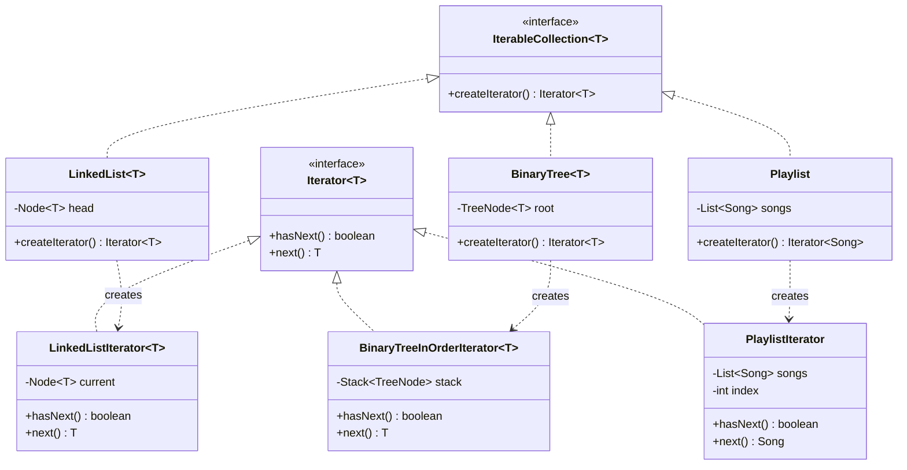

# 29. Iterator Design Pattern

> 💡 **Quick Revision Anchor**
> - **Type:** Behavioral Design Pattern
> - **Core Principle:** Provides a way to access elements of an aggregate object sequentially without exposing its underlying internal data structure (array, linked list, tree, hash table).
> - **Mental Model:** A standardized traversal cursor (`hasNext()`, `next()`) decoupled from the collection container.
> - **Key Advantage:** Enables multiple independent, simultaneous traversals over the same collection while adhering strictly to the **Single Responsibility Principle (SRP)**.

---

## 1. The Problem: Why Do We Need Iterators?

Developers frequently ask: *"If I can already loop over an array with `for (int i = 0; i < n; i++)`, why do I need an Iterator?"*

Consider an application managing collections of objects (e.g., a music `Playlist`, a custom `LinkedList`, or a `BinarySearchTree`):

```
       Array / List                     Linked List                    Binary Search Tree
┌───┬───┬───┬───┬───┐              ┌───┐   ┌───┐   ┌───┐                      [ 4 ]
│ 1 │ 2 │ 3 │ 4 │ 5 │              │ 1 │──▶│ 2 │──▶│ 3 │                     /     \
└───┴───┴───┴───┴───┘              └───┘   └───┘   └───┘                  [ 2 ]   [ 5 ]
Traversed by: Index [i]            Traversed by: Node.next               Traversed by: Stack / Recursion
```

### What Happens Without the Iterator Pattern?
1. **Tight Coupling to Internal Data Structures:**
   - If a `Playlist` stores songs in an Array, client code writes `for (int i=0; i<songs.length; i++)`.
   - If engineering refactors `Playlist` to use a `LinkedList` (for faster insertions) or a `BinarySearchTree` (for alphabetical sorting), **every client traversal loop in the entire codebase breaks!**
2. **Violates the Single Responsibility Principle (SRP):**
   - The collection class is burdened with two distinct responsibilities:
     - Storing and managing elements (CRUD operations).
     - Tracking traversal cursors, ordering, and iteration algorithms.
3. **Inability to Support Concurrent Traversals:**
   - If the collection itself maintains a single internal cursor (`currentPosition`), two independent loops or threads cannot traverse the collection simultaneously without colliding and corrupting each other's cursor state.

---

## 2. Core Solution: The Iterator Pattern

Extract the traversal responsibility out of the collection and place it into a dedicated **Iterator object**:
- The Collection implements an **Aggregate interface** (`IterableCollection<T>`) declaring `createIterator()`.
- The Iterator implements an **Iterator interface** (`Iterator<T>`) declaring `hasNext()` and `next()`.
- Each Iterator instance encapsulates its own independent cursor state.

```
Client ──▶ collection.createIterator() ──▶ returns Iterator Instance
              │
              ├──▶ while (iterator.hasNext())
              │        T item = iterator.next();
```

---

## 3. Architecture & Class Diagram



---

## 4. Java Implementation (Covering Multiple Data Structures)

### Step 1: Standard Iterator & Aggregate Interfaces
```java
public interface CustomIterator<T> {
    boolean hasNext();
    T next();
}

public interface CustomIterable<T> {
    CustomIterator<T> createIterator();
}
```

---

### Step 2: Primary Lecture Example 1 — Music Playlist Iterator
```java
import java.util.ArrayList;
import java.util.List;
import java.util.NoSuchElementException;

public class Song {
    private final String title;
    private final String artist;

    public Song(String title, String artist) {
        this.title = title;
        this.artist = artist;
    }

    public String getTitle() { return title; }
    public String getArtist() { return artist; }

    @Override
    public String toString() { return "'" + title + "' by " + artist; }
}

public class Playlist implements CustomIterable<Song> {
    private final List<Song> songs = new ArrayList<>();

    public void addSong(Song song) { songs.add(song); }

    @Override
    public CustomIterator<Song> createIterator() {
        return new PlaylistIterator(this.songs);
    }

    // Concrete Iterator for Playlist
    private static class PlaylistIterator implements CustomIterator<Song> {
        private final List<Song> songs;
        private int cursor = 0;

        public PlaylistIterator(List<Song> songs) {
            this.songs = songs;
        }

        @Override
        public boolean hasNext() {
            return cursor < songs.size();
        }

        @Override
        public Song next() {
            if (!hasNext()) throw new NoSuchElementException();
            return songs.get(cursor++);
        }
    }
}
```

---

### Step 3: Primary Lecture Example 2 — Binary Tree In-Order Iterator
The instructor demonstrates traversing a complex non-linear data structure (**Binary Search Tree**) in sorted In-Order sequence ($O(1)$ amortized `next()` using an explicit stack, without exposing tree nodes or pointers to the client):

```java
import java.util.NoSuchElementException;
import java.util.Stack;

public class BinaryTree<T extends Comparable<T>> implements CustomIterable<T> {
    public static class TreeNode<T> {
        public T value;
        public TreeNode<T> left;
        public TreeNode<T> right;

        public TreeNode(T value) { this.value = value; }
    }

    private TreeNode<T> root;

    public void setRoot(TreeNode<T> root) { this.root = root; }

    @Override
    public CustomIterator<T> createIterator() {
        return new InOrderIterator<>(root);
    }

    // In-Order Iterator for Binary Tree using an internal Stack
    private static class InOrderIterator<T> implements CustomIterator<T> {
        private final Stack<TreeNode<T>> stack = new Stack<>();

        public InOrderIterator(TreeNode<T> root) {
            pushLeftNodes(root);
        }

        private void pushLeftNodes(TreeNode<T> node) {
            while (node != null) {
                stack.push(node);
                node = node.left;
            }
        }

        @Override
        public boolean hasNext() {
            return !stack.isEmpty();
        }

        @Override
        public T next() {
            if (!hasNext()) throw new NoSuchElementException();
            TreeNode<T> curr = stack.pop();
            if (curr.right != null) {
                pushLeftNodes(curr.right);
            }
            return curr.value;
        }
    }
}
```

---

### Step 4: Client Code & Universal Traversal Demonstration
```java
public class Main {
    // Universal printer method: Works on ANY data structure implementing CustomIterable!
    public static <T> void printAll(String title, CustomIterable<T> collection) {
        System.out.println("=== " + title + " ===");
        CustomIterator<T> it = collection.createIterator();
        while (it.hasNext()) {
            System.out.println("  -> " + it.next());
        }
        System.out.println();
    }

    public static void main(String[] args) {
        // 1. Traverse Playlist
        Playlist playlist = new Playlist();
        playlist.addSong(new Song("Admiring You", "Karan Aujla"));
        playlist.addSong(new Song("Husn", "Anuv Jain"));
        playlist.addSong(new Song("Chaiyya Chaiyya", "Sukhwinder Singh"));

        printAll("Music Playlist", playlist);

        // 2. Traverse Binary Tree (Sorted In-Order)
        BinaryTree<Integer> bst = new BinaryTree<>();
        BinaryTree.TreeNode<Integer> root = new BinaryTree.TreeNode<>(4);
        root.left = new BinaryTree.TreeNode<>(2);
        root.right = new BinaryTree.TreeNode<>(6);
        root.left.left = new BinaryTree.TreeNode<>(1);
        root.left.right = new BinaryTree.TreeNode<>(3);
        root.right.left = new BinaryTree.TreeNode<>(5);
        root.right.right = new BinaryTree.TreeNode<>(7);
        bst.setRoot(root);

        printAll("Binary Search Tree (In-Order Traversal)", bst);
    }
}
```

### Execution Output:
```text
=== Music Playlist ===
  -> 'Admiring You' by Karan Aujla
  -> 'Husn' by Anuv Jain
  -> 'Chaiyya Chaiyya' by Sukhwinder Singh

=== Binary Search Tree (In-Order Traversal) ===
  -> 1
  -> 2
  -> 3
  -> 4
  -> 5
  -> 6
  -> 7
```

---

## 5. Real-World Applications

1. **Java Collections Framework:**
   - Every collection (`ArrayList`, `HashSet`, `LinkedList`, `TreeSet`) implements `java.lang.Iterable<T>` and returns `java.util.Iterator<T>`.
   - Powers the universal Java `for-each` loop: `for (T item : collection) { ... }`.
2. **Database Result Sets:**
   - JDBC `ResultSet.next()` iterates across database query rows on demand, fetching pages of records from network streams.
3. **Paging Iterators in Cloud APIs:**
   - AWS / Google Cloud SDK pagination iterators automatically fetch the next page of 100 S3 objects or Cloud Storage files behind the scenes when `.next()` crosses page limits.

---

## 6. Interview Perspective

- **Q: Why does Iterator uphold the Single Responsibility Principle?**
  *A: The aggregate focuses exclusively on holding and organizing data, while the iterator focuses exclusively on tracking navigation state and ordering.*
- **Q: Can multiple iterators run on the same collection at the same time?**
  *A: Yes! Because each iterator instance maintains its own cursor (`cursor` or `stack`), multiple threads or nested loops can traverse the same collection without interference.*
- **Q: What is the "Fail-Fast" behavior in Java Iterators?**
  *A: If a collection is structurally modified (items added or removed) while an iterator is actively traversing it, the iterator detects a discrepancy in `modCount` and immediately throws a `ConcurrentModificationException` to prevent reading corrupt data.*

---

## 7. Quick Revision

```text
Problem: Direct traversal exposes internal data structure (array index vs node pointer vs tree recursion).
Solution: Collection implements Iterable (createIterator()); Traversal lives in Iterator (hasNext(), next()).
Benefit: Uniform client traversal loop; supports simultaneous independent iterations; adheres to SRP.
```
