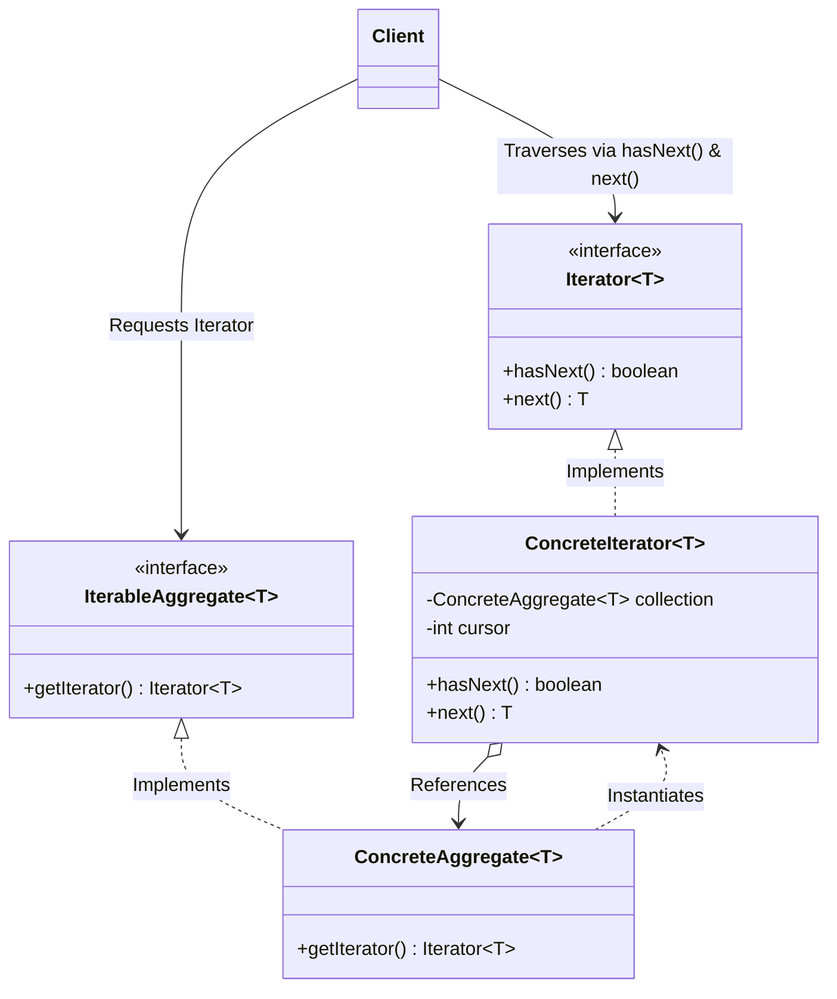

# 29. Iterator Design Pattern

> 💡 **Quick Revision Anchor**: The **Iterator Pattern** is a **behavioral design pattern** that provides a standardized mechanism to sequentially access elements of an aggregate collection (Array, Singly Linked List, Binary Tree, Music Playlist) without exposing its underlying internal data structures. It strictly adheres to the **Single Responsibility Principle** by decoupling storage management from traversal cursor state.

---

## 1. Executive Summary & Lecture Motivation

Aggregate data structures (Arrays, Linked Lists, Trees, Hash Maps) naturally store collections of items. However, directly allowing client applications to traverse internal collection storage creates major architectural liabilities:

### Problems with Direct Traversal:
1. **Encapsulation Breakdown**: If a `Playlist` class internally uses a raw array (`Song[]`), client code writes indexed loops: `for (int i = 0; i < songs.length; i++)`. If the engineering team later switches internal storage to a `DoublyLinkedList` or balanced `BST`, every client loop in the codebase breaks.
2. **Violation of Single Responsibility Principle (SRP)**: An aggregate object's sole responsibility is **managing elements in memory** (adding, removing, sizing). Burdening the aggregate with traversal algorithms, traversal bounds, and multiple cursor states creates bloated, fragile classes.
3. **Inability to Support Multiple Independent Traversals**: If cursor index pointers are stored inside the collection class itself, two clients (or two concurrent threads) cannot traverse the same collection independently at different rates without overwriting each other's cursor position.

The **Iterator Pattern** delegates traversal responsibilities to a dedicated, decoupled **Iterator** object.

```mermaid
flowchart LR
    Client([Client Loop]) -->|1. createIterator()| Aggregate["Aggregate / Collection<br/>(Playlist, LinkedList, Tree)"]
    Aggregate -->|2. returns instance| Iterator["ConcreteIterator<br/>(Maintains cursor state)"]
    Client -->|3. hasNext()| Iterator
    Client -->|4. next()| Iterator
    Iterator -.->|Traverses internal nodes without exposing them| Aggregate

    style Client fill:#e1f5fe,stroke:#0288d1,stroke-width:2px
    style Aggregate fill:#fff3e0,stroke:#f57c00,stroke-width:2px
    style Iterator fill:#e8f8f5,stroke:#26a69a,stroke-width:2px
```

---

## 2. Standard GoF Architecture & UML



### Key Participants and Responsibilities:
| Participant | Responsibility in Pattern |
| :--- | :--- |
| **`Iterator<T>`** | Interface declaring cursor operations: `hasNext()`, `next()` (and optionally `hasPrevious()`, `previous()`). |
| **`ConcreteIterator<T>`** | Encapsulates cursor position, traversal direction, and algorithms for a specific aggregate. |
| **`IterableAggregate<T>`** | Interface declaring factory method `getIterator()` to generate a compatible iterator. |
| **`ConcreteAggregate<T>`** | Concrete container (e.g. `Playlist`, `CustomLinkedList`, `BinaryTree`) implementing `getIterator()`. |

---

## 3. Production Java Implementations

Below are the three primary implementations taught in the lecture.

### Implementation 1: Custom Singly Linked List Iterator
Traversing a node-based linked list without ever exposing `Node.next` pointers to the client.

```java
package com.designpatterns.iterator.linkedlist;

import java.util.NoSuchElementException;

// Generic Iterator Contract
interface CustomIterator<T> {
    boolean hasNext();
    T next();
}

// Generic Iterable Collection Contract
interface CustomIterable<T> {
    CustomIterator<T> getIterator();
}

// Node structure (strictly private/encapsulated)
class Node<T> {
    T data;
    Node<T> next;

    public Node(T data) {
        this.data = data;
        this.next = null;
    }
}

// Concrete Aggregate: Singly Linked List
class CustomLinkedList<T> implements CustomIterable<T> {
    private Node<T> head;
    private Node<T> tail;

    public void add(T value) {
        Node<T> newNode = new Node<>(value);
        if (head == null) {
            head = newNode;
            tail = newNode;
        } else {
            tail.next = newNode;
            tail = newNode;
        }
    }

    @Override
    public CustomIterator<T> getIterator() {
        return new LinkedListIterator<>(head);
    }

    // Concrete Iterator: Keeps cursor on Node reference
    private static class LinkedListIterator<T> implements CustomIterator<T> {
        private Node<T> current;

        public LinkedListIterator(Node<T> head) {
            this.current = head;
        }

        @Override
        public boolean hasNext() {
            return current != null;
        }

        @Override
        public T next() {
            if (!hasNext()) {
                throw new NoSuchElementException("No more elements in Linked List!");
            }
            T val = current.data;
            current = current.next; // Advance cursor
            return val;
        }
    }
}
```

---

### Implementation 2: Music Playlist Iterator
A media domain collection where songs can be traversed sequentially with independent concurrent cursors.

```java
package com.designpatterns.iterator.playlist;

import java.util.ArrayList;
import java.util.List;
import java.util.NoSuchElementException;

class Song {
    private final String title;
    private final String artist;

    public Song(String title, String artist) {
        this.title = title;
        this.artist = artist;
    }

    public String getTitle() { return title; }
    public String getArtist() { return artist; }

    @Override
    public String toString() {
        return "'" + title + "' by " + artist;
    }
}

class Playlist implements com.designpatterns.iterator.linkedlist.CustomIterable<Song> {
    private final List<Song> songs = new ArrayList<>();

    public void addSong(Song song) {
        songs.add(song);
    }

    public int size() {
        return songs.size();
    }

    public Song getSong(int index) {
        return songs.get(index);
    }

    @Override
    public com.designpatterns.iterator.linkedlist.CustomIterator<Song> getIterator() {
        return new PlaylistIterator(this);
    }

    private static class PlaylistIterator implements com.designpatterns.iterator.linkedlist.CustomIterator<Song> {
        private final Playlist playlist;
        private int cursor = 0;

        public PlaylistIterator(Playlist playlist) {
            this.playlist = playlist;
        }

        @Override
        public boolean hasNext() {
            return cursor < playlist.size();
        }

        @Override
        public Song next() {
            if (!hasNext()) throw new NoSuchElementException("End of playlist reached!");
            return playlist.getSong(cursor++);
        }
    }
}
```

---

### Implementation 3: Binary Search Tree In-Order Iterator
Traversing a non-linear hierarchy (Tree) in sorted order ($Left \to Root \to Right$) using an internal `Stack` cursor.

```java
package com.designpatterns.iterator.tree;

import java.util.NoSuchElementException;
import java.util.Stack;

class TreeNode {
    int val;
    TreeNode left;
    TreeNode right;

    public TreeNode(int val) {
        this.val = val;
    }
}

class BinaryTreeInOrderIterator implements com.designpatterns.iterator.linkedlist.CustomIterator<Integer> {
    private final Stack<TreeNode> stack = new Stack<>();

    public BinaryTreeInOrderIterator(TreeNode root) {
        pushLeftSubtree(root);
    }

    private void pushLeftSubtree(TreeNode node) {
        while (node != null) {
            stack.push(node);
            node = node.left;
        }
    }

    @Override
    public boolean hasNext() {
        return !stack.isEmpty();
    }

    @Override
    public Integer next() {
        if (!hasNext()) throw new NoSuchElementException("Tree iteration complete!");
        TreeNode node = stack.pop();
        pushLeftSubtree(node.right);
        return node.val;
    }
}
```

---

## 4. Lecture Homework & Extension: Bi-Directional Iterator

In the video, the instructor tasks students with extending the iterator contract to support bi-directional navigation (forward and reverse):

```java
public interface BiDirectionalIterator<T> {
    boolean hasNext();
    T next();
    boolean hasPrevious();
    T previous();
}
```

This mirrors Java's production `java.util.ListIterator<E>`, allowing a customer to skip forward to the next song or rewind to the previous track.

---

## 5. Main Demonstration Driver

```java
package com.designpatterns.iterator;

import com.designpatterns.iterator.linkedlist.CustomIterator;
import com.designpatterns.iterator.linkedlist.CustomLinkedList;
import com.designpatterns.iterator.playlist.Playlist;
import com.designpatterns.iterator.playlist.Song;
import com.designpatterns.iterator.tree.BinaryTreeInOrderIterator;
import com.designpatterns.iterator.tree.TreeNode;

public class IteratorPatternDemo {
    public static void main(String[] args) {
        System.out.println("=================================================");
        System.out.println("1. CUSTOM SINGLY LINKED LIST TRAVERSAL");
        System.out.println("=================================================");
        CustomLinkedList<Integer> list = new CustomLinkedList<>();
        list.add(10);
        list.add(20);
        list.add(30);

        CustomIterator<Integer> listIt = list.getIterator();
        while (listIt.hasNext()) {
            System.out.print(listIt.next() + " -> ");
        }
        System.out.println("NULL");

        System.out.println("\n=================================================");
        System.out.println("2. PLAYLIST ITERATION (TWO INDEPENDENT CURSORS)");
        System.out.println("=================================================");
        Playlist playlist = new Playlist();
        playlist.addSong(new Song("Starboy", "The Weeknd"));
        playlist.addSong(new Song("Believer", "Imagine Dragons"));
        playlist.addSong(new Song("Shape of You", "Ed Sheeran"));

        CustomIterator<Song> it1 = playlist.getIterator();
        CustomIterator<Song> it2 = playlist.getIterator();

        System.out.println("User 1 tracks: " + it1.next() + " | " + it1.next());
        System.out.println("User 2 track (independent cursor): " + it2.next());

        System.out.println("\n=================================================");
        System.out.println("3. BINARY TREE IN-ORDER ITERATOR (SORTED OUTPUT)");
        System.out.println("=================================================");
        // Tree:    4
        //         / \
        //        2   5
        //       / \
        //      1   3
        TreeNode root = new TreeNode(4);
        root.left = new TreeNode(2);
        root.right = new TreeNode(5);
        root.left.left = new TreeNode(1);
        root.left.right = new TreeNode(3);

        CustomIterator<Integer> treeIt = new BinaryTreeInOrderIterator(root);
        while (treeIt.hasNext()) {
            System.out.print(treeIt.next() + " ");
        }
        System.out.println();
    }
}
```

---

## 6. Execution Output

```text
=================================================
1. CUSTOM SINGLY LINKED LIST TRAVERSAL
=================================================
10 -> 20 -> 30 -> NULL

=================================================
2. PLAYLIST ITERATION (TWO INDEPENDENT CURSORS)
=================================================
User 1 tracks: 'Starboy' by The Weeknd | 'Believer' by Imagine Dragons
User 2 track (independent cursor): 'Starboy' by The Weeknd

=================================================
3. BINARY TREE IN-ORDER ITERATOR (SORTED OUTPUT)
=================================================
1 2 3 4 5 
```

---

## Quick Revision

### Core Idea
Provides a uniform, decoupled way to access elements of an aggregate collection sequentially without exposing its underlying internal data structure.

### Remember
- **`Iterator<T>`**: Declares traversal operations (`hasNext()`, `next()`).
- **`Iterable<T>`**: Declares the factory method (`getIterator()`) implemented by the collection.
- Traversal state (cursor position) lives inside the **Iterator**, not inside the Collection, enabling multiple concurrent traversals.

### Java Implementation Idea
```java
interface Iterator<T> { boolean hasNext(); T next(); }
interface IterableCollection<T> { Iterator<T> getIterator(); }

class MyIterator<T> implements Iterator<T> {
    private Node<T> current;
    public boolean hasNext() { return current != null; }
    public T next() { T val = current.val; current = current.next; return val; }
}
```

### Most Important Interview Point
**Why shouldn't the collection class implement `Iterator` directly?**
If `Playlist` implements `Iterator`, the cursor index variable (`current`) must be stored in the collection itself. This creates a severe **Single Responsibility Principle** violation and makes concurrent independent traversals impossible (e.g. two users listening to the same playlist at different song positions).

### Common Trap
Modifying a collection's structure (adding/deleting items) while iterating over it without updating the iterator, leading to index out-of-bounds or `ConcurrentModificationException` in fail-fast iterators.
