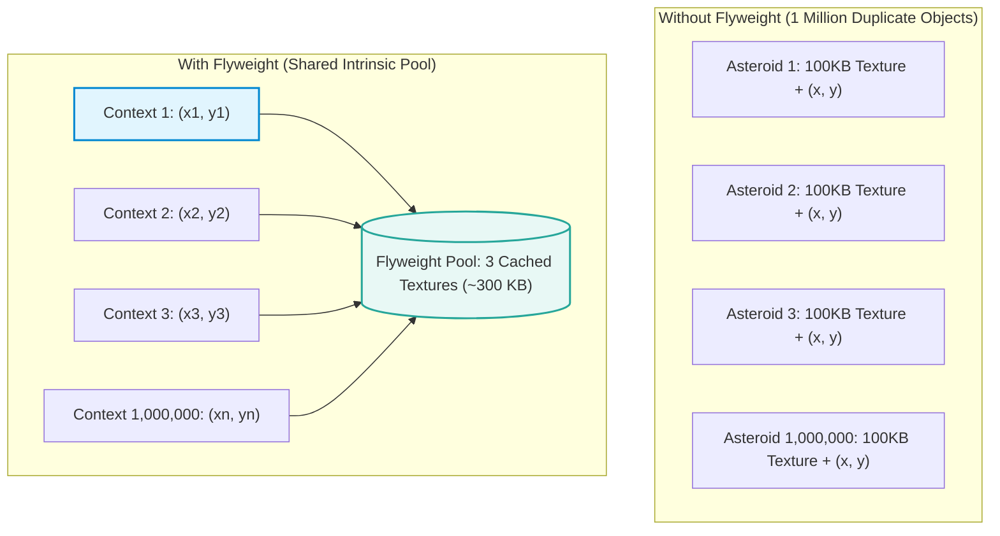
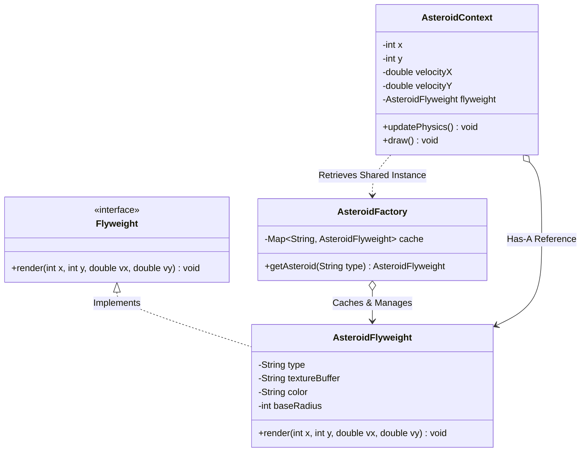

# 30. Flyweight Design Pattern

> 💡 **Quick Revision Anchor**: The **Flyweight Pattern** is a **structural design pattern** that minimizes RAM usage by sharing common parts of state across millions of fine-grained objects. It strictly bifurcates an object's state into **Intrinsic state** (immutable, shared state cached in a Flyweight pool) and **Extrinsic state** (context-dependent, varying state passed as method arguments or maintained in lightweight context objects).

---

## 1. Executive Summary & Lecture Motivation

When designing applications that render or manage massive numbers of similar entities (e.g., 1,000,000 asteroids in a space arcade game, or 500,000 characters in a text editor like Google Docs), creating a full-blown object for each entity crashes the application with `OutOfMemoryError`:

### The Problem: Naive Object Instantiation
Consider a 2D Space Arcade game:
- **1,000,000 (One Million) Asteroids** are actively falling on screen.
- Each asteroid requires:
  - Heavy graphical data: 3D mesh vertices, compressed bitmap texture, color palette, base radius (~100 KB).
  - Spatial dynamics: $X, Y$ viewport coordinates, velocity vector $(\Delta X, \Delta Y)$.
- **Naive Memory Math**:
  $$\text{RAM Required} = 1,000,000 \times 100\text{ KB} \approx 100,000,000\text{ KB} \approx \mathbf{100\text{ GB of RAM!}}$$
- Even high-end gaming rigs will crash instantly. In the lecture, the instructor proves how a naive implementation consumes **186.92 MB** of heap memory for a small test run, whereas the Flyweight architecture reduces it to **22 MB**!



---

## 2. Core Architectural Concept: Intrinsic vs. Extrinsic State

The cornerstone of the Flyweight Pattern is categorizing every attribute into one of two categories:

| State Category | Definition | Where It Lives | Mutability | Examples from Lecture |
| :--- | :--- | :--- | :--- | :--- |
| **Intrinsic State** | Constant, invariant data that is identical across all instances of a type. Independent of the object's context or position. | Stored **inside the Flyweight** object. | **Strictly Immutable (`final`)**. | Asteroid 3D mesh, texture bitmap, base color; Character font glyph (`'A'`, `'B'`). |
| **Extrinsic State** | Dynamic, contextual data that varies per instance and scene. Depends on time and position. | Stored in **lightweight Context** or passed as method parameters. | **Mutable** by caller / game engine. | Asteroid $(X, Y)$ coordinates, velocity vector; Character line/column coordinates. |

---

## 3. Standard GoF Architecture & UML



---

## 4. Production Java Implementation: Space Arcade Asteroid Fleet

Below is the complete Java implementation featuring the Asteroid simulation and memory math directly matching the lecture.

```java
package com.designpatterns.flyweight.game;

import java.util.ArrayList;
import java.util.HashMap;
import java.util.List;
import java.util.Map;
import java.util.Random;

// ============================================================================
// 1. INTRINSIC STATE: SHARED IMMUTABLE FLYWEIGHT
// ============================================================================

interface IAsteroidFlyweight {
    void render(int x, int y, double vx, double vy);
}

class AsteroidFlyweight implements IAsteroidFlyweight {
    // Intrinsic properties shared across all asteroids of this type
    private final String type;
    private final String color;
    private final int baseRadius;
    private final String textureBuffer; // Simulated 100 KB texture memory

    public AsteroidFlyweight(String type, String color, int baseRadius) {
        this.type = type;
        this.color = color;
        this.baseRadius = baseRadius;
        this.textureBuffer = "[100 KB Compressed Texture Mesh for " + type + "]";
        System.out.println("  >> [Flyweight Allocated in Heap] Created shared texture for: " + type);
    }

    @Override
    public void render(int x, int y, double vx, double vy) {
        // Extrinsic coordinates (x, y, speed) are supplied by caller at runtime!
        System.out.printf("  Rendering %s [Color=%s, Radius=%d] at (%d, %d) with velocity (%.1f, %.1f)\n",
                          type, color, baseRadius, x, y, vx, vy);
    }
}

// ============================================================================
// 2. FLYWEIGHT FACTORY: POOL & CACHE MANAGER
// ============================================================================

class AsteroidFactory {
    private static final Map<String, AsteroidFlyweight> cache = new HashMap<>();

    public static AsteroidFlyweight getAsteroid(String type) {
        if (!cache.containsKey(type)) {
            switch (type) {
                case "ICE_ROCK":
                    cache.put(type, new AsteroidFlyweight("ICE_ROCK", "Cyan", 15));
                    break;
                case "IRON_METEOR":
                    cache.put(type, new AsteroidFlyweight("IRON_METEOR", "Metallic Grey", 35));
                    break;
                case "MAGMA_ASTEROID":
                    cache.put(type, new AsteroidFlyweight("MAGMA_ASTEROID", "Fiery Red", 80));
                    break;
                default:
                    throw new IllegalArgumentException("Unknown asteroid type: " + type);
            }
        }
        return cache.get(type);
    }

    public static int getCachedFlyweightsCount() {
        return cache.size();
    }
}

// ============================================================================
// 3. EXTRINSIC STATE: LIGHTWEIGHT CONTEXT WRAPPER
// ============================================================================

class AsteroidContext {
    private int x;
    private int y;
    private double velocityX;
    private double velocityY;
    private final AsteroidFlyweight flyweight; // Reference to shared Flyweight

    public AsteroidContext(int x, int y, double vx, double vy, AsteroidFlyweight flyweight) {
        this.x = x;
        this.y = y;
        this.velocityX = vx;
        this.velocityY = vy;
        this.flyweight = flyweight;
    }

    public void updatePhysics() {
        this.x += velocityX;
        this.y += velocityY;
    }

    public void draw() {
        // Injects extrinsic state into shared intrinsic flyweight
        flyweight.render(x, y, velocityX, velocityY);
    }
}

// ============================================================================
// MAIN DEMONSTRATION DRIVER
// ============================================================================

public class FlyweightDemo {
    public static void main(String[] args) {
        System.out.println("=================================================");
        System.out.println("SPAWNING 100,000 ASTEROIDS INTO VIEWPORT");
        System.out.println("=================================================");

        List<AsteroidContext> activeFleet = new ArrayList<>();
        String[] types = {"ICE_ROCK", "IRON_METEOR", "MAGMA_ASTEROID"};
        Random random = new Random();

        // Spawn 100,000 lightweight context instances
        for (int i = 0; i < 100_000; i++) {
            String selectedType = types[random.nextInt(types.length)];
            AsteroidFlyweight sharedFlyweight = AsteroidFactory.getAsteroid(selectedType);

            AsteroidContext context = new AsteroidContext(
                random.nextInt(1920), random.nextInt(1080),
                random.nextDouble() * 5.0, random.nextDouble() * 5.0,
                sharedFlyweight
            );
            activeFleet.add(context);
        }

        System.out.println("\nActive Asteroids on screen: " + activeFleet.size());
        System.out.println("Heavy Flyweight Texture Buffers in RAM: " + AsteroidFactory.getCachedFlyweightsCount());

        System.out.println("\n--- Sample Renders (Injecting Extrinsic State) ---");
        for (int i = 0; i < 3; i++) {
            activeFleet.get(i).draw();
        }

        System.out.println("\n=================================================");
        System.out.println("MEMORY SAVINGS SUMMARY");
        System.out.println("=================================================");
        System.out.println("Without Flyweight: 100,000 * 100 KB = 10,000,000 KB (~10 GB RAM)");
        System.out.println("With Flyweight:    3 * 100 KB + 100,000 * 32 Bytes = ~3.5 MB RAM");
        System.out.println("RAM Reduction:     > 99.9% Memory Saved!");
    }
}
```

---

## 5. Lecture Example 2: Text Editor Document Characters

In the concluding portion of the lecture, the instructor highlights another canonical real-world Flyweight example: **Designing a Document Character Formatting Engine (e.g. Google Docs, MS Word)**:
- A document can contain millions of characters.
- In English, there are only 26 alphabets ($A-Z, a-z$) plus numbers and punctuation.
- **Intrinsic State (`CharacterFlyweight`)**: The character symbol (`'A'`), glyph bitmap, baseline typography.
- **Extrinsic State**: The document $(row, col)$ position, dynamic font size (12pt vs 24pt), bold/italic flags, highlight color.

```java
class CharacterFlyweight {
    private final char symbol; // Intrinsic (e.g. 'A')

    public CharacterFlyweight(char symbol) {
        this.symbol = symbol;
    }

    public void render(int row, int col, int fontSize, String color) {
        // Extrinsic state passed at render time
        System.out.println("Char '" + symbol + "' at line " + row + ", col " + col 
                           + " [Size: " + fontSize + ", Color: " + color + "]");
    }
}
```

---

## 6. Real-World Applications in Java Standard Library

1. **Java String Pool**:
   - `String s1 = "hello"; String s2 = "hello";`
   - Both references point to the exact same shared `String` flyweight in the JVM String Constant Pool.
2. **`Integer.valueOf(int)` Cache**:
   - Java caches integers from `-128` to `+127`.
   - `Integer a = 100; Integer b = 100; (a == b) -> true` because they reference the identical cached flyweight object!

---

## Quick Revision

### Core Idea
A structural pattern that drastically reduces memory consumption by sharing immutable **intrinsic state** among millions of fine-grained objects, while passing **extrinsic state** dynamically at method call time.

### Remember
- **Intrinsic State** = Shared, immutable, context-free data cached in the Flyweight (e.g. texture, mesh, character glyph).
- **Extrinsic State** = Unique, context-dependent coordinates passed from outside (e.g. $X, Y$ position, velocity).
- **Flyweight Factory** = Manages an in-memory cache pool returning existing flyweight instances.

### Java Implementation Idea
```java
class FlyweightFactory {
    private static Map<String, Flyweight> cache = new HashMap<>();
    public static Flyweight get(String key) {
        return cache.computeIfAbsent(key, k -> new ConcreteFlyweight(k));
    }
}
```

### Most Important Interview Point
**Why MUST the intrinsic state inside a Flyweight be strictly immutable (`final`)?**
Because a single Flyweight instance is simultaneously shared by hundreds of thousands of contexts. If any thread or caller mutates the flyweight's internal state (e.g. changing an asteroid's color to green), all 1,000,000 referencing asteroids across the entire screen will instantly change color!

### Common Trap
Storing extrinsic state inside the Flyweight object. If you store coordinates $(x, y)$ inside `AsteroidFlyweight`, you destroy shareability and fall back to the 1-million-object memory explosion.
