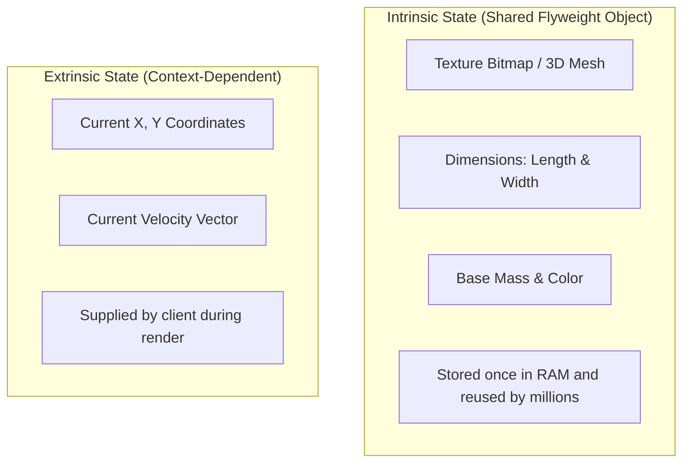
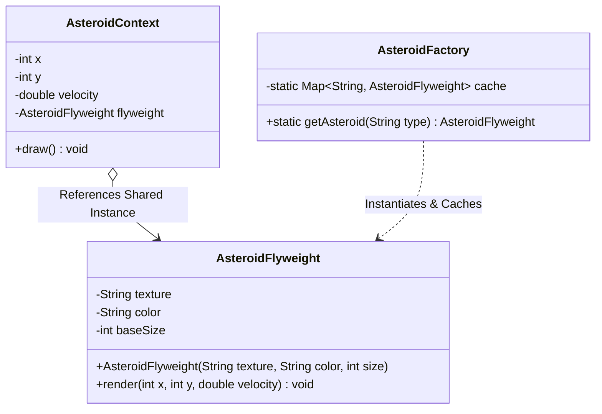

# 30. Flyweight Design Pattern

> 💡 **Quick Revision Anchor**: The **Flyweight Pattern** is a **structural design pattern** that minimizes memory footprint by sharing common parts of state across millions of fine-grained objects. It strictly bifurcates an object's state into **Intrinsic state** (immutable, shared context) and **Extrinsic state** (unique, context-dependent state passed at runtime).

---

## 1. Context & Motivation: The Memory Problem

Imagine developing a space arcade game where players shoot falling **Asteroids**:
- Under heavy waves, **1,000,000 (1 Million) asteroids** are active simultaneously on screen.
- Each Asteroid has:
  - Visual attributes: `textureBitmap` (200 KB), `color`, `meshType`, `mass`.
  - Spatial attributes: `x`, `y` coordinates, `velocityX`, `velocityY`.

### The Problem without Flyweight
If every single asteroid is instantiated as an independent object holding its own 200 KB texture:
$$\text{RAM Required} = 1,000,000 \times 200\text{ KB} \approx 200\text{ GB of RAM!}$$
The application will immediately crash with an `OutOfMemoryError`.

---

## 2. Core Architectural Insight: Intrinsic vs. Extrinsic State

The Flyweight pattern divides an object's properties into two distinct categories:



| State Category | Definition | Where It Lives | Mutability |
| :--- | :--- | :--- | :--- |
| **Intrinsic** | State that is constant across many objects and independent of scene context. | Inside the **Flyweight** object. | **Strictly Immutable**. |
| **Extrinsic** | State that varies per object and depends on position/context. | Kept in a lightweight Context struct or passed as method arguments. | **Mutable** by caller. |

---

## 3. Flyweight Architecture & UML



---

## 4. Production Java Implementation: Space Arcade Simulation

### Step 1: Concrete Flyweight (Intrinsic State)
```java
// Immutable Flyweight containing the heavy, shared memory buffers
public class AsteroidFlyweight {
    private final String type;       // "SMALL_ROCK", "MEDIUM_METEOR", "GIANT_ASTEROID"
    private final String textureData; // Simulated heavy bitmap/mesh buffer (e.g. 100KB)
    private final String color;
    private final int baseRadius;

    public AsteroidFlyweight(String type, String color, int baseRadius) {
        this.type = type;
        this.color = color;
        this.baseRadius = baseRadius;
        // Heavy allocation happens only ONCE per type
        this.textureData = "[100KB Texture Bitmap Buffer for " + type + "]";
        System.out.println("[Flyweight Created] Allocated shared texture for: " + type);
    }

    // Extrinsic state (x, y, speed) is passed as arguments at execution time!
    public void render(int x, int y, double velocityX, double velocityY) {
        System.out.println("Rendering " + type + " at (" + x + ", " + y + ") with speed (" 
                           + velocityX + ", " + velocityY + ") using " + textureData);
    }
}
```

### Step 2: Flyweight Factory (Caching & Pool Management)
```java
import java.util.HashMap;
import java.util.Map;

public class AsteroidFactory {
    // Cache pool storing shared flyweights
    private static final Map<String, AsteroidFlyweight> cache = new HashMap<>();

    public static AsteroidFlyweight getAsteroidFlyweight(String type) {
        if (!cache.containsKey(type)) {
            switch (type) {
                case "ICE_ASTEROID":
                    cache.put(type, new AsteroidFlyweight("ICE_ASTEROID", "Cyan", 15));
                    break;
                case "IRON_METEOR":
                    cache.put(type, new AsteroidFlyweight("IRON_METEOR", "Metallic Grey", 40));
                    break;
                case "MAGMA_ROCK":
                    cache.put(type, new AsteroidFlyweight("MAGMA_ROCK", "Fiery Red", 80));
                    break;
                default:
                    throw new IllegalArgumentException("Unknown asteroid type: " + type);
            }
        }
        return cache.get(type);
    }

    public static int getFlyweightPoolSize() {
        return cache.size();
    }
}
```

### Step 3: Context Object (Extrinsic State)
```java
// Lightweight wrapper holding extrinsic attributes + reference to shared flyweight
public class AsteroidContext {
    private int x;
    private int y;
    private double velocityX;
    private double velocityY;
    private final AsteroidFlyweight flyweight; // Pointer to shared Flyweight

    public AsteroidContext(int x, int y, double vx, double vy, AsteroidFlyweight flyweight) {
        this.x = x;
        this.y = y;
        this.velocityX = vx;
        this.velocityY = vy;
        this.flyweight = flyweight;
    }

    public void updatePhysics() {
        this.x += velocityX;
        this.y += velocityY;
    }

    public void draw() {
        // Delegate rendering to shared flyweight, injecting current extrinsic coordinates
        flyweight.render(x, y, velocityX, velocityY);
    }
}
```

### Step 4: Driver Execution & Memory Proof
```java
import java.util.ArrayList;
import java.util.List;
import java.util.Random;

public class Main {
    public static void main(String[] args) {
        System.out.println("=== Initializing Space Scene with 100,000 Asteroids ===");
        List<AsteroidContext> asteroidFleet = new ArrayList<>();
        Random rand = new Random();
        String[] types = {"ICE_ASTEROID", "IRON_METEOR", "MAGMA_ROCK"};

        // Spawning 100,000 asteroid context instances
        for (int i = 0; i < 100_000; i++) {
            String selectedType = types[rand.nextInt(types.length)];
            AsteroidFlyweight sharedFlyweight = AsteroidFactory.getAsteroidFlyweight(selectedType);

            AsteroidContext asteroid = new AsteroidContext(
                rand.nextInt(1920), rand.nextInt(1080), 
                rand.nextDouble() * 5, rand.nextDouble() * 5, 
                sharedFlyweight
            );
            asteroidFleet.add(asteroid);
        }

        System.out.println("\nSuccessfully spawned " + asteroidFleet.size() + " active game asteroids!");
        System.out.println("Total heavy Flyweight texture instances in RAM: " + AsteroidFactory.getFlyweightPoolSize());

        // Render first 3 asteroids as a sample
        System.out.println("\n--- Rendering Sample Asteroids ---");
        for (int i = 0; i < 3; i++) {
            asteroidFleet.get(i).draw();
        }
    }
}
```

---

## 5. Execution Output & Memory Reduction Analysis

```text
=== Initializing Space Scene with 100,000 Asteroids ===
[Flyweight Created] Allocated shared texture for: ICE_ASTEROID
[Flyweight Created] Allocated shared texture for: IRON_METEOR
[Flyweight Created] Allocated shared texture for: MAGMA_ROCK

Successfully spawned 100000 active game asteroids!
Total heavy Flyweight texture instances in RAM: 3

--- Rendering Sample Asteroids ---
Rendering ICE_ASTEROID at (1240, 512) with speed (3.24, 1.15) using [100KB Texture Bitmap Buffer for ICE_ASTEROID]
Rendering MAGMA_ROCK at (410, 89) with speed (0.87, 4.31) using [100KB Texture Bitmap Buffer for MAGMA_ROCK]
Rendering IRON_METEOR at (1750, 940) with speed (2.11, 2.80) using [100KB Texture Bitmap Buffer for IRON_METEOR]
```

### Memory Math Comparison:
- **Without Flyweight**: $100,000 \times 100\text{ KB} \approx 10,000,000\text{ KB} \approx \mathbf{10\text{ GB}}$.
- **With Flyweight**:
  - 3 Flyweight objects $\times 100\text{ KB} \approx 300\text{ KB}$.
  - $100,000 \text{ Contexts} \times (\text{two ints + two doubles + one reference}) \approx 100,000 \times 32\text{ Bytes} \approx \mathbf{3.2\text{ MB}}$.
  - **Total RAM Saved**: Over **99.9%**!

---

## 6. Real-World Applications & Interview Gotchas

1. **Java String Pool**:
   - String literals in Java are flyweights! `String s1 = "hello"; String s2 = "hello";` share the exact same reference in the String constant pool.
2. **Java Wrapper Caches**:
   - `Integer.valueOf(10)` caches numbers between `-128` and `127`. Repeated calls return the identical `Integer` flyweight object.
3. **Word Processors (Google Docs / MS Word)**:
   - A document containing 500,000 characters does not create 500,000 font objects. Each character glyph (`'a'`, `'b'`, font size, typeface) is a shared flyweight; extrinsic state is the cursor index/line position.
4. **Interview Watch-out**:
   - Ensure that the Intrinsic state inside the flyweight is completely immutable. If any thread modifies shared flyweight state, all 100,000 referencing instances will be corrupted!
