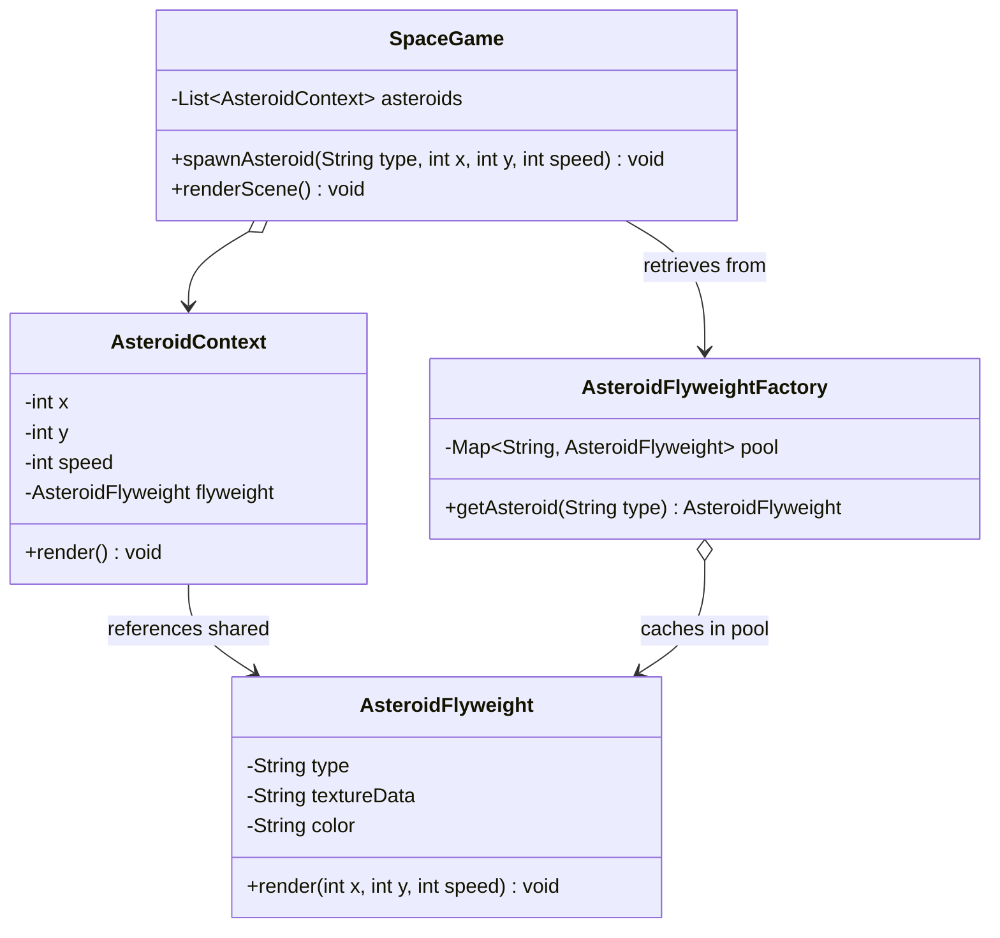

# 30. Flyweight Design Pattern

> 💡 **Quick Revision Anchor**
> - **Type:** Structural Design Pattern
> - **Core Principle:** Minimizes memory usage by sharing as much data as possible with other similar objects. Fits thousands or millions of fine-grained objects into RAM by sharing common state.
> - **Mental Model:** Split object state into two distinct categories:
>   1. **Intrinsic State:** Shared, invariant, context-free, immutable (stored inside the **Flyweight**).
>   2. **Extrinsic State:** Unique, variable, contextual (passed from the outside or held in thin wrappers).
> - **Primary Lecture Example:** 2D/3D Space Combat Game with 100,000 falling **Asteroids**.

---

## 1. Problem: The Out-Of-Memory Crash

Suppose you are developing a fast-paced Space Action Game where waves of **100,000 Asteroids** plummet towards Earth simultaneously.

Every individual asteroid in a naive OOP implementation contains:
- 3D Mesh / Bitmap Texture data: ~50 KB
- Material & Color Shaders: ~10 KB
- Position coordinates (`x, y`): 8 bytes
- Velocity vector (`vx, vy`): 8 bytes

```
[Asteroid Instance #1]  ---> 60 KB (50KB Mesh + 10KB Texture + 16B coords)
[Asteroid Instance #2]  ---> 60 KB
...
[Asteroid Instance #100,000] ---> 60 KB
--------------------------------------------------------------
Total RAM Required: 100,000 * 60 KB ≈ 6,000,000 KB ≈ 6 Gigabytes of RAM!
```

### The Failure:
Attempting to allocate 6 GB of heap memory for simple ambient space rocks instantly crashes mobile devices and low-spec PCs with an `OutOfMemoryError`.
Yet, if you examine those 100,000 asteroids closely, **99.9% of them look completely identical!** They share the exact same 3 visual models (Small Rock, Medium Boulder, Huge Iron Asteroid). Only their current `(x, y)` screen coordinates differ!

---

## 2. Core Solution: Intrinsic vs. Extrinsic State

The **Flyweight Pattern** solves this memory crisis by separating the state into two distinct halves:

| State Type | Characteristics | Where It Lives | Examples |
| :--- | :--- | :--- | :--- |
| **Intrinsic State** | Constant, immutable, shared across thousands of instances. Does not change with location or time. | Stored inside the **Flyweight** object. | 3D Wireframe, Texture bitmap, Color palette, Type name. |
| **Extrinsic State** | Variable, unique per object, dependent on context. Changes constantly. | Maintained by the **Context** or passed as method parameters. | Current coordinates (`x, y`), current velocity (`vx, vy`), current rotation. |

```
                       [Intrinsic State (Shared Flyweight)]
                       ┌──────────────────────────────────┐
                       │ AsteroidModel: "Iron Boulder"    │
                       │ Texture: 50 KB binary buffer     │
                       └────────────────┬─────────────────┘
                                        │
             ┌──────────────────────────┼──────────────────────────┐
             ▼                          ▼                          ▼
┌─────────────────────────┐┌─────────────────────────┐┌─────────────────────────┐
│  AsteroidContext #1     ││  AsteroidContext #2     ││  AsteroidContext #100k  │
│  (x: 10, y: 50, v: 2)   ││  (x: 400, y: 120, v: 5) ││  (x: 900, y: 80, v: 3)  │
│  Size: 16 bytes         ││  Size: 16 bytes         ││  Size: 16 bytes         │
└─────────────────────────┘└─────────────────────────┘└─────────────────────────┘
```

### The Dramatic Memory Savings:
- **Flyweights:** 3 unique models $\times$ 60 KB = **180 KB**.
- **Contexts:** 100,000 thin contexts $\times$ 16 bytes $\approx$ **1.6 MB**.
- **Total Memory:** ~**1.78 MB** instead of 6 GB (a **99.97% memory reduction!**).

---

## 3. Architecture & Class Diagram



---

## 4. Java Implementation (Primary Lecture Example)

### Step 1: The Flyweight Class (Encapsulating Intrinsic State)
```java
// Flyweight: Immutable, contains heavy shared intrinsic data
public class AsteroidFlyweight {
    private final String type;
    private final String textureData; // Simulates 50KB heavy binary mesh/texture
    private final String color;

    public AsteroidFlyweight(String type, String textureData, String color) {
        this.type = type;
        this.textureData = textureData;
        this.color = color;
        System.out.println("[Loaded Heavy Asset] Created new AsteroidFlyweight for type: " + type + " (50 KB allocated)");
    }

    // Extrinsic state (x, y, speed) is supplied dynamically from outside
    public void render(int x, int y, int speed) {
        System.out.println("  Rendering [" + type + " | " + color + "] at (" + x + ", " + y + ") falling at speed " + speed + " km/s");
    }

    public String getType() { return type; }
}
```

---

### Step 2: Flyweight Factory (Object Pool & Cache)
```java
import java.util.HashMap;
import java.util.Map;

// Factory: ensures flyweights are shared and never duplicated in RAM
public class AsteroidFlyweightFactory {
    private static final Map<String, AsteroidFlyweight> flyweightPool = new HashMap<>();

    public static AsteroidFlyweight getAsteroidFlyweight(String type) {
        if (!flyweightPool.containsKey(type)) {
            // Lazy load asset only once upon first request
            switch (type.toUpperCase()) {
                case "SMALL" -> flyweightPool.put(type, new AsteroidFlyweight("Small Rocky", "texture_small_rock.raw", "Grey"));
                case "MEDIUM" -> flyweightPool.put(type, new AsteroidFlyweight("Medium Iron", "texture_iron_dense.raw", "Metallic"));
                case "LARGE" -> flyweightPool.put(type, new AsteroidFlyweight("Massive Carbon", "texture_carbon_giant.raw", "Black"));
                default -> throw new IllegalArgumentException("Unknown asteroid type: " + type);
            }
        }
        return flyweightPool.get(type);
    }

    public static int getFlyweightCount() {
        return flyweightPool.size();
    }
}
```

---

### Step 3: Context Class (Thin Wrapper for Extrinsic State)
```java
// Context: Contains lightweight extrinsic variables and a reference to the shared Flyweight
public class AsteroidContext {
    private int x;
    private int y;
    private int speed;
    private final AsteroidFlyweight flyweight; // Reference to shared intrinsic state

    public AsteroidContext(int x, int y, int speed, AsteroidFlyweight flyweight) {
        this.x = x;
        this.y = y;
        this.speed = speed;
        this.flyweight = flyweight;
    }

    public void render() {
        flyweight.render(x, y, speed);
    }

    public void updatePosition() {
        this.y += speed; // Simulating downward movement
    }
}
```

---

### Step 4: Game Orchestrator & Memory Comparison Demonstration
```java
import java.util.ArrayList;
import java.util.List;
import java.util.Random;

public class SpaceGame {
    private final List<AsteroidContext> activeAsteroids = new ArrayList<>();

    public void spawnAsteroid(String type, int x, int y, int speed) {
        AsteroidFlyweight flyweight = AsteroidFlyweightFactory.getAsteroidFlyweight(type);
        activeAsteroids.add(new AsteroidContext(x, y, speed, flyweight));
    }

    public void renderScene() {
        System.out.println("\n--- Rendering Frame with " + activeAsteroids.size() + " Asteroids ---");
        // For demonstration, render first 5
        for (int i = 0; i < Math.min(5, activeAsteroids.size()); i++) {
            activeAsteroids.get(i).render();
        }
        System.out.println("... [" + (activeAsteroids.size() - 5) + " more asteroids rendered concurrently] ...\n");
    }

    public static void main(String[] args) {
        SpaceGame game = new SpaceGame();
        Random random = new Random();
        String[] types = {"SMALL", "MEDIUM", "LARGE"};

        System.out.println("=== Spawning 100,000 Asteroids in Space Combat Simulation ===");

        // Spawning 100,000 asteroids
        for (int i = 0; i < 100_000; i++) {
            String type = types[random.nextInt(types.length)];
            int x = random.nextInt(1920);
            int y = random.nextInt(1080);
            int speed = random.nextInt(10) + 1;
            game.spawnAsteroid(type, x, y, speed);
        }

        // Render scene
        game.renderScene();

        // Print Architecture & Memory Stats
        System.out.println("=== Memory Analysis ===");
        System.out.println("Total Asteroids Active on Screen: 100,000");
        System.out.println("Total Heavy Flyweight Objects Created in Heap: " + AsteroidFlyweightFactory.getFlyweightCount());
        System.out.println("RAM consumed by Flyweights: " + (AsteroidFlyweightFactory.getFlyweightCount() * 50) + " KB");
        System.out.println("RAM consumed by Contexts (100k x 16 bytes): ~1,600 KB (1.6 MB)");
        System.out.println("Total RAM: ~1.75 MB! (Compared to ~5,000 MB without Flyweight)");
    }
}
```

### Execution Output:
```text
=== Spawning 100,000 Asteroids in Space Combat Simulation ===
[Loaded Heavy Asset] Created new AsteroidFlyweight for type: SMALL (50 KB allocated)
[Loaded Heavy Asset] Created new AsteroidFlyweight for type: MEDIUM (50 KB allocated)
[Loaded Heavy Asset] Created new AsteroidFlyweight for type: LARGE (50 KB allocated)

--- Rendering Frame with 100000 Asteroids ---
  Rendering [Small Rocky | Grey] at (812, 340) falling at speed 7 km/s
  Rendering [Massive Carbon | Black] at (120, 95) falling at speed 2 km/s
  Rendering [Medium Iron | Metallic] at (1430, 890) falling at speed 9 km/s
  Rendering [Small Rocky | Grey] at (240, 110) falling at speed 4 km/s
  Rendering [Small Rocky | Grey] at (1680, 520) falling at speed 8 km/s
... [99995 more asteroids rendered concurrently] ...

=== Memory Analysis ===
Total Asteroids Active on Screen: 100,000
Total Heavy Flyweight Objects Created in Heap: 3
RAM consumed by Flyweights: 150 KB
RAM consumed by Contexts (100k x 16 bytes): ~1,600 KB (1.6 MB)
Total RAM: ~1.75 MB! (Compared to ~5,000 MB without Flyweight)
```

---

## 5. Real-World Applications Discussed in Lecture

1. **Open-World Video Games (GTA, Assassin's Creed, Minecraft):**
   - In massive game environments with hundreds of thousands of trees, rocks, and background pedestrians, the 3D meshes, skeleton rigs, and textures are shared Flyweights. Only individual coordinates and current animation frame state are unique.
2. **Text Editors & Word Processors:**
   - A document containing 1,000,000 characters does not instantiate 1,000,000 character objects with duplicate font glyph geometries.
   - Intrinsic: Letter `'e'`, font-family Arial, font-size 12.
   - Extrinsic: Row 42, Column 18 in the document canvas.
3. **Java Platform Internals:**
   - `java.lang.Integer.valueOf(int i)`: Pre-allocates and caches Flyweight instances for integers between `-128` and `127`.
   - `String.intern()`: Java's String Constant Pool is a built-in Flyweight pattern, reusing identical string literals across the JVM.

---

## 6. Trade-offs & Limitations

| Advantages | Limitations |
| :--- | :--- |
| **Massive Memory Savings:** Reduces memory footprints by orders of magnitude (from gigabytes down to megabytes). | **CPU vs. Memory Trade-off:** Separating and recombining intrinsic and extrinsic state at runtime increases CPU computation overhead marginally. |
| **Garbage Collection Efficiency:** Far fewer objects exist on the heap, eliminating GC pause spikes. | **Code Complexity:** Introducing factories, flyweight pools, and context wrappers makes architecture harder to read for novices. |

---

## 7. Interview Perspective

- **Q: How do you identify Intrinsic vs. Extrinsic state?**
  *A: Ask: "If I move this object to a different coordinate, or if 1,000 objects are active simultaneously, what values stay identical across all of them?" Invariant data is Intrinsic (Flyweight). Contextual data that varies per instance is Extrinsic (Context).*
- **Q: Must Flyweight objects be Immutable?**
  *A: **Yes, absolutely.** Because thousands of contexts share the exact same Flyweight instance in memory, modifying a flyweight's field would instantly corrupt all other objects sharing it.*
- **Q: How does Flyweight differ from Singleton?**
  *A: A Singleton ensures exactly **one** instance of a class exists across the entire application. Flyweight allows **multiple** distinct instances (e.g. Small, Medium, Large models), but pools and shares each distinct variant across thousands of contextual usages.*

---

## 8. Quick Revision

```text
Problem: Allocating millions of repetitive objects with heavy asset data crashes RAM.
Solution: Split into Intrinsic State (Immutable, shared Flyweight) and Extrinsic State (Context coordinates).
Mechanism: FlyweightFactory pools and shares flyweight objects via Hash Map.
Result: RAM footprint reduced from Gigabytes to Megabytes.
```
