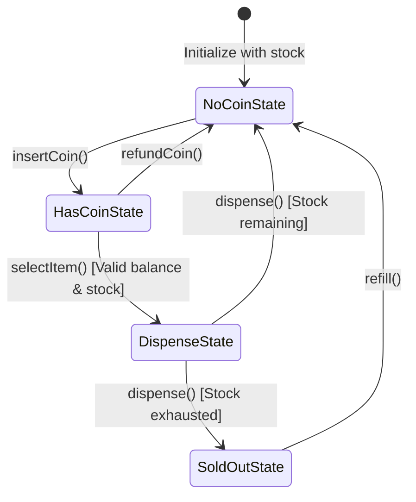
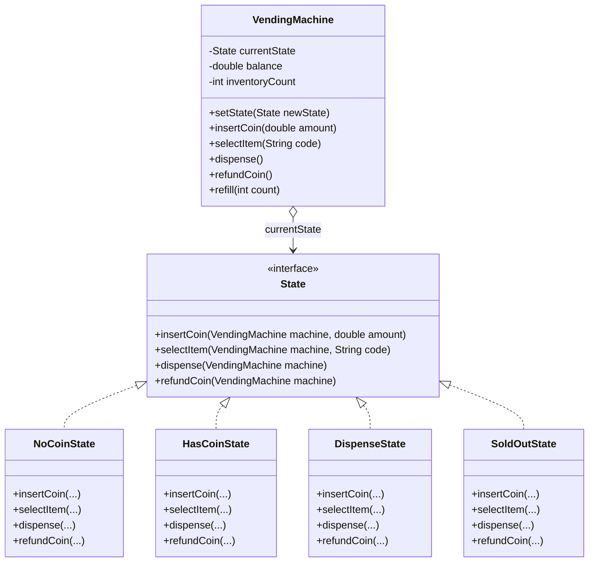

# 32. State Design Pattern — Vending Machine

> 💡 **Quick Revision Anchor**: A comprehensive, interview-focused guide to the State Design Pattern faithfully derived from the complete lecture transcript. Connects object-oriented state management directly to **Theory of Computation (TOC)** and **Finite State Machine (FSM)** principles. Eliminates brittle nested `switch-case` statements by encapsulating lifecycle transitions into polymorphic state objects: `NoCoinState`, `HasCoinState`, `DispenseState`, and `SoldOutState`. Demonstrates bidirectional state transitions, safe coin insertion/refund, product selection, and out-of-stock restocking flows.

---

## 1. Context & The "Nested Switch" Problem

Consider modeling an automated **Vending Machine**:
- It accepts coins, allows users to choose products, dispenses items, handles refunds, and tracks out-of-stock scenarios.

### The Anti-Pattern: Monolithic State Conditioning
```java
// BAD CODE: Giant nested switch statements everywhere
public void selectItem(String itemCode) {
    switch (currentState) {
        case NO_COIN:
            System.out.println("Please insert money first.");
            break;
        case HAS_COIN:
            if (balance >= price) {
                currentState = DISPENSE;
            }
            break;
        case DISPENSE:
            System.out.println("Already dispensing, please wait.");
            break;
        case SOLD_OUT:
            System.out.println("Machine is sold out.");
            break;
    }
}
```
**Why this breaks:**
- **Violates Open/Closed Principle**: Adding a new state (e.g., `MaintenanceState`, `ReturnChangeState`) forces you to modify every single action method in the class.
- **Tight Coupling**: State transition logic is scattered across hundreds of lines of procedural conditional blocks.

---

## 2. Vending Machine State Transition Diagram



---

## 3. State Pattern Architecture & UML



---

## 4. Production Java Implementation

### Step 1: State Interface
```java
public interface State {
    void insertCoin(VendingMachine machine, double amount);
    void selectItem(VendingMachine machine, String code);
    void dispense(VendingMachine machine);
    void refundCoin(VendingMachine machine);
}
```

### Step 2: Context Class (VendingMachine)
```java
public class VendingMachine {
    // Reusable state instances
    private final State noCoinState = new NoCoinState();
    private final State hasCoinState = new HasCoinState();
    private final State dispenseState = new DispenseState();
    private final State soldOutState = new SoldOutState();

    private State currentState;
    private double balance = 0.0;
    private int inventoryCount;
    private final double itemPrice = 25.0; // Fixed price for simplicity

    public VendingMachine(int initialStock) {
        this.inventoryCount = initialStock;
        if (initialStock > 0) {
            this.currentState = noCoinState;
        } else {
            this.currentState = soldOutState;
        }
    }

    // State management methods
    public void setState(State state) {
        this.currentState = state;
    }

    public State getNoCoinState() { return noCoinState; }
    public State getHasCoinState() { return hasCoinState; }
    public State getDispenseState() { return dispenseState; }
    public State getSoldOutState() { return soldOutState; }

    // Business properties
    public double getBalance() { return balance; }
    public void addBalance(double amount) { this.balance += amount; }
    public void resetBalance() { this.balance = 0.0; }
    public double getItemPrice() { return itemPrice; }
    public int getInventoryCount() { return inventoryCount; }
    public void deductInventory() { this.inventoryCount--; }

    public void refill(int count) {
        this.inventoryCount += count;
        System.out.println("[Machine] Refilled +" + count + " items. Total stock: " + inventoryCount);
        if (inventoryCount > 0 && currentState == soldOutState) {
            setState(noCoinState);
        }
    }

    // Delegation to current state
    public void insertCoin(double amount) { currentState.insertCoin(this, amount); }
    public void selectItem(String code) { currentState.selectItem(this, code); }
    public void dispense() { currentState.dispense(this); }
    public void refundCoin() { currentState.refundCoin(this); }
}
```

### Step 3: Concrete State Classes
```java
// 1. No Coin State (Machine is Idle, awaiting currency)
public class NoCoinState implements State {
    @Override
    public void insertCoin(VendingMachine machine, double amount) {
        machine.addBalance(amount);
        System.out.println("[NoCoinState] Accepted ₹" + amount + ". Total balance: ₹" + machine.getBalance());
        machine.setState(machine.getHasCoinState());
    }

    @Override
    public void selectItem(VendingMachine machine, String code) {
        System.err.println("[NoCoinState] Error: Please insert coins before selecting an item.");
    }

    @Override
    public void dispense(VendingMachine machine) {
        System.err.println("[NoCoinState] Error: No item or payment provided to dispense.");
    }

    @Override
    public void refundCoin(VendingMachine machine) {
        System.err.println("[NoCoinState] Error: No coins to refund.");
    }
}

// 2. Has Coin State (Payment inserted, ready for item selection or refund)
public class HasCoinState implements State {
    @Override
    public void insertCoin(VendingMachine machine, double amount) {
        machine.addBalance(amount);
        System.out.println("[HasCoinState] Added ₹" + amount + ". Current balance: ₹" + machine.getBalance());
    }

    @Override
    public void selectItem(VendingMachine machine, String code) {
        if (machine.getBalance() < machine.getItemPrice()) {
            System.err.println("[HasCoinState] Insufficient funds! Item costs ₹" + machine.getItemPrice() 
                               + ", but balance is ₹" + machine.getBalance());
            return;
        }

        System.out.println("[HasCoinState] Item selected (" + code + "). Proceeding to dispense.");
        machine.setState(machine.getDispenseState());
        machine.dispense(); // Trigger dispense transition automatically
    }

    @Override
    public void refundCoin(VendingMachine machine) {
        System.out.println("[HasCoinState] Refunding balance: ₹" + machine.getBalance());
        machine.resetBalance();
        machine.setState(machine.getNoCoinState());
    }

    @Override
    public void dispense(VendingMachine machine) {
        System.err.println("[HasCoinState] Error: Please select an item first.");
    }
}

// 3. Dispense State (Releasing product and returning change)
public class DispenseState implements State {
    @Override
    public void insertCoin(VendingMachine machine, double amount) {
        System.err.println("[DispenseState] Please wait: currently dispensing.");
    }

    @Override
    public void selectItem(VendingMachine machine, String code) {
        System.err.println("[DispenseState] Please wait: already dispensing an item.");
    }

    @Override
    public void dispense(VendingMachine machine) {
        machine.deductInventory();
        double change = machine.getBalance() - machine.getItemPrice();
        System.out.println("[DispenseState] 🍫 Dispensed product! Change returned: ₹" + change);
        machine.resetBalance();

        if (machine.getInventoryCount() > 0) {
            machine.setState(machine.getNoCoinState());
        } else {
            System.out.println("[DispenseState] Machine stock exhausted!");
            machine.setState(machine.getSoldOutState());
        }
    }

    @Override
    public void refundCoin(VendingMachine machine) {
        System.err.println("[DispenseState] Error: Cannot refund, item is already dispensing.");
    }
}

// 4. Sold Out State (Machine has 0 stock)
public class SoldOutState implements State {
    @Override
    public void insertCoin(VendingMachine machine, double amount) {
        System.err.println("[SoldOutState] Machine is SOLD OUT! Returning coins: ₹" + amount);
    }

    @Override
    public void selectItem(VendingMachine machine, String code) {
        System.err.println("[SoldOutState] Machine is SOLD OUT. Please wait for maintenance refill.");
    }

    @Override
    public void dispense(VendingMachine machine) {
        System.err.println("[SoldOutState] Nothing to dispense: out of stock.");
    }

    @Override
    public void refundCoin(VendingMachine machine) {
        System.err.println("[SoldOutState] No coins inserted to refund.");
    }
}
```

### Step 4: Test Driver & Execution
```java
public class Main {
    public static void main(String[] args) {
        // Initialize machine with 1 unit of stock
        VendingMachine vm = new VendingMachine(1);

        System.out.println(">>> Scenario 1: User tries selecting without inserting coin");
        vm.selectItem("A1");

        System.out.println("\n>>> Scenario 2: Successful purchase with change");
        vm.insertCoin(10.0);
        vm.insertCoin(20.0); // Total ₹30 (Price is ₹25)
        vm.selectItem("A1");  // Dispenses item, returns ₹5 change, stock drops to 0

        System.out.println("\n>>> Scenario 3: Machine is now Sold Out");
        vm.insertCoin(50.0); // Rejected

        System.out.println("\n>>> Scenario 4: Technician refilled the machine");
        vm.refill(5);
        vm.insertCoin(30.0);
        vm.refundCoin(); // User changed mind, requests refund
    }
}
```

---

## 5. Execution Trace

```text
>>> Scenario 1: User tries selecting without inserting coin
[NoCoinState] Error: Please insert coins before selecting an item.

>>> Scenario 2: Successful purchase with change
[NoCoinState] Accepted ₹10.0. Total balance: ₹10.0
[HasCoinState] Added ₹20.0. Current balance: ₹30.0
[HasCoinState] Item selected (A1). Proceeding to dispense.
[DispenseState] 🍫 Dispensed product! Change returned: ₹5.0
[DispenseState] Machine stock exhausted!

>>> Scenario 3: Machine is now Sold Out
[SoldOutState] Machine is SOLD OUT! Returning coins: ₹50.0

>>> Scenario 4: Technician refilled the machine
[Machine] Refilled +5 items. Total stock: 5
[NoCoinState] Accepted ₹30.0. Total balance: ₹30.0
[HasCoinState] Refunding balance: ₹30.0
```

---

## 6. State Pattern vs. Strategy Pattern

| Dimension | State Pattern | Strategy Pattern |
| :--- | :--- | :--- |
| **Intent** | Changes behavior based on **internal lifecycle/state**. | Encapsulates **independent algorithmic strategies**. |
| **Awareness** | Concrete States are usually **aware of other states** and trigger transitions. | Strategies are **completely unaware of other strategies**. |
| **Client Control** | Client triggers actions; the context manages transitions internally. | Client explicitly passes the desired strategy to the Context. |
