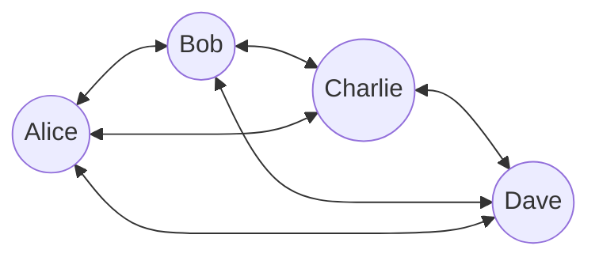
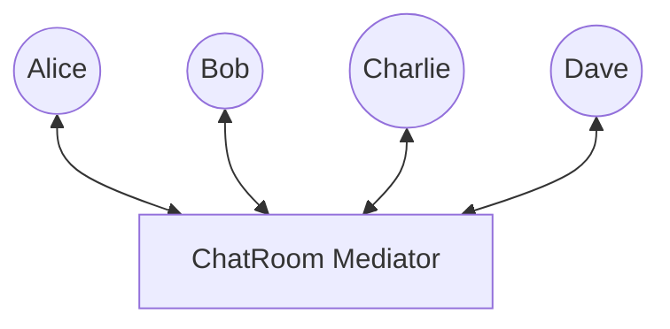
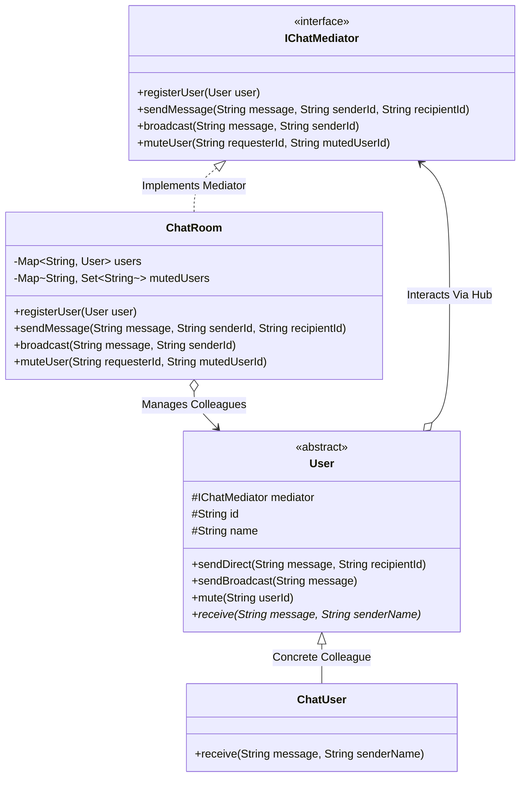

# 35. Mediator Design Pattern — Chat Room

> 💡 **Quick Revision Anchor**: The **Mediator Pattern** is a **behavioral design pattern** that reduces chaotic point-to-point dependencies between objects by forcing them to communicate exclusively through a central mediator object. It replaces a high-complexity $O(N^2)$ **mesh topology** with a clean $O(N)$ **hub-and-spoke star topology**.

---

## 1. Context & The "Mesh Coupling" Problem

Imagine developing a real-time group chat application where multiple participants exchange messages, broadcast alerts, and mute/block peers.

### The Bad Design: Direct Point-to-Point Mesh Network

If every user maintains a direct list of all other users:
- **Total Direct Connections**: For $N$ users, you have $\frac{N(N - 1)}{2}$ interdependent channels ($O(N^2)$ complexity).
- Adding a new user requires updating the internal state of every existing user.
- Filtering, message moderation, or muting rules must be replicated inside every single user class.

### The Mediator Solution: Central Star Topology

Users (**Colleagues**) know *only* about the Mediator. When Alice sends a message, she dispatches it to the Mediator, which manages routing, moderation, and delivery.

---

## 2. Real-World Analogy: Air Traffic Control (ATC)

When airplanes approach an airport runway:
- Pilots do **not** radio every single approaching aircraft directly to negotiate landing order.
- Every pilot radios the **ATC Tower** (the Mediator).
- The ATC Tower maintains the runway queue, detects collision courses, and instructs individual flights when it is safe to descend.

---

## 3. Class Diagram & Architecture



---

## 4. Production Java Implementation

### Step 1: Mediator Interface
```java
public interface IChatMediator {
    void registerUser(User user);
    void sendDirectMessage(String message, String senderId, String recipientId);
    void broadcastMessage(String message, String senderId);
    void muteUser(String requesterId, String mutedUserId);
}
```

### Step 2: Colleague Abstraction & Concrete User
```java
public abstract class User {
    protected final IChatMediator mediator;
    protected final String id;
    protected final String name;

    public User(IChatMediator mediator, String id, String name) {
        this.mediator = mediator;
        this.id = id;
        this.name = name;
    }

    public String getId() { return id; }
    public String getName() { return name; }

    public void sendDirect(String message, String recipientId) {
        mediator.sendDirectMessage(message, this.id, recipientId);
    }

    public void sendBroadcast(String message) {
        mediator.broadcastMessage(message, this.id);
    }

    public void mute(String targetUserId) {
        mediator.muteUser(this.id, targetUserId);
    }

    public abstract void receive(String message, String senderName);
}

public class ChatUser extends User {
    public ChatUser(IChatMediator mediator, String id, String name) {
        super(mediator, id, name);
    }

    @Override
    public void receive(String message, String senderName) {
        System.out.println("  📩 [" + name + "'s Screen] " + senderName + ": " + message);
    }
}
```

### Step 3: Concrete Mediator (ChatRoom)
```java
import java.util.*;

public class ChatRoom implements IChatMediator {
    private final Map<String, User> userRegistry = new HashMap<>();
    // Muting Ledger: recipientId -> Set of userIds whose messages they reject
    private final Map<String, Set<String>> muteLedger = new HashMap<>();

    @Override
    public void registerUser(User user) {
        userRegistry.put(user.getId(), user);
        muteLedger.putIfAbsent(user.getId(), new HashSet<>());
        System.out.println("[ChatRoom Hub] Registered user: " + user.getName() + " (ID: " + user.getId() + ")");
    }

    @Override
    public void sendDirectMessage(String message, String senderId, String recipientId) {
        User sender = userRegistry.get(senderId);
        User recipient = userRegistry.get(recipientId);

        if (sender == null || recipient == null) {
            System.err.println("[ChatRoom Hub] Error: Invalid sender or recipient ID.");
            return;
        }

        // Check if recipient has muted this sender
        if (muteLedger.get(recipientId).contains(senderId)) {
            System.out.println("[ChatRoom Hub] Direct message from " + sender.getName() 
                               + " to " + recipient.getName() + " blocked (User muted).");
            return;
        }

        System.out.println("[Direct Chat] " + sender.getName() + " -> " + recipient.getName());
        recipient.receive(message, sender.getName());
    }

    @Override
    public void broadcastMessage(String message, String senderId) {
        User sender = userRegistry.get(senderId);
        if (sender == null) return;

        System.out.println("\n[Broadcast Announcement] " + sender.getName() + " shouts to all: \"" + message + "\"");

        for (User recipient : userRegistry.values()) {
            // Do not echo back to sender
            if (recipient.getId().equals(senderId)) continue;

            // Respect individual mute settings
            if (muteLedger.get(recipient.getId()).contains(senderId)) {
                System.out.println("   (Silenced for " + recipient.getName() + " due to active mute)");
                continue;
            }

            recipient.receive(message, sender.getName());
        }
    }

    @Override
    public void muteUser(String requesterId, String mutedUserId) {
        User requester = userRegistry.get(requesterId);
        User target = userRegistry.get(mutedUserId);
        if (requester != null && target != null) {
            muteLedger.get(requesterId).add(mutedUserId);
            System.out.println("[Privacy] " + requester.getName() + " muted messages from " + target.getName());
        }
    }
}
```

### Step 4: Test Driver & Verification
```java
public class Main {
    public static void main(String[] args) {
        IChatMediator chatRoom = new ChatRoom();

        // 1. Create users connected through the mediator
        User alice = new ChatUser(chatRoom, "U1", "Alice");
        User bob = new ChatUser(chatRoom, "U2", "Bob");
        User charlie = new ChatUser(chatRoom, "U3", "Charlie");

        chatRoom.registerUser(alice);
        chatRoom.registerUser(bob);
        chatRoom.registerUser(charlie);

        // 2. Direct message
        System.out.println("\n>>> Alice sends direct message to Bob:");
        alice.sendDirect("Hey Bob, can you review my PR?", "U2");

        // 3. Broadcast message
        alice.sendBroadcast("Production deployment starts in 10 minutes!");

        // 4. Bob mutes Alice
        System.out.println("\n>>> Bob chooses to mute Alice:");
        bob.mute("U1");

        // 5. Alice broadcasts again (Charlie receives it, but Bob's screen is shielded)
        alice.sendBroadcast("Hotfix patch applied successfully.");

        // 6. Direct message attempt while muted
        alice.sendDirect("Bob, are you online?", "U2");
    }
}
```

---

## 5. Execution Trace

```text
[ChatRoom Hub] Registered user: Alice (ID: U1)
[ChatRoom Hub] Registered user: Bob (ID: U2)
[ChatRoom Hub] Registered user: Charlie (ID: U3)

>>> Alice sends direct message to Bob:
[Direct Chat] Alice -> Bob
  📩 [Bob's Screen] Alice: Hey Bob, can you review my PR?

[Broadcast Announcement] Alice shouts to all: "Production deployment starts in 10 minutes!"
  📩 [Bob's Screen] Alice: Production deployment starts in 10 minutes!
  📩 [Charlie's Screen] Alice: Production deployment starts in 10 minutes!

>>> Bob chooses to mute Alice:
[Privacy] Bob muted messages from Alice

[Broadcast Announcement] Alice shouts to all: "Hotfix patch applied successfully."
   (Silenced for Bob due to active mute)
  📩 [Charlie's Screen] Alice: Hotfix patch applied successfully.
[ChatRoom Hub] Direct message from Alice to Bob blocked (User muted).
```

---

## 6. Mediator vs. Facade vs. Observer

| Pattern | Primary Focus | Communication Direction |
| :--- | :--- | :--- |
| **Mediator** | Facilitates and centralizes communication between **peer colleague objects**. | **Bidirectional**: Peers $\leftrightarrow$ Mediator. |
| **Facade** | Provides a simplified higher-level interface over a complex **subsystem**. | **Unidirectional**: Client $\rightarrow$ Facade $\rightarrow$ Subsystem. |
| **Observer** | Distributes one-to-many change events from a **Subject** to multiple **Observers**. | **Unidirectional**: Subject $\rightarrow$ Observers. |

---

## 7. Real-World Applications & Interview Gotchas

1. **Java & Frameworks**:
   - `java.util.concurrent.ExecutorService` acts as a mediator between submitting threads and worker threads.
   - **UI Dialogs**: In Java Swing/Android, a `DialogController` acts as a mediator between Checkboxes, TextFields, and the Submit button (disabling Submit until required fields are filled).
2. **Interview Gotcha (God Object Warning)**:
   - Because all interaction logic flows through the Mediator, it can easily degenerate into a bloated, monolithic **"God Class"**.
   - *Mitigation*: Adhere to SRP by separating routing, authorization, and event logging into helper classes delegated by the mediator.
