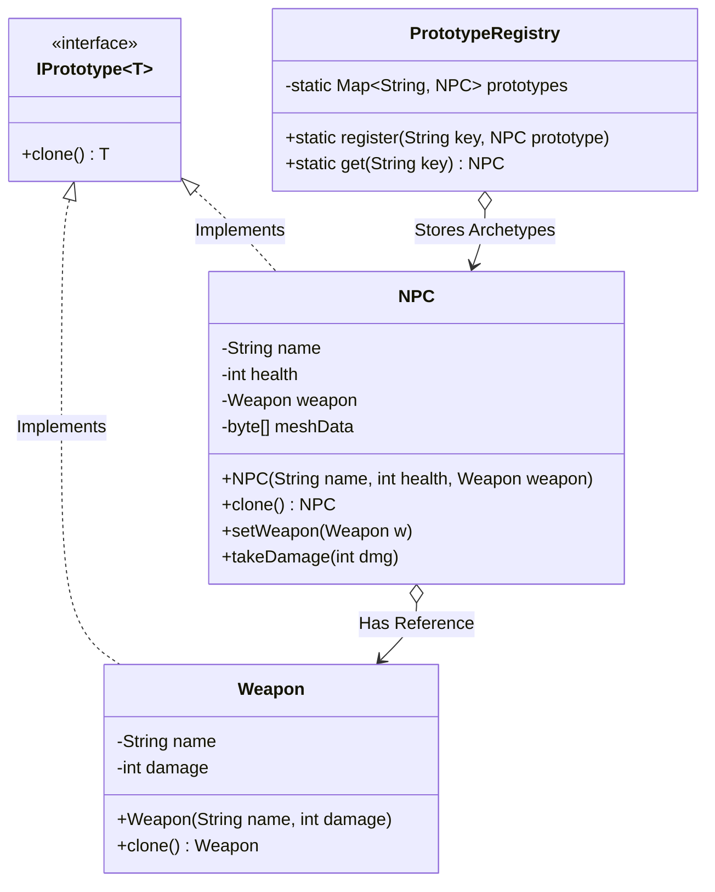

# 36. Prototype Design Pattern

> 💡 **Quick Revision Anchor**: A comprehensive, interview-focused guide to the Prototype Design Pattern faithfully derived from the complete lecture transcript. Explores why cloning existing instances via an in-memory prototype eliminates expensive constructor initialization (database roundtrips, disk I/O, heavy mesh rendering) and preserves encapsulation. Features the lecture's canonical **Game NPC (Non-Player Character) and Weapon System**, an architectural deep-dive into **Shallow Copy vs. Deep Copy** hazards, and a production-grade `PrototypeRegistry` catalog for rapid entity cloning.

---

## 1. Context & Motivation: The Heavy Instantiation Problem

Imagine designing an open-world video game (like GTA or Skyrim) populated by thousands of **NPCs (Non-Player Characters)**:
- Spawning an NPC from scratch requires:
  1. Loading 3D skeletal meshes and texture bitmaps from disk (2–3 seconds).
  2. Querying database tables for base statistics and skill trees.
  3. Allocating AI pathfinding graphs.
- **The Problem**: Executing this constructor for 1,000 NPCs takes over 30 minutes and causes game engine stuttering.
- **Furthermore**: Trying to copy an object from outside fails because the caller cannot access `private` fields without violating encapsulation.

### The Prototype Solution
Instantiate **one** canonical instance (the Prototype) through the expensive constructor. Thereafter, spawn subsequent NPCs by calling `prototype.clone()`. Cloning copies populated memory fields directly in micro-seconds, after which only minor fields (e.g., coordinates $(X, Y)$ or equipped weapon) are adjusted.

---

## 2. Core Architecture & UML



---

## 3. Deep Dive: Shallow Copy vs. Deep Copy

| Aspect | Shallow Copy | Deep Copy (Required for Mutables) |
| :--- | :--- | :--- |
| **Primitives** (`int`, `boolean`, `double`) | Values are duplicated directly. | Values are duplicated directly. |
| **Object References** (`Weapon`, `List<Item>`) | Only memory **addresses (pointers)** are copied. Both clone and original point to the **exact same memory buffer**! | The nested reference object is **recursively cloned**. Clone owns its own independent copy. |
| **Risk** | Mutating clone's weapon inadvertently changes the original archetype's weapon! | Fully isolated; no side-effects between clones. |

---

## 4. Production Java Implementation

### Step 1: Prototype Interface & Nested Reference Object
```java
// Generic Prototype contract
public interface Prototype<T> {
    T clone();
}

// Mutable nested object
public class Weapon implements Prototype<Weapon> {
    private String name;
    private int damage;

    public Weapon(String name, int damage) {
        this.name = name;
        this.damage = damage;
    }

    public String getName() { return name; }
    public void setName(String name) { this.name = name; }
    public int getDamage() { return damage; }
    public void setDamage(int damage) { this.damage = damage; }

    @Override
    public Weapon clone() {
        // Deep copy of weapon object
        return new Weapon(this.name, this.damage);
    }

    @Override
    public String toString() {
        return name + " (Dmg: " + damage + ")";
    }
}
```

### Step 2: Concrete Prototype (NPC)
```java
public class NPC implements Prototype<NPC> {
    private String type;
    private int health;
    private Weapon weapon;
    private final String heavyMesh3D; // Simulated 50MB 3D asset

    // Heavy constructor: Invoked ONLY ONCE for the archetype
    public NPC(String type, int health, Weapon weapon) {
        this.type = type;
        this.health = health;
        this.weapon = weapon;

        // Expensive simulation: disk read / GPU compilation
        System.out.println("[Expensive Initialization] Loading 3D geometry & shaders for: " + type + " (takes 3s)...");
        this.heavyMesh3D = "[3D Mesh Buffer for " + type + "]";
    }

    // Fast copy constructor used by clone()
    private NPC(NPC source, boolean deepCopy) {
        this.type = source.type;
        this.health = source.health;
        this.heavyMesh3D = source.heavyMesh3D; // Shared immutable asset reference

        if (deepCopy && source.weapon != null) {
            this.weapon = source.weapon.clone(); // DEEP COPY: Independent weapon instance
        } else {
            this.weapon = source.weapon; // Shallow copy
        }
    }

    @Override
    public NPC clone() {
        System.out.println("[Prototype Clone] Rapidly cloned " + type + " in <1ms!");
        return new NPC(this, true); // Enforce deep copy
    }

    // Getters and Mutators for tweaking individual clone instances
    public void setHealth(int health) { this.health = health; }
    public void setWeapon(Weapon weapon) { this.weapon = weapon; }
    public Weapon getWeapon() { return weapon; }
    public int getHealth() { return health; }

    @Override
    public String toString() {
        return "NPC{type='" + type + "', hp=" + health + ", weapon=" + weapon + "}";
    }
}
```

### Step 3: Prototype Registry / Cache
```java
import java.util.HashMap;
import java.util.Map;

public class PrototypeRegistry {
    private static final Map<String, NPC> registry = new HashMap<>();

    public static void register(String key, NPC prototype) {
        registry.put(key, prototype);
    }

    public static NPC get(String key) {
        NPC prototype = registry.get(key);
        if (prototype == null) {
            throw new IllegalArgumentException("No prototype registered for key: " + key);
        }
        return prototype.clone(); // Return clone, never expose raw master archetype
    }
}
```

### Step 4: Test Driver & Deep Copy Verification
```java
public class Main {
    public static void main(String[] args) {
        System.out.println("=== 1. PRE-WARMING ARCHETYPE REGISTRY ===");
        // Expensive initialization happens once at startup
        NPC zombieMaster = new NPC("ZOMBIE_WARRIOR", 100, new Weapon("Rusty Axe", 25));
        NPC alienMaster = new NPC("XENOMORPH", 250, new Weapon("Acid Spit", 80));

        PrototypeRegistry.register("ZOMBIE", zombieMaster);
        PrototypeRegistry.register("ALIEN", alienMaster);

        System.out.println("\n=== 2. INSTANTANEOUS RUNTIME CLONING ===");
        // Fast spawning: no 3-second disk I/O!
        NPC zombie1 = PrototypeRegistry.get("ZOMBIE");
        NPC zombie2 = PrototypeRegistry.get("ZOMBIE");

        // Customize clone 2 without affecting clone 1 or archetype
        zombie2.setHealth(150);
        zombie2.getWeapon().setName("Enchanted Axe");
        zombie2.getWeapon().setDamage(45);

        System.out.println("\n=== 3. DEEP COPY VERIFICATION ===");
        System.out.println("Zombie 1 (Default):    " + zombie1);
        System.out.println("Zombie 2 (Customized): " + zombie2);

        // Verify weapon reference independence
        System.out.println("\nIndependent Weapon Objects in Memory? " 
                           + (zombie1.getWeapon() != zombie2.getWeapon()));
    }
}
```

---

## 5. Execution Output

```text
=== 1. PRE-WARMING ARCHETYPE REGISTRY ===
[Expensive Initialization] Loading 3D geometry & shaders for: ZOMBIE_WARRIOR (takes 3s)...
[Expensive Initialization] Loading 3D geometry & shaders for: XENOMORPH (takes 3s)...

=== 2. INSTANTANEOUS RUNTIME CLONING ===
[Prototype Clone] Rapidly cloned ZOMBIE_WARRIOR in <1ms!
[Prototype Clone] Rapidly cloned ZOMBIE_WARRIOR in <1ms!

=== 3. DEEP COPY VERIFICATION ===
Zombie 1 (Default):    NPC{type='ZOMBIE_WARRIOR', hp=100, weapon=Rusty Axe (Dmg: 25)}
Zombie 2 (Customized): NPC{type='ZOMBIE_WARRIOR', hp=150, weapon=Enchanted Axe (Dmg: 45)}

Independent Weapon Objects in Memory? true
```

---

## 6. Real-World Applications & Interview Gotchas

1. **Java `java.lang.Cloneable` Pitfall**:
   - Java provides a native `Object.clone()` and `Cloneable` interface, but it performs a **shallow copy** by default and throws `CloneNotSupportedException`.
   - Effective Java (Joshua Bloch) recommends **Copy Constructors** (`public NPC(NPC other)`) or custom `Prototype<T>` interfaces instead of standard Java `Cloneable`.
2. **Flyweight vs. Prototype**:
   - **Flyweight**: Shares a **single immutable instance** across millions of references to conserve RAM.
   - **Prototype**: Spawns **distinct, independent new instances** populated with cloned default data so they can be modified separately.
