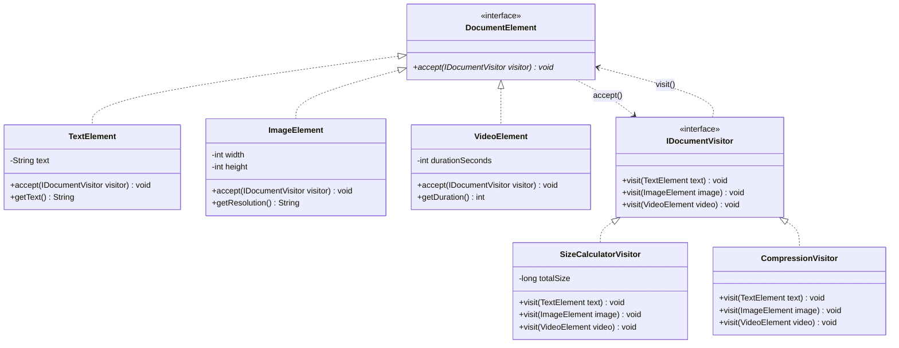

# 38. Visitor Design Pattern & Double Dispatch

> 💡 **Quick Revision Anchor**: A comprehensive, interview-focused guide to the Visitor Design Pattern faithfully derived from the complete lecture transcript. Decouples operations and algorithms from the heterogeneous object hierarchies on which they operate. Explores the mechanics of **Double Dispatch** (`element.accept(visitor)` $\to$ `visitor.visit(this)`), enabling engineers to add arbitrary new operations (PDF export, compression, word count, virus scanning) without modifying existing domain classes. Analyzes the architectural trade-offs between the Visitor Pattern and Strategy Pattern.

---

## 1. Context & The "Bloated Hierarchy" Problem

Imagine building a document management application supporting various elements:
- `TextElement`
- `ImageElement`
- `VideoElement`

As the application evolves, new operational requirements keep arriving:
1. **Feature 1**: Calculate file byte size.
2. **Feature 2**: Compress element contents.
3. **Feature 3**: Scan for malware / security viruses.
4. **Feature 4**: Export to PDF format.

### The Anti-Pattern: Modifying Elements Directly
Without the Visitor pattern, you must add `calculateSize()`, `compress()`, `scanVirus()`, and `exportPdf()` into the base `DocumentElement` class and touch all subclass files.

**Consequences:**
- **Violates Open/Closed Principle**: Stable domain classes are continuously edited and recompiled for auxiliary operations.
- **Violates Single Responsibility Principle**: `TextElement` should represent text; now it contains PDF rendering algorithms, compression math, and antivirus heuristics.
- **Polluted Codebase**: Different operational concerns become tightly coupled with data models.

---

## 2. The Visitor Pattern & Double Dispatch Mechanism



### What is Double Dispatch?
In standard OOP languages like Java or C++, method calls use **Single Dispatch** (the runtime type of only the calling object `this` determines which method executes; parameter types are bound statically at compile time).

**Double Dispatch** binds both dynamically:
1. **Dispatch 1 (`element.accept(visitor)`)**: The runtime type of `element` (`TextElement`) is resolved polymorphically.
2. **Dispatch 2 (`visitor.visit(this)`)**: Inside `TextElement`, `this` has the static type `TextElement`. Calling `visitor.visit(this)` forces the compiler to invoke `visit(TextElement)` on the runtime visitor type (`CompressionVisitor`).

---

## 3. Production Java Implementation

### Step 1: Visitor Interface
```java
public interface IDocumentVisitor {
    void visit(TextElement text);
    void visit(ImageElement image);
    void visit(VideoElement video);
}
```

### Step 2: Element Abstraction & Concrete Elements
```java
public interface DocumentElement {
    // Single entry point for any operation
    void accept(IDocumentVisitor visitor);
}

public class TextElement implements DocumentElement {
    private final String content;

    public TextElement(String content) {
        this.content = content;
    }

    public String getContent() {
        return content;
    }

    @Override
    public void accept(IDocumentVisitor visitor) {
        // Double dispatch: 'this' is known to be TextElement at compile time
        visitor.visit(this);
    }
}

public class ImageElement implements DocumentElement {
    private final int width;
    private final int height;
    private final String format;

    public ImageElement(int width, int height, String format) {
        this.width = width;
        this.height = height;
        this.format = format;
    }

    public int getPixelCount() { return width * height; }
    public String getFormat() { return format; }

    @Override
    public void accept(IDocumentVisitor visitor) {
        visitor.visit(this);
    }
}

public class VideoElement implements DocumentElement {
    private final int durationSeconds;
    private final int bitrateKbps;

    public VideoElement(int durationSeconds, int bitrateKbps) {
        this.durationSeconds = durationSeconds;
        this.bitrateKbps = bitrateKbps;
    }

    public int getDurationSeconds() { return durationSeconds; }
    public int getBitrateKbps() { return bitrateKbps; }

    @Override
    public void accept(IDocumentVisitor visitor) {
        visitor.visit(this);
    }
}
```

### Step 3: Concrete Visitors (Operations)
```java
// Operation 1: Size Calculation Visitor
public class SizeCalculatorVisitor implements IDocumentVisitor {
    private long totalBytes = 0;

    @Override
    public void visit(TextElement text) {
        long bytes = text.getContent().getBytes().length;
        totalBytes += bytes;
        System.out.println("[SizeVisitor] Text element size: " + bytes + " bytes");
    }

    @Override
    public void visit(ImageElement image) {
        long bytes = (long) image.getPixelCount() * 3; // Approx 3 bytes per pixel
        totalBytes += bytes;
        System.out.println("[SizeVisitor] Image (" + image.getFormat() + ") size: " + bytes + " bytes");
    }

    @Override
    public void visit(VideoElement video) {
        long bytes = ((long) video.getDurationSeconds() * video.getBitrateKbps() * 1024) / 8;
        totalBytes += bytes;
        System.out.println("[SizeVisitor] Video stream size: " + bytes + " bytes");
    }

    public long getTotalBytes() {
        return totalBytes;
    }
}

// Operation 2: Compression Visitor
public class CompressionVisitor implements IDocumentVisitor {
    @Override
    public void visit(TextElement text) {
        System.out.println("[Compression] Running Huffman LZW encoding on text snippet...");
    }

    @Override
    public void visit(ImageElement image) {
        System.out.println("[Compression] Downscaling resolution & applying WebP lossy compression...");
    }

    @Override
    public void visit(VideoElement video) {
        System.out.println("[Compression] Transcoding video bitrate using H.265 / HEVC codec...");
    }
}
```

### Step 4: Test Driver & Verification
```java
import java.util.List;

public class Main {
    public static void main(String[] args) {
        // Document object structure
        List<DocumentElement> document = List.of(
            new TextElement("System Design LLD Notes by Code Army."),
            new ImageElement(1920, 1080, "PNG"),
            new VideoElement(60, 4000)
        );

        // Run Operation 1: Size Calculation
        System.out.println("=== 1. EXECUTING SIZE CALCULATION VISITOR ===");
        SizeCalculatorVisitor sizeVisitor = new SizeCalculatorVisitor();
        for (DocumentElement element : document) {
            element.accept(sizeVisitor);
        }
        System.out.println("-> Total Document Memory Footprint: " + sizeVisitor.getTotalBytes() + " bytes\n");

        // Run Operation 2: Compression without modifying any element class
        System.out.println("=== 2. EXECUTING COMPRESSION VISITOR ===");
        CompressionVisitor compressVisitor = new CompressionVisitor();
        for (DocumentElement element : document) {
            element.accept(compressVisitor);
        }
    }
}
```

---

## 4. Execution Trace

```text
=== 1. EXECUTING SIZE CALCULATION VISITOR ===
[SizeVisitor] Text element size: 38 bytes
[SizeVisitor] Image (PNG) size: 6220800 bytes
[SizeVisitor] Video stream size: 30720000 bytes
-> Total Document Memory Footprint: 36940838 bytes

=== 2. EXECUTING COMPRESSION VISITOR ===
[Compression] Running Huffman LZW encoding on text snippet...
[Compression] Downscaling resolution & applying WebP lossy compression...
[Compression] Transcoding video bitrate using H.265 / HEVC codec...
```

---

## 5. Visitor Pattern Trade-Offs

| Advantage | Trade-Off / Cost |
| :--- | :--- |
| **Open/Closed Principle**: Adding new operations is trivial (create a new visitor class). | **Fragile if elements change**: Adding a new element class (e.g. `AudioElement`) forces updates to **every** visitor interface and class. |
| **SRP**: Gathers related operational code into a single visitor instead of scattering it across element classes. | **Breaks encapsulation**: Visitors often require access to private/internal state of elements via getters. |
| **Accumulates State**: A visitor can compute running totals (like `totalBytes`) as it traverses the tree. | High architectural complexity with double-dispatch indirections. |

---

## 6. Real-World Applications & Interview Checklist

1. **Compilers & Abstract Syntax Trees (AST)**:
   - Elements: `BinaryExpressionNode`, `AssignmentNode`, `IfStatementNode`.
   - Visitors: `TypeCheckingVisitor`, `OptimizationVisitor`, `CodeGenerationVisitor` (LLVM).
2. **Rule of Thumb for Interview**:
   - Use Visitor **only when the element hierarchy is stable**, but new operations over the elements are expected frequently.
   - If new element classes are added all the time, Visitor is an anti-pattern.
